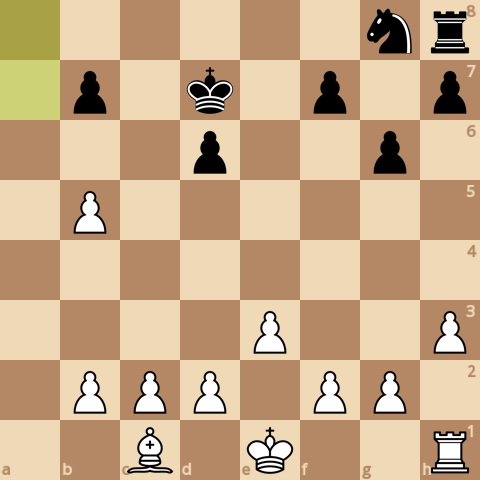
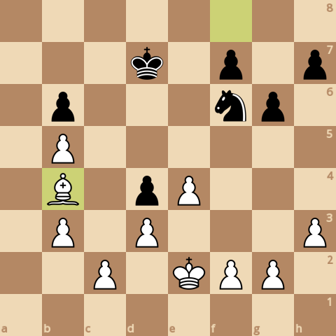
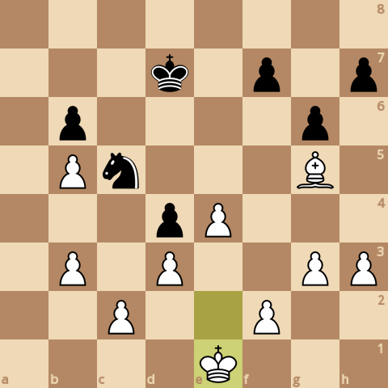

### board0000.png

Current board:\

### board0001.png

Found a new move 0\
Analyzed boards: 5190\
Average speed for the move: 102361 boards/s\
Time taken for the move: 0.050703s\
Total time taken: 0.050703s\
Current white score: 24200, black score: 24100\
Current board after move:\

### board0002.png

Found a new move 1\
Analyzed boards: 52952\
Average speed for the move: 103719 boards/s\
Time taken for the move: 0.460495s\
Total time taken: 0.511198s\
Current white score: 24200, black score: 24200\
Current board after move:\

### board0003.png

Found a new move 2\
Analyzed boards: 98866\
Average speed for the move: 111701 boards/s\
Time taken for the move: 0.411044s\
Total time taken: 0.922242s\
Current white score: 24240, black score: 24190\
Current board after move:\

### board0004.png

Found a new move 3\
Analyzed boards: 104358\
Average speed for the move: 115325 boards/s\
Time taken for the move: 0.047622s\
Total time taken: 0.969864s\
Current white score: 24230, black score: 24220\
Current board after move:\

### board0005.png

Found a new move 4\
Analyzed boards: 136763\
Average speed for the move: 105930 boards/s\
Time taken for the move: 0.305909s\
Total time taken: 1.27577s\
Current white score: 24350, black score: 24210\
Current board after move:\

### board0006.png

Found a new move 5\
Analyzed boards: 140324\
Average speed for the move: 102219 boards/s\
Time taken for the move: 0.034837s\
Total time taken: 1.31061s\
Current white score: 24340, black score: 24230\
Current board after move:\

### board0007.png

Found a new move 6\
Analyzed boards: 168219\
Average speed for the move: 105323 boards/s\
Time taken for the move: 0.264851s\
Total time taken: 1.57546s\
Current white score: 24350, black score: 24230\
Current board after move:\

### board0008.png

Found a new move 7\
Analyzed boards: 182639\
Average speed for the move: 102680 boards/s\
Time taken for the move: 0.140436s\
Total time taken: 1.7159s\
Current white score: 24340, black score: 24210\
Current board after move:\

### board0009.png

Found a new move 8\
Analyzed boards: 280897\
Average speed for the move: 108316 boards/s\
Time taken for the move: 0.907139s\
Total time taken: 2.62304s\
Current white score: 24350, black score: 24210\
Current board after move:\

### board0010.png

Found a new move 9\
Analyzed boards: 331051\
Average speed for the move: 102913 boards/s\
Time taken for the move: 0.487343s\
Total time taken: 3.11038s\
Current white score: 24350, black score: 24270\
Current board after move:\

### board0011.png

Found a new move 10\
Analyzed boards: 355655\
Average speed for the move: 116789 boards/s\
Time taken for the move: 0.210671s\
Total time taken: 3.32105s\
Current white score: 23320, black score: 23210\
Current board after move:\

### board0012.png

Found a new move 11\
Analyzed boards: 390590\
Average speed for the move: 117582 boards/s\
Time taken for the move: 0.297112s\
Total time taken: 3.61816s\
Current white score: 23320, black score: 23210\
Current board after move:\

### board0013.png

Found a new move 12\
Analyzed boards: 403383\
Average speed for the move: 117955 boards/s\
Time taken for the move: 0.108457s\
Total time taken: 3.72662s\
Current white score: 23350, black score: 23180\
Current board after move:\

### board0014.png

Found a new move 13\
Analyzed boards: 406751\
Average speed for the move: 126114 boards/s\
Time taken for the move: 0.026706s\
Total time taken: 3.75332s\
Current white score: 22990, black score: 22890\
Current board after move:\

### board0015.png

Found a new move 14\
Analyzed boards: 449698\
Average speed for the move: 129064 boards/s\
Time taken for the move: 0.332757s\
Total time taken: 4.08608s\
Current white score: 23020, black score: 22890\
Current board after move:\

### board0016.png

Found a new move 15\
Analyzed boards: 478679\
Average speed for the move: 127866 boards/s\
Time taken for the move: 0.226652s\
Total time taken: 4.31273s\
Current white score: 23020, black score: 22910\
Current board after move:\

### board0017.png

Found a new move 16\
Analyzed boards: 578607\
Average speed for the move: 135412 boards/s\
Time taken for the move: 0.737958s\
Total time taken: 5.05069s\
Current white score: 23020, black score: 22910\
Current board after move:\

### board0018.png

Found a new move 17\
Analyzed boards: 628735\
Average speed for the move: 130808 boards/s\
Time taken for the move: 0.383218s\
Total time taken: 5.43391s\
Current white score: 23020, black score: 22970\
Current board after move:\

### board0019.png

Found a new move 18\
Analyzed boards: 656562\
Average speed for the move: 106853 boards/s\
Time taken for the move: 0.260422s\
Total time taken: 5.69433s\
Current white score: 23050, black score: 22930\
Current board after move:\

### board0020.png

Found a new move 19\
Analyzed boards: 682487\
Average speed for the move: 132829 boards/s\
Time taken for the move: 0.195176s\
Total time taken: 5.88951s\
Current white score: 23040, black score: 22960\
Current board after move:\

### board0021.png

Found a new move 20\
Analyzed boards: 763849\
Average speed for the move: 133623 boards/s\
Time taken for the move: 0.608891s\
Total time taken: 6.4984s\
Current white score: 23050, black score: 22960\
Current board after move:\

### board0022.png

Found a new move 21\
Analyzed boards: 793772\
Average speed for the move: 117413 boards/s\
Time taken for the move: 0.254853s\
Total time taken: 6.75325s\
Current white score: 23050, black score: 22900\
Current board after move:\

### board0023.png

Found a new move 22\
Analyzed boards: 828827\
Average speed for the move: 118623 boards/s\
Time taken for the move: 0.295516s\
Total time taken: 7.04877s\
Current white score: 22700, black score: 22100\
Current board after move:\

### board0024.png

Found a new move 23\
Analyzed boards: 833692\
Average speed for the move: 135120 boards/s\
Time taken for the move: 0.036005s\
Total time taken: 7.08477s\
Current white score: 22330, black score: 22130\
Current board after move:\

### board0025.png

Found a new move 24\
Analyzed boards: 842368\
Average speed for the move: 133947 boards/s\
Time taken for the move: 0.064772s\
Total time taken: 7.14954s\
Current white score: 22370, black score: 22040\
Current board after move:\

### board0026.png

Found a new move 25\
Analyzed boards: 874224\
Average speed for the move: 150424 boards/s\
Time taken for the move: 0.211775s\
Total time taken: 7.36132s\
Current white score: 22370, black score: 22090\
Current board after move:\

### board0027.png

Found a new move 26\
Analyzed boards: 905656\
Average speed for the move: 149658 boards/s\
Time taken for the move: 0.210025s\
Total time taken: 7.57134s\
Current white score: 22370, black score: 22030\
Current board after move:\

### board0028.png

Found a new move 27\
Analyzed boards: 919989\
Average speed for the move: 160655 boards/s\
Time taken for the move: 0.089216s\
Total time taken: 7.66056s\
Current white score: 21790, black score: 21470\
Current board after move:\

### board0029.png

Found a new move 28\
Analyzed boards: 932341\
Average speed for the move: 165260 boards/s\
Time taken for the move: 0.074743s\
Total time taken: 7.7353s\
Current white score: 21800, black score: 21470\
Current board after move:\

### board0030.png

Found a new move 29\
Analyzed boards: 964141\
Average speed for the move: 172688 boards/s\
Time taken for the move: 0.184147s\
Total time taken: 7.91945s\
Current white score: 21800, black score: 21480\
Current board after move:\

### board0031.png

Found a new move 30\
Analyzed boards: 977957\
Average speed for the move: 164719 boards/s\
Time taken for the move: 0.083876s\
Total time taken: 8.00333s\
Current white score: 21850, black score: 21480\
Current board after move:\

### board0032.png

Found a new move 31\
Analyzed boards: 986754\
Average speed for the move: 145151 boards/s\
Time taken for the move: 0.060606s\
Total time taken: 8.06393s\
Current white score: 21850, black score: 21550\
Current board after move:\

### board0033.png

Found a new move 32\
Analyzed boards: 1013936\
Average speed for the move: 138790 boards/s\
Time taken for the move: 0.19585s\
Total time taken: 8.25978s\
Current white score: 21850, black score: 21550\
Current board after move:\

### board0034.png

Found a new move 33\
Analyzed boards: 1036506\
Average speed for the move: 153530 boards/s\
Time taken for the move: 0.147007s\
Total time taken: 8.40679s\
Current white score: 21850, black score: 21580\
Current board after move:\

### board0035.png

Found a new move 34\
Analyzed boards: 1067733\
Average speed for the move: 140900 boards/s\
Time taken for the move: 0.221626s\
Total time taken: 8.62842s\
Current white score: 21860, black score: 21580\
Current board after move:\

### board0036.png

Found a new move 35\
Analyzed boards: 1105271\
Average speed for the move: 160847 boards/s\
Time taken for the move: 0.233377s\
Total time taken: 8.86179s\
Current white score: 21860, black score: 21590\
Current board after move:\

### board0037.png

Found a new move 36\
Analyzed boards: 1197204\
Average speed for the move: 168926 boards/s\
Time taken for the move: 0.544222s\
Total time taken: 9.40602s\
Current white score: 21870, black score: 21590\
Current board after move:\

### board0038.png

Found a new move 37\
Analyzed boards: 1226107\
Average speed for the move: 154998 boards/s\
Time taken for the move: 0.186473s\
Total time taken: 9.59249s\
Current white score: 21870, black score: 21600\
Current board after move:\

### board0039.png

Found a new move 38\
Analyzed boards: 1247088\
Average speed for the move: 148102 boards/s\
Time taken for the move: 0.141666s\
Total time taken: 9.73415s\
Current white score: 21860, black score: 21580\
Current board after move:\

### board0040.png

Found a new move 39\
Analyzed boards: 1269313\
Average speed for the move: 151034 boards/s\
Time taken for the move: 0.147152s\
Total time taken: 9.88131s\
Current white score: 21860, black score: 21570\
Current board after move:\

### board0041.png

Found a new move 40\
Analyzed boards: 1279346\
Average speed for the move: 141843 boards/s\
Time taken for the move: 0.070733s\
Total time taken: 9.95204s\
Current white score: 21920, black score: 21570\
Current board after move:\

### board0042.png

Found a new move 41\
Analyzed boards: 1305651\
Average speed for the move: 145473 boards/s\
Time taken for the move: 0.180824s\
Total time taken: 10.1329s\
Current white score: 21900, black score: 21570\
Current board after move:\

### board0043.png

Found a new move 42\
Analyzed boards: 1316269\
Average speed for the move: 146213 boards/s\
Time taken for the move: 0.07262s\
Total time taken: 10.2055s\
Current white score: 21900, black score: 21540\
Current board after move:\

### board0044.png

Found a new move 43\
Analyzed boards: 1341284\
Average speed for the move: 150464 boards/s\
Time taken for the move: 0.166252s\
Total time taken: 10.3717s\
Current white score: 21900, black score: 21590\
Current board after move:\

### board0045.png

Found a new move 44\
Analyzed boards: 1358298\
Average speed for the move: 148954 boards/s\
Time taken for the move: 0.114223s\
Total time taken: 10.486s\
Current white score: 21960, black score: 21590\
Current board after move:\

### board0046.png

Found a new move 45\
Analyzed boards: 1413948\
Average speed for the move: 148760 boards/s\
Time taken for the move: 0.374093s\
Total time taken: 10.8601s\
Current white score: 21320, black score: 20970\
Current board after move:\

### board0047.png

Found a new move 46\
Analyzed boards: 1435713\
Average speed for the move: 167103 boards/s\
Time taken for the move: 0.130249s\
Total time taken: 10.9903s\
Current white score: 21330, black score: 20970\
Current board after move:\

### board0048.png

Found a new move 47\
Analyzed boards: 1451275\
Average speed for the move: 174335 boards/s\
Time taken for the move: 0.089265s\
Total time taken: 11.0796s\
Current white score: 21330, black score: 20960\
Current board after move:\

### board0049.png

Found a new move 48\
Analyzed boards: 1473156\
Average speed for the move: 182296 boards/s\
Time taken for the move: 0.12003s\
Total time taken: 11.1996s\
Current white score: 21320, black score: 20960\
Current board after move:\

### board0050.png

Found a new move 49\
Analyzed boards: 1487746\
Average speed for the move: 199729 boards/s\
Time taken for the move: 0.073049s\
Total time taken: 11.2726s\
Current white score: 21320, black score: 20970\
Current board after move:\

### board0051.png

Found a new move 50\
Analyzed boards: 1510038\
Average speed for the move: 186569 boards/s\
Time taken for the move: 0.119484s\
Total time taken: 11.3921s\
Current white score: 21320, black score: 20970\
Current board after move:\

### board0052.png

Found a new move 51\
Analyzed boards: 1518638\
Average speed for the move: 182889 boards/s\
Time taken for the move: 0.047023s\
Total time taken: 11.4392s\
Current white score: 21320, black score: 20990\
Current board after move:\

### board0053.png

Found a new move 52\
Analyzed boards: 1533280\
Average speed for the move: 159727 boards/s\
Time taken for the move: 0.091669s\
Total time taken: 11.5308s\
Current white score: 21330, black score: 20980\
Current board after move:\

### board0054.png

Found a new move 53\
Analyzed boards: 1538669\
Average speed for the move: 171843 boards/s\
Time taken for the move: 0.03136s\
Total time taken: 11.5622s\
Current white score: 21330, black score: 20990\
Current board after move:\

### board0055.png

Found a new move 54\
Analyzed boards: 1544457\
Average speed for the move: 169027 boards/s\
Time taken for the move: 0.034243s\
Total time taken: 11.5964s\
Current white score: 21310, black score: 20990\
Current board after move:\

### board0056.png

Found a new move 55\
Analyzed boards: 1551094\
Average speed for the move: 164944 boards/s\
Time taken for the move: 0.040238s\
Total time taken: 11.6367s\
Current white score: 21290, black score: 20990\
Current board after move:\

### board0057.png

Found a new move 56\
Analyzed boards: 1557750\
Average speed for the move: 195099 boards/s\
Time taken for the move: 0.034116s\
Total time taken: 11.6708s\
Current white score: 21290, black score: 20990\
Current board after move:\

### board0058.png

Found a new move 57\
Analyzed boards: 1574035\
Average speed for the move: 195550 boards/s\
Time taken for the move: 0.083278s\
Total time taken: 11.7541s\
Current white score: 21290, black score: 20990\
Current board after move:\

### board0059.png

Found a new move 58\
Analyzed boards: 1588606\
Average speed for the move: 180042 boards/s\
Time taken for the move: 0.080931s\
Total time taken: 11.835s\
Current white score: 21260, black score: 20990\
Current board after move:\

### board0060.png

Found a new move 59\
Analyzed boards: 1595832\
Average speed for the move: 174731 boards/s\
Time taken for the move: 0.041355s\
Total time taken: 11.8763s\
Current white score: 21260, black score: 20990\
Current board after move:\

### board0061.png

Found a new move 60\
Analyzed boards: 1608912\
Average speed for the move: 206769 boards/s\
Time taken for the move: 0.063259s\
Total time taken: 11.9396s\
Current white score: 21290, black score: 20990\
Current board after move:\

### board0062.png

Found a new move 61\
Analyzed boards: 1614549\
Average speed for the move: 179459 boards/s\
Time taken for the move: 0.031411s\
Total time taken: 11.971s\
Current white score: 21190, black score: 20990\
Current board after move:\

### board0063.png

Found a new move 62\
Analyzed boards: 1622155\
Average speed for the move: 156935 boards/s\
Time taken for the move: 0.048466s\
Total time taken: 12.0195s\
Current white score: 21170, black score: 20870\
Current board after move:\

### board0064.png

Found a new move 63\
Analyzed boards: 1631229\
Average speed for the move: 196756 boards/s\
Time taken for the move: 0.046118s\
Total time taken: 12.0656s\
Current white score: 21170, black score: 20870\
Current board after move:\

### board0065.png

Found a new move 64\
Analyzed boards: 1641435\
Average speed for the move: 193846 boards/s\
Time taken for the move: 0.05265s\
Total time taken: 12.1182s\
Current white score: 21170, black score: 20870\
Current board after move:\

### board0066.png

Found a new move 65\
Analyzed boards: 1643649\
Average speed for the move: 199495 boards/s\
Time taken for the move: 0.011098s\
Total time taken: 12.1293s\
Current white score: 21190, black score: 20870\
Current board after move:\

### board0067.png

Found a new move 66\
Analyzed boards: 1650944\
Average speed for the move: 200854 boards/s\
Time taken for the move: 0.03632s\
Total time taken: 12.1657s\
Current white score: 21170, black score: 20850\
Current board after move:\

### board0068.png

Found a new move 67\
Analyzed boards: 1654131\
Average speed for the move: 208110 boards/s\
Time taken for the move: 0.015314s\
Total time taken: 12.181s\
Current white score: 21170, black score: 20810\
Current board after move:\

### board0069.png

Found a new move 68\
Analyzed boards: 1658627\
Average speed for the move: 177078 boards/s\
Time taken for the move: 0.02539s\
Total time taken: 12.2064s\
Current white score: 21190, black score: 20810\
Current board after move:\

### board0070.png

Found a new move 69\
Analyzed boards: 1662095\
Average speed for the move: 171420 boards/s\
Time taken for the move: 0.020231s\
Total time taken: 12.2266s\
Current white score: 21190, black score: 20840\
Current board after move:\

### board0071.png

Found a new move 70\
Analyzed boards: 1667703\
Average speed for the move: 201640 boards/s\
Time taken for the move: 0.027812s\
Total time taken: 12.2544s\
Current white score: 21200, black score: 20840\
Current board after move:\

### board0072.png

Found a new move 71\
Analyzed boards: 1674180\
Average speed for the move: 190326 boards/s\
Time taken for the move: 0.034031s\
Total time taken: 12.2884s\
Current white score: 21200, black score: 20820\
Current board after move:\

### board0073.png

Found a new move 72\
Analyzed boards: 1682989\
Average speed for the move: 217200 boards/s\
Time taken for the move: 0.040557s\
Total time taken: 12.329s\
Current white score: 21190, black score: 20820\
Current board after move:\

### board0074.png

Found a new move 73\
Analyzed boards: 1689897\
Average speed for the move: 194334 boards/s\
Time taken for the move: 0.035547s\
Total time taken: 12.3645s\
Current white score: 21190, black score: 20790\
Current board after move:\

### board0075.png

Found a new move 74\
Analyzed boards: 1699219\
Average speed for the move: 209610 boards/s\
Time taken for the move: 0.044473s\
Total time taken: 12.409s\
Current white score: 21180, black score: 20790\
Current board after move:\

### board0076.png

Found a new move 75\
Analyzed boards: 1703636\
Average speed for the move: 218837 boards/s\
Time taken for the move: 0.020184s\
Total time taken: 12.4292s\
Current white score: 21180, black score: 20810\
Current board after move:\

### board0077.png

Found a new move 76\
Analyzed boards: 1709150\
Average speed for the move: 205800 boards/s\
Time taken for the move: 0.026793s\
Total time taken: 12.456s\
Current white score: 21190, black score: 20820\
Current board after move:\

### board0078.png

Found a new move 77\
Analyzed boards: 1709732\
Average speed for the move: 174147 boards/s\
Time taken for the move: 0.003342s\
Total time taken: 12.4593s\
Current white score: 21090, black score: 20820\
Current board after move:\

### board0079.png

Found a new move 78\
Analyzed boards: 1711567\
Average speed for the move: 178658 boards/s\
Time taken for the move: 0.010271s\
Total time taken: 12.4696s\
Current white score: 21090, black score: 20710\
Current board after move:\

### board0080.png

Found a new move 79\
Analyzed boards: 1715844\
Average speed for the move: 222923 boards/s\
Time taken for the move: 0.019186s\
Total time taken: 12.4888s\
Current white score: 21090, black score: 20710\
Current board after move:\

### board0081.png

Found a new move 80\
Analyzed boards: 1723162\
Average speed for the move: 217422 boards/s\
Time taken for the move: 0.033658s\
Total time taken: 12.5225s\
Current white score: 21100, black score: 20710\
Current board after move:\

### board0082.png

Found a new move 81\
Analyzed boards: 1727299\
Average speed for the move: 198066 boards/s\
Time taken for the move: 0.020887s\
Total time taken: 12.5433s\
Current white score: 21090, black score: 20750\
Current board after move:\

### board0083.png

Found a new move 82\
Analyzed boards: 1738985\
Average speed for the move: 182161 boards/s\
Time taken for the move: 0.064152s\
Total time taken: 12.6075s\
Current white score: 21130, black score: 20770\
Current board after move:\

### board0084.png

Found a new move 83\
Analyzed boards: 1753007\
Average speed for the move: 200572 boards/s\
Time taken for the move: 0.06991s\
Total time taken: 12.6774s\
Current white score: 21140, black score: 20760\
Current board after move:\

### board0085.png

Found a new move 84\
Analyzed boards: 1754953\
Average speed for the move: 196705 boards/s\
Time taken for the move: 0.009893s\
Total time taken: 12.6873s\
Current white score: 21130, black score: 20760\
Current board after move:\

### board0086.png

Found a new move 85\
Analyzed boards: 1761111\
Average speed for the move: 175277 boards/s\
Time taken for the move: 0.035133s\
Total time taken: 12.7224s\
Current white score: 21120, black score: 20770\
Current board after move:\

### board0087.png

Found a new move 86\
Analyzed boards: 1770763\
Average speed for the move: 216870 boards/s\
Time taken for the move: 0.044506s\
Total time taken: 12.7669s\
Current white score: 21120, black score: 20770\
Current board after move:\

### board0088.png

Found a new move 87\
Analyzed boards: 1784292\
Average speed for the move: 183529 boards/s\
Time taken for the move: 0.073716s\
Total time taken: 12.8406s\
Current white score: 21120, black score: 20750\
Current board after move:\

### board0089.png

Found a new move 88\
Analyzed boards: 1788839\
Average speed for the move: 206241 boards/s\
Time taken for the move: 0.022047s\
Total time taken: 12.8627s\
Current white score: 21130, black score: 20750\
Current board after move:\

### board0090.png

Found a new move 89\
Analyzed boards: 1792579\
Average speed for the move: 174465 boards/s\
Time taken for the move: 0.021437s\
Total time taken: 12.8841s\
Current white score: 20720, black score: 20390\
Current board after move:\
Game ended, it's a checkmate!\

