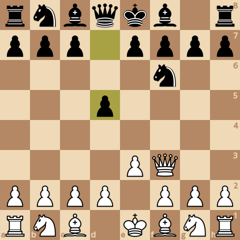

### board0000.png

Current board:\

### board0001.png

Found a new move 0\
Analyzed boards: 84045\
Average speed for the move: 123868 boards/s\
Time taken for the move: 0.678505s\
Total time taken: 0.678505s\
Current white score: 24200, black score: 24100\
Current board after move:\

### board0002.png

Found a new move 1\
Analyzed boards: 408325\
Average speed for the move: 119893 boards/s\
Time taken for the move: 2.70474s\
Total time taken: 3.38324s\
Current white score: 24200, black score: 24120\
Current board after move:\

### board0003.png

Found a new move 2\
Analyzed boards: 655505\
Average speed for the move: 121393 boards/s\
Time taken for the move: 2.0362s\
Total time taken: 5.41944s\
Current white score: 24270, black score: 24120\
Current board after move:\

### board0004.png

Found a new move 3\
Analyzed boards: 918722\
Average speed for the move: 114502 boards/s\
Time taken for the move: 2.29881s\
Total time taken: 7.71825s\
Current white score: 24250, black score: 24200\
Current board after move:\

### board0005.png

Found a new move 4\
Analyzed boards: 1480623\
Average speed for the move: 128311 boards/s\
Time taken for the move: 4.3792s\
Total time taken: 12.0975s\
Current white score: 24290, black score: 24200\
Current board after move:\

### board0006.png

Found a new move 5\
Analyzed boards: 1941779\
Average speed for the move: 130185 boards/s\
Time taken for the move: 3.5423s\
Total time taken: 15.6398s\
Current white score: 24280, black score: 24250\
Current board after move:\

### board0007.png

Found a new move 6\
Analyzed boards: 2062936\
Average speed for the move: 135152 boards/s\
Time taken for the move: 0.896447s\
Total time taken: 16.5362s\
Current white score: 24270, black score: 24240\
Current board after move:\

### board0008.png

Found a new move 7\
Analyzed boards: 2159798\
Average speed for the move: 127455 boards/s\
Time taken for the move: 0.759969s\
Total time taken: 17.2962s\
Current white score: 24250, black score: 24250\
Current board after move:\

### board0009.png

Found a new move 8\
Analyzed boards: 2185146\
Average speed for the move: 133293 boards/s\
Time taken for the move: 0.190167s\
Total time taken: 17.4863s\
Current white score: 23300, black score: 23520\
Current board after move:\

### board0010.png

Found a new move 9\
Analyzed boards: 2393755\
Average speed for the move: 127958 boards/s\
Time taken for the move: 1.63029s\
Total time taken: 19.1166s\
Current white score: 23300, black score: 23540\
Current board after move:\

### board0011.png

Found a new move 10\
Analyzed boards: 2445369\
Average speed for the move: 116679 boards/s\
Time taken for the move: 0.44236s\
Total time taken: 19.559s\
Current white score: 22960, black score: 22620\
Current board after move:\

### board0012.png

Found a new move 11\
Analyzed boards: 2661800\
Average speed for the move: 111752 boards/s\
Time taken for the move: 1.93672s\
Total time taken: 21.4957s\
Current white score: 22960, black score: 22710\
Current board after move:\

### board0013.png

Found a new move 12\
Analyzed boards: 2969979\
Average speed for the move: 134481 boards/s\
Time taken for the move: 2.29161s\
Total time taken: 23.7873s\
Current white score: 22970, black score: 22710\
Current board after move:\

### board0014.png

Found a new move 13\
Analyzed boards: 3115702\
Average speed for the move: 136371 boards/s\
Time taken for the move: 1.06857s\
Total time taken: 24.8559s\
Current white score: 22960, black score: 22760\
Current board after move:\

### board0015.png

Found a new move 14\
Analyzed boards: 3137872\
Average speed for the move: 139724 boards/s\
Time taken for the move: 0.15867s\
Total time taken: 25.0146s\
Current white score: 22960, black score: 22750\
Current board after move:\

### board0016.png

Found a new move 15\
Analyzed boards: 3369644\
Average speed for the move: 129863 boards/s\
Time taken for the move: 1.78475s\
Total time taken: 26.7993s\
Current white score: 22960, black score: 22710\
Current board after move:\

### board0017.png

Found a new move 16\
Analyzed boards: 3670839\
Average speed for the move: 142055 boards/s\
Time taken for the move: 2.12027s\
Total time taken: 28.9196s\
Current white score: 23000, black score: 22700\
Current board after move:\

### board0018.png

Found a new move 17\
Analyzed boards: 3985790\
Average speed for the move: 155173 boards/s\
Time taken for the move: 2.02967s\
Total time taken: 30.9492s\
Current white score: 23000, black score: 22710\
Current board after move:\

### board0019.png

Found a new move 18\
Analyzed boards: 4053657\
Average speed for the move: 170417 boards/s\
Time taken for the move: 0.39824s\
Total time taken: 31.3475s\
Current white score: 23000, black score: 22700\
Current board after move:\

### board0020.png

Found a new move 19\
Analyzed boards: 4098563\
Average speed for the move: 150536 boards/s\
Time taken for the move: 0.298307s\
Total time taken: 31.6458s\
Current white score: 22990, black score: 22710\
Current board after move:\

### board0021.png

Found a new move 20\
Analyzed boards: 4122257\
Average speed for the move: 181075 boards/s\
Time taken for the move: 0.130852s\
Total time taken: 31.7766s\
Current white score: 23000, black score: 22700\
Current board after move:\

### board0022.png

Found a new move 21\
Analyzed boards: 4206382\
Average speed for the move: 153265 boards/s\
Time taken for the move: 0.548887s\
Total time taken: 32.3255s\
Current white score: 23000, black score: 22700\
Current board after move:\

### board0023.png

Found a new move 22\
Analyzed boards: 4280462\
Average speed for the move: 175123 boards/s\
Time taken for the move: 0.423018s\
Total time taken: 32.7485s\
Current white score: 22640, black score: 22080\
Current board after move:\

### board0024.png

Found a new move 23\
Analyzed boards: 4449291\
Average speed for the move: 168597 boards/s\
Time taken for the move: 1.00138s\
Total time taken: 33.7499s\
Current white score: 22650, black score: 22110\
Current board after move:\

### board0025.png

Found a new move 24\
Analyzed boards: 4521902\
Average speed for the move: 184798 boards/s\
Time taken for the move: 0.39292s\
Total time taken: 34.1428s\
Current white score: 22670, black score: 22110\
Current board after move:\

### board0026.png

Found a new move 25\
Analyzed boards: 4578874\
Average speed for the move: 187448 boards/s\
Time taken for the move: 0.303935s\
Total time taken: 34.4468s\
Current white score: 22660, black score: 22100\
Current board after move:\

### board0027.png

Found a new move 26\
Analyzed boards: 4695009\
Average speed for the move: 161684 boards/s\
Time taken for the move: 0.718282s\
Total time taken: 35.1651s\
Current white score: 22650, black score: 21990\
Current board after move:\

### board0028.png

Found a new move 27\
Analyzed boards: 4806663\
Average speed for the move: 184737 boards/s\
Time taken for the move: 0.604393s\
Total time taken: 35.7695s\
Current white score: 22540, black score: 21980\
Current board after move:\

### board0029.png

Found a new move 28\
Analyzed boards: 4853231\
Average speed for the move: 176515 boards/s\
Time taken for the move: 0.263819s\
Total time taken: 36.0333s\
Current white score: 22580, black score: 21980\
Current board after move:\

### board0030.png

Found a new move 29\
Analyzed boards: 4924515\
Average speed for the move: 150064 boards/s\
Time taken for the move: 0.475025s\
Total time taken: 36.5083s\
Current white score: 22580, black score: 22020\
Current board after move:\

### board0031.png

Found a new move 30\
Analyzed boards: 5117627\
Average speed for the move: 185846 boards/s\
Time taken for the move: 1.0391s\
Total time taken: 37.5474s\
Current white score: 22590, black score: 22020\
Current board after move:\

### board0032.png

Found a new move 31\
Analyzed boards: 5288295\
Average speed for the move: 203665 boards/s\
Time taken for the move: 0.837983s\
Total time taken: 38.3854s\
Current white score: 22570, black score: 22010\
Current board after move:\

### board0033.png

Found a new move 32\
Analyzed boards: 5527639\
Average speed for the move: 197890 boards/s\
Time taken for the move: 1.20948s\
Total time taken: 39.5949s\
Current white score: 22560, black score: 22000\
Current board after move:\

### board0034.png

Found a new move 33\
Analyzed boards: 5720720\
Average speed for the move: 190995 boards/s\
Time taken for the move: 1.01092s\
Total time taken: 40.6058s\
Current white score: 22570, black score: 22020\
Current board after move:\

### board0035.png

Found a new move 34\
Analyzed boards: 5933596\
Average speed for the move: 205073 boards/s\
Time taken for the move: 1.03805s\
Total time taken: 41.6438s\
Current white score: 22600, black score: 22020\
Current board after move:\

### board0036.png

Found a new move 35\
Analyzed boards: 6111710\
Average speed for the move: 189900 boards/s\
Time taken for the move: 0.937935s\
Total time taken: 42.5818s\
Current white score: 22490, black score: 22010\
Current board after move:\

### board0037.png

Found a new move 36\
Analyzed boards: 6971547\
Average speed for the move: 213743 boards/s\
Time taken for the move: 4.02275s\
Total time taken: 46.6045s\
Current white score: 22530, black score: 22010\
Current board after move:\

### board0038.png

Found a new move 37\
Analyzed boards: 7817457\
Average speed for the move: 201759 boards/s\
Time taken for the move: 4.19268s\
Total time taken: 50.7972s\
Current white score: 22540, black score: 22020\
Current board after move:\

### board0039.png

Found a new move 38\
Analyzed boards: 8099753\
Average speed for the move: 200765 boards/s\
Time taken for the move: 1.4061s\
Total time taken: 52.2033s\
Current white score: 22520, black score: 22010\
Current board after move:\

### board0040.png

Found a new move 39\
Analyzed boards: 8707176\
Average speed for the move: 177565 boards/s\
Time taken for the move: 3.42084s\
Total time taken: 55.6241s\
Current white score: 22520, black score: 22030\
Current board after move:\

### board0041.png

Found a new move 40\
Analyzed boards: 8884207\
Average speed for the move: 173041 boards/s\
Time taken for the move: 1.02306s\
Total time taken: 56.6472s\
Current white score: 22500, black score: 22030\
Current board after move:\

### board0042.png

Found a new move 41\
Analyzed boards: 9546165\
Average speed for the move: 187262 boards/s\
Time taken for the move: 3.53492s\
Total time taken: 60.1821s\
Current white score: 22500, black score: 22010\
Current board after move:\

### board0043.png

Found a new move 42\
Analyzed boards: 11930210\
Average speed for the move: 187020 boards/s\
Time taken for the move: 12.7475s\
Total time taken: 72.9296s\
Current white score: 22500, black score: 22010\
Current board after move:\

### board0044.png

Found a new move 43\
Analyzed boards: 12125050\
Average speed for the move: 187271 boards/s\
Time taken for the move: 1.04042s\
Total time taken: 73.9701s\
Current white score: 22500, black score: 22030\
Current board after move:\

### board0045.png

Found a new move 44\
Analyzed boards: 12141666\
Average speed for the move: 204969 boards/s\
Time taken for the move: 0.081066s\
Total time taken: 74.0511s\
Current white score: 22500, black score: 22000\
Current board after move:\

### board0046.png

Found a new move 45\
Analyzed boards: 12270409\
Average speed for the move: 191412 boards/s\
Time taken for the move: 0.672595s\
Total time taken: 74.7237s\
Current white score: 22420, black score: 22030\
Current board after move:\

### board0047.png

Found a new move 46\
Analyzed boards: 12402327\
Average speed for the move: 207011 boards/s\
Time taken for the move: 0.63725s\
Total time taken: 75.361s\
Current white score: 22380, black score: 22000\
Current board after move:\
Game ended, it's a checkmate!\

