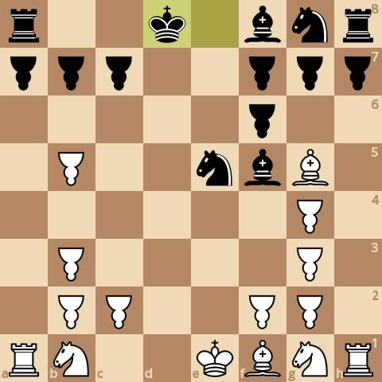
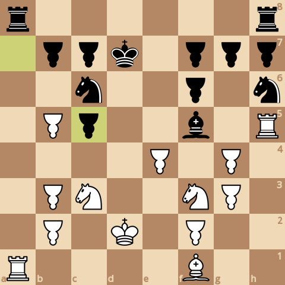
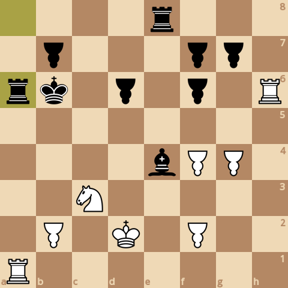
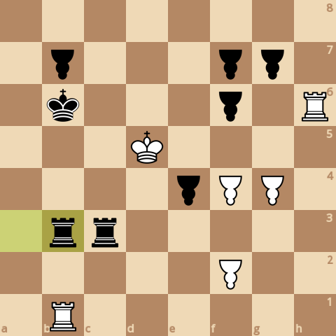
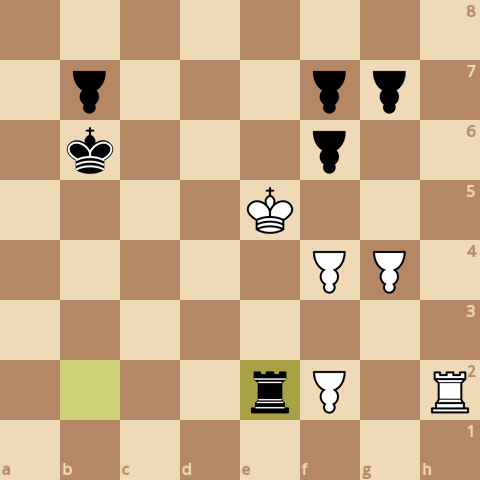
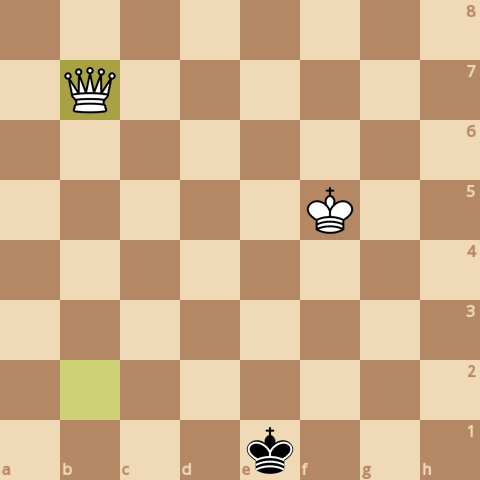

### board0000.png

Current board:\

### board0001.png

Found a new move 0\
Analyzed boards: 199689\
Average speed for the move: 165800 boards/s\
Time taken for the move: 1.2044s\
Total time taken: 1.2044s\
Current white score: 24310, black score: 24200\
Current board after move:\

### board0002.png

Found a new move 1\
Analyzed boards: 498263\
Average speed for the move: 164232 boards/s\
Time taken for the move: 1.818s\
Total time taken: 3.0224s\
Current white score: 24330, black score: 24330\
Current board after move:\

### board0003.png

Found a new move 2\
Analyzed boards: 564837\
Average speed for the move: 166744 boards/s\
Time taken for the move: 0.399259s\
Total time taken: 3.42166s\
Current white score: 24320, black score: 24200\
Current board after move:\

### board0004.png

Found a new move 3\
Analyzed boards: 642150\
Average speed for the move: 166384 boards/s\
Time taken for the move: 0.464667s\
Total time taken: 3.88632s\
Current white score: 24310, black score: 24240\
Current board after move:\

### board0005.png

Found a new move 4\
Analyzed boards: 743834\
Average speed for the move: 169749 boards/s\
Time taken for the move: 0.599025s\
Total time taken: 4.48535s\
Current white score: 24350, black score: 24230\
Current board after move:\

### board0006.png

Found a new move 5\
Analyzed boards: 961008\
Average speed for the move: 171317 boards/s\
Time taken for the move: 1.26767s\
Total time taken: 5.75302s\
Current white score: 24340, black score: 24260\
Current board after move:\

### board0007.png

Found a new move 6\
Analyzed boards: 1430389\
Average speed for the move: 169067 boards/s\
Time taken for the move: 2.77631s\
Total time taken: 8.52933s\
Current white score: 24390, black score: 24260\
Current board after move:\

### board0008.png

Found a new move 7\
Analyzed boards: 1720542\
Average speed for the move: 160625 boards/s\
Time taken for the move: 1.8064s\
Total time taken: 10.3357s\
Current white score: 24390, black score: 24260\
Current board after move:\

### board0009.png

Found a new move 8\
Analyzed boards: 2478849\
Average speed for the move: 153786 boards/s\
Time taken for the move: 4.93094s\
Total time taken: 15.2667s\
Current white score: 24430, black score: 24250\
Current board after move:\

### board0010.png

Found a new move 9\
Analyzed boards: 4222892\
Average speed for the move: 155506 boards/s\
Time taken for the move: 11.2153s\
Total time taken: 26.482s\
Current white score: 24440, black score: 24270\
Current board after move:\

### board0011.png

Found a new move 10\
Analyzed boards: 5426257\
Average speed for the move: 150844 boards/s\
Time taken for the move: 7.97754s\
Total time taken: 34.4595s\
Current white score: 24480, black score: 24270\
Current board after move:\

### board0012.png

Found a new move 11\
Analyzed boards: 6947893\
Average speed for the move: 153385 boards/s\
Time taken for the move: 9.92034s\
Total time taken: 44.3798s\
Current white score: 24470, black score: 24300\
Current board after move:\

### board0013.png

Found a new move 12\
Analyzed boards: 8283418\
Average speed for the move: 146041 boards/s\
Time taken for the move: 9.14488s\
Total time taken: 53.5247s\
Current white score: 24520, black score: 23320\
Current board after move:\

### board0014.png

Found a new move 13\
Analyzed boards: 8700404\
Average speed for the move: 164224 boards/s\
Time taken for the move: 2.53913s\
Total time taken: 56.0638s\
Current white score: 23480, black score: 23320\
Current board after move:\

### board0015.png

Found a new move 14\
Analyzed boards: 12184309\
Average speed for the move: 163453 boards/s\
Time taken for the move: 21.3145s\
Total time taken: 77.3783s\
Current white score: 23490, black score: 23320\
Current board after move:\

### board0016.png

Found a new move 15\
Analyzed boards: 16515431\
Average speed for the move: 163425 boards/s\
Time taken for the move: 26.5021s\
Total time taken: 103.88s\
Current white score: 23490, black score: 23350\
Current board after move:\

### board0017.png

Found a new move 16\
Analyzed boards: 19748587\
Average speed for the move: 161249 boards/s\
Time taken for the move: 20.0507s\
Total time taken: 123.931s\
Current white score: 23460, black score: 23350\
Current board after move:\

### board0018.png

Found a new move 17\
Analyzed boards: 20884550\
Average speed for the move: 163935 boards/s\
Time taken for the move: 6.92934s\
Total time taken: 130.86s\
Current white score: 23120, black score: 23360\
Current board after move:\

### board0019.png

Found a new move 18\
Analyzed boards: 21014427\
Average speed for the move: 176002 boards/s\
Time taken for the move: 0.737931s\
Total time taken: 131.598s\
Current white score: 23130, black score: 22980\
Current board after move:\

### board0020.png

Found a new move 19\
Analyzed boards: 22104293\
Average speed for the move: 180640 boards/s\
Time taken for the move: 6.03337s\
Total time taken: 137.632s\
Current white score: 23020, black score: 22980\
Current board after move:\

### board0021.png

Found a new move 20\
Analyzed boards: 22518558\
Average speed for the move: 180436 boards/s\
Time taken for the move: 2.29592s\
Total time taken: 139.928s\
Current white score: 23040, black score: 22970\
Current board after move:\

### board0022.png

Found a new move 21\
Analyzed boards: 22997446\
Average speed for the move: 185355 boards/s\
Time taken for the move: 2.58362s\
Total time taken: 142.511s\
Current white score: 23020, black score: 22980\
Current board after move:\

### board0023.png

Found a new move 22\
Analyzed boards: 23699889\
Average speed for the move: 189785 boards/s\
Time taken for the move: 3.70126s\
Total time taken: 146.213s\
Current white score: 23020, black score: 22950\
Current board after move:\

### board0024.png

Found a new move 23\
Analyzed boards: 24121030\
Average speed for the move: 199505 boards/s\
Time taken for the move: 2.11093s\
Total time taken: 148.323s\
Current white score: 23000, black score: 22940\
Current board after move:\

### board0025.png

Found a new move 24\
Analyzed boards: 25054718\
Average speed for the move: 187923 boards/s\
Time taken for the move: 4.96847s\
Total time taken: 153.292s\
Current white score: 23050, black score: 22940\
Current board after move:\

### board0026.png

Found a new move 25\
Analyzed boards: 26254356\
Average speed for the move: 184991 boards/s\
Time taken for the move: 6.48484s\
Total time taken: 159.777s\
Current white score: 23040, black score: 22960\
Current board after move:\

### board0027.png

Found a new move 26\
Analyzed boards: 31771469\
Average speed for the move: 178602 boards/s\
Time taken for the move: 30.8906s\
Total time taken: 190.667s\
Current white score: 23070, black score: 22960\
Current board after move:\

### board0028.png

Found a new move 27\
Analyzed boards: 35401016\
Average speed for the move: 182072 boards/s\
Time taken for the move: 19.9347s\
Total time taken: 210.602s\
Current white score: 23070, black score: 23040\
Current board after move:\

### board0029.png

Found a new move 28\
Analyzed boards: 39569177\
Average speed for the move: 170194 boards/s\
Time taken for the move: 24.4907s\
Total time taken: 235.093s\
Current white score: 23110, black score: 23040\
Current board after move:\

### board0030.png

Found a new move 29\
Analyzed boards: 43255731\
Average speed for the move: 174113 boards/s\
Time taken for the move: 21.1733s\
Total time taken: 256.266s\
Current white score: 23130, black score: 23120\
Current board after move:\

### board0031.png

Found a new move 30\
Analyzed boards: 44868919\
Average speed for the move: 173661 boards/s\
Time taken for the move: 9.28929s\
Total time taken: 265.555s\
Current white score: 23100, black score: 23060\
Current board after move:\

### board0032.png

Found a new move 31\
Analyzed boards: 49204392\
Average speed for the move: 172690 boards/s\
Time taken for the move: 25.1055s\
Total time taken: 290.661s\
Current white score: 23110, black score: 23050\
Current board after move:\

### board0033.png

Found a new move 32\
Analyzed boards: 55920428\
Average speed for the move: 175620 boards/s\
Time taken for the move: 38.2419s\
Total time taken: 328.903s\
Current white score: 23140, black score: 23050\
Current board after move:\

### board0034.png

Found a new move 33\
Analyzed boards: 61409014\
Average speed for the move: 173315 boards/s\
Time taken for the move: 31.6683s\
Total time taken: 360.571s\
Current white score: 23040, black score: 23070\
Current board after move:\

### board0035.png

Found a new move 34\
Analyzed boards: 70501596\
Average speed for the move: 176863 boards/s\
Time taken for the move: 51.4104s\
Total time taken: 411.981s\
Current white score: 23030, black score: 22940\
Current board after move:\

### board0036.png

Found a new move 35\
Analyzed boards: 75865898\
Average speed for the move: 184628 boards/s\
Time taken for the move: 29.0546s\
Total time taken: 441.036s\
Current white score: 23030, black score: 22940\
Current board after move:\

### board0037.png

Found a new move 36\
Analyzed boards: 83906482\
Average speed for the move: 183537 boards/s\
Time taken for the move: 43.809s\
Total time taken: 484.845s\
Current white score: 22990, black score: 22930\
Current board after move:\

### board0038.png

Found a new move 37\
Analyzed boards: 87580786\
Average speed for the move: 185407 boards/s\
Time taken for the move: 19.8175s\
Total time taken: 504.662s\
Current white score: 22990, black score: 22920\
Current board after move:\

### board0039.png

Found a new move 38\
Analyzed boards: 89296837\
Average speed for the move: 191165 boards/s\
Time taken for the move: 8.97678s\
Total time taken: 513.639s\
Current white score: 23000, black score: 22550\
Current board after move:\

### board0040.png

Found a new move 39\
Analyzed boards: 89501196\
Average speed for the move: 199843 boards/s\
Time taken for the move: 1.0226s\
Total time taken: 514.662s\
Current white score: 22650, black score: 22570\
Current board after move:\

### board0041.png

Found a new move 40\
Analyzed boards: 94155046\
Average speed for the move: 206707 boards/s\
Time taken for the move: 22.5142s\
Total time taken: 537.176s\
Current white score: 22610, black score: 22560\
Current board after move:\

### board0042.png

Found a new move 41\
Analyzed boards: 96666415\
Average speed for the move: 206281 boards/s\
Time taken for the move: 12.1745s\
Total time taken: 549.351s\
Current white score: 22610, black score: 22590\
Current board after move:\

### board0043.png

Found a new move 42\
Analyzed boards: 98452712\
Average speed for the move: 204813 boards/s\
Time taken for the move: 8.72162s\
Total time taken: 558.072s\
Current white score: 22610, black score: 22500\
Current board after move:\

### board0044.png

Found a new move 43\
Analyzed boards: 98913874\
Average speed for the move: 197187 boards/s\
Time taken for the move: 2.33871s\
Total time taken: 560.411s\
Current white score: 22350, black score: 22480\
Current board after move:\

### board0045.png

Found a new move 44\
Analyzed boards: 99326604\
Average speed for the move: 208097 boards/s\
Time taken for the move: 1.98336s\
Total time taken: 562.394s\
Current white score: 22320, black score: 22160\
Current board after move:\

### board0046.png

Found a new move 45\
Analyzed boards: 99480384\
Average speed for the move: 215898 boards/s\
Time taken for the move: 0.71228s\
Total time taken: 563.107s\
Current white score: 22220, black score: 22220\
Current board after move:\

### board0047.png

Found a new move 46\
Analyzed boards: 99652449\
Average speed for the move: 215548 boards/s\
Time taken for the move: 0.798268s\
Total time taken: 563.905s\
Current white score: 22240, black score: 22220\
Current board after move:\

### board0048.png

Found a new move 47\
Analyzed boards: 99787712\
Average speed for the move: 213786 boards/s\
Time taken for the move: 0.632702s\
Total time taken: 564.538s\
Current white score: 22150, black score: 22240\
Current board after move:\

### board0049.png

Found a new move 48\
Analyzed boards: 99864502\
Average speed for the move: 212309 boards/s\
Time taken for the move: 0.36169s\
Total time taken: 564.899s\
Current white score: 22120, black score: 22240\
Current board after move:\

### board0050.png

Found a new move 49\
Analyzed boards: 99966300\
Average speed for the move: 217397 boards/s\
Time taken for the move: 0.468258s\
Total time taken: 565.367s\
Current white score: 22110, black score: 22210\
Current board after move:\

### board0051.png

Found a new move 50\
Analyzed boards: 100107568\
Average speed for the move: 216195 boards/s\
Time taken for the move: 0.653428s\
Total time taken: 566.021s\
Current white score: 22110, black score: 21810\
Current board after move:\

### board0052.png

Found a new move 51\
Analyzed boards: 100191299\
Average speed for the move: 233321 boards/s\
Time taken for the move: 0.358866s\
Total time taken: 566.38s\
Current white score: 21770, black score: 21830\
Current board after move:\

### board0053.png

Found a new move 52\
Analyzed boards: 100273292\
Average speed for the move: 226904 boards/s\
Time taken for the move: 0.361356s\
Total time taken: 566.741s\
Current white score: 21780, black score: 21820\
Current board after move:\

### board0054.png

Found a new move 53\
Analyzed boards: 100486551\
Average speed for the move: 235154 boards/s\
Time taken for the move: 0.90689s\
Total time taken: 567.648s\
Current white score: 21770, black score: 21870\
Current board after move:\

### board0055.png

Found a new move 54\
Analyzed boards: 100548206\
Average speed for the move: 236383 boards/s\
Time taken for the move: 0.260827s\
Total time taken: 567.909s\
Current white score: 21760, black score: 21860\
Current board after move:\

### board0056.png

Found a new move 55\
Analyzed boards: 100725379\
Average speed for the move: 241015 boards/s\
Time taken for the move: 0.735113s\
Total time taken: 568.644s\
Current white score: 21760, black score: 21880\
Current board after move:\

### board0057.png

Found a new move 56\
Analyzed boards: 100750217\
Average speed for the move: 229784 boards/s\
Time taken for the move: 0.108093s\
Total time taken: 568.752s\
Current white score: 21760, black score: 21910\
Current board after move:\

### board0058.png

Found a new move 57\
Analyzed boards: 100835758\
Average speed for the move: 240379 boards/s\
Time taken for the move: 0.355859s\
Total time taken: 569.108s\
Current white score: 21760, black score: 21880\
Current board after move:\

### board0059.png

Found a new move 58\
Analyzed boards: 100843415\
Average speed for the move: 246634 boards/s\
Time taken for the move: 0.031046s\
Total time taken: 569.139s\
Current white score: 21770, black score: 21870\
Current board after move:\

### board0060.png

Found a new move 59\
Analyzed boards: 100934626\
Average speed for the move: 238895 boards/s\
Time taken for the move: 0.381804s\
Total time taken: 569.521s\
Current white score: 21650, black score: 21870\
Current board after move:\

### board0061.png

Found a new move 60\
Analyzed boards: 101042135\
Average speed for the move: 237514 boards/s\
Time taken for the move: 0.452642s\
Total time taken: 569.973s\
Current white score: 21670, black score: 21870\
Current board after move:\

### board0062.png

Found a new move 61\
Analyzed boards: 101065444\
Average speed for the move: 256317 boards/s\
Time taken for the move: 0.090938s\
Total time taken: 570.064s\
Current white score: 21640, black score: 21830\
Current board after move:\

### board0063.png

Found a new move 62\
Analyzed boards: 101108025\
Average speed for the move: 250588 boards/s\
Time taken for the move: 0.169924s\
Total time taken: 570.234s\
Current white score: 21620, black score: 21290\
Current board after move:\

### board0064.png

Found a new move 63\
Analyzed boards: 101111161\
Average speed for the move: 282701 boards/s\
Time taken for the move: 0.011093s\
Total time taken: 570.245s\
Current white score: 21050, black score: 21270\
Current board after move:\

### board0065.png

Found a new move 64\
Analyzed boards: 101130401\
Average speed for the move: 291997 boards/s\
Time taken for the move: 0.065891s\
Total time taken: 570.311s\
Current white score: 21040, black score: 21170\
Current board after move:\

### board0066.png

Found a new move 65\
Analyzed boards: 101174112\
Average speed for the move: 310533 boards/s\
Time taken for the move: 0.140761s\
Total time taken: 570.452s\
Current white score: 21040, black score: 21140\
Current board after move:\

### board0067.png

Found a new move 66\
Analyzed boards: 101193088\
Average speed for the move: 319386 boards/s\
Time taken for the move: 0.059414s\
Total time taken: 570.511s\
Current white score: 21030, black score: 21140\
Current board after move:\

### board0068.png

Found a new move 67\
Analyzed boards: 101246458\
Average speed for the move: 324444 boards/s\
Time taken for the move: 0.164497s\
Total time taken: 570.676s\
Current white score: 21030, black score: 21140\
Current board after move:\

### board0069.png

Found a new move 68\
Analyzed boards: 101265764\
Average speed for the move: 328495 boards/s\
Time taken for the move: 0.058771s\
Total time taken: 570.735s\
Current white score: 21020, black score: 21150\
Current board after move:\

### board0070.png

Found a new move 69\
Analyzed boards: 101308116\
Average speed for the move: 315488 boards/s\
Time taken for the move: 0.134243s\
Total time taken: 570.869s\
Current white score: 21020, black score: 21150\
Current board after move:\

### board0071.png

Found a new move 70\
Analyzed boards: 101327289\
Average speed for the move: 317670 boards/s\
Time taken for the move: 0.060355s\
Total time taken: 570.929s\
Current white score: 21040, black score: 21170\
Current board after move:\

### board0072.png

Found a new move 71\
Analyzed boards: 101354844\
Average speed for the move: 315242 boards/s\
Time taken for the move: 0.087409s\
Total time taken: 571.017s\
Current white score: 21040, black score: 21180\
Current board after move:\

### board0073.png

Found a new move 72\
Analyzed boards: 101382747\
Average speed for the move: 331910 boards/s\
Time taken for the move: 0.084068s\
Total time taken: 571.101s\
Current white score: 21020, black score: 21140\
Current board after move:\

### board0074.png

Found a new move 73\
Analyzed boards: 101436346\
Average speed for the move: 328526 boards/s\
Time taken for the move: 0.16315s\
Total time taken: 571.264s\
Current white score: 21000, black score: 21160\
Current board after move:\

### board0075.png

Found a new move 74\
Analyzed boards: 101454998\
Average speed for the move: 317529 boards/s\
Time taken for the move: 0.058741s\
Total time taken: 571.323s\
Current white score: 21000, black score: 21160\
Current board after move:\

### board0076.png

Found a new move 75\
Analyzed boards: 101500509\
Average speed for the move: 338115 boards/s\
Time taken for the move: 0.134602s\
Total time taken: 571.457s\
Current white score: 21000, black score: 21150\
Current board after move:\

### board0077.png

Found a new move 76\
Analyzed boards: 101508375\
Average speed for the move: 321942 boards/s\
Time taken for the move: 0.024433s\
Total time taken: 571.482s\
Current white score: 20990, black score: 21150\
Current board after move:\

### board0078.png

Found a new move 77\
Analyzed boards: 101529032\
Average speed for the move: 358479 boards/s\
Time taken for the move: 0.057624s\
Total time taken: 571.539s\
Current white score: 20950, black score: 21140\
Current board after move:\

### board0079.png

Found a new move 78\
Analyzed boards: 101532642\
Average speed for the move: 349772 boards/s\
Time taken for the move: 0.010321s\
Total time taken: 571.55s\
Current white score: 21000, black score: 21030\
Current board after move:\

### board0080.png

Found a new move 79\
Analyzed boards: 101543855\
Average speed for the move: 370714 boards/s\
Time taken for the move: 0.030247s\
Total time taken: 571.58s\
Current white score: 20910, black score: 21050\
Current board after move:\

### board0081.png

Found a new move 80\
Analyzed boards: 101552741\
Average speed for the move: 362620 boards/s\
Time taken for the move: 0.024505s\
Total time taken: 571.604s\
Current white score: 20910, black score: 20940\
Current board after move:\

### board0082.png

Found a new move 81\
Analyzed boards: 101558564\
Average speed for the move: 345353 boards/s\
Time taken for the move: 0.016861s\
Total time taken: 571.621s\
Current white score: 20910, black score: 20930\
Current board after move:\

### board0083.png

Found a new move 82\
Analyzed boards: 101560123\
Average speed for the move: 371722 boards/s\
Time taken for the move: 0.004194s\
Total time taken: 571.625s\
Current white score: 20840, black score: 20920\
Current board after move:\

### board0084.png

Found a new move 83\
Analyzed boards: 101562022\
Average speed for the move: 370464 boards/s\
Time taken for the move: 0.005126s\
Total time taken: 571.631s\
Current white score: 20320, black score: 20890\
Current board after move:\

### board0085.png

Found a new move 84\
Analyzed boards: 101562998\
Average speed for the move: 461903 boards/s\
Time taken for the move: 0.002113s\
Total time taken: 571.633s\
Current white score: 20330, black score: 20330\
Current board after move:\

### board0086.png

Found a new move 85\
Analyzed boards: 101564579\
Average speed for the move: 469557 boards/s\
Time taken for the move: 0.003367s\
Total time taken: 571.636s\
Current white score: 20330, black score: 20330\
Current board after move:\

### board0087.png

Found a new move 86\
Analyzed boards: 101566072\
Average speed for the move: 434138 boards/s\
Time taken for the move: 0.003439s\
Total time taken: 571.639s\
Current white score: 20320, black score: 20320\
Current board after move:\

### board0088.png

Found a new move 87\
Analyzed boards: 101577090\
Average speed for the move: 510211 boards/s\
Time taken for the move: 0.021595s\
Total time taken: 571.661s\
Current white score: 20320, black score: 20320\
Current board after move:\

### board0089.png

Found a new move 88\
Analyzed boards: 101580876\
Average speed for the move: 450607 boards/s\
Time taken for the move: 0.008402s\
Total time taken: 571.669s\
Current white score: 20400, black score: 20340\
Current board after move:\

### board0090.png

Found a new move 89\
Analyzed boards: 101585313\
Average speed for the move: 413436 boards/s\
Time taken for the move: 0.010732s\
Total time taken: 571.68s\
Current white score: 20400, black score: 20340\
Current board after move:\

### board0091.png

Found a new move 90\
Analyzed boards: 101586212\
Average speed for the move: 365745 boards/s\
Time taken for the move: 0.002458s\
Total time taken: 571.683s\
Current white score: 21270, black score: 20340\
Current board after move:\

### board0092.png

Found a new move 91\
Analyzed boards: 101588460\
Average speed for the move: 391025 boards/s\
Time taken for the move: 0.005749s\
Total time taken: 571.688s\
Current white score: 21280, black score: 20340\
Current board after move:\

### board0093.png

Found a new move 92\
Analyzed boards: 101589122\
Average speed for the move: 376993 boards/s\
Time taken for the move: 0.001756s\
Total time taken: 571.69s\
Current white score: 21310, black score: 20210\
Current board after move:\

### board0094.png

Found a new move 93\
Analyzed boards: 101592008\
Average speed for the move: 422053 boards/s\
Time taken for the move: 0.006838s\
Total time taken: 571.697s\
Current white score: 21170, black score: 20210\
Current board after move:\

### board0095.png

Found a new move 94\
Analyzed boards: 101597426\
Average speed for the move: 439916 boards/s\
Time taken for the move: 0.012316s\
Total time taken: 571.709s\
Current white score: 21180, black score: 20210\
Current board after move:\

### board0096.png

Found a new move 95\
Analyzed boards: 101603293\
Average speed for the move: 472878 boards/s\
Time taken for the move: 0.012407s\
Total time taken: 571.722s\
Current white score: 21200, black score: 20180\
Current board after move:\

### board0097.png

Found a new move 96\
Analyzed boards: 101607161\
Average speed for the move: 481214 boards/s\
Time taken for the move: 0.008038s\
Total time taken: 571.73s\
Current white score: 21210, black score: 20050\
Current board after move:\

### board0098.png

Found a new move 97\
Analyzed boards: 101616794\
Average speed for the move: 512557 boards/s\
Time taken for the move: 0.018794s\
Total time taken: 571.749s\
Current white score: 21210, black score: 20080\
Current board after move:\

### board0099.png

Found a new move 98\
Analyzed boards: 101621897\
Average speed for the move: 475804 boards/s\
Time taken for the move: 0.010725s\
Total time taken: 571.759s\
Current white score: 21210, black score: 20080\
Current board after move:\

### board0100.png

Found a new move 99\
Analyzed boards: 101630392\
Average speed for the move: 475591 boards/s\
Time taken for the move: 0.017862s\
Total time taken: 571.777s\
Current white score: 21220, black score: 20080\
Current board after move:\

### board0101.png

Found a new move 100\
Analyzed boards: 101634712\
Average speed for the move: 495697 boards/s\
Time taken for the move: 0.008715s\
Total time taken: 571.786s\
Current white score: 21250, black score: 20080\
Current board after move:\

### board0102.png

Found a new move 101\
Analyzed boards: 101640611\
Average speed for the move: 501189 boards/s\
Time taken for the move: 0.01177s\
Total time taken: 571.798s\
Current white score: 21250, black score: 20080\
Current board after move:\

### board0103.png

Found a new move 102\
Analyzed boards: 101646176\
Average speed for the move: 506139 boards/s\
Time taken for the move: 0.010995s\
Total time taken: 571.809s\
Current white score: 21250, black score: 20080\
Current board after move:\

### board0104.png

Found a new move 103\
Analyzed boards: 101651050\
Average speed for the move: 504816 boards/s\
Time taken for the move: 0.009655s\
Total time taken: 571.818s\
Current white score: 21250, black score: 20050\
Current board after move:\

### board0105.png

Found a new move 104\
Analyzed boards: 101655534\
Average speed for the move: 499944 boards/s\
Time taken for the move: 0.008969s\
Total time taken: 571.827s\
Current white score: 21230, black score: 20050\
Current board after move:\

### board0106.png

Found a new move 105\
Analyzed boards: 101657822\
Average speed for the move: 511057 boards/s\
Time taken for the move: 0.004477s\
Total time taken: 571.832s\
Current white score: 21230, black score: 20050\
Current board after move:\

### board0107.png

Found a new move 106\
Analyzed boards: 101661065\
Average speed for the move: 507432 boards/s\
Time taken for the move: 0.006391s\
Total time taken: 571.838s\
Current white score: 21210, black score: 20050\
Current board after move:\
Game ended, it's a checkmate!\

