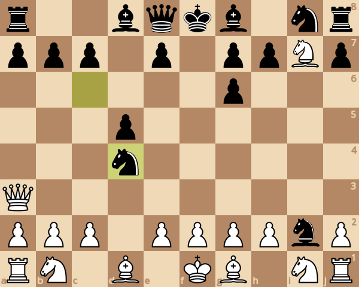
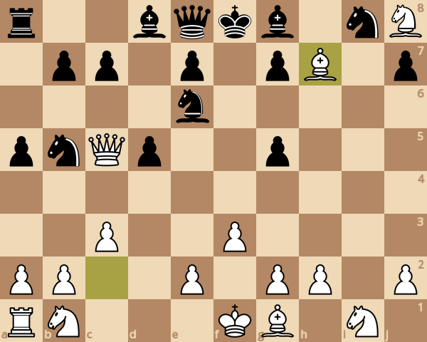
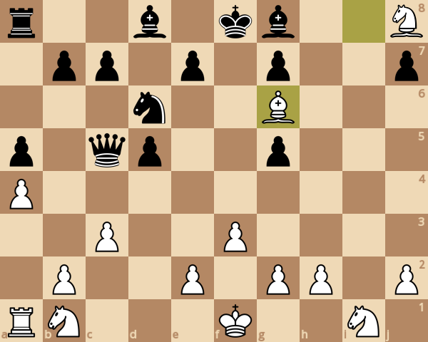
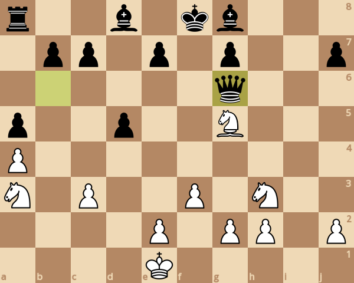
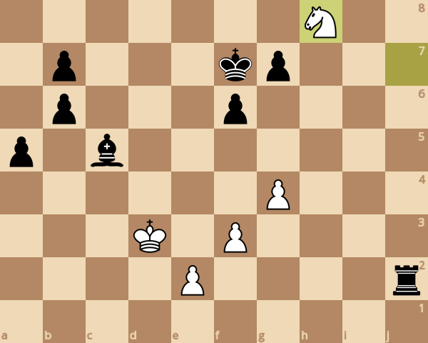
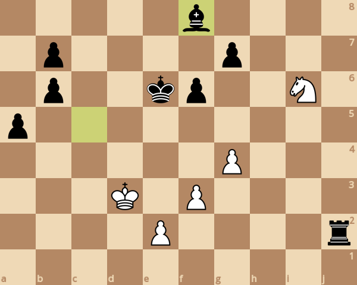

### board0000.png

Current board:\

### board0001.png

Found a new move 0\
Analyzed boards: 251033\
Average speed for the move: 132059 boards/s\
Time taken for the move: 1.90092s\
Total time taken: 1.90092s\
Current white score: 26280, black score: 26180\
Current board after move:\

### board0002.png

Found a new move 1\
Analyzed boards: 560420\
Average speed for the move: 130419 boards/s\
Time taken for the move: 2.37225s\
Total time taken: 4.27317s\
Current white score: 26280, black score: 26320\
Current board after move:\

### board0003.png

Found a new move 2\
Analyzed boards: 1405851\
Average speed for the move: 119391 boards/s\
Time taken for the move: 7.08118s\
Total time taken: 11.3544s\
Current white score: 26410, black score: 26310\
Current board after move:\

### board0004.png

Found a new move 3\
Analyzed boards: 1627406\
Average speed for the move: 118231 boards/s\
Time taken for the move: 1.87391s\
Total time taken: 13.2283s\
Current white score: 26400, black score: 26400\
Current board after move:\

### board0005.png

Found a new move 4\
Analyzed boards: 2112191\
Average speed for the move: 112216 boards/s\
Time taken for the move: 4.3201s\
Total time taken: 17.5484s\
Current white score: 26460, black score: 25350\
Current board after move:\

### board0006.png

Found a new move 5\
Analyzed boards: 2145287\
Average speed for the move: 131864 boards/s\
Time taken for the move: 0.250985s\
Total time taken: 17.7993s\
Current white score: 25350, black score: 25360\
Current board after move:\

### board0007.png

Found a new move 6\
Analyzed boards: 2490721\
Average speed for the move: 128186 boards/s\
Time taken for the move: 2.6948s\
Total time taken: 20.4941s\
Current white score: 25400, black score: 25240\
Current board after move:\

### board0008.png

Found a new move 7\
Analyzed boards: 2698655\
Average speed for the move: 131420 boards/s\
Time taken for the move: 1.58221s\
Total time taken: 22.0764s\
Current white score: 25280, black score: 25290\
Current board after move:\

### board0009.png

Found a new move 8\
Analyzed boards: 3079481\
Average speed for the move: 134999 boards/s\
Time taken for the move: 2.82096s\
Total time taken: 24.8973s\
Current white score: 25380, black score: 25280\
Current board after move:\

### board0010.png

Found a new move 9\
Analyzed boards: 4124295\
Average speed for the move: 133842 boards/s\
Time taken for the move: 7.80631s\
Total time taken: 32.7036s\
Current white score: 25380, black score: 25270\
Current board after move:\

### board0011.png

Found a new move 10\
Analyzed boards: 4988241\
Average speed for the move: 132386 boards/s\
Time taken for the move: 6.52597s\
Total time taken: 39.2296s\
Current white score: 25390, black score: 25280\
Current board after move:\

### board0012.png

Found a new move 11\
Analyzed boards: 5905724\
Average speed for the move: 133953 boards/s\
Time taken for the move: 6.84929s\
Total time taken: 46.0789s\
Current white score: 25290, black score: 25360\
Current board after move:\

### board0013.png

Found a new move 12\
Analyzed boards: 8271941\
Average speed for the move: 134960 boards/s\
Time taken for the move: 17.5327s\
Total time taken: 63.6116s\
Current white score: 25250, black score: 24860\
Current board after move:\

### board0014.png

Found a new move 13\
Analyzed boards: 9808714\
Average speed for the move: 139141 boards/s\
Time taken for the move: 11.0447s\
Total time taken: 74.6563s\
Current white score: 24750, black score: 24820\
Current board after move:\

### board0015.png

Found a new move 14\
Analyzed boards: 12130256\
Average speed for the move: 143500 boards/s\
Time taken for the move: 16.178s\
Total time taken: 90.8343s\
Current white score: 24730, black score: 24820\
Current board after move:\

### board0016.png

Found a new move 15\
Analyzed boards: 14113173\
Average speed for the move: 148988 boards/s\
Time taken for the move: 13.3093s\
Total time taken: 104.144s\
Current white score: 24730, black score: 24800\
Current board after move:\

### board0017.png

Found a new move 16\
Analyzed boards: 17649274\
Average speed for the move: 139280 boards/s\
Time taken for the move: 25.3884s\
Total time taken: 129.532s\
Current white score: 24720, black score: 24800\
Current board after move:\

### board0018.png

Found a new move 17\
Analyzed boards: 19552022\
Average speed for the move: 146771 boards/s\
Time taken for the move: 12.9641s\
Total time taken: 142.496s\
Current white score: 24740, black score: 24760\
Current board after move:\

### board0019.png

Found a new move 18\
Analyzed boards: 20774683\
Average speed for the move: 142996 boards/s\
Time taken for the move: 8.55029s\
Total time taken: 151.046s\
Current white score: 24790, black score: 24750\
Current board after move:\

### board0020.png

Found a new move 19\
Analyzed boards: 24427260\
Average speed for the move: 150365 boards/s\
Time taken for the move: 24.2914s\
Total time taken: 175.338s\
Current white score: 24750, black score: 24790\
Current board after move:\

### board0021.png

Found a new move 20\
Analyzed boards: 26911300\
Average speed for the move: 144433 boards/s\
Time taken for the move: 17.1986s\
Total time taken: 192.536s\
Current white score: 24800, black score: 24790\
Current board after move:\

### board0022.png

Found a new move 21\
Analyzed boards: 30295446\
Average speed for the move: 146718 boards/s\
Time taken for the move: 23.0656s\
Total time taken: 215.602s\
Current white score: 24800, black score: 24810\
Current board after move:\

### board0023.png

Found a new move 22\
Analyzed boards: 31622268\
Average speed for the move: 144470 boards/s\
Time taken for the move: 9.1841s\
Total time taken: 224.786s\
Current white score: 24800, black score: 24700\
Current board after move:\

### board0024.png

Found a new move 23\
Analyzed boards: 33110740\
Average speed for the move: 148198 boards/s\
Time taken for the move: 10.0438s\
Total time taken: 234.83s\
Current white score: 23770, black score: 24780\
Current board after move:\

### board0025.png

Found a new move 24\
Analyzed boards: 33512536\
Average speed for the move: 153915 boards/s\
Time taken for the move: 2.6105s\
Total time taken: 237.44s\
Current white score: 23840, black score: 23720\
Current board after move:\

### board0026.png

Found a new move 25\
Analyzed boards: 33901959\
Average speed for the move: 161880 boards/s\
Time taken for the move: 2.40563s\
Total time taken: 239.846s\
Current white score: 23840, black score: 23770\
Current board after move:\

### board0027.png

Found a new move 26\
Analyzed boards: 34848690\
Average speed for the move: 165886 boards/s\
Time taken for the move: 5.70713s\
Total time taken: 245.553s\
Current white score: 23830, black score: 23470\
Current board after move:\

### board0028.png

Found a new move 27\
Analyzed boards: 35377670\
Average speed for the move: 160546 boards/s\
Time taken for the move: 3.29488s\
Total time taken: 248.848s\
Current white score: 23430, black score: 23480\
Current board after move:\

### board0029.png

Found a new move 28\
Analyzed boards: 37160282\
Average speed for the move: 161204 boards/s\
Time taken for the move: 11.0581s\
Total time taken: 259.906s\
Current white score: 23440, black score: 23470\
Current board after move:\

### board0030.png

Found a new move 29\
Analyzed boards: 38090259\
Average speed for the move: 166581 boards/s\
Time taken for the move: 5.58274s\
Total time taken: 265.489s\
Current white score: 23430, black score: 23500\
Current board after move:\

### board0031.png

Found a new move 30\
Analyzed boards: 38769048\
Average speed for the move: 167432 boards/s\
Time taken for the move: 4.05412s\
Total time taken: 269.543s\
Current white score: 23470, black score: 23490\
Current board after move:\

### board0032.png

Found a new move 31\
Analyzed boards: 39192885\
Average speed for the move: 166060 boards/s\
Time taken for the move: 2.55231s\
Total time taken: 272.095s\
Current white score: 23450, black score: 23540\
Current board after move:\

### board0033.png

Found a new move 32\
Analyzed boards: 39502429\
Average speed for the move: 161715 boards/s\
Time taken for the move: 1.91413s\
Total time taken: 274.009s\
Current white score: 23480, black score: 23540\
Current board after move:\

### board0034.png

Found a new move 33\
Analyzed boards: 40025222\
Average speed for the move: 164643 boards/s\
Time taken for the move: 3.17531s\
Total time taken: 277.185s\
Current white score: 23500, black score: 23480\
Current board after move:\

### board0035.png

Found a new move 34\
Analyzed boards: 40066490\
Average speed for the move: 160409 boards/s\
Time taken for the move: 0.257267s\
Total time taken: 277.442s\
Current white score: 23510, black score: 23520\
Current board after move:\

### board0036.png

Found a new move 35\
Analyzed boards: 40481141\
Average speed for the move: 164463 boards/s\
Time taken for the move: 2.52124s\
Total time taken: 279.963s\
Current white score: 23390, black score: 23510\
Current board after move:\

### board0037.png

Found a new move 36\
Analyzed boards: 40837873\
Average speed for the move: 166007 boards/s\
Time taken for the move: 2.14889s\
Total time taken: 282.112s\
Current white score: 23390, black score: 23510\
Current board after move:\

### board0038.png

Found a new move 37\
Analyzed boards: 41261970\
Average speed for the move: 180464 boards/s\
Time taken for the move: 2.35004s\
Total time taken: 284.462s\
Current white score: 23380, black score: 23500\
Current board after move:\

### board0039.png

Found a new move 38\
Analyzed boards: 41582579\
Average speed for the move: 169853 boards/s\
Time taken for the move: 1.88756s\
Total time taken: 286.35s\
Current white score: 23490, black score: 23390\
Current board after move:\

### board0040.png

Found a new move 39\
Analyzed boards: 42001037\
Average speed for the move: 170221 boards/s\
Time taken for the move: 2.45832s\
Total time taken: 288.808s\
Current white score: 23490, black score: 23400\
Current board after move:\

### board0041.png

Found a new move 40\
Analyzed boards: 42067039\
Average speed for the move: 172537 boards/s\
Time taken for the move: 0.382539s\
Total time taken: 289.191s\
Current white score: 23490, black score: 23410\
Current board after move:\

### board0042.png

Found a new move 41\
Analyzed boards: 42271758\
Average speed for the move: 177125 boards/s\
Time taken for the move: 1.15579s\
Total time taken: 290.346s\
Current white score: 22980, black score: 23390\
Current board after move:\

### board0043.png

Found a new move 42\
Analyzed boards: 42451995\
Average speed for the move: 181760 boards/s\
Time taken for the move: 0.991623s\
Total time taken: 291.338s\
Current white score: 23010, black score: 23050\
Current board after move:\

### board0044.png

Found a new move 43\
Analyzed boards: 42542502\
Average speed for the move: 181204 boards/s\
Time taken for the move: 0.499475s\
Total time taken: 291.837s\
Current white score: 22590, black score: 23120\
Current board after move:\

### board0045.png

Found a new move 44\
Analyzed boards: 43019121\
Average speed for the move: 190176 boards/s\
Time taken for the move: 2.5062s\
Total time taken: 294.344s\
Current white score: 22570, black score: 23150\
Current board after move:\

### board0046.png

Found a new move 45\
Analyzed boards: 43224621\
Average speed for the move: 195532 boards/s\
Time taken for the move: 1.05098s\
Total time taken: 295.395s\
Current white score: 22570, black score: 23110\
Current board after move:\

### board0047.png

Found a new move 46\
Analyzed boards: 43433428\
Average speed for the move: 191946 boards/s\
Time taken for the move: 1.08784s\
Total time taken: 296.482s\
Current white score: 22570, black score: 23110\
Current board after move:\

### board0048.png

Found a new move 47\
Analyzed boards: 43798092\
Average speed for the move: 194103 boards/s\
Time taken for the move: 1.87871s\
Total time taken: 298.361s\
Current white score: 22570, black score: 23070\
Current board after move:\

### board0049.png

Found a new move 48\
Analyzed boards: 43936178\
Average speed for the move: 203806 boards/s\
Time taken for the move: 0.677536s\
Total time taken: 299.039s\
Current white score: 22570, black score: 23060\
Current board after move:\

### board0050.png

Found a new move 49\
Analyzed boards: 44253590\
Average speed for the move: 206005 boards/s\
Time taken for the move: 1.5408s\
Total time taken: 300.58s\
Current white score: 22580, black score: 23090\
Current board after move:\

### board0051.png

Found a new move 50\
Analyzed boards: 44469243\
Average speed for the move: 195471 boards/s\
Time taken for the move: 1.10325s\
Total time taken: 301.683s\
Current white score: 22570, black score: 23060\
Current board after move:\

### board0052.png

Found a new move 51\
Analyzed boards: 44805767\
Average speed for the move: 197283 boards/s\
Time taken for the move: 1.70579s\
Total time taken: 303.389s\
Current white score: 22570, black score: 23130\
Current board after move:\

### board0053.png

Found a new move 52\
Analyzed boards: 45128207\
Average speed for the move: 210925 boards/s\
Time taken for the move: 1.52869s\
Total time taken: 304.917s\
Current white score: 22560, black score: 23100\
Current board after move:\

### board0054.png

Found a new move 53\
Analyzed boards: 45164443\
Average speed for the move: 196590 boards/s\
Time taken for the move: 0.184323s\
Total time taken: 305.102s\
Current white score: 22460, black score: 23090\
Current board after move:\

### board0055.png

Found a new move 54\
Analyzed boards: 45198281\
Average speed for the move: 206623 boards/s\
Time taken for the move: 0.163767s\
Total time taken: 305.265s\
Current white score: 22500, black score: 23130\
Current board after move:\

### board0056.png

Found a new move 55\
Analyzed boards: 45225000\
Average speed for the move: 191959 boards/s\
Time taken for the move: 0.139191s\
Total time taken: 305.405s\
Current white score: 22500, black score: 23130\
Current board after move:\

### board0057.png

Found a new move 56\
Analyzed boards: 45359751\
Average speed for the move: 188108 boards/s\
Time taken for the move: 0.716349s\
Total time taken: 306.121s\
Current white score: 22480, black score: 22060\
Current board after move:\

### board0058.png

Found a new move 57\
Analyzed boards: 45372202\
Average speed for the move: 231970 boards/s\
Time taken for the move: 0.053675s\
Total time taken: 306.175s\
Current white score: 21440, black score: 22050\
Current board after move:\

### board0059.png

Found a new move 58\
Analyzed boards: 45415774\
Average speed for the move: 226838 boards/s\
Time taken for the move: 0.192084s\
Total time taken: 306.367s\
Current white score: 21470, black score: 22020\
Current board after move:\

### board0060.png

Found a new move 59\
Analyzed boards: 45436655\
Average speed for the move: 229891 boards/s\
Time taken for the move: 0.09083s\
Total time taken: 306.457s\
Current white score: 21120, black score: 22040\
Current board after move:\

### board0061.png

Found a new move 60\
Analyzed boards: 45444524\
Average speed for the move: 263768 boards/s\
Time taken for the move: 0.029833s\
Total time taken: 306.487s\
Current white score: 21110, black score: 21690\
Current board after move:\

### board0062.png

Found a new move 61\
Analyzed boards: 45459942\
Average speed for the move: 265210 boards/s\
Time taken for the move: 0.058135s\
Total time taken: 306.545s\
Current white score: 21110, black score: 21710\
Current board after move:\

### board0063.png

Found a new move 62\
Analyzed boards: 45486096\
Average speed for the move: 273626 boards/s\
Time taken for the move: 0.095583s\
Total time taken: 306.641s\
Current white score: 21110, black score: 21700\
Current board after move:\

### board0064.png

Found a new move 63\
Analyzed boards: 45505027\
Average speed for the move: 274864 boards/s\
Time taken for the move: 0.068874s\
Total time taken: 306.71s\
Current white score: 21110, black score: 21810\
Current board after move:\

### board0065.png

Found a new move 64\
Analyzed boards: 45535584\
Average speed for the move: 239197 boards/s\
Time taken for the move: 0.127748s\
Total time taken: 306.838s\
Current white score: 21120, black score: 21710\
Current board after move:\

### board0066.png

Found a new move 65\
Analyzed boards: 45583993\
Average speed for the move: 264505 boards/s\
Time taken for the move: 0.183017s\
Total time taken: 307.021s\
Current white score: 21120, black score: 21740\
Current board after move:\

### board0067.png

Found a new move 66\
Analyzed boards: 45597842\
Average speed for the move: 267758 boards/s\
Time taken for the move: 0.051722s\
Total time taken: 307.072s\
Current white score: 21120, black score: 21750\
Current board after move:\

### board0068.png

Found a new move 67\
Analyzed boards: 45624583\
Average speed for the move: 257576 boards/s\
Time taken for the move: 0.103818s\
Total time taken: 307.176s\
Current white score: 21000, black score: 21720\
Current board after move:\

### board0069.png

Found a new move 68\
Analyzed boards: 45639117\
Average speed for the move: 248461 boards/s\
Time taken for the move: 0.058496s\
Total time taken: 307.235s\
Current white score: 21000, black score: 21720\
Current board after move:\

### board0070.png

Found a new move 69\
Analyzed boards: 45727119\
Average speed for the move: 268933 boards/s\
Time taken for the move: 0.327227s\
Total time taken: 307.562s\
Current white score: 20890, black score: 21700\
Current board after move:\

### board0071.png

Found a new move 70\
Analyzed boards: 45733219\
Average speed for the move: 303317 boards/s\
Time taken for the move: 0.020111s\
Total time taken: 307.582s\
Current white score: 20870, black score: 21580\
Current board after move:\

### board0072.png

Found a new move 71\
Analyzed boards: 45751210\
Average speed for the move: 301306 boards/s\
Time taken for the move: 0.05971s\
Total time taken: 307.642s\
Current white score: 20870, black score: 21590\
Current board after move:\

### board0073.png

Found a new move 72\
Analyzed boards: 45756983\
Average speed for the move: 273887 boards/s\
Time taken for the move: 0.021078s\
Total time taken: 307.663s\
Current white score: 20860, black score: 21620\
Current board after move:\

### board0074.png

Found a new move 73\
Analyzed boards: 45822083\
Average speed for the move: 300288 boards/s\
Time taken for the move: 0.216792s\
Total time taken: 307.88s\
Current white score: 20740, black score: 21610\
Current board after move:\

### board0075.png

Found a new move 74\
Analyzed boards: 45836405\
Average speed for the move: 315261 boards/s\
Time taken for the move: 0.045429s\
Total time taken: 307.925s\
Current white score: 20750, black score: 21620\
Current board after move:\

### board0076.png

Found a new move 75\
Analyzed boards: 45847234\
Average speed for the move: 324825 boards/s\
Time taken for the move: 0.033338s\
Total time taken: 307.958s\
Current white score: 20750, black score: 21630\
Current board after move:\

### board0077.png

Found a new move 76\
Analyzed boards: 45883525\
Average speed for the move: 296677 boards/s\
Time taken for the move: 0.122325s\
Total time taken: 308.081s\
Current white score: 20770, black score: 21630\
Current board after move:\

### board0078.png

Found a new move 77\
Analyzed boards: 45904255\
Average speed for the move: 303790 boards/s\
Time taken for the move: 0.068238s\
Total time taken: 308.149s\
Current white score: 20770, black score: 21590\
Current board after move:\

### board0079.png

Found a new move 78\
Analyzed boards: 45924801\
Average speed for the move: 308267 boards/s\
Time taken for the move: 0.06665s\
Total time taken: 308.216s\
Current white score: 20770, black score: 21590\
Current board after move:\

### board0080.png

Found a new move 79\
Analyzed boards: 45960022\
Average speed for the move: 299753 boards/s\
Time taken for the move: 0.1175s\
Total time taken: 308.333s\
Current white score: 20770, black score: 21600\
Current board after move:\

### board0081.png

Found a new move 80\
Analyzed boards: 45980273\
Average speed for the move: 282496 boards/s\
Time taken for the move: 0.071686s\
Total time taken: 308.405s\
Current white score: 20780, black score: 21630\
Current board after move:\

### board0082.png

Found a new move 81\
Analyzed boards: 46015371\
Average speed for the move: 270457 boards/s\
Time taken for the move: 0.129773s\
Total time taken: 308.535s\
Current white score: 20760, black score: 21590\
Current board after move:\

### board0083.png

Found a new move 82\
Analyzed boards: 46019786\
Average speed for the move: 314683 boards/s\
Time taken for the move: 0.01403s\
Total time taken: 308.549s\
Current white score: 20760, black score: 21580\
Current board after move:\

### board0084.png

Found a new move 83\
Analyzed boards: 46067073\
Average speed for the move: 313695 boards/s\
Time taken for the move: 0.150742s\
Total time taken: 308.699s\
Current white score: 20780, black score: 21590\
Current board after move:\
Game ended, it's a checkmate!\

