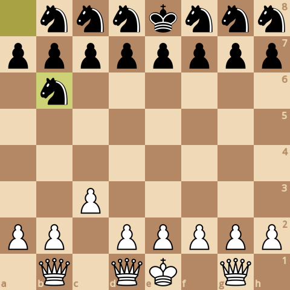
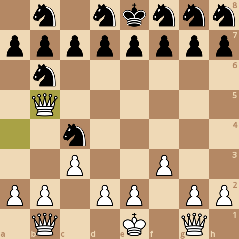
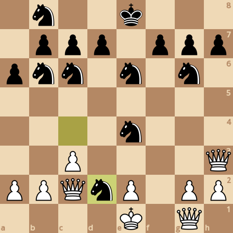
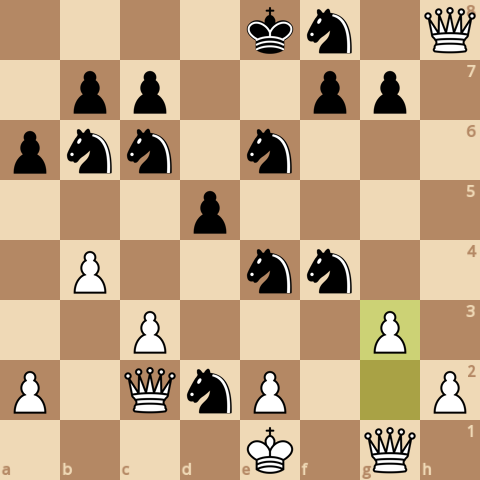
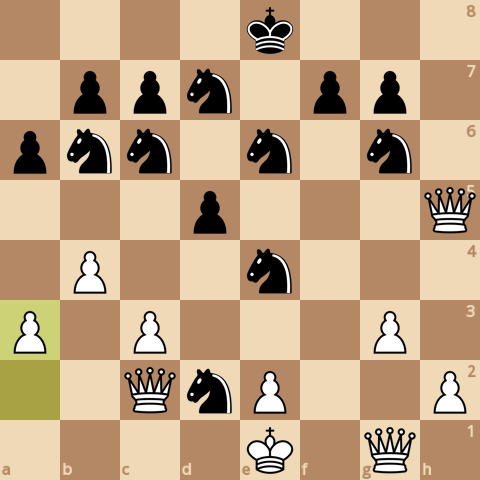
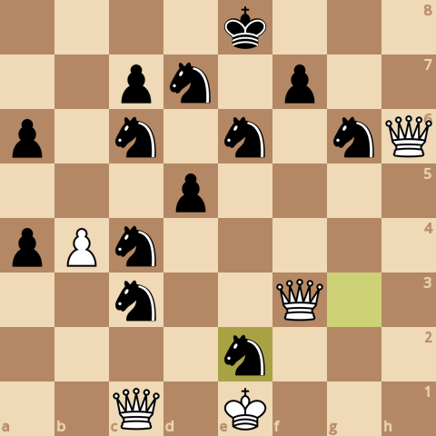

### board0000.png

Current board:\

### board0001.png

Found a new move 0\
Analyzed boards: 56137\
Average speed for the move: 183049 boards/s\
Time taken for the move: 0.306677s\
Total time taken: 0.306677s\
Current white score: 23800, black score: 23180\
Current board after move:\

### board0002.png

Found a new move 1\
Analyzed boards: 457653\
Average speed for the move: 183843 boards/s\
Time taken for the move: 2.18402s\
Total time taken: 2.49069s\
Current white score: 23800, black score: 23180\
Current board after move:\

### board0003.png

Found a new move 2\
Analyzed boards: 615642\
Average speed for the move: 163192 boards/s\
Time taken for the move: 0.968115s\
Total time taken: 3.45881s\
Current white score: 23850, black score: 23180\
Current board after move:\

### board0004.png

Found a new move 3\
Analyzed boards: 1447920\
Average speed for the move: 182848 boards/s\
Time taken for the move: 4.55176s\
Total time taken: 8.01056s\
Current white score: 23850, black score: 23250\
Current board after move:\

### board0005.png

Found a new move 4\
Analyzed boards: 2301465\
Average speed for the move: 174804 boards/s\
Time taken for the move: 4.88288s\
Total time taken: 12.8934s\
Current white score: 23940, black score: 23250\
Current board after move:\

### board0006.png

Found a new move 5\
Analyzed boards: 3180713\
Average speed for the move: 190084 boards/s\
Time taken for the move: 4.62556s\
Total time taken: 17.519s\
Current white score: 23930, black score: 23240\
Current board after move:\

### board0007.png

Found a new move 6\
Analyzed boards: 3951017\
Average speed for the move: 177717 boards/s\
Time taken for the move: 4.33444s\
Total time taken: 21.8534s\
Current white score: 23970, black score: 23240\
Current board after move:\

### board0008.png

Found a new move 7\
Analyzed boards: 7086564\
Average speed for the move: 185847 boards/s\
Time taken for the move: 16.8717s\
Total time taken: 38.7251s\
Current white score: 23940, black score: 23240\
Current board after move:\

### board0009.png

Found a new move 8\
Analyzed boards: 9400407\
Average speed for the move: 172267 boards/s\
Time taken for the move: 13.4317s\
Total time taken: 52.1568s\
Current white score: 24000, black score: 23230\
Current board after move:\

### board0010.png

Found a new move 9\
Analyzed boards: 15247853\
Average speed for the move: 187382 boards/s\
Time taken for the move: 31.206s\
Total time taken: 83.3628s\
Current white score: 23980, black score: 23240\
Current board after move:\

### board0011.png

Found a new move 10\
Analyzed boards: 20861654\
Average speed for the move: 177757 boards/s\
Time taken for the move: 31.5814s\
Total time taken: 114.944s\
Current white score: 23980, black score: 23250\
Current board after move:\

### board0012.png

Found a new move 11\
Analyzed boards: 28157037\
Average speed for the move: 188927 boards/s\
Time taken for the move: 38.6148s\
Total time taken: 153.559s\
Current white score: 23980, black score: 23250\
Current board after move:\

### board0013.png

Found a new move 12\
Analyzed boards: 29694244\
Average speed for the move: 179944 boards/s\
Time taken for the move: 8.54268s\
Total time taken: 162.102s\
Current white score: 23970, black score: 23250\
Current board after move:\

### board0014.png

Found a new move 13\
Analyzed boards: 38393635\
Average speed for the move: 189466 boards/s\
Time taken for the move: 45.9154s\
Total time taken: 208.017s\
Current white score: 23970, black score: 23320\
Current board after move:\

### board0015.png

Found a new move 14\
Analyzed boards: 40855261\
Average speed for the move: 176505 boards/s\
Time taken for the move: 13.9465s\
Total time taken: 221.964s\
Current white score: 23930, black score: 23310\
Current board after move:\

### board0016.png

Found a new move 15\
Analyzed boards: 53706733\
Average speed for the move: 188403 boards/s\
Time taken for the move: 68.2125s\
Total time taken: 290.176s\
Current white score: 23930, black score: 23310\
Current board after move:\

### board0017.png

Found a new move 16\
Analyzed boards: 54779084\
Average speed for the move: 184671 boards/s\
Time taken for the move: 5.80683s\
Total time taken: 295.983s\
Current white score: 23880, black score: 23300\
Current board after move:\

### board0018.png

Found a new move 17\
Analyzed boards: 62181446\
Average speed for the move: 186613 boards/s\
Time taken for the move: 39.667s\
Total time taken: 335.65s\
Current white score: 23880, black score: 23300\
Current board after move:\

### board0019.png

Found a new move 18\
Analyzed boards: 63426298\
Average speed for the move: 176570 boards/s\
Time taken for the move: 7.05017s\
Total time taken: 342.7s\
Current white score: 23850, black score: 23310\
Current board after move:\

### board0020.png

Found a new move 19\
Analyzed boards: 70527378\
Average speed for the move: 183677 boards/s\
Time taken for the move: 38.6608s\
Total time taken: 381.361s\
Current white score: 23850, black score: 23340\
Current board after move:\

### board0021.png

Found a new move 20\
Analyzed boards: 72487117\
Average speed for the move: 171589 boards/s\
Time taken for the move: 11.4211s\
Total time taken: 392.782s\
Current white score: 23870, black score: 23230\
Current board after move:\

### board0022.png

Found a new move 21\
Analyzed boards: 81054732\
Average speed for the move: 187550 boards/s\
Time taken for the move: 45.6818s\
Total time taken: 438.464s\
Current white score: 23760, black score: 23280\
Current board after move:\

### board0023.png

Found a new move 22\
Analyzed boards: 83129941\
Average speed for the move: 177982 boards/s\
Time taken for the move: 11.6596s\
Total time taken: 450.123s\
Current white score: 23770, black score: 23280\
Current board after move:\

### board0024.png

Found a new move 23\
Analyzed boards: 89771033\
Average speed for the move: 198067 boards/s\
Time taken for the move: 33.5295s\
Total time taken: 483.653s\
Current white score: 23680, black score: 23260\
Current board after move:\

### board0025.png

Found a new move 24\
Analyzed boards: 91614922\
Average speed for the move: 183538 boards/s\
Time taken for the move: 10.0464s\
Total time taken: 493.699s\
Current white score: 23670, black score: 23140\
Current board after move:\

### board0026.png

Found a new move 25\
Analyzed boards: 97174437\
Average speed for the move: 202921 boards/s\
Time taken for the move: 27.3975s\
Total time taken: 521.097s\
Current white score: 23670, black score: 23150\
Current board after move:\

### board0027.png

Found a new move 26\
Analyzed boards: 99966053\
Average speed for the move: 189939 boards/s\
Time taken for the move: 14.6974s\
Total time taken: 535.794s\
Current white score: 23710, black score: 23150\
Current board after move:\

### board0028.png

Found a new move 27\
Analyzed boards: 105994017\
Average speed for the move: 202661 boards/s\
Time taken for the move: 29.7441s\
Total time taken: 565.538s\
Current white score: 23710, black score: 23180\
Current board after move:\

### board0029.png

Found a new move 28\
Analyzed boards: 109091334\
Average speed for the move: 178759 boards/s\
Time taken for the move: 17.3268s\
Total time taken: 582.865s\
Current white score: 23710, black score: 23180\
Current board after move:\

### board0030.png

Found a new move 29\
Analyzed boards: 117903611\
Average speed for the move: 195260 boards/s\
Time taken for the move: 45.1309s\
Total time taken: 627.996s\
Current white score: 23720, black score: 23190\
Current board after move:\

### board0031.png

Found a new move 30\
Analyzed boards: 119529564\
Average speed for the move: 184655 boards/s\
Time taken for the move: 8.80536s\
Total time taken: 636.801s\
Current white score: 23680, black score: 23190\
Current board after move:\

### board0032.png

Found a new move 31\
Analyzed boards: 121090864\
Average speed for the move: 192227 boards/s\
Time taken for the move: 8.12216s\
Total time taken: 644.924s\
Current white score: 23670, black score: 23170\
Current board after move:\

### board0033.png

Found a new move 32\
Analyzed boards: 123906929\
Average speed for the move: 183967 boards/s\
Time taken for the move: 15.3075s\
Total time taken: 660.231s\
Current white score: 23680, black score: 23170\
Current board after move:\

### board0034.png

Found a new move 33\
Analyzed boards: 129818269\
Average speed for the move: 199866 boards/s\
Time taken for the move: 29.5765s\
Total time taken: 689.808s\
Current white score: 23670, black score: 23140\
Current board after move:\

### board0035.png

Found a new move 34\
Analyzed boards: 131646737\
Average speed for the move: 187654 boards/s\
Time taken for the move: 9.74383s\
Total time taken: 699.551s\
Current white score: 23710, black score: 23140\
Current board after move:\

### board0036.png

Found a new move 35\
Analyzed boards: 140765572\
Average speed for the move: 208646 boards/s\
Time taken for the move: 43.7049s\
Total time taken: 743.256s\
Current white score: 23710, black score: 23180\
Current board after move:\

### board0037.png

Found a new move 36\
Analyzed boards: 146224845\
Average speed for the move: 190640 boards/s\
Time taken for the move: 28.6366s\
Total time taken: 771.893s\
Current white score: 23710, black score: 23180\
Current board after move:\

### board0038.png

Found a new move 37\
Analyzed boards: 156671908\
Average speed for the move: 205826 boards/s\
Time taken for the move: 50.7569s\
Total time taken: 822.65s\
Current white score: 23700, black score: 23200\
Current board after move:\

### board0039.png

Found a new move 38\
Analyzed boards: 159894010\
Average speed for the move: 189497 boards/s\
Time taken for the move: 17.0034s\
Total time taken: 839.653s\
Current white score: 23690, black score: 23200\
Current board after move:\

### board0040.png

Found a new move 39\
Analyzed boards: 168792972\
Average speed for the move: 200276 boards/s\
Time taken for the move: 44.4335s\
Total time taken: 884.087s\
Current white score: 23660, black score: 23170\
Current board after move:\

### board0041.png

Found a new move 40\
Analyzed boards: 172630634\
Average speed for the move: 189135 boards/s\
Time taken for the move: 20.2906s\
Total time taken: 904.377s\
Current white score: 23660, black score: 23170\
Current board after move:\

### board0042.png

Found a new move 41\
Analyzed boards: 182118350\
Average speed for the move: 204122 boards/s\
Time taken for the move: 46.4807s\
Total time taken: 950.858s\
Current white score: 23670, black score: 23150\
Current board after move:\

### board0043.png

Found a new move 42\
Analyzed boards: 184655122\
Average speed for the move: 192374 boards/s\
Time taken for the move: 13.1866s\
Total time taken: 964.045s\
Current white score: 23680, black score: 23150\
Current board after move:\

### board0044.png

Found a new move 43\
Analyzed boards: 189937022\
Average speed for the move: 204729 boards/s\
Time taken for the move: 25.7995s\
Total time taken: 989.844s\
Current white score: 23680, black score: 23200\
Current board after move:\

### board0045.png

Found a new move 44\
Analyzed boards: 192618978\
Average speed for the move: 189395 boards/s\
Time taken for the move: 14.1607s\
Total time taken: 1004s\
Current white score: 23660, black score: 23200\
Current board after move:\

### board0046.png

Found a new move 45\
Analyzed boards: 199831208\
Average speed for the move: 202559 boards/s\
Time taken for the move: 35.6056s\
Total time taken: 1039.61s\
Current white score: 23660, black score: 23180\
Current board after move:\

### board0047.png

Found a new move 46\
Analyzed boards: 203071192\
Average speed for the move: 194343 boards/s\
Time taken for the move: 16.6715s\
Total time taken: 1056.28s\
Current white score: 23660, black score: 23180\
Current board after move:\

### board0048.png

Found a new move 47\
Analyzed boards: 209199262\
Average speed for the move: 206843 boards/s\
Time taken for the move: 29.6267s\
Total time taken: 1085.91s\
Current white score: 23660, black score: 23210\
Current board after move:\

### board0049.png

Found a new move 48\
Analyzed boards: 213533709\
Average speed for the move: 189822 boards/s\
Time taken for the move: 22.8343s\
Total time taken: 1108.74s\
Current white score: 23670, black score: 23210\
Current board after move:\

### board0050.png

Found a new move 49\
Analyzed boards: 222754021\
Average speed for the move: 205753 boards/s\
Time taken for the move: 44.8126s\
Total time taken: 1153.56s\
Current white score: 23670, black score: 23180\
Current board after move:\

### board0051.png

Found a new move 50\
Analyzed boards: 223841869\
Average speed for the move: 195588 boards/s\
Time taken for the move: 5.56194s\
Total time taken: 1159.12s\
Current white score: 23630, black score: 23180\
Current board after move:\

### board0052.png

Found a new move 51\
Analyzed boards: 230336348\
Average speed for the move: 204990 boards/s\
Time taken for the move: 31.6819s\
Total time taken: 1190.8s\
Current white score: 23520, black score: 23180\
Current board after move:\

### board0053.png

Found a new move 52\
Analyzed boards: 232665444\
Average speed for the move: 192818 boards/s\
Time taken for the move: 12.0792s\
Total time taken: 1202.88s\
Current white score: 23570, black score: 23180\
Current board after move:\

### board0054.png

Found a new move 53\
Analyzed boards: 237034939\
Average speed for the move: 202215 boards/s\
Time taken for the move: 21.6082s\
Total time taken: 1224.49s\
Current white score: 23560, black score: 23220\
Current board after move:\

### board0055.png

Found a new move 54\
Analyzed boards: 238766140\
Average speed for the move: 186567 boards/s\
Time taken for the move: 9.27926s\
Total time taken: 1233.77s\
Current white score: 23570, black score: 23230\
Current board after move:\

### board0056.png

Found a new move 55\
Analyzed boards: 241674200\
Average speed for the move: 194548 boards/s\
Time taken for the move: 14.9478s\
Total time taken: 1248.71s\
Current white score: 23580, black score: 23190\
Current board after move:\

### board0057.png

Found a new move 56\
Analyzed boards: 242444750\
Average speed for the move: 187054 boards/s\
Time taken for the move: 4.11939s\
Total time taken: 1252.83s\
Current white score: 23540, black score: 23190\
Current board after move:\

### board0058.png

Found a new move 57\
Analyzed boards: 245647163\
Average speed for the move: 200072 boards/s\
Time taken for the move: 16.0063s\
Total time taken: 1268.84s\
Current white score: 23430, black score: 23180\
Current board after move:\

### board0059.png

Found a new move 58\
Analyzed boards: 246811769\
Average speed for the move: 194583 boards/s\
Time taken for the move: 5.98513s\
Total time taken: 1274.82s\
Current white score: 23510, black score: 23070\
Current board after move:\

### board0060.png

Found a new move 59\
Analyzed boards: 250600196\
Average speed for the move: 209142 boards/s\
Time taken for the move: 18.1142s\
Total time taken: 1292.94s\
Current white score: 23470, black score: 23120\
Current board after move:\

### board0061.png

Found a new move 60\
Analyzed boards: 251664172\
Average speed for the move: 205889 boards/s\
Time taken for the move: 5.16772s\
Total time taken: 1298.11s\
Current white score: 23460, black score: 23120\
Current board after move:\

### board0062.png

Found a new move 61\
Analyzed boards: 255086312\
Average speed for the move: 210751 boards/s\
Time taken for the move: 16.2378s\
Total time taken: 1314.34s\
Current white score: 23380, black score: 23110\
Current board after move:\

### board0063.png

Found a new move 62\
Analyzed boards: 255975006\
Average speed for the move: 209254 boards/s\
Time taken for the move: 4.24697s\
Total time taken: 1318.59s\
Current white score: 23390, black score: 23110\
Current board after move:\

### board0064.png

Found a new move 63\
Analyzed boards: 259816033\
Average speed for the move: 217179 boards/s\
Time taken for the move: 17.686s\
Total time taken: 1336.28s\
Current white score: 23420, black score: 23150\
Current board after move:\

### board0065.png

Found a new move 64\
Analyzed boards: 260807106\
Average speed for the move: 206079 boards/s\
Time taken for the move: 4.80919s\
Total time taken: 1341.09s\
Current white score: 23410, black score: 23150\
Current board after move:\

### board0066.png

Found a new move 65\
Analyzed boards: 265214828\
Average speed for the move: 215755 boards/s\
Time taken for the move: 20.4293s\
Total time taken: 1361.52s\
Current white score: 23310, black score: 23150\
Current board after move:\

### board0067.png

Found a new move 66\
Analyzed boards: 265667416\
Average speed for the move: 216072 boards/s\
Time taken for the move: 2.09462s\
Total time taken: 1363.61s\
Current white score: 23380, black score: 23150\
Current board after move:\

### board0068.png

Found a new move 67\
Analyzed boards: 267117946\
Average speed for the move: 222112 boards/s\
Time taken for the move: 6.53061s\
Total time taken: 1370.14s\
Current white score: 23290, black score: 23130\
Current board after move:\

### board0069.png

Found a new move 68\
Analyzed boards: 267390014\
Average speed for the move: 217816 boards/s\
Time taken for the move: 1.24907s\
Total time taken: 1371.39s\
Current white score: 23270, black score: 23130\
Current board after move:\

### board0070.png

Found a new move 69\
Analyzed boards: 270660953\
Average speed for the move: 230894 boards/s\
Time taken for the move: 14.1664s\
Total time taken: 1385.56s\
Current white score: 23160, black score: 23110\
Current board after move:\

### board0071.png

Found a new move 70\
Analyzed boards: 271209307\
Average speed for the move: 193886 boards/s\
Time taken for the move: 2.82823s\
Total time taken: 1388.38s\
Current white score: 23200, black score: 23110\
Current board after move:\

### board0072.png

Found a new move 71\
Analyzed boards: 273802313\
Average speed for the move: 224874 boards/s\
Time taken for the move: 11.5309s\
Total time taken: 1399.92s\
Current white score: 23200, black score: 23130\
Current board after move:\

### board0073.png

Found a new move 72\
Analyzed boards: 274012467\
Average speed for the move: 206520 boards/s\
Time taken for the move: 1.01759s\
Total time taken: 1400.93s\
Current white score: 23180, black score: 23130\
Current board after move:\

### board0074.png

Found a new move 73\
Analyzed boards: 277631533\
Average speed for the move: 221047 boards/s\
Time taken for the move: 16.3724s\
Total time taken: 1417.31s\
Current white score: 23140, black score: 23100\
Current board after move:\

### board0075.png

Found a new move 74\
Analyzed boards: 277982848\
Average speed for the move: 210323 boards/s\
Time taken for the move: 1.67036s\
Total time taken: 1418.98s\
Current white score: 23130, black score: 23100\
Current board after move:\

### board0076.png

Found a new move 75\
Analyzed boards: 279217250\
Average speed for the move: 223093 boards/s\
Time taken for the move: 5.53312s\
Total time taken: 1424.51s\
Current white score: 23120, black score: 23070\
Current board after move:\

### board0077.png

Found a new move 76\
Analyzed boards: 279270809\
Average speed for the move: 218005 boards/s\
Time taken for the move: 0.245678s\
Total time taken: 1424.75s\
Current white score: 23080, black score: 23070\
Current board after move:\

### board0078.png

Found a new move 77\
Analyzed boards: 279950554\
Average speed for the move: 225367 boards/s\
Time taken for the move: 3.01616s\
Total time taken: 1427.77s\
Current white score: 23060, black score: 23060\
Current board after move:\

### board0079.png

Found a new move 78\
Analyzed boards: 279995782\
Average speed for the move: 210948 boards/s\
Time taken for the move: 0.214404s\
Total time taken: 1427.99s\
Current white score: 23080, black score: 23060\
Current board after move:\

### board0080.png

Found a new move 79\
Analyzed boards: 281102508\
Average speed for the move: 227662 boards/s\
Time taken for the move: 4.86128s\
Total time taken: 1432.85s\
Current white score: 23050, black score: 23020\
Current board after move:\

### board0081.png

Found a new move 80\
Analyzed boards: 281381373\
Average speed for the move: 205427 boards/s\
Time taken for the move: 1.35749s\
Total time taken: 1434.2s\
Current white score: 23040, black score: 23020\
Current board after move:\

### board0082.png

Found a new move 81\
Analyzed boards: 281719643\
Average speed for the move: 223513 boards/s\
Time taken for the move: 1.51343s\
Total time taken: 1435.72s\
Current white score: 23080, black score: 23040\
Current board after move:\

### board0083.png

Found a new move 82\
Analyzed boards: 282106390\
Average speed for the move: 200374 boards/s\
Time taken for the move: 1.93012s\
Total time taken: 1437.65s\
Current white score: 23110, black score: 23040\
Current board after move:\

### board0084.png

Found a new move 83\
Analyzed boards: 285135007\
Average speed for the move: 218762 boards/s\
Time taken for the move: 13.8444s\
Total time taken: 1451.49s\
Current white score: 23100, black score: 23100\
Current board after move:\

### board0085.png

Found a new move 84\
Analyzed boards: 285640850\
Average speed for the move: 203835 boards/s\
Time taken for the move: 2.48163s\
Total time taken: 1453.97s\
Current white score: 23110, black score: 23100\
Current board after move:\

### board0086.png

Found a new move 85\
Analyzed boards: 288400324\
Average speed for the move: 223792 boards/s\
Time taken for the move: 12.3305s\
Total time taken: 1466.3s\
Current white score: 23120, black score: 23130\
Current board after move:\

### board0087.png

Found a new move 86\
Analyzed boards: 288439989\
Average speed for the move: 208174 boards/s\
Time taken for the move: 0.190538s\
Total time taken: 1466.49s\
Current white score: 23130, black score: 22780\
Current board after move:\

### board0088.png

Found a new move 87\
Analyzed boards: 288565599\
Average speed for the move: 243084 boards/s\
Time taken for the move: 0.516734s\
Total time taken: 1467.01s\
Current white score: 23130, black score: 22750\
Current board after move:\

### board0089.png

Found a new move 88\
Analyzed boards: 288579385\
Average speed for the move: 243556 boards/s\
Time taken for the move: 0.056603s\
Total time taken: 1467.07s\
Current white score: 23130, black score: 22750\
Current board after move:\

### board0090.png

Found a new move 89\
Analyzed boards: 288695116\
Average speed for the move: 240237 boards/s\
Time taken for the move: 0.481737s\
Total time taken: 1467.55s\
Current white score: 23130, black score: 22770\
Current board after move:\
Game ended, it's a checkmate!\

