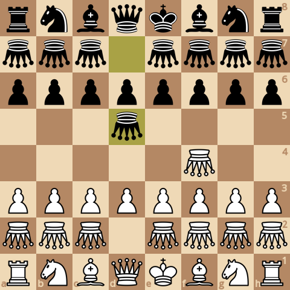
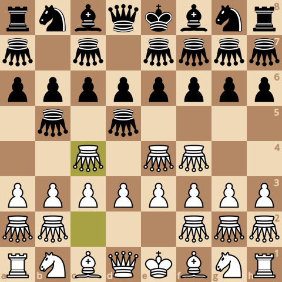
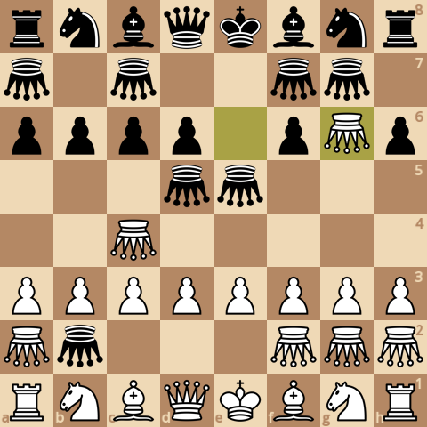
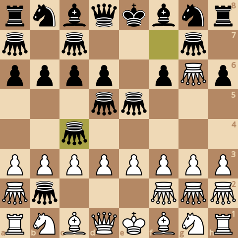
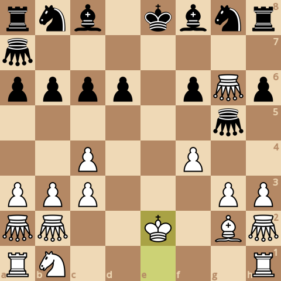
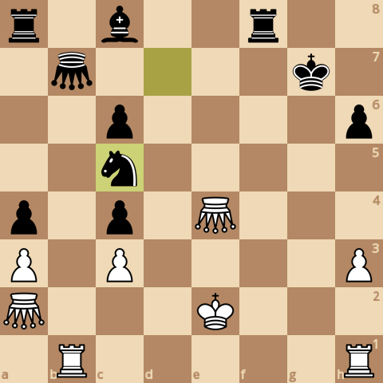
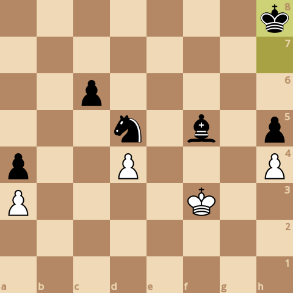

### board0000.png

Current board:\

### board0001.png

Found a new move 0\
Analyzed boards: 5028008\
Average speed for the move: 114234 boards/s\
Time taken for the move: 44.0148s\
Total time taken: 44.0148s\
Current white score: 25880, black score: 25850\
Current board after move:\

### board0002.png

Found a new move 1\
Analyzed boards: 7625641\
Average speed for the move: 107968 boards/s\
Time taken for the move: 24.0592s\
Total time taken: 68.074s\
Current white score: 25870, black score: 25880\
Current board after move:\

### board0003.png

Found a new move 2\
Analyzed boards: 10872351\
Average speed for the move: 106818 boards/s\
Time taken for the move: 30.3949s\
Total time taken: 98.4689s\
Current white score: 25900, black score: 25870\
Current board after move:\

### board0004.png

Found a new move 3\
Analyzed boards: 18335996\
Average speed for the move: 107248 boards/s\
Time taken for the move: 69.5925s\
Total time taken: 168.061s\
Current white score: 25890, black score: 25930\
Current board after move:\

### board0005.png

Found a new move 4\
Analyzed boards: 25548401\
Average speed for the move: 106490 boards/s\
Time taken for the move: 67.7283s\
Total time taken: 235.79s\
Current white score: 25920, black score: 25920\
Current board after move:\

### board0006.png

Found a new move 5\
Analyzed boards: 35339067\
Average speed for the move: 106109 boards/s\
Time taken for the move: 92.2697s\
Total time taken: 328.059s\
Current white score: 25920, black score: 25950\
Current board after move:\

### board0007.png

Found a new move 6\
Analyzed boards: 48104326\
Average speed for the move: 104140 boards/s\
Time taken for the move: 122.578s\
Total time taken: 450.637s\
Current white score: 25970, black score: 25760\
Current board after move:\

### board0008.png

Found a new move 7\
Analyzed boards: 54563016\
Average speed for the move: 113394 boards/s\
Time taken for the move: 56.9579s\
Total time taken: 507.595s\
Current white score: 25720, black score: 25760\
Current board after move:\

### board0009.png

Found a new move 8\
Analyzed boards: 61379848\
Average speed for the move: 112061 boards/s\
Time taken for the move: 60.8315s\
Total time taken: 568.426s\
Current white score: 25700, black score: 25670\
Current board after move:\

### board0010.png

Found a new move 9\
Analyzed boards: 64145541\
Average speed for the move: 117658 boards/s\
Time taken for the move: 23.5063s\
Total time taken: 591.933s\
Current white score: 25490, black score: 25660\
Current board after move:\

### board0011.png

Found a new move 10\
Analyzed boards: 68535127\
Average speed for the move: 113696 boards/s\
Time taken for the move: 38.608s\
Total time taken: 630.541s\
Current white score: 25500, black score: 25570\
Current board after move:\

### board0012.png

Found a new move 11\
Analyzed boards: 69212034\
Average speed for the move: 123499 boards/s\
Time taken for the move: 5.48106s\
Total time taken: 636.022s\
Current white score: 25280, black score: 25580\
Current board after move:\

### board0013.png

Found a new move 12\
Analyzed boards: 72373894\
Average speed for the move: 116830 boards/s\
Time taken for the move: 27.0638s\
Total time taken: 663.085s\
Current white score: 25290, black score: 25330\
Current board after move:\

### board0014.png

Found a new move 13\
Analyzed boards: 74195844\
Average speed for the move: 121858 boards/s\
Time taken for the move: 14.9515s\
Total time taken: 678.037s\
Current white score: 25080, black score: 25310\
Current board after move:\

### board0015.png

Found a new move 14\
Analyzed boards: 76986213\
Average speed for the move: 121168 boards/s\
Time taken for the move: 23.029s\
Total time taken: 701.066s\
Current white score: 25080, black score: 25100\
Current board after move:\

### board0016.png

Found a new move 15\
Analyzed boards: 77687247\
Average speed for the move: 126970 boards/s\
Time taken for the move: 5.52127s\
Total time taken: 706.587s\
Current white score: 24780, black score: 25110\
Current board after move:\

### board0017.png

Found a new move 16\
Analyzed boards: 81445641\
Average speed for the move: 124981 boards/s\
Time taken for the move: 30.0716s\
Total time taken: 736.659s\
Current white score: 24790, black score: 25120\
Current board after move:\

### board0018.png

Found a new move 17\
Analyzed boards: 83090670\
Average speed for the move: 130785 boards/s\
Time taken for the move: 12.5781s\
Total time taken: 749.237s\
Current white score: 24770, black score: 25120\
Current board after move:\

### board0019.png

Found a new move 18\
Analyzed boards: 84593922\
Average speed for the move: 127210 boards/s\
Time taken for the move: 11.8171s\
Total time taken: 761.054s\
Current white score: 24790, black score: 24890\
Current board after move:\

### board0020.png

Found a new move 19\
Analyzed boards: 85828054\
Average speed for the move: 132243 boards/s\
Time taken for the move: 9.33232s\
Total time taken: 770.386s\
Current white score: 24790, black score: 24940\
Current board after move:\

### board0021.png

Found a new move 20\
Analyzed boards: 87185623\
Average speed for the move: 131863 boards/s\
Time taken for the move: 10.2953s\
Total time taken: 780.682s\
Current white score: 24770, black score: 24940\
Current board after move:\

### board0022.png

Found a new move 21\
Analyzed boards: 87883069\
Average speed for the move: 133177 boards/s\
Time taken for the move: 5.23699s\
Total time taken: 785.919s\
Current white score: 24650, black score: 25030\
Current board after move:\

### board0023.png

Found a new move 22\
Analyzed boards: 89214028\
Average speed for the move: 141777 boards/s\
Time taken for the move: 9.38767s\
Total time taken: 795.306s\
Current white score: 24680, black score: 24810\
Current board after move:\

### board0024.png

Found a new move 23\
Analyzed boards: 92089034\
Average speed for the move: 134884 boards/s\
Time taken for the move: 21.3147s\
Total time taken: 816.621s\
Current white score: 24680, black score: 24810\
Current board after move:\

### board0025.png

Found a new move 24\
Analyzed boards: 92983911\
Average speed for the move: 134793 boards/s\
Time taken for the move: 6.63888s\
Total time taken: 823.26s\
Current white score: 24710, black score: 24800\
Current board after move:\

### board0026.png

Found a new move 25\
Analyzed boards: 95602110\
Average speed for the move: 128739 boards/s\
Time taken for the move: 20.3373s\
Total time taken: 843.597s\
Current white score: 24390, black score: 24790\
Current board after move:\

### board0027.png

Found a new move 26\
Analyzed boards: 95964220\
Average speed for the move: 152601 boards/s\
Time taken for the move: 2.37291s\
Total time taken: 845.97s\
Current white score: 24420, black score: 24560\
Current board after move:\

### board0028.png

Found a new move 27\
Analyzed boards: 96094472\
Average speed for the move: 156966 boards/s\
Time taken for the move: 0.829809s\
Total time taken: 846.8s\
Current white score: 23430, black score: 24590\
Current board after move:\

### board0029.png

Found a new move 28\
Analyzed boards: 96114190\
Average speed for the move: 176910 boards/s\
Time taken for the move: 0.111458s\
Total time taken: 846.911s\
Current white score: 23480, black score: 23510\
Current board after move:\

### board0030.png

Found a new move 29\
Analyzed boards: 96393161\
Average speed for the move: 161573 boards/s\
Time taken for the move: 1.7266s\
Total time taken: 848.638s\
Current white score: 23130, black score: 23500\
Current board after move:\

### board0031.png

Found a new move 30\
Analyzed boards: 96597692\
Average speed for the move: 169790 boards/s\
Time taken for the move: 1.20461s\
Total time taken: 849.843s\
Current white score: 23150, black score: 23490\
Current board after move:\

### board0032.png

Found a new move 31\
Analyzed boards: 96733817\
Average speed for the move: 168573 boards/s\
Time taken for the move: 0.807515s\
Total time taken: 850.65s\
Current white score: 23150, black score: 23480\
Current board after move:\

### board0033.png

Found a new move 32\
Analyzed boards: 97044147\
Average speed for the move: 167548 boards/s\
Time taken for the move: 1.85219s\
Total time taken: 852.502s\
Current white score: 23160, black score: 23480\
Current board after move:\

### board0034.png

Found a new move 33\
Analyzed boards: 97194238\
Average speed for the move: 159913 boards/s\
Time taken for the move: 0.938578s\
Total time taken: 853.441s\
Current white score: 23170, black score: 23510\
Current board after move:\

### board0035.png

Found a new move 34\
Analyzed boards: 98662231\
Average speed for the move: 162160 boards/s\
Time taken for the move: 9.05274s\
Total time taken: 862.494s\
Current white score: 23200, black score: 23500\
Current board after move:\

### board0036.png

Found a new move 35\
Analyzed boards: 99813307\
Average speed for the move: 168321 boards/s\
Time taken for the move: 6.83859s\
Total time taken: 869.332s\
Current white score: 23200, black score: 23530\
Current board after move:\

### board0037.png

Found a new move 36\
Analyzed boards: 101441643\
Average speed for the move: 166723 boards/s\
Time taken for the move: 9.76674s\
Total time taken: 879.099s\
Current white score: 23280, black score: 23530\
Current board after move:\

### board0038.png

Found a new move 37\
Analyzed boards: 102439903\
Average speed for the move: 153458 boards/s\
Time taken for the move: 6.50509s\
Total time taken: 885.604s\
Current white score: 23160, black score: 23510\
Current board after move:\

### board0039.png

Found a new move 38\
Analyzed boards: 104387447\
Average speed for the move: 166143 boards/s\
Time taken for the move: 11.7221s\
Total time taken: 897.326s\
Current white score: 23160, black score: 23510\
Current board after move:\

### board0040.png

Found a new move 39\
Analyzed boards: 104908869\
Average speed for the move: 161247 boards/s\
Time taken for the move: 3.23369s\
Total time taken: 900.56s\
Current white score: 23060, black score: 23520\
Current board after move:\

### board0041.png

Found a new move 40\
Analyzed boards: 106368940\
Average speed for the move: 164339 boards/s\
Time taken for the move: 8.88453s\
Total time taken: 909.444s\
Current white score: 23090, black score: 23520\
Current board after move:\

### board0042.png

Found a new move 41\
Analyzed boards: 106576229\
Average speed for the move: 158978 boards/s\
Time taken for the move: 1.30389s\
Total time taken: 910.748s\
Current white score: 23050, black score: 23520\
Current board after move:\

### board0043.png

Found a new move 42\
Analyzed boards: 107837002\
Average speed for the move: 157234 boards/s\
Time taken for the move: 8.01845s\
Total time taken: 918.767s\
Current white score: 23040, black score: 23310\
Current board after move:\

### board0044.png

Found a new move 43\
Analyzed boards: 108262671\
Average speed for the move: 155388 boards/s\
Time taken for the move: 2.73939s\
Total time taken: 921.506s\
Current white score: 22930, black score: 23330\
Current board after move:\

### board0045.png

Found a new move 44\
Analyzed boards: 108798686\
Average speed for the move: 171391 boards/s\
Time taken for the move: 3.12744s\
Total time taken: 924.634s\
Current white score: 22960, black score: 23210\
Current board after move:\

### board0046.png

Found a new move 45\
Analyzed boards: 108829197\
Average speed for the move: 173239 boards/s\
Time taken for the move: 0.176121s\
Total time taken: 924.81s\
Current white score: 22950, black score: 23240\
Current board after move:\

### board0047.png

Found a new move 46\
Analyzed boards: 109322962\
Average speed for the move: 177018 boards/s\
Time taken for the move: 2.78934s\
Total time taken: 927.599s\
Current white score: 22930, black score: 23120\
Current board after move:\

### board0048.png

Found a new move 47\
Analyzed boards: 109693614\
Average speed for the move: 173579 boards/s\
Time taken for the move: 2.13535s\
Total time taken: 929.734s\
Current white score: 22910, black score: 23140\
Current board after move:\

### board0049.png

Found a new move 48\
Analyzed boards: 110024899\
Average speed for the move: 182867 boards/s\
Time taken for the move: 1.81162s\
Total time taken: 931.546s\
Current white score: 22930, black score: 23130\
Current board after move:\

### board0050.png

Found a new move 49\
Analyzed boards: 110338265\
Average speed for the move: 178880 boards/s\
Time taken for the move: 1.75182s\
Total time taken: 933.298s\
Current white score: 22830, black score: 23200\
Current board after move:\

### board0051.png

Found a new move 50\
Analyzed boards: 110850919\
Average speed for the move: 177514 boards/s\
Time taken for the move: 2.88797s\
Total time taken: 936.186s\
Current white score: 22810, black score: 23190\
Current board after move:\

### board0052.png

Found a new move 51\
Analyzed boards: 111753990\
Average speed for the move: 182450 boards/s\
Time taken for the move: 4.9497s\
Total time taken: 941.136s\
Current white score: 22820, black score: 23150\
Current board after move:\

### board0053.png

Found a new move 52\
Analyzed boards: 112618936\
Average speed for the move: 176926 boards/s\
Time taken for the move: 4.88875s\
Total time taken: 946.024s\
Current white score: 22780, black score: 23150\
Current board after move:\

### board0054.png

Found a new move 53\
Analyzed boards: 113395296\
Average speed for the move: 172560 boards/s\
Time taken for the move: 4.49907s\
Total time taken: 950.523s\
Current white score: 22770, black score: 23160\
Current board after move:\

### board0055.png

Found a new move 54\
Analyzed boards: 113764632\
Average speed for the move: 177989 boards/s\
Time taken for the move: 2.07505s\
Total time taken: 952.598s\
Current white score: 22760, black score: 23160\
Current board after move:\

### board0056.png

Found a new move 55\
Analyzed boards: 113914280\
Average speed for the move: 182395 boards/s\
Time taken for the move: 0.820461s\
Total time taken: 953.419s\
Current white score: 22540, black score: 23190\
Current board after move:\

### board0057.png

Found a new move 56\
Analyzed boards: 114105026\
Average speed for the move: 192464 boards/s\
Time taken for the move: 0.991074s\
Total time taken: 954.41s\
Current white score: 22550, black score: 22820\
Current board after move:\

### board0058.png

Found a new move 57\
Analyzed boards: 114318860\
Average speed for the move: 190933 boards/s\
Time taken for the move: 1.11994s\
Total time taken: 955.53s\
Current white score: 22180, black score: 22790\
Current board after move:\

### board0059.png

Found a new move 58\
Analyzed boards: 114350999\
Average speed for the move: 209270 boards/s\
Time taken for the move: 0.153577s\
Total time taken: 955.683s\
Current white score: 22170, black score: 22460\
Current board after move:\

### board0060.png

Found a new move 59\
Analyzed boards: 114463300\
Average speed for the move: 219201 boards/s\
Time taken for the move: 0.51232s\
Total time taken: 956.196s\
Current white score: 21950, black score: 22450\
Current board after move:\

### board0061.png

Found a new move 60\
Analyzed boards: 114494818\
Average speed for the move: 222407 boards/s\
Time taken for the move: 0.141713s\
Total time taken: 956.337s\
Current white score: 22020, black score: 22450\
Current board after move:\

### board0062.png

Found a new move 61\
Analyzed boards: 114614490\
Average speed for the move: 217806 boards/s\
Time taken for the move: 0.549443s\
Total time taken: 956.887s\
Current white score: 22020, black score: 22490\
Current board after move:\

### board0063.png

Found a new move 62\
Analyzed boards: 114659446\
Average speed for the move: 220625 boards/s\
Time taken for the move: 0.203767s\
Total time taken: 957.091s\
Current white score: 22040, black score: 22510\
Current board after move:\

### board0064.png

Found a new move 63\
Analyzed boards: 114896810\
Average speed for the move: 225776 boards/s\
Time taken for the move: 1.05132s\
Total time taken: 958.142s\
Current white score: 22040, black score: 22560\
Current board after move:\

### board0065.png

Found a new move 64\
Analyzed boards: 114994624\
Average speed for the move: 220084 boards/s\
Time taken for the move: 0.44444s\
Total time taken: 958.586s\
Current white score: 22080, black score: 22560\
Current board after move:\

### board0066.png

Found a new move 65\
Analyzed boards: 115029547\
Average speed for the move: 242242 boards/s\
Time taken for the move: 0.144166s\
Total time taken: 958.731s\
Current white score: 22090, black score: 22530\
Current board after move:\

### board0067.png

Found a new move 66\
Analyzed boards: 115118254\
Average speed for the move: 228016 boards/s\
Time taken for the move: 0.389039s\
Total time taken: 959.12s\
Current white score: 22060, black score: 22340\
Current board after move:\

### board0068.png

Found a new move 67\
Analyzed boards: 115235173\
Average speed for the move: 227031 boards/s\
Time taken for the move: 0.514991s\
Total time taken: 959.635s\
Current white score: 21860, black score: 22340\
Current board after move:\

### board0069.png

Found a new move 68\
Analyzed boards: 115397006\
Average speed for the move: 236689 boards/s\
Time taken for the move: 0.683736s\
Total time taken: 960.318s\
Current white score: 21880, black score: 22340\
Current board after move:\

### board0070.png

Found a new move 69\
Analyzed boards: 115627630\
Average speed for the move: 249695 boards/s\
Time taken for the move: 0.923624s\
Total time taken: 961.242s\
Current white score: 21880, black score: 22340\
Current board after move:\

### board0071.png

Found a new move 70\
Analyzed boards: 115657803\
Average speed for the move: 245827 boards/s\
Time taken for the move: 0.122741s\
Total time taken: 961.365s\
Current white score: 21790, black score: 22350\
Current board after move:\

### board0072.png

Found a new move 71\
Analyzed boards: 115759681\
Average speed for the move: 244453 boards/s\
Time taken for the move: 0.416759s\
Total time taken: 961.782s\
Current white score: 21790, black score: 22400\
Current board after move:\

### board0073.png

Found a new move 72\
Analyzed boards: 115766422\
Average speed for the move: 253041 boards/s\
Time taken for the move: 0.02664s\
Total time taken: 961.808s\
Current white score: 21840, black score: 22420\
Current board after move:\

### board0074.png

Found a new move 73\
Analyzed boards: 115849742\
Average speed for the move: 245981 boards/s\
Time taken for the move: 0.338726s\
Total time taken: 962.147s\
Current white score: 21840, black score: 22400\
Current board after move:\

### board0075.png

Found a new move 74\
Analyzed boards: 115853239\
Average speed for the move: 261791 boards/s\
Time taken for the move: 0.013358s\
Total time taken: 962.16s\
Current white score: 21830, black score: 22390\
Current board after move:\

### board0076.png

Found a new move 75\
Analyzed boards: 115900248\
Average speed for the move: 257022 boards/s\
Time taken for the move: 0.182899s\
Total time taken: 962.343s\
Current white score: 21230, black score: 22380\
Current board after move:\

### board0077.png

Found a new move 76\
Analyzed boards: 115903376\
Average speed for the move: 272189 boards/s\
Time taken for the move: 0.011492s\
Total time taken: 962.355s\
Current white score: 21210, black score: 21760\
Current board after move:\

### board0078.png

Found a new move 77\
Analyzed boards: 115941095\
Average speed for the move: 306116 boards/s\
Time taken for the move: 0.123218s\
Total time taken: 962.478s\
Current white score: 20990, black score: 21790\
Current board after move:\

### board0079.png

Found a new move 78\
Analyzed boards: 115944044\
Average speed for the move: 298603 boards/s\
Time taken for the move: 0.009876s\
Total time taken: 962.488s\
Current white score: 20950, black score: 21690\
Current board after move:\

### board0080.png

Found a new move 79\
Analyzed boards: 115971771\
Average speed for the move: 319539 boards/s\
Time taken for the move: 0.086772s\
Total time taken: 962.574s\
Current white score: 20950, black score: 21660\
Current board after move:\

### board0081.png

Found a new move 80\
Analyzed boards: 115993334\
Average speed for the move: 287975 boards/s\
Time taken for the move: 0.074878s\
Total time taken: 962.649s\
Current white score: 20990, black score: 21630\
Current board after move:\

### board0082.png

Found a new move 81\
Analyzed boards: 116006515\
Average speed for the move: 330070 boards/s\
Time taken for the move: 0.039934s\
Total time taken: 962.689s\
Current white score: 20990, black score: 21680\
Current board after move:\

### board0083.png

Found a new move 82\
Analyzed boards: 116011089\
Average speed for the move: 314862 boards/s\
Time taken for the move: 0.014527s\
Total time taken: 962.704s\
Current white score: 20970, black score: 21670\
Current board after move:\

### board0084.png

Found a new move 83\
Analyzed boards: 116027530\
Average speed for the move: 324850 boards/s\
Time taken for the move: 0.050611s\
Total time taken: 962.754s\
Current white score: 20970, black score: 21670\
Current board after move:\

### board0085.png

Found a new move 84\
Analyzed boards: 116030764\
Average speed for the move: 335164 boards/s\
Time taken for the move: 0.009649s\
Total time taken: 962.764s\
Current white score: 20980, black score: 21670\
Current board after move:\

### board0086.png

Found a new move 85\
Analyzed boards: 116048881\
Average speed for the move: 322717 boards/s\
Time taken for the move: 0.056139s\
Total time taken: 962.82s\
Current white score: 20970, black score: 21700\
Current board after move:\

### board0087.png

Found a new move 86\
Analyzed boards: 116053233\
Average speed for the move: 330222 boards/s\
Time taken for the move: 0.013179s\
Total time taken: 962.833s\
Current white score: 20980, black score: 21700\
Current board after move:\

### board0088.png

Found a new move 87\
Analyzed boards: 116069609\
Average speed for the move: 321748 boards/s\
Time taken for the move: 0.050897s\
Total time taken: 962.884s\
Current white score: 20990, black score: 21710\
Current board after move:\

### board0089.png

Found a new move 88\
Analyzed boards: 116072475\
Average speed for the move: 248031 boards/s\
Time taken for the move: 0.011555s\
Total time taken: 962.896s\
Current white score: 20970, black score: 21720\
Current board after move:\

### board0090.png

Found a new move 89\
Analyzed boards: 116083605\
Average speed for the move: 360334 boards/s\
Time taken for the move: 0.030888s\
Total time taken: 962.927s\
Current white score: 20410, black score: 21740\
Current board after move:\

### board0091.png

Found a new move 90\
Analyzed boards: 116086171\
Average speed for the move: 358982 boards/s\
Time taken for the move: 0.007148s\
Total time taken: 962.934s\
Current white score: 20400, black score: 21150\
Current board after move:\

### board0092.png

Found a new move 91\
Analyzed boards: 116096907\
Average speed for the move: 409100 boards/s\
Time taken for the move: 0.026243s\
Total time taken: 962.96s\
Current white score: 20390, black score: 21150\
Current board after move:\

### board0093.png

Found a new move 92\
Analyzed boards: 116101056\
Average speed for the move: 346993 boards/s\
Time taken for the move: 0.011957s\
Total time taken: 962.972s\
Current white score: 20390, black score: 21150\
Current board after move:\

### board0094.png

Found a new move 93\
Analyzed boards: 116108855\
Average speed for the move: 410279 boards/s\
Time taken for the move: 0.019009s\
Total time taken: 962.991s\
Current white score: 20380, black score: 21150\
Current board after move:\

### board0095.png

Found a new move 94\
Analyzed boards: 116114551\
Average speed for the move: 400366 boards/s\
Time taken for the move: 0.014227s\
Total time taken: 963.005s\
Current white score: 20380, black score: 21150\
Current board after move:\

### board0096.png

Found a new move 95\
Analyzed boards: 116123724\
Average speed for the move: 403670 boards/s\
Time taken for the move: 0.022724s\
Total time taken: 963.028s\
Current white score: 20380, black score: 21140\
Current board after move:\

### board0097.png

Found a new move 96\
Analyzed boards: 116127370\
Average speed for the move: 404661 boards/s\
Time taken for the move: 0.00901s\
Total time taken: 963.037s\
Current white score: 20370, black score: 21140\
Current board after move:\

### board0098.png

Found a new move 97\
Analyzed boards: 116133469\
Average speed for the move: 389812 boards/s\
Time taken for the move: 0.015646s\
Total time taken: 963.053s\
Current white score: 20370, black score: 21160\
Current board after move:\

### board0099.png

Found a new move 98\
Analyzed boards: 116137188\
Average speed for the move: 401403 boards/s\
Time taken for the move: 0.009265s\
Total time taken: 963.062s\
Current white score: 20380, black score: 21160\
Current board after move:\

### board0100.png

Found a new move 99\
Analyzed boards: 116144657\
Average speed for the move: 407008 boards/s\
Time taken for the move: 0.018351s\
Total time taken: 963.08s\
Current white score: 20380, black score: 21190\
Current board after move:\

### board0101.png

Found a new move 100\
Analyzed boards: 116150273\
Average speed for the move: 390163 boards/s\
Time taken for the move: 0.014394s\
Total time taken: 963.095s\
Current white score: 20350, black score: 21190\
Current board after move:\

### board0102.png

Found a new move 101\
Analyzed boards: 116160355\
Average speed for the move: 393168 boards/s\
Time taken for the move: 0.025643s\
Total time taken: 963.12s\
Current white score: 20350, black score: 21150\
Current board after move:\

### board0103.png

Found a new move 102\
Analyzed boards: 116162535\
Average speed for the move: 352865 boards/s\
Time taken for the move: 0.006178s\
Total time taken: 963.127s\
Current white score: 20350, black score: 21150\
Current board after move:\

### board0104.png

Found a new move 103\
Analyzed boards: 116169527\
Average speed for the move: 413875 boards/s\
Time taken for the move: 0.016894s\
Total time taken: 963.143s\
Current white score: 20350, black score: 21160\
Current board after move:\

### board0105.png

Found a new move 104\
Analyzed boards: 116174244\
Average speed for the move: 396154 boards/s\
Time taken for the move: 0.011907s\
Total time taken: 963.155s\
Current white score: 20380, black score: 21160\
Current board after move:\

### board0106.png

Found a new move 105\
Analyzed boards: 116182959\
Average speed for the move: 409597 boards/s\
Time taken for the move: 0.021277s\
Total time taken: 963.177s\
Current white score: 20380, black score: 21150\
Current board after move:\

### board0107.png

Found a new move 106\
Analyzed boards: 116186836\
Average speed for the move: 390119 boards/s\
Time taken for the move: 0.009938s\
Total time taken: 963.187s\
Current white score: 20370, black score: 21150\
Current board after move:\

### board0108.png

Found a new move 107\
Analyzed boards: 116194822\
Average speed for the move: 408178 boards/s\
Time taken for the move: 0.019565s\
Total time taken: 963.206s\
Current white score: 20370, black score: 21140\
Current board after move:\

### board0109.png

Found a new move 108\
Analyzed boards: 116196971\
Average speed for the move: 394819 boards/s\
Time taken for the move: 0.005443s\
Total time taken: 963.212s\
Current white score: 20380, black score: 21140\
Current board after move:\

### board0110.png

Found a new move 109\
Analyzed boards: 116203196\
Average speed for the move: 414806 boards/s\
Time taken for the move: 0.015007s\
Total time taken: 963.227s\
Current white score: 20380, black score: 21160\
Current board after move:\

### board0111.png

Found a new move 110\
Analyzed boards: 116205342\
Average speed for the move: 367089 boards/s\
Time taken for the move: 0.005846s\
Total time taken: 963.232s\
Current white score: 20350, black score: 21160\
Current board after move:\

### board0112.png

Found a new move 111\
Analyzed boards: 116215221\
Average speed for the move: 436602 boards/s\
Time taken for the move: 0.022627s\
Total time taken: 963.255s\
Current white score: 20350, black score: 21160\
Current board after move:\

### board0113.png

Found a new move 112\
Analyzed boards: 116217818\
Average speed for the move: 401701 boards/s\
Time taken for the move: 0.006465s\
Total time taken: 963.262s\
Current white score: 20350, black score: 21160\
Current board after move:\

### board0114.png

Found a new move 113\
Analyzed boards: 116223753\
Average speed for the move: 422300 boards/s\
Time taken for the move: 0.014054s\
Total time taken: 963.276s\
Current white score: 20350, black score: 21140\
Current board after move:\

### board0115.png

Found a new move 114\
Analyzed boards: 116224839\
Average speed for the move: 371409 boards/s\
Time taken for the move: 0.002924s\
Total time taken: 963.278s\
Current white score: 20350, black score: 21140\
Current board after move:\

### board0116.png

Found a new move 115\
Analyzed boards: 116229309\
Average speed for the move: 399642 boards/s\
Time taken for the move: 0.011185s\
Total time taken: 963.29s\
Current white score: 20350, black score: 21150\
Current board after move:\

### board0117.png

Found a new move 116\
Analyzed boards: 116230532\
Average speed for the move: 412201 boards/s\
Time taken for the move: 0.002967s\
Total time taken: 963.293s\
Current white score: 20370, black score: 21150\
Current board after move:\

### board0118.png

Found a new move 117\
Analyzed boards: 116234809\
Average speed for the move: 415364 boards/s\
Time taken for the move: 0.010297s\
Total time taken: 963.303s\
Current white score: 20370, black score: 21150\
Current board after move:\

### board0119.png

Found a new move 118\
Analyzed boards: 116237170\
Average speed for the move: 419361 boards/s\
Time taken for the move: 0.00563s\
Total time taken: 963.309s\
Current white score: 20340, black score: 21150\
Current board after move:\

### board0120.png

Found a new move 119\
Analyzed boards: 116240217\
Average speed for the move: 425856 boards/s\
Time taken for the move: 0.007155s\
Total time taken: 963.316s\
Current white score: 20340, black score: 21140\
Current board after move:\
Game ended, it's a checkmate!\

