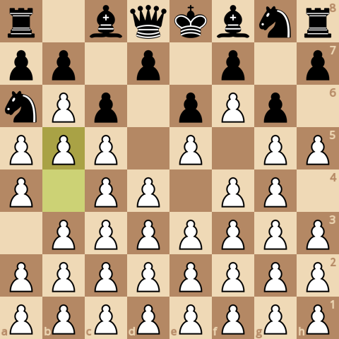
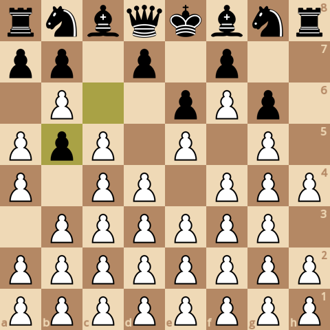
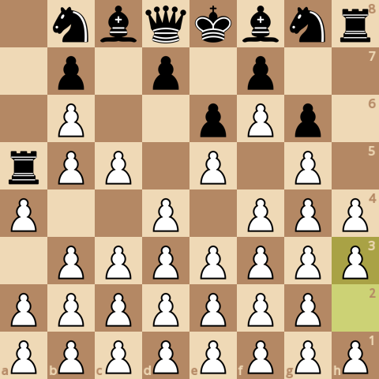
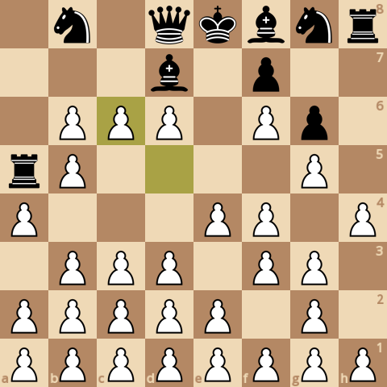
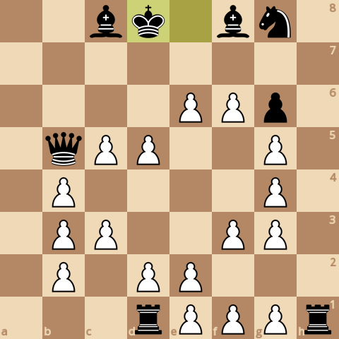
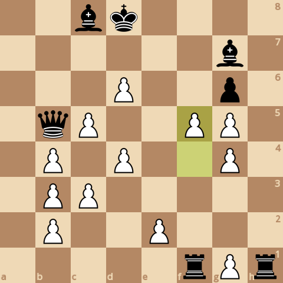

### board0000.png

Current board:\

### board0001.png

Found a new move 0\
Analyzed boards: 88992\
Average speed for the move: 186767 boards/s\
Time taken for the move: 0.476487s\
Total time taken: 0.476487s\
Current white score: 3690, black score: 24050\
Current board after move:\

### board0002.png

Found a new move 1\
Analyzed boards: 273765\
Average speed for the move: 174146 boards/s\
Time taken for the move: 1.06102s\
Total time taken: 1.53751s\
Current white score: 3690, black score: 24130\
Current board after move:\

### board0003.png

Found a new move 2\
Analyzed boards: 622812\
Average speed for the move: 179613 boards/s\
Time taken for the move: 1.94333s\
Total time taken: 3.48084s\
Current white score: 3700, black score: 24120\
Current board after move:\

### board0004.png

Found a new move 3\
Analyzed boards: 1148112\
Average speed for the move: 169156 boards/s\
Time taken for the move: 3.10542s\
Total time taken: 6.58625s\
Current white score: 3700, black score: 24140\
Current board after move:\

### board0005.png

Found a new move 4\
Analyzed boards: 1644886\
Average speed for the move: 168561 boards/s\
Time taken for the move: 2.94715s\
Total time taken: 9.5334s\
Current white score: 3710, black score: 24130\
Current board after move:\

### board0006.png

Found a new move 5\
Analyzed boards: 2763669\
Average speed for the move: 162588 boards/s\
Time taken for the move: 6.88108s\
Total time taken: 16.4145s\
Current white score: 3720, black score: 24160\
Current board after move:\

### board0007.png

Found a new move 6\
Analyzed boards: 3848838\
Average speed for the move: 167939 boards/s\
Time taken for the move: 6.46169s\
Total time taken: 22.8762s\
Current white score: 3700, black score: 24120\
Current board after move:\

### board0008.png

Found a new move 7\
Analyzed boards: 4718555\
Average speed for the move: 165006 boards/s\
Time taken for the move: 5.27082s\
Total time taken: 28.147s\
Current white score: 3700, black score: 24130\
Current board after move:\

### board0009.png

Found a new move 8\
Analyzed boards: 6082213\
Average speed for the move: 166125 boards/s\
Time taken for the move: 8.20861s\
Total time taken: 36.3556s\
Current white score: 3710, black score: 24110\
Current board after move:\

### board0010.png

Found a new move 9\
Analyzed boards: 6521892\
Average speed for the move: 161311 boards/s\
Time taken for the move: 2.72566s\
Total time taken: 39.0813s\
Current white score: 3700, black score: 24100\
Current board after move:\

### board0011.png

Found a new move 10\
Analyzed boards: 7433374\
Average speed for the move: 165746 boards/s\
Time taken for the move: 5.49927s\
Total time taken: 44.5805s\
Current white score: 3700, black score: 24100\
Current board after move:\

### board0012.png

Found a new move 11\
Analyzed boards: 8059477\
Average speed for the move: 162666 boards/s\
Time taken for the move: 3.84901s\
Total time taken: 48.4295s\
Current white score: 3690, black score: 24130\
Current board after move:\

### board0013.png

Found a new move 12\
Analyzed boards: 10031723\
Average speed for the move: 165993 boards/s\
Time taken for the move: 11.8815s\
Total time taken: 60.3111s\
Current white score: 3710, black score: 24140\
Current board after move:\

### board0014.png

Found a new move 13\
Analyzed boards: 10982889\
Average speed for the move: 159259 boards/s\
Time taken for the move: 5.97243s\
Total time taken: 66.2835s\
Current white score: 3710, black score: 24110\
Current board after move:\

### board0015.png

Found a new move 14\
Analyzed boards: 13010268\
Average speed for the move: 163671 boards/s\
Time taken for the move: 12.3869s\
Total time taken: 78.6704s\
Current white score: 3720, black score: 24030\
Current board after move:\

### board0016.png

Found a new move 15\
Analyzed boards: 13916032\
Average speed for the move: 159188 boards/s\
Time taken for the move: 5.6899s\
Total time taken: 84.3603s\
Current white score: 3590, black score: 24040\
Current board after move:\

### board0017.png

Found a new move 16\
Analyzed boards: 16030141\
Average speed for the move: 168227 boards/s\
Time taken for the move: 12.567s\
Total time taken: 96.9273s\
Current white score: 3600, black score: 24030\
Current board after move:\

### board0018.png

Found a new move 17\
Analyzed boards: 16784440\
Average speed for the move: 165863 boards/s\
Time taken for the move: 4.54771s\
Total time taken: 101.475s\
Current white score: 3520, black score: 24060\
Current board after move:\

### board0019.png

Found a new move 18\
Analyzed boards: 18458098\
Average speed for the move: 168298 boards/s\
Time taken for the move: 9.94463s\
Total time taken: 111.42s\
Current white score: 3510, black score: 23930\
Current board after move:\

### board0020.png

Found a new move 19\
Analyzed boards: 18835003\
Average speed for the move: 169295 boards/s\
Time taken for the move: 2.22632s\
Total time taken: 113.646s\
Current white score: 3420, black score: 23950\
Current board after move:\

### board0021.png

Found a new move 20\
Analyzed boards: 19922908\
Average speed for the move: 175730 boards/s\
Time taken for the move: 6.19079s\
Total time taken: 119.837s\
Current white score: 3400, black score: 23850\
Current board after move:\

### board0022.png

Found a new move 21\
Analyzed boards: 20267211\
Average speed for the move: 179120 boards/s\
Time taken for the move: 1.92219s\
Total time taken: 121.759s\
Current white score: 3390, black score: 23860\
Current board after move:\

### board0023.png

Found a new move 22\
Analyzed boards: 21385674\
Average speed for the move: 179227 boards/s\
Time taken for the move: 6.24047s\
Total time taken: 127.999s\
Current white score: 3390, black score: 23860\
Current board after move:\

### board0024.png

Found a new move 23\
Analyzed boards: 21851314\
Average speed for the move: 177072 boards/s\
Time taken for the move: 2.62966s\
Total time taken: 130.629s\
Current white score: 3400, black score: 23850\
Current board after move:\

### board0025.png

Found a new move 24\
Analyzed boards: 22938224\
Average speed for the move: 177695 boards/s\
Time taken for the move: 6.11673s\
Total time taken: 136.746s\
Current white score: 3420, black score: 23870\
Current board after move:\

### board0026.png

Found a new move 25\
Analyzed boards: 23850374\
Average speed for the move: 169696 boards/s\
Time taken for the move: 5.3752s\
Total time taken: 142.121s\
Current white score: 3320, black score: 23870\
Current board after move:\

### board0027.png

Found a new move 26\
Analyzed boards: 25589013\
Average speed for the move: 191496 boards/s\
Time taken for the move: 9.07926s\
Total time taken: 151.2s\
Current white score: 3320, black score: 23860\
Current board after move:\

### board0028.png

Found a new move 27\
Analyzed boards: 26102399\
Average speed for the move: 184306 boards/s\
Time taken for the move: 2.78551s\
Total time taken: 153.986s\
Current white score: 3230, black score: 23860\
Current board after move:\

### board0029.png

Found a new move 28\
Analyzed boards: 27541352\
Average speed for the move: 192384 boards/s\
Time taken for the move: 7.47957s\
Total time taken: 161.465s\
Current white score: 3230, black score: 23750\
Current board after move:\

### board0030.png

Found a new move 29\
Analyzed boards: 28036084\
Average speed for the move: 190428 boards/s\
Time taken for the move: 2.598s\
Total time taken: 164.063s\
Current white score: 3250, black score: 23810\
Current board after move:\

### board0031.png

Found a new move 30\
Analyzed boards: 30972478\
Average speed for the move: 192266 boards/s\
Time taken for the move: 15.2725s\
Total time taken: 179.336s\
Current white score: 3230, black score: 23700\
Current board after move:\

### board0032.png

Found a new move 31\
Analyzed boards: 31759839\
Average speed for the move: 180744 boards/s\
Time taken for the move: 4.35622s\
Total time taken: 183.692s\
Current white score: 3130, black score: 23750\
Current board after move:\

### board0033.png

Found a new move 32\
Analyzed boards: 35289899\
Average speed for the move: 186533 boards/s\
Time taken for the move: 18.9246s\
Total time taken: 202.617s\
Current white score: 3140, black score: 23740\
Current board after move:\

### board0034.png

Found a new move 33\
Analyzed boards: 36349462\
Average speed for the move: 182780 boards/s\
Time taken for the move: 5.79692s\
Total time taken: 208.414s\
Current white score: 3140, black score: 23750\
Current board after move:\

### board0035.png

Found a new move 34\
Analyzed boards: 39584376\
Average speed for the move: 186768 boards/s\
Time taken for the move: 17.3205s\
Total time taken: 225.734s\
Current white score: 3150, black score: 23750\
Current board after move:\

### board0036.png

Found a new move 35\
Analyzed boards: 41016649\
Average speed for the move: 191603 boards/s\
Time taken for the move: 7.47522s\
Total time taken: 233.209s\
Current white score: 3140, black score: 23760\
Current board after move:\

### board0037.png

Found a new move 36\
Analyzed boards: 45841014\
Average speed for the move: 199200 boards/s\
Time taken for the move: 24.2187s\
Total time taken: 257.428s\
Current white score: 3150, black score: 23740\
Current board after move:\

### board0038.png

Found a new move 37\
Analyzed boards: 47183285\
Average speed for the move: 187288 boards/s\
Time taken for the move: 7.16688s\
Total time taken: 264.595s\
Current white score: 3130, black score: 23710\
Current board after move:\

### board0039.png

Found a new move 38\
Analyzed boards: 51056268\
Average speed for the move: 196708 boards/s\
Time taken for the move: 19.689s\
Total time taken: 284.284s\
Current white score: 3150, black score: 23710\
Current board after move:\

### board0040.png

Found a new move 39\
Analyzed boards: 51960924\
Average speed for the move: 183820 boards/s\
Time taken for the move: 4.92143s\
Total time taken: 289.205s\
Current white score: 3050, black score: 23710\
Current board after move:\

### board0041.png

Found a new move 40\
Analyzed boards: 54566386\
Average speed for the move: 191667 boards/s\
Time taken for the move: 13.5937s\
Total time taken: 302.799s\
Current white score: 3050, black score: 23600\
Current board after move:\

### board0042.png

Found a new move 41\
Analyzed boards: 54980768\
Average speed for the move: 171809 boards/s\
Time taken for the move: 2.41187s\
Total time taken: 305.211s\
Current white score: 3050, black score: 23660\
Current board after move:\

### board0043.png

Found a new move 42\
Analyzed boards: 58196578\
Average speed for the move: 180970 boards/s\
Time taken for the move: 17.7699s\
Total time taken: 322.981s\
Current white score: 3080, black score: 23670\
Current board after move:\

### board0044.png

Found a new move 43\
Analyzed boards: 58354764\
Average speed for the move: 175401 boards/s\
Time taken for the move: 0.901852s\
Total time taken: 323.883s\
Current white score: 2950, black score: 23630\
Current board after move:\

### board0045.png

Found a new move 44\
Analyzed boards: 59615633\
Average speed for the move: 181343 boards/s\
Time taken for the move: 6.95296s\
Total time taken: 330.836s\
Current white score: 3050, black score: 23630\
Current board after move:\

### board0046.png

Found a new move 45\
Analyzed boards: 60034866\
Average speed for the move: 177300 boards/s\
Time taken for the move: 2.36455s\
Total time taken: 333.2s\
Current white score: 2970, black score: 23630\
Current board after move:\

### board0047.png

Found a new move 46\
Analyzed boards: 65613353\
Average speed for the move: 180213 boards/s\
Time taken for the move: 30.9549s\
Total time taken: 364.155s\
Current white score: 2980, black score: 23630\
Current board after move:\

### board0048.png

Found a new move 47\
Analyzed boards: 66794855\
Average speed for the move: 176845 boards/s\
Time taken for the move: 6.68099s\
Total time taken: 370.836s\
Current white score: 2970, black score: 23670\
Current board after move:\

### board0049.png

Found a new move 48\
Analyzed boards: 74936055\
Average speed for the move: 179746 boards/s\
Time taken for the move: 45.2928s\
Total time taken: 416.129s\
Current white score: 2990, black score: 23660\
Current board after move:\

### board0050.png

Found a new move 49\
Analyzed boards: 76160141\
Average speed for the move: 173857 boards/s\
Time taken for the move: 7.04075s\
Total time taken: 423.17s\
Current white score: 2880, black score: 23670\
Current board after move:\

### board0051.png

Found a new move 50\
Analyzed boards: 84117820\
Average speed for the move: 183950 boards/s\
Time taken for the move: 43.26s\
Total time taken: 466.43s\
Current white score: 2890, black score: 23660\
Current board after move:\

### board0052.png

Found a new move 51\
Analyzed boards: 84797587\
Average speed for the move: 180815 boards/s\
Time taken for the move: 3.75946s\
Total time taken: 470.189s\
Current white score: 2870, black score: 23660\
Current board after move:\

### board0053.png

Found a new move 52\
Analyzed boards: 89714823\
Average speed for the move: 185663 boards/s\
Time taken for the move: 26.4847s\
Total time taken: 496.674s\
Current white score: 2880, black score: 23660\
Current board after move:\

### board0054.png

Found a new move 53\
Analyzed boards: 90352620\
Average speed for the move: 183030 boards/s\
Time taken for the move: 3.48467s\
Total time taken: 500.159s\
Current white score: 2770, black score: 23680\
Current board after move:\

### board0055.png

Found a new move 54\
Analyzed boards: 94152794\
Average speed for the move: 186388 boards/s\
Time taken for the move: 20.3885s\
Total time taken: 520.547s\
Current white score: 2780, black score: 23670\
Current board after move:\

### board0056.png

Found a new move 55\
Analyzed boards: 94885212\
Average speed for the move: 181471 boards/s\
Time taken for the move: 4.036s\
Total time taken: 524.583s\
Current white score: 2760, black score: 23670\
Current board after move:\

### board0057.png

Found a new move 56\
Analyzed boards: 99993829\
Average speed for the move: 202529 boards/s\
Time taken for the move: 25.2242s\
Total time taken: 549.807s\
Current white score: 2760, black score: 23670\
Current board after move:\

### board0058.png

Found a new move 57\
Analyzed boards: 100534355\
Average speed for the move: 198833 boards/s\
Time taken for the move: 2.71849s\
Total time taken: 552.526s\
Current white score: 2650, black score: 23680\
Current board after move:\

### board0059.png

Found a new move 58\
Analyzed boards: 104218944\
Average speed for the move: 203408 boards/s\
Time taken for the move: 18.1143s\
Total time taken: 570.64s\
Current white score: 2840, black score: 23400\
Current board after move:\

### board0060.png

Found a new move 59\
Analyzed boards: 104799616\
Average speed for the move: 198079 boards/s\
Time taken for the move: 2.93152s\
Total time taken: 573.572s\
Current white score: 2510, black score: 23400\
Current board after move:\

### board0061.png

Found a new move 60\
Analyzed boards: 106177362\
Average speed for the move: 216546 boards/s\
Time taken for the move: 6.36238s\
Total time taken: 579.934s\
Current white score: 2520, black score: 23400\
Current board after move:\

### board0062.png

Found a new move 61\
Analyzed boards: 108229949\
Average speed for the move: 201193 boards/s\
Time taken for the move: 10.2021s\
Total time taken: 590.136s\
Current white score: 2410, black score: 23460\
Current board after move:\

### board0063.png

Found a new move 62\
Analyzed boards: 110471337\
Average speed for the move: 224023 boards/s\
Time taken for the move: 10.0052s\
Total time taken: 600.141s\
Current white score: 2410, black score: 23400\
Current board after move:\

### board0064.png

Found a new move 63\
Analyzed boards: 111734834\
Average speed for the move: 208416 boards/s\
Time taken for the move: 6.06237s\
Total time taken: 606.204s\
Current white score: 2300, black score: 23410\
Current board after move:\

### board0065.png

Found a new move 64\
Analyzed boards: 112517624\
Average speed for the move: 239266 boards/s\
Time taken for the move: 3.27163s\
Total time taken: 609.475s\
Current white score: 2310, black score: 23400\
Current board after move:\

### board0066.png

Found a new move 65\
Analyzed boards: 113455323\
Average speed for the move: 206406 boards/s\
Time taken for the move: 4.54299s\
Total time taken: 614.018s\
Current white score: 2190, black score: 23410\
Current board after move:\

### board0067.png

Found a new move 66\
Analyzed boards: 114187359\
Average speed for the move: 228009 boards/s\
Time taken for the move: 3.21055s\
Total time taken: 617.229s\
Current white score: 2210, black score: 23370\
Current board after move:\

### board0068.png

Found a new move 67\
Analyzed boards: 114755668\
Average speed for the move: 223605 boards/s\
Time taken for the move: 2.54158s\
Total time taken: 619.77s\
Current white score: 2100, black score: 23380\
Current board after move:\

### board0069.png

Found a new move 68\
Analyzed boards: 115712993\
Average speed for the move: 234643 boards/s\
Time taken for the move: 4.07992s\
Total time taken: 623.85s\
Current white score: 2110, black score: 23390\
Current board after move:\

### board0070.png

Found a new move 69\
Analyzed boards: 116708935\
Average speed for the move: 225502 boards/s\
Time taken for the move: 4.41656s\
Total time taken: 628.267s\
Current white score: 2010, black score: 23400\
Current board after move:\

### board0071.png

Found a new move 70\
Analyzed boards: 117449356\
Average speed for the move: 241529 boards/s\
Time taken for the move: 3.06556s\
Total time taken: 631.332s\
Current white score: 2010, black score: 23400\
Current board after move:\

### board0072.png

Found a new move 71\
Analyzed boards: 118294334\
Average speed for the move: 231155 boards/s\
Time taken for the move: 3.65546s\
Total time taken: 634.988s\
Current white score: 1900, black score: 23360\
Current board after move:\

### board0073.png

Found a new move 72\
Analyzed boards: 119819300\
Average speed for the move: 251105 boards/s\
Time taken for the move: 6.07302s\
Total time taken: 641.061s\
Current white score: 1900, black score: 23360\
Current board after move:\

### board0074.png

Found a new move 73\
Analyzed boards: 120650447\
Average speed for the move: 244649 boards/s\
Time taken for the move: 3.3973s\
Total time taken: 644.458s\
Current white score: 1800, black score: 23360\
Current board after move:\

### board0075.png

Found a new move 74\
Analyzed boards: 121533026\
Average speed for the move: 258789 boards/s\
Time taken for the move: 3.41042s\
Total time taken: 647.869s\
Current white score: 1820, black score: 23340\
Current board after move:\

### board0076.png

Found a new move 75\
Analyzed boards: 122219241\
Average speed for the move: 252126 boards/s\
Time taken for the move: 2.72172s\
Total time taken: 650.59s\
Current white score: 1820, black score: 23340\
Current board after move:\

### board0077.png

Found a new move 76\
Analyzed boards: 122967273\
Average speed for the move: 259893 boards/s\
Time taken for the move: 2.87823s\
Total time taken: 653.468s\
Current white score: 1820, black score: 23320\
Current board after move:\

### board0078.png

Found a new move 77\
Analyzed boards: 123846386\
Average speed for the move: 240662 boards/s\
Time taken for the move: 3.65289s\
Total time taken: 657.121s\
Current white score: 1820, black score: 23330\
Current board after move:\

### board0079.png

Found a new move 78\
Analyzed boards: 124675301\
Average speed for the move: 246767 boards/s\
Time taken for the move: 3.3591s\
Total time taken: 660.48s\
Current white score: 1930, black score: 23330\
Current board after move:\

### board0080.png

Found a new move 79\
Analyzed boards: 124785043\
Average speed for the move: 231430 boards/s\
Time taken for the move: 0.47419s\
Total time taken: 660.955s\
Current white score: 1720, black score: 23320\
Current board after move:\

### board0081.png

Found a new move 80\
Analyzed boards: 125001913\
Average speed for the move: 263637 boards/s\
Time taken for the move: 0.822609s\
Total time taken: 661.777s\
Current white score: 1820, black score: 23000\
Current board after move:\

### board0082.png

Found a new move 81\
Analyzed boards: 125043647\
Average speed for the move: 275011 boards/s\
Time taken for the move: 0.151754s\
Total time taken: 661.929s\
Current white score: 1600, black score: 23010\
Current board after move:\

### board0083.png

Found a new move 82\
Analyzed boards: 125186548\
Average speed for the move: 300892 boards/s\
Time taken for the move: 0.474924s\
Total time taken: 662.404s\
Current white score: 1610, black score: 23000\
Current board after move:\

### board0084.png

Found a new move 83\
Analyzed boards: 125302911\
Average speed for the move: 278140 boards/s\
Time taken for the move: 0.418362s\
Total time taken: 662.822s\
Current white score: 1500, black score: 23040\
Current board after move:\

### board0085.png

Found a new move 84\
Analyzed boards: 125435234\
Average speed for the move: 296686 boards/s\
Time taken for the move: 0.446003s\
Total time taken: 663.268s\
Current white score: 1520, black score: 23020\
Current board after move:\

### board0086.png

Found a new move 85\
Analyzed boards: 125602623\
Average speed for the move: 297202 boards/s\
Time taken for the move: 0.563217s\
Total time taken: 663.832s\
Current white score: 1520, black score: 23060\
Current board after move:\

### board0087.png

Found a new move 86\
Analyzed boards: 125852898\
Average speed for the move: 290577 boards/s\
Time taken for the move: 0.861304s\
Total time taken: 664.693s\
Current white score: 1530, black score: 23050\
Current board after move:\

### board0088.png

Found a new move 87\
Analyzed boards: 125950511\
Average speed for the move: 291577 boards/s\
Time taken for the move: 0.334776s\
Total time taken: 665.028s\
Current white score: 1520, black score: 23050\
Current board after move:\

### board0089.png

Found a new move 88\
Analyzed boards: 126083404\
Average speed for the move: 283594 boards/s\
Time taken for the move: 0.468603s\
Total time taken: 665.496s\
Current white score: 1510, black score: 23060\
Current board after move:\

### board0090.png

Found a new move 89\
Analyzed boards: 126208720\
Average speed for the move: 282379 boards/s\
Time taken for the move: 0.443786s\
Total time taken: 665.94s\
Current white score: 1410, black score: 23050\
Current board after move:\

### board0091.png

Found a new move 90\
Analyzed boards: 126310485\
Average speed for the move: 292061 boards/s\
Time taken for the move: 0.348438s\
Total time taken: 666.288s\
Current white score: 1410, black score: 23040\
Current board after move:\

### board0092.png

Found a new move 91\
Analyzed boards: 126523008\
Average speed for the move: 294416 boards/s\
Time taken for the move: 0.721847s\
Total time taken: 667.01s\
Current white score: 1290, black score: 23070\
Current board after move:\

### board0093.png

Found a new move 92\
Analyzed boards: 126631088\
Average speed for the move: 297702 boards/s\
Time taken for the move: 0.363048s\
Total time taken: 667.373s\
Current white score: 1300, black score: 23080\
Current board after move:\

### board0094.png

Found a new move 93\
Analyzed boards: 126994003\
Average speed for the move: 285216 boards/s\
Time taken for the move: 1.27242s\
Total time taken: 668.646s\
Current white score: 1200, black score: 23070\
Current board after move:\

### board0095.png

Found a new move 94\
Analyzed boards: 127057415\
Average speed for the move: 296971 boards/s\
Time taken for the move: 0.213529s\
Total time taken: 668.859s\
Current white score: 1200, black score: 23050\
Current board after move:\

### board0096.png

Found a new move 95\
Analyzed boards: 127169331\
Average speed for the move: 300698 boards/s\
Time taken for the move: 0.372187s\
Total time taken: 669.231s\
Current white score: 1090, black score: 23060\
Current board after move:\

### board0097.png

Found a new move 96\
Analyzed boards: 127260144\
Average speed for the move: 283612 boards/s\
Time taken for the move: 0.320202s\
Total time taken: 669.552s\
Current white score: 1120, black score: 23050\
Current board after move:\

### board0098.png

Found a new move 97\
Analyzed boards: 127353590\
Average speed for the move: 276607 boards/s\
Time taken for the move: 0.33783s\
Total time taken: 669.89s\
Current white score: 980, black score: 23080\
Current board after move:\

### board0099.png

Found a new move 98\
Analyzed boards: 127416002\
Average speed for the move: 303105 boards/s\
Time taken for the move: 0.205909s\
Total time taken: 670.095s\
Current white score: 980, black score: 22980\
Current board after move:\

### board0100.png

Found a new move 99\
Analyzed boards: 127740453\
Average speed for the move: 292700 boards/s\
Time taken for the move: 1.10848s\
Total time taken: 671.204s\
Current white score: 870, black score: 23020\
Current board after move:\

### board0101.png

Found a new move 100\
Analyzed boards: 127753672\
Average speed for the move: 297050 boards/s\
Time taken for the move: 0.044501s\
Total time taken: 671.248s\
Current white score: 880, black score: 23050\
Current board after move:\

### board0102.png

Found a new move 101\
Analyzed boards: 127870139\
Average speed for the move: 296890 boards/s\
Time taken for the move: 0.39229s\
Total time taken: 671.641s\
Current white score: 770, black score: 23110\
Current board after move:\

### board0103.png

Found a new move 102\
Analyzed boards: 127898053\
Average speed for the move: 288842 boards/s\
Time taken for the move: 0.096641s\
Total time taken: 671.737s\
Current white score: 770, black score: 23090\
Current board after move:\

### board0104.png

Found a new move 103\
Analyzed boards: 127967571\
Average speed for the move: 330057 boards/s\
Time taken for the move: 0.210624s\
Total time taken: 671.948s\
Current white score: 650, black score: 23090\
Current board after move:\

### board0105.png

Found a new move 104\
Analyzed boards: 127988434\
Average speed for the move: 284229 boards/s\
Time taken for the move: 0.073402s\
Total time taken: 672.021s\
Current white score: 640, black score: 23090\
Current board after move:\

### board0106.png

Found a new move 105\
Analyzed boards: 128050801\
Average speed for the move: 308302 boards/s\
Time taken for the move: 0.202292s\
Total time taken: 672.224s\
Current white score: 630, black score: 23120\
Current board after move:\

### board0107.png

Found a new move 106\
Analyzed boards: 128080239\
Average speed for the move: 291125 boards/s\
Time taken for the move: 0.101118s\
Total time taken: 672.325s\
Current white score: 630, black score: 23120\
Current board after move:\

### board0108.png

Found a new move 107\
Analyzed boards: 128196318\
Average speed for the move: 283061 boards/s\
Time taken for the move: 0.410085s\
Total time taken: 672.735s\
Current white score: 520, black score: 23150\
Current board after move:\
Game ended, it's a checkmate!\

