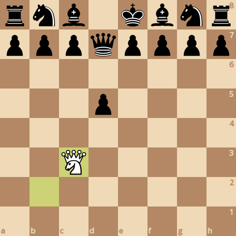
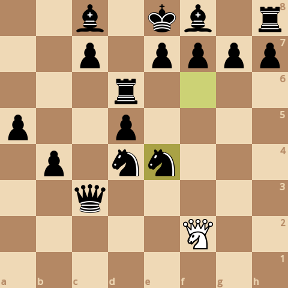
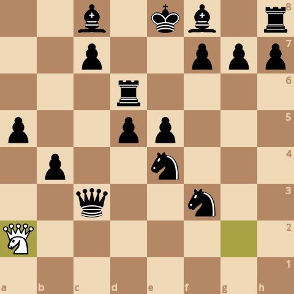
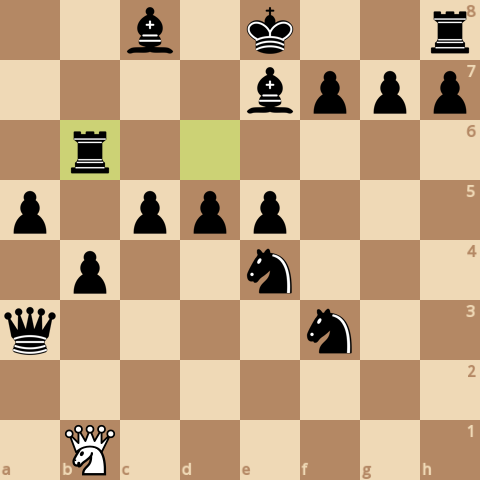

### board0000.png

Current board:\

### board0001.png

Found a new move 0\
Analyzed boards: 25916\
Average speed for the move: 255872 boards/s\
Time taken for the move: 0.101285s\
Total time taken: 0.101285s\
Current white score: 1540, black score: 24100\
Current board after move:\

### board0002.png

Found a new move 1\
Analyzed boards: 69319\
Average speed for the move: 248798 boards/s\
Time taken for the move: 0.174451s\
Total time taken: 0.275736s\
Current white score: 1540, black score: 24180\
Current board after move:\

### board0003.png

Found a new move 2\
Analyzed boards: 93689\
Average speed for the move: 231076 boards/s\
Time taken for the move: 0.105463s\
Total time taken: 0.381199s\
Current white score: 1550, black score: 24180\
Current board after move:\

### board0004.png

Found a new move 3\
Analyzed boards: 190631\
Average speed for the move: 241049 boards/s\
Time taken for the move: 0.402168s\
Total time taken: 0.783367s\
Current white score: 1550, black score: 24190\
Current board after move:\

### board0005.png

Found a new move 4\
Analyzed boards: 212462\
Average speed for the move: 218271 boards/s\
Time taken for the move: 0.100018s\
Total time taken: 0.883385s\
Current white score: 1610, black score: 24190\
Current board after move:\

### board0006.png

Found a new move 5\
Analyzed boards: 426244\
Average speed for the move: 223989 boards/s\
Time taken for the move: 0.954431s\
Total time taken: 1.83782s\
Current white score: 1610, black score: 24200\
Current board after move:\

### board0007.png

Found a new move 6\
Analyzed boards: 467444\
Average speed for the move: 214111 boards/s\
Time taken for the move: 0.192424s\
Total time taken: 2.03024s\
Current white score: 1600, black score: 24200\
Current board after move:\

### board0008.png

Found a new move 7\
Analyzed boards: 773825\
Average speed for the move: 219182 boards/s\
Time taken for the move: 1.39784s\
Total time taken: 3.42808s\
Current white score: 1600, black score: 24260\
Current board after move:\

### board0009.png

Found a new move 8\
Analyzed boards: 807223\
Average speed for the move: 161428 boards/s\
Time taken for the move: 0.206891s\
Total time taken: 3.63497s\
Current white score: 1610, black score: 24260\
Current board after move:\

### board0010.png

Found a new move 9\
Analyzed boards: 1233680\
Average speed for the move: 207449 boards/s\
Time taken for the move: 2.05572s\
Total time taken: 5.69069s\
Current white score: 1610, black score: 24240\
Current board after move:\

### board0011.png

Found a new move 10\
Analyzed boards: 1282958\
Average speed for the move: 205995 boards/s\
Time taken for the move: 0.239219s\
Total time taken: 5.92991s\
Current white score: 1590, black score: 24240\
Current board after move:\

### board0012.png

Found a new move 11\
Analyzed boards: 1652713\
Average speed for the move: 217435 boards/s\
Time taken for the move: 1.70053s\
Total time taken: 7.63045s\
Current white score: 1590, black score: 24230\
Current board after move:\

### board0013.png

Found a new move 12\
Analyzed boards: 1700904\
Average speed for the move: 196847 boards/s\
Time taken for the move: 0.244814s\
Total time taken: 7.87526s\
Current white score: 1610, black score: 24230\
Current board after move:\

### board0014.png

Found a new move 13\
Analyzed boards: 2008311\
Average speed for the move: 210985 boards/s\
Time taken for the move: 1.45701s\
Total time taken: 9.33227s\
Current white score: 1600, black score: 24260\
Current board after move:\

### board0015.png

Found a new move 14\
Analyzed boards: 2049503\
Average speed for the move: 198809 boards/s\
Time taken for the move: 0.207194s\
Total time taken: 9.53947s\
Current white score: 1580, black score: 24250\
Current board after move:\

### board0016.png

Found a new move 15\
Analyzed boards: 2289689\
Average speed for the move: 217315 boards/s\
Time taken for the move: 1.10524s\
Total time taken: 10.6447s\
Current white score: 1570, black score: 24310\
Current board after move:\

### board0017.png

Found a new move 16\
Analyzed boards: 2347269\
Average speed for the move: 215126 boards/s\
Time taken for the move: 0.267657s\
Total time taken: 10.9124s\
Current white score: 1550, black score: 24320\
Current board after move:\

### board0018.png

Found a new move 17\
Analyzed boards: 2972306\
Average speed for the move: 207225 boards/s\
Time taken for the move: 3.01622s\
Total time taken: 13.9286s\
Current white score: 1540, black score: 24440\
Current board after move:\

### board0019.png

Found a new move 18\
Analyzed boards: 3024872\
Average speed for the move: 156896 boards/s\
Time taken for the move: 0.335037s\
Total time taken: 14.2636s\
Current white score: 1480, black score: 24450\
Current board after move:\

### board0020.png

Found a new move 19\
Analyzed boards: 3624777\
Average speed for the move: 221448 boards/s\
Time taken for the move: 2.70901s\
Total time taken: 16.9726s\
Current white score: 1480, black score: 24410\
Current board after move:\

### board0021.png

Found a new move 20\
Analyzed boards: 3679285\
Average speed for the move: 199577 boards/s\
Time taken for the move: 0.273118s\
Total time taken: 17.2458s\
Current white score: 1530, black score: 24410\
Current board after move:\

### board0022.png

Found a new move 21\
Analyzed boards: 4654308\
Average speed for the move: 199804 boards/s\
Time taken for the move: 4.87989s\
Total time taken: 22.1256s\
Current white score: 1530, black score: 24460\
Current board after move:\

### board0023.png

Found a new move 22\
Analyzed boards: 4723905\
Average speed for the move: 192017 boards/s\
Time taken for the move: 0.362452s\
Total time taken: 22.4881s\
Current white score: 1500, black score: 24460\
Current board after move:\

### board0024.png

Found a new move 23\
Analyzed boards: 6066142\
Average speed for the move: 203107 boards/s\
Time taken for the move: 6.60853s\
Total time taken: 29.0966s\
Current white score: 1500, black score: 24450\
Current board after move:\

### board0025.png

Found a new move 24\
Analyzed boards: 6149624\
Average speed for the move: 193087 boards/s\
Time taken for the move: 0.432354s\
Total time taken: 29.529s\
Current white score: 1540, black score: 24450\
Current board after move:\

### board0026.png

Found a new move 25\
Analyzed boards: 7381334\
Average speed for the move: 201148 boards/s\
Time taken for the move: 6.1234s\
Total time taken: 35.6524s\
Current white score: 1550, black score: 24510\
Current board after move:\

### board0027.png

Found a new move 26\
Analyzed boards: 7477056\
Average speed for the move: 187423 boards/s\
Time taken for the move: 0.510728s\
Total time taken: 36.1631s\
Current white score: 1560, black score: 24510\
Current board after move:\

### board0028.png

Found a new move 27\
Analyzed boards: 9742716\
Average speed for the move: 197696 boards/s\
Time taken for the move: 11.4603s\
Total time taken: 47.6234s\
Current white score: 1540, black score: 24520\
Current board after move:\

### board0029.png

Found a new move 28\
Analyzed boards: 9829825\
Average speed for the move: 195750 boards/s\
Time taken for the move: 0.445002s\
Total time taken: 48.0684s\
Current white score: 1510, black score: 24520\
Current board after move:\

### board0030.png

Found a new move 29\
Analyzed boards: 12286101\
Average speed for the move: 195028 boards/s\
Time taken for the move: 12.5945s\
Total time taken: 60.6629s\
Current white score: 1510, black score: 24490\
Current board after move:\

### board0031.png

Found a new move 30\
Analyzed boards: 12420308\
Average speed for the move: 190942 boards/s\
Time taken for the move: 0.702868s\
Total time taken: 61.3658s\
Current white score: 1480, black score: 24490\
Current board after move:\

### board0032.png

Found a new move 31\
Analyzed boards: 13728442\
Average speed for the move: 201008 boards/s\
Time taken for the move: 6.50787s\
Total time taken: 67.8737s\
Current white score: 1460, black score: 24440\
Current board after move:\

### board0033.png

Found a new move 32\
Analyzed boards: 13776474\
Average speed for the move: 200868 boards/s\
Time taken for the move: 0.239122s\
Total time taken: 68.1128s\
Current white score: 1550, black score: 24450\
Current board after move:\

### board0034.png

Found a new move 33\
Analyzed boards: 14833030\
Average speed for the move: 218569 boards/s\
Time taken for the move: 4.83396s\
Total time taken: 72.9468s\
Current white score: 1530, black score: 24430\
Current board after move:\

### board0035.png

Found a new move 34\
Analyzed boards: 14882618\
Average speed for the move: 212720 boards/s\
Time taken for the move: 0.233114s\
Total time taken: 73.1799s\
Current white score: 1500, black score: 24430\
Current board after move:\

### board0036.png

Found a new move 35\
Analyzed boards: 16651023\
Average speed for the move: 215200 boards/s\
Time taken for the move: 8.21751s\
Total time taken: 81.3974s\
Current white score: 1500, black score: 24490\
Current board after move:\

### board0037.png

Found a new move 36\
Analyzed boards: 16803159\
Average speed for the move: 201603 boards/s\
Time taken for the move: 0.754633s\
Total time taken: 82.152s\
Current white score: 1470, black score: 24490\
Current board after move:\

### board0038.png

Found a new move 37\
Analyzed boards: 18106724\
Average speed for the move: 213760 boards/s\
Time taken for the move: 6.09826s\
Total time taken: 88.2503s\
Current white score: 1470, black score: 24520\
Current board after move:\

### board0039.png

Found a new move 38\
Analyzed boards: 18157411\
Average speed for the move: 196498 boards/s\
Time taken for the move: 0.257952s\
Total time taken: 88.5082s\
Current white score: 1530, black score: 24520\
Current board after move:\

### board0040.png

Found a new move 39\
Analyzed boards: 19900753\
Average speed for the move: 210753 boards/s\
Time taken for the move: 8.27198s\
Total time taken: 96.7802s\
Current white score: 1520, black score: 24500\
Current board after move:\

### board0041.png

Found a new move 40\
Analyzed boards: 20058000\
Average speed for the move: 204921 boards/s\
Time taken for the move: 0.767354s\
Total time taken: 97.5476s\
Current white score: 1470, black score: 24500\
Current board after move:\

### board0042.png

Found a new move 41\
Analyzed boards: 21931500\
Average speed for the move: 202103 boards/s\
Time taken for the move: 9.27s\
Total time taken: 106.818s\
Current white score: 1470, black score: 24520\
Current board after move:\

### board0043.png

Found a new move 42\
Analyzed boards: 21990482\
Average speed for the move: 191352 boards/s\
Time taken for the move: 0.308238s\
Total time taken: 107.126s\
Current white score: 1470, black score: 24520\
Current board after move:\

### board0044.png

Found a new move 43\
Analyzed boards: 23228798\
Average speed for the move: 196191 boards/s\
Time taken for the move: 6.3118s\
Total time taken: 113.438s\
Current white score: 1470, black score: 24530\
Current board after move:\

### board0045.png

Found a new move 44\
Analyzed boards: 23268909\
Average speed for the move: 182876 boards/s\
Time taken for the move: 0.219335s\
Total time taken: 113.657s\
Current white score: 1480, black score: 24530\
Current board after move:\

### board0046.png

Found a new move 45\
Analyzed boards: 25325422\
Average speed for the move: 194283 boards/s\
Time taken for the move: 10.5852s\
Total time taken: 124.242s\
Current white score: 1480, black score: 24520\
Current board after move:\

### board0047.png

Found a new move 46\
Analyzed boards: 25515691\
Average speed for the move: 189566 boards/s\
Time taken for the move: 1.00371s\
Total time taken: 125.246s\
Current white score: 1490, black score: 24520\
Current board after move:\

### board0048.png

Found a new move 47\
Analyzed boards: 28550737\
Average speed for the move: 197190 boards/s\
Time taken for the move: 15.3915s\
Total time taken: 140.637s\
Current white score: 1490, black score: 24590\
Current board after move:\

### board0049.png

Found a new move 48\
Analyzed boards: 28640719\
Average speed for the move: 180967 boards/s\
Time taken for the move: 0.49723s\
Total time taken: 141.135s\
Current white score: 1500, black score: 24590\
Current board after move:\

### board0050.png

Found a new move 49\
Analyzed boards: 30754683\
Average speed for the move: 191353 boards/s\
Time taken for the move: 11.0475s\
Total time taken: 152.182s\
Current white score: 1500, black score: 24570\
Current board after move:\

### board0051.png

Found a new move 50\
Analyzed boards: 30811251\
Average speed for the move: 182427 boards/s\
Time taken for the move: 0.310085s\
Total time taken: 152.492s\
Current white score: 1460, black score: 24560\
Current board after move:\

### board0052.png

Found a new move 51\
Analyzed boards: 32734029\
Average speed for the move: 193075 boards/s\
Time taken for the move: 9.95871s\
Total time taken: 162.451s\
Current white score: 1460, black score: 24630\
Current board after move:\

### board0053.png

Found a new move 52\
Analyzed boards: 32933896\
Average speed for the move: 191604 boards/s\
Time taken for the move: 1.04313s\
Total time taken: 163.494s\
Current white score: 1470, black score: 24530\
Current board after move:\

### board0054.png

Found a new move 53\
Analyzed boards: 37140321\
Average speed for the move: 206589 boards/s\
Time taken for the move: 20.3613s\
Total time taken: 183.855s\
Current white score: 1470, black score: 24490\
Current board after move:\
Game ended, it's a checkmate!\

