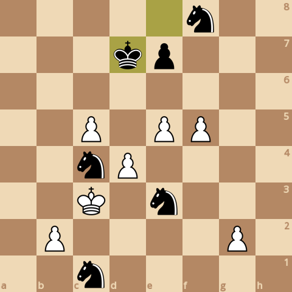
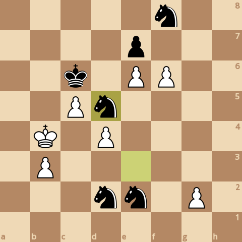

### board0000.png

Current board:\

### board0001.png

Found a new move 0\
Analyzed boards: 12062\
Average speed for the move: 320670 boards/s\
Time taken for the move: 0.037615s\
Total time taken: 0.037615s\
Current white score: 20980, black score: 21470\
Current board after move:\

### board0002.png

Found a new move 1\
Analyzed boards: 20817\
Average speed for the move: 308069 boards/s\
Time taken for the move: 0.028419s\
Total time taken: 0.066034s\
Current white score: 20980, black score: 21510\
Current board after move:\

### board0003.png

Found a new move 2\
Analyzed boards: 44776\
Average speed for the move: 333528 boards/s\
Time taken for the move: 0.071835s\
Total time taken: 0.137869s\
Current white score: 20970, black score: 21510\
Current board after move:\

### board0004.png

Found a new move 3\
Analyzed boards: 58155\
Average speed for the move: 307083 boards/s\
Time taken for the move: 0.043568s\
Total time taken: 0.181437s\
Current white score: 20970, black score: 21560\
Current board after move:\

### board0005.png

Found a new move 4\
Analyzed boards: 93305\
Average speed for the move: 335494 boards/s\
Time taken for the move: 0.104771s\
Total time taken: 0.286208s\
Current white score: 20970, black score: 21560\
Current board after move:\

### board0006.png

Found a new move 5\
Analyzed boards: 113052\
Average speed for the move: 331854 boards/s\
Time taken for the move: 0.059505s\
Total time taken: 0.345713s\
Current white score: 20960, black score: 21550\
Current board after move:\

### board0007.png

Found a new move 6\
Analyzed boards: 127239\
Average speed for the move: 351294 boards/s\
Time taken for the move: 0.040385s\
Total time taken: 0.386098s\
Current white score: 20990, black score: 21550\
Current board after move:\

### board0008.png

Found a new move 7\
Analyzed boards: 172671\
Average speed for the move: 343103 boards/s\
Time taken for the move: 0.132415s\
Total time taken: 0.518513s\
Current white score: 20880, black score: 21520\
Current board after move:\

### board0009.png

Found a new move 8\
Analyzed boards: 207022\
Average speed for the move: 359001 boards/s\
Time taken for the move: 0.095685s\
Total time taken: 0.614198s\
Current white score: 20890, black score: 21510\
Current board after move:\

### board0010.png

Found a new move 9\
Analyzed boards: 217672\
Average speed for the move: 344326 boards/s\
Time taken for the move: 0.03093s\
Total time taken: 0.645128s\
Current white score: 20870, black score: 21500\
Current board after move:\

### board0011.png

Found a new move 10\
Analyzed boards: 228354\
Average speed for the move: 342613 boards/s\
Time taken for the move: 0.031178s\
Total time taken: 0.676306s\
Current white score: 20860, black score: 21500\
Current board after move:\

### board0012.png

Found a new move 11\
Analyzed boards: 241984\
Average speed for the move: 320796 boards/s\
Time taken for the move: 0.042488s\
Total time taken: 0.718794s\
Current white score: 20750, black score: 21470\
Current board after move:\

### board0013.png

Found a new move 12\
Analyzed boards: 254730\
Average speed for the move: 375070 boards/s\
Time taken for the move: 0.033983s\
Total time taken: 0.752777s\
Current white score: 20750, black score: 21470\
Current board after move:\

### board0014.png

Found a new move 13\
Analyzed boards: 262709\
Average speed for the move: 361417 boards/s\
Time taken for the move: 0.022077s\
Total time taken: 0.774854s\
Current white score: 20740, black score: 21500\
Current board after move:\

### board0015.png

Found a new move 14\
Analyzed boards: 275479\
Average speed for the move: 347615 boards/s\
Time taken for the move: 0.036736s\
Total time taken: 0.81159s\
Current white score: 20750, black score: 21500\
Current board after move:\

### board0016.png

Found a new move 15\
Analyzed boards: 298299\
Average speed for the move: 382899 boards/s\
Time taken for the move: 0.059598s\
Total time taken: 0.871188s\
Current white score: 20750, black score: 21530\
Current board after move:\

### board0017.png

Found a new move 16\
Analyzed boards: 324743\
Average speed for the move: 407590 boards/s\
Time taken for the move: 0.064879s\
Total time taken: 0.936067s\
Current white score: 20760, black score: 21530\
Current board after move:\

### board0018.png

Found a new move 17\
Analyzed boards: 336701\
Average speed for the move: 367916 boards/s\
Time taken for the move: 0.032502s\
Total time taken: 0.968569s\
Current white score: 20750, black score: 21550\
Current board after move:\

### board0019.png

Found a new move 18\
Analyzed boards: 346408\
Average speed for the move: 364473 boards/s\
Time taken for the move: 0.026633s\
Total time taken: 0.995202s\
Current white score: 20740, black score: 21550\
Current board after move:\

### board0020.png

Found a new move 19\
Analyzed boards: 407684\
Average speed for the move: 407474 boards/s\
Time taken for the move: 0.15038s\
Total time taken: 1.14558s\
Current white score: 20750, black score: 21550\
Current board after move:\

### board0021.png

Found a new move 20\
Analyzed boards: 426195\
Average speed for the move: 389336 boards/s\
Time taken for the move: 0.047545s\
Total time taken: 1.19313s\
Current white score: 20730, black score: 21550\
Current board after move:\

### board0022.png

Found a new move 21\
Analyzed boards: 451300\
Average speed for the move: 421649 boards/s\
Time taken for the move: 0.05954s\
Total time taken: 1.25267s\
Current white score: 20730, black score: 21560\
Current board after move:\

### board0023.png

Found a new move 22\
Analyzed boards: 466618\
Average speed for the move: 387346 boards/s\
Time taken for the move: 0.039546s\
Total time taken: 1.29221s\
Current white score: 20740, black score: 21560\
Current board after move:\

### board0024.png

Found a new move 23\
Analyzed boards: 496203\
Average speed for the move: 384540 boards/s\
Time taken for the move: 0.076936s\
Total time taken: 1.36915s\
Current white score: 20740, black score: 21590\
Current board after move:\

### board0025.png

Found a new move 24\
Analyzed boards: 513452\
Average speed for the move: 384816 boards/s\
Time taken for the move: 0.044824s\
Total time taken: 1.41397s\
Current white score: 20740, black score: 21590\
Current board after move:\

### board0026.png

Found a new move 25\
Analyzed boards: 533726\
Average speed for the move: 367969 boards/s\
Time taken for the move: 0.055097s\
Total time taken: 1.46907s\
Current white score: 20740, black score: 21610\
Current board after move:\

### board0027.png

Found a new move 26\
Analyzed boards: 539778\
Average speed for the move: 358850 boards/s\
Time taken for the move: 0.016865s\
Total time taken: 1.48593s\
Current white score: 20730, black score: 21610\
Current board after move:\

### board0028.png

Found a new move 27\
Analyzed boards: 554835\
Average speed for the move: 384039 boards/s\
Time taken for the move: 0.039207s\
Total time taken: 1.52514s\
Current white score: 20720, black score: 21610\
Current board after move:\

### board0029.png

Found a new move 28\
Analyzed boards: 578773\
Average speed for the move: 366220 boards/s\
Time taken for the move: 0.065365s\
Total time taken: 1.59051s\
Current white score: 20720, black score: 21600\
Current board after move:\

### board0030.png

Found a new move 29\
Analyzed boards: 612379\
Average speed for the move: 325022 boards/s\
Time taken for the move: 0.103396s\
Total time taken: 1.6939s\
Current white score: 20700, black score: 21620\
Current board after move:\

### board0031.png

Found a new move 30\
Analyzed boards: 642073\
Average speed for the move: 340212 boards/s\
Time taken for the move: 0.087281s\
Total time taken: 1.78118s\
Current white score: 20710, black score: 21630\
Current board after move:\

### board0032.png

Found a new move 31\
Analyzed boards: 728492\
Average speed for the move: 317723 boards/s\
Time taken for the move: 0.271995s\
Total time taken: 2.05318s\
Current white score: 20700, black score: 21610\
Current board after move:\

### board0033.png

Found a new move 32\
Analyzed boards: 754159\
Average speed for the move: 306787 boards/s\
Time taken for the move: 0.083664s\
Total time taken: 2.13684s\
Current white score: 20700, black score: 21610\
Current board after move:\

### board0034.png

Found a new move 33\
Analyzed boards: 798092\
Average speed for the move: 315009 boards/s\
Time taken for the move: 0.139466s\
Total time taken: 2.27631s\
Current white score: 20590, black score: 21620\
Current board after move:\

### board0035.png

Found a new move 34\
Analyzed boards: 808124\
Average speed for the move: 358632 boards/s\
Time taken for the move: 0.027973s\
Total time taken: 2.30428s\
Current white score: 20600, black score: 21620\
Current board after move:\

### board0036.png

Found a new move 35\
Analyzed boards: 811956\
Average speed for the move: 353767 boards/s\
Time taken for the move: 0.010832s\
Total time taken: 2.31511s\
Current white score: 20480, black score: 21600\
Current board after move:\

### board0037.png

Found a new move 36\
Analyzed boards: 815881\
Average speed for the move: 366857 boards/s\
Time taken for the move: 0.010699s\
Total time taken: 2.32581s\
Current white score: 20470, black score: 21600\
Current board after move:\

### board0038.png

Found a new move 37\
Analyzed boards: 824753\
Average speed for the move: 340694 boards/s\
Time taken for the move: 0.026041s\
Total time taken: 2.35185s\
Current white score: 20370, black score: 21640\
Current board after move:\

### board0039.png

Found a new move 38\
Analyzed boards: 829493\
Average speed for the move: 365459 boards/s\
Time taken for the move: 0.01297s\
Total time taken: 2.36482s\
Current white score: 20370, black score: 21640\
Current board after move:\

### board0040.png

Found a new move 39\
Analyzed boards: 842278\
Average speed for the move: 398336 boards/s\
Time taken for the move: 0.032096s\
Total time taken: 2.39692s\
Current white score: 20370, black score: 21660\
Current board after move:\

### board0041.png

Found a new move 40\
Analyzed boards: 845469\
Average speed for the move: 357455 boards/s\
Time taken for the move: 0.008927s\
Total time taken: 2.40585s\
Current white score: 20370, black score: 21660\
Current board after move:\

### board0042.png

Found a new move 41\
Analyzed boards: 859032\
Average speed for the move: 405519 boards/s\
Time taken for the move: 0.033446s\
Total time taken: 2.43929s\
Current white score: 20250, black score: 21620\
Current board after move:\

### board0043.png

Found a new move 42\
Analyzed boards: 869682\
Average speed for the move: 425523 boards/s\
Time taken for the move: 0.025028s\
Total time taken: 2.46432s\
Current white score: 20290, black score: 21620\
Current board after move:\

### board0044.png

Found a new move 43\
Analyzed boards: 888664\
Average speed for the move: 435068 boards/s\
Time taken for the move: 0.04363s\
Total time taken: 2.50795s\
Current white score: 20290, black score: 21660\
Current board after move:\

### board0045.png

Found a new move 44\
Analyzed boards: 894600\
Average speed for the move: 394235 boards/s\
Time taken for the move: 0.015057s\
Total time taken: 2.52301s\
Current white score: 20260, black score: 21660\
Current board after move:\

### board0046.png

Found a new move 45\
Analyzed boards: 903115\
Average speed for the move: 424794 boards/s\
Time taken for the move: 0.020045s\
Total time taken: 2.54305s\
Current white score: 20260, black score: 21640\
Current board after move:\

### board0047.png

Found a new move 46\
Analyzed boards: 905690\
Average speed for the move: 419860 boards/s\
Time taken for the move: 0.006133s\
Total time taken: 2.54919s\
Current white score: 20270, black score: 21640\
Current board after move:\

### board0048.png

Found a new move 47\
Analyzed boards: 913229\
Average speed for the move: 447897 boards/s\
Time taken for the move: 0.016832s\
Total time taken: 2.56602s\
Current white score: 20160, black score: 21640\
Current board after move:\

### board0049.png

Found a new move 48\
Analyzed boards: 917501\
Average speed for the move: 409235 boards/s\
Time taken for the move: 0.010439s\
Total time taken: 2.57646s\
Current white score: 20160, black score: 21640\
Current board after move:\

### board0050.png

Found a new move 49\
Analyzed boards: 947694\
Average speed for the move: 441851 boards/s\
Time taken for the move: 0.068333s\
Total time taken: 2.64479s\
Current white score: 20050, black score: 21640\
Current board after move:\
Game ended, it's a checkmate!\

