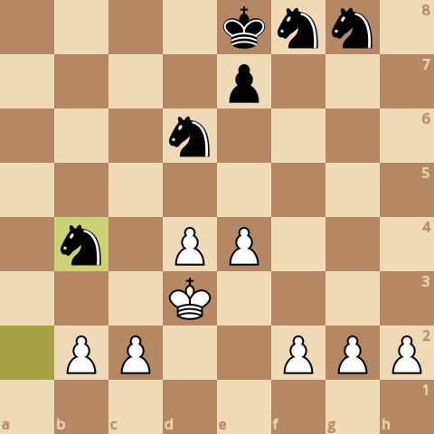
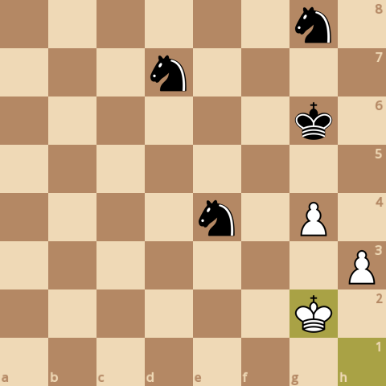

### board0000.png

Current board:\

### board0001.png

Found a new move 0\
Analyzed boards: 38268\
Average speed for the move: 296176 boards/s\
Time taken for the move: 0.129207s\
Total time taken: 0.129207s\
Current white score: 20980, black score: 21470\
Current board after move:\

### board0002.png

Found a new move 1\
Analyzed boards: 116264\
Average speed for the move: 342391 boards/s\
Time taken for the move: 0.227798s\
Total time taken: 0.357005s\
Current white score: 20980, black score: 21510\
Current board after move:\

### board0003.png

Found a new move 2\
Analyzed boards: 159192\
Average speed for the move: 315540 boards/s\
Time taken for the move: 0.136046s\
Total time taken: 0.493051s\
Current white score: 20980, black score: 21510\
Current board after move:\

### board0004.png

Found a new move 3\
Analyzed boards: 349495\
Average speed for the move: 334311 boards/s\
Time taken for the move: 0.569239s\
Total time taken: 1.06229s\
Current white score: 20970, black score: 21500\
Current board after move:\

### board0005.png

Found a new move 4\
Analyzed boards: 401572\
Average speed for the move: 331916 boards/s\
Time taken for the move: 0.156898s\
Total time taken: 1.21919s\
Current white score: 20990, black score: 21500\
Current board after move:\

### board0006.png

Found a new move 5\
Analyzed boards: 576797\
Average speed for the move: 345328 boards/s\
Time taken for the move: 0.507416s\
Total time taken: 1.7266s\
Current white score: 20880, black score: 21470\
Current board after move:\

### board0007.png

Found a new move 6\
Analyzed boards: 661161\
Average speed for the move: 336988 boards/s\
Time taken for the move: 0.250347s\
Total time taken: 1.97695s\
Current white score: 20890, black score: 21470\
Current board after move:\

### board0008.png

Found a new move 7\
Analyzed boards: 765237\
Average speed for the move: 349587 boards/s\
Time taken for the move: 0.297711s\
Total time taken: 2.27466s\
Current white score: 20890, black score: 21510\
Current board after move:\

### board0009.png

Found a new move 8\
Analyzed boards: 832668\
Average speed for the move: 338853 boards/s\
Time taken for the move: 0.198998s\
Total time taken: 2.47366s\
Current white score: 20870, black score: 21510\
Current board after move:\

### board0010.png

Found a new move 9\
Analyzed boards: 1058251\
Average speed for the move: 344196 boards/s\
Time taken for the move: 0.655392s\
Total time taken: 3.12905s\
Current white score: 20860, black score: 21540\
Current board after move:\

### board0011.png

Found a new move 10\
Analyzed boards: 1068537\
Average speed for the move: 335136 boards/s\
Time taken for the move: 0.030692s\
Total time taken: 3.15974s\
Current white score: 20840, black score: 21540\
Current board after move:\

### board0012.png

Found a new move 11\
Analyzed boards: 1108992\
Average speed for the move: 349954 boards/s\
Time taken for the move: 0.115601s\
Total time taken: 3.27535s\
Current white score: 20850, black score: 21550\
Current board after move:\

### board0013.png

Found a new move 12\
Analyzed boards: 1198442\
Average speed for the move: 345249 boards/s\
Time taken for the move: 0.259088s\
Total time taken: 3.53443s\
Current white score: 20860, black score: 21540\
Current board after move:\

### board0014.png

Found a new move 13\
Analyzed boards: 1260307\
Average speed for the move: 355417 boards/s\
Time taken for the move: 0.174063s\
Total time taken: 3.7085s\
Current white score: 20850, black score: 21550\
Current board after move:\

### board0015.png

Found a new move 14\
Analyzed boards: 1300140\
Average speed for the move: 350748 boards/s\
Time taken for the move: 0.113566s\
Total time taken: 3.82206s\
Current white score: 20880, black score: 21550\
Current board after move:\

### board0016.png

Found a new move 15\
Analyzed boards: 1331220\
Average speed for the move: 369310 boards/s\
Time taken for the move: 0.084157s\
Total time taken: 3.90622s\
Current white score: 20760, black score: 21530\
Current board after move:\

### board0017.png

Found a new move 16\
Analyzed boards: 1398095\
Average speed for the move: 365449 boards/s\
Time taken for the move: 0.182994s\
Total time taken: 4.08921s\
Current white score: 20770, black score: 21530\
Current board after move:\

### board0018.png

Found a new move 17\
Analyzed boards: 1555750\
Average speed for the move: 367511 boards/s\
Time taken for the move: 0.42898s\
Total time taken: 4.51819s\
Current white score: 20770, black score: 21550\
Current board after move:\

### board0019.png

Found a new move 18\
Analyzed boards: 1711799\
Average speed for the move: 367938 boards/s\
Time taken for the move: 0.424118s\
Total time taken: 4.94231s\
Current white score: 20760, black score: 21550\
Current board after move:\

### board0020.png

Found a new move 19\
Analyzed boards: 1989510\
Average speed for the move: 384408 boards/s\
Time taken for the move: 0.722439s\
Total time taken: 5.66475s\
Current white score: 20760, black score: 21570\
Current board after move:\

### board0021.png

Found a new move 20\
Analyzed boards: 2218201\
Average speed for the move: 378569 boards/s\
Time taken for the move: 0.604093s\
Total time taken: 6.26884s\
Current white score: 20770, black score: 21570\
Current board after move:\

### board0022.png

Found a new move 21\
Analyzed boards: 2265575\
Average speed for the move: 376241 boards/s\
Time taken for the move: 0.125914s\
Total time taken: 6.39476s\
Current white score: 20770, black score: 21530\
Current board after move:\

### board0023.png

Found a new move 22\
Analyzed boards: 2320969\
Average speed for the move: 359947 boards/s\
Time taken for the move: 0.153895s\
Total time taken: 6.54865s\
Current white score: 20760, black score: 21530\
Current board after move:\

### board0024.png

Found a new move 23\
Analyzed boards: 2565883\
Average speed for the move: 387599 boards/s\
Time taken for the move: 0.631875s\
Total time taken: 7.18053s\
Current white score: 20750, black score: 21570\
Current board after move:\

### board0025.png

Found a new move 24\
Analyzed boards: 2728930\
Average speed for the move: 397756 boards/s\
Time taken for the move: 0.409917s\
Total time taken: 7.59044s\
Current white score: 20740, black score: 21570\
Current board after move:\

### board0026.png

Found a new move 25\
Analyzed boards: 2937264\
Average speed for the move: 395043 boards/s\
Time taken for the move: 0.52737s\
Total time taken: 8.11781s\
Current white score: 20740, black score: 21540\
Current board after move:\

### board0027.png

Found a new move 26\
Analyzed boards: 3007582\
Average speed for the move: 388766 boards/s\
Time taken for the move: 0.180875s\
Total time taken: 8.29869s\
Current white score: 20740, black score: 21540\
Current board after move:\

### board0028.png

Found a new move 27\
Analyzed boards: 3126878\
Average speed for the move: 384064 boards/s\
Time taken for the move: 0.310615s\
Total time taken: 8.6093s\
Current white score: 20730, black score: 21580\
Current board after move:\

### board0029.png

Found a new move 28\
Analyzed boards: 3243236\
Average speed for the move: 392843 boards/s\
Time taken for the move: 0.296195s\
Total time taken: 8.9055s\
Current white score: 20720, black score: 21580\
Current board after move:\

### board0030.png

Found a new move 29\
Analyzed boards: 3325300\
Average speed for the move: 390441 boards/s\
Time taken for the move: 0.210183s\
Total time taken: 9.11568s\
Current white score: 20610, black score: 21540\
Current board after move:\

### board0031.png

Found a new move 30\
Analyzed boards: 3364463\
Average speed for the move: 411350 boards/s\
Time taken for the move: 0.095206s\
Total time taken: 9.21089s\
Current white score: 20610, black score: 21540\
Current board after move:\

### board0032.png

Found a new move 31\
Analyzed boards: 3393393\
Average speed for the move: 428237 boards/s\
Time taken for the move: 0.067556s\
Total time taken: 9.27844s\
Current white score: 20610, black score: 21540\
Current board after move:\

### board0033.png

Found a new move 32\
Analyzed boards: 3406462\
Average speed for the move: 399468 boards/s\
Time taken for the move: 0.032716s\
Total time taken: 9.31116s\
Current white score: 20620, black score: 21540\
Current board after move:\

### board0034.png

Found a new move 33\
Analyzed boards: 3425847\
Average speed for the move: 404023 boards/s\
Time taken for the move: 0.04798s\
Total time taken: 9.35914s\
Current white score: 20620, black score: 21550\
Current board after move:\

### board0035.png

Found a new move 34\
Analyzed boards: 3438842\
Average speed for the move: 404766 boards/s\
Time taken for the move: 0.032105s\
Total time taken: 9.39124s\
Current white score: 20580, black score: 21230\
Current board after move:\

### board0036.png

Found a new move 35\
Analyzed boards: 3459651\
Average speed for the move: 440113 boards/s\
Time taken for the move: 0.047281s\
Total time taken: 9.43853s\
Current white score: 20470, black score: 21270\
Current board after move:\

### board0037.png

Found a new move 36\
Analyzed boards: 3474409\
Average speed for the move: 335944 boards/s\
Time taken for the move: 0.04393s\
Total time taken: 9.48246s\
Current white score: 20480, black score: 21280\
Current board after move:\

### board0038.png

Found a new move 37\
Analyzed boards: 3495458\
Average speed for the move: 395956 boards/s\
Time taken for the move: 0.05316s\
Total time taken: 9.53562s\
Current white score: 20370, black score: 21290\
Current board after move:\

### board0039.png

Found a new move 38\
Analyzed boards: 3515493\
Average speed for the move: 404331 boards/s\
Time taken for the move: 0.049551s\
Total time taken: 9.58517s\
Current white score: 20360, black score: 21170\
Current board after move:\

### board0040.png

Found a new move 39\
Analyzed boards: 3546615\
Average speed for the move: 342780 boards/s\
Time taken for the move: 0.090793s\
Total time taken: 9.67596s\
Current white score: 20360, black score: 21150\
Current board after move:\

### board0041.png

Found a new move 40\
Analyzed boards: 3558194\
Average speed for the move: 393001 boards/s\
Time taken for the move: 0.029463s\
Total time taken: 9.70542s\
Current white score: 20390, black score: 21150\
Current board after move:\

### board0042.png

Found a new move 41\
Analyzed boards: 3575274\
Average speed for the move: 410725 boards/s\
Time taken for the move: 0.041585s\
Total time taken: 9.74701s\
Current white score: 20250, black score: 21150\
Current board after move:\

### board0043.png

Found a new move 42\
Analyzed boards: 3589797\
Average speed for the move: 466872 boards/s\
Time taken for the move: 0.031107s\
Total time taken: 9.77811s\
Current white score: 20290, black score: 21150\
Current board after move:\

### board0044.png

Found a new move 43\
Analyzed boards: 3636149\
Average speed for the move: 492211 boards/s\
Time taken for the move: 0.094171s\
Total time taken: 9.87229s\
Current white score: 20290, black score: 21160\
Current board after move:\

### board0045.png

Found a new move 44\
Analyzed boards: 3652499\
Average speed for the move: 485711 boards/s\
Time taken for the move: 0.033662s\
Total time taken: 9.90595s\
Current white score: 20260, black score: 21160\
Current board after move:\

### board0046.png

Found a new move 45\
Analyzed boards: 3728004\
Average speed for the move: 507075 boards/s\
Time taken for the move: 0.148903s\
Total time taken: 10.0549s\
Current white score: 20260, black score: 21170\
Current board after move:\

### board0047.png

Found a new move 46\
Analyzed boards: 3742659\
Average speed for the move: 529578 boards/s\
Time taken for the move: 0.027673s\
Total time taken: 10.0825s\
Current white score: 20250, black score: 21170\
Current board after move:\

### board0048.png

Found a new move 47\
Analyzed boards: 3776026\
Average speed for the move: 508822 boards/s\
Time taken for the move: 0.065577s\
Total time taken: 10.1481s\
Current white score: 20250, black score: 21190\
Current board after move:\

### board0049.png

Found a new move 48\
Analyzed boards: 3792097\
Average speed for the move: 504030 boards/s\
Time taken for the move: 0.031885s\
Total time taken: 10.18s\
Current white score: 20290, black score: 21190\
Current board after move:\

### board0050.png

Found a new move 49\
Analyzed boards: 3834128\
Average speed for the move: 513400 boards/s\
Time taken for the move: 0.081868s\
Total time taken: 10.2619s\
Current white score: 20280, black score: 21140\
Current board after move:\

### board0051.png

Found a new move 50\
Analyzed boards: 3849084\
Average speed for the move: 510792 boards/s\
Time taken for the move: 0.02928s\
Total time taken: 10.2911s\
Current white score: 20250, black score: 21140\
Current board after move:\

### board0052.png

Found a new move 51\
Analyzed boards: 3874373\
Average speed for the move: 487414 boards/s\
Time taken for the move: 0.051884s\
Total time taken: 10.343s\
Current white score: 20250, black score: 21170\
Current board after move:\

### board0053.png

Found a new move 52\
Analyzed boards: 3884613\
Average speed for the move: 469165 boards/s\
Time taken for the move: 0.021826s\
Total time taken: 10.3648s\
Current white score: 20260, black score: 21170\
Current board after move:\

### board0054.png

Found a new move 53\
Analyzed boards: 3908429\
Average speed for the move: 493780 boards/s\
Time taken for the move: 0.048232s\
Total time taken: 10.4131s\
Current white score: 20260, black score: 21170\
Current board after move:\

### board0055.png

Found a new move 54\
Analyzed boards: 3924119\
Average speed for the move: 488602 boards/s\
Time taken for the move: 0.032112s\
Total time taken: 10.4452s\
Current white score: 20240, black score: 21170\
Current board after move:\

### board0056.png

Found a new move 55\
Analyzed boards: 3953295\
Average speed for the move: 475760 boards/s\
Time taken for the move: 0.061325s\
Total time taken: 10.5065s\
Current white score: 20250, black score: 21220\
Current board after move:\
Game ended, it's a checkmate!\

