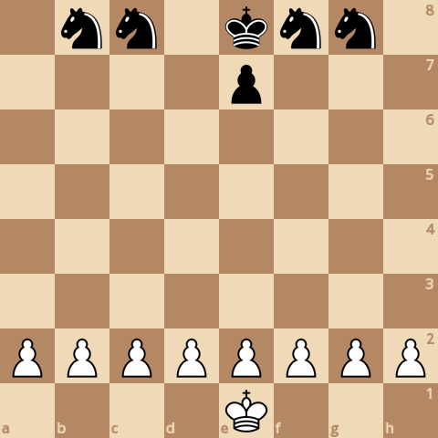
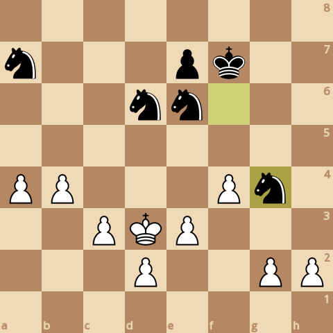
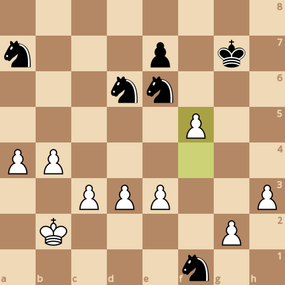
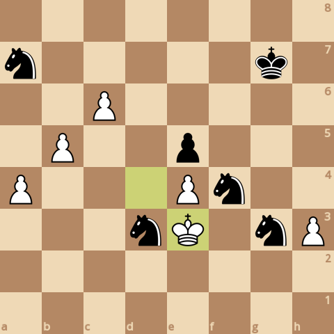
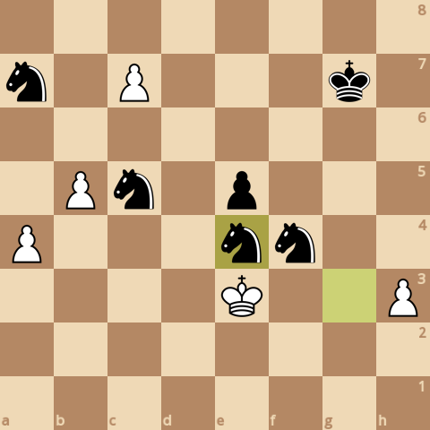

### board0000.png

Current board:\

### board0001.png

Found a new move 0\
Analyzed boards: 1269627\
Average speed for the move: 323767 boards/s\
Time taken for the move: 3.92142s\
Total time taken: 3.92142s\
Current white score: 20970, black score: 21470\
Current board after move:\

### board0002.png

Found a new move 1\
Analyzed boards: 1795932\
Average speed for the move: 307425 boards/s\
Time taken for the move: 1.71198s\
Total time taken: 5.6334s\
Current white score: 20970, black score: 21510\
Current board after move:\

### board0003.png

Found a new move 2\
Analyzed boards: 3931913\
Average speed for the move: 322148 boards/s\
Time taken for the move: 6.63044s\
Total time taken: 12.2638s\
Current white score: 20960, black score: 21510\
Current board after move:\

### board0004.png

Found a new move 3\
Analyzed boards: 4483204\
Average speed for the move: 335283 boards/s\
Time taken for the move: 1.64426s\
Total time taken: 13.9081s\
Current white score: 20960, black score: 21550\
Current board after move:\

### board0005.png

Found a new move 4\
Analyzed boards: 6535555\
Average speed for the move: 344101 boards/s\
Time taken for the move: 5.96438s\
Total time taken: 19.8725s\
Current white score: 20960, black score: 21550\
Current board after move:\

### board0006.png

Found a new move 5\
Analyzed boards: 7124971\
Average speed for the move: 341465 boards/s\
Time taken for the move: 1.72614s\
Total time taken: 21.5986s\
Current white score: 20960, black score: 21580\
Current board after move:\

### board0007.png

Found a new move 6\
Analyzed boards: 8816435\
Average speed for the move: 355997 boards/s\
Time taken for the move: 4.75134s\
Total time taken: 26.35s\
Current white score: 20960, black score: 21580\
Current board after move:\

### board0008.png

Found a new move 7\
Analyzed boards: 9766289\
Average speed for the move: 349503 boards/s\
Time taken for the move: 2.71773s\
Total time taken: 29.0677s\
Current white score: 20960, black score: 21590\
Current board after move:\

### board0009.png

Found a new move 8\
Analyzed boards: 12559234\
Average speed for the move: 355699 boards/s\
Time taken for the move: 7.85199s\
Total time taken: 36.9197s\
Current white score: 20950, black score: 21590\
Current board after move:\

### board0010.png

Found a new move 9\
Analyzed boards: 14172304\
Average speed for the move: 323536 boards/s\
Time taken for the move: 4.98575s\
Total time taken: 41.9054s\
Current white score: 20950, black score: 21650\
Current board after move:\

### board0011.png

Found a new move 10\
Analyzed boards: 24395314\
Average speed for the move: 334403 boards/s\
Time taken for the move: 30.5709s\
Total time taken: 72.4763s\
Current white score: 20970, black score: 21650\
Current board after move:\

### board0012.png

Found a new move 11\
Analyzed boards: 36255320\
Average speed for the move: 325822 boards/s\
Time taken for the move: 36.4002s\
Total time taken: 108.877s\
Current white score: 20970, black score: 21610\
Current board after move:\

### board0013.png

Found a new move 12\
Analyzed boards: 44195199\
Average speed for the move: 325210 boards/s\
Time taken for the move: 24.4146s\
Total time taken: 133.291s\
Current white score: 20940, black score: 21610\
Current board after move:\

### board0014.png

Found a new move 13\
Analyzed boards: 46808351\
Average speed for the move: 314289 boards/s\
Time taken for the move: 8.31449s\
Total time taken: 141.606s\
Current white score: 20930, black score: 21600\
Current board after move:\

### board0015.png

Found a new move 14\
Analyzed boards: 48007830\
Average speed for the move: 333255 boards/s\
Time taken for the move: 3.59928s\
Total time taken: 145.205s\
Current white score: 20930, black score: 21600\
Current board after move:\

### board0016.png

Found a new move 15\
Analyzed boards: 48505621\
Average speed for the move: 327065 boards/s\
Time taken for the move: 1.52199s\
Total time taken: 146.727s\
Current white score: 20930, black score: 21610\
Current board after move:\

### board0017.png

Found a new move 16\
Analyzed boards: 52756545\
Average speed for the move: 330988 boards/s\
Time taken for the move: 12.8431s\
Total time taken: 159.57s\
Current white score: 20960, black score: 21610\
Current board after move:\

### board0018.png

Found a new move 17\
Analyzed boards: 55711339\
Average speed for the move: 315104 boards/s\
Time taken for the move: 9.37721s\
Total time taken: 168.947s\
Current white score: 20960, black score: 21630\
Current board after move:\

### board0019.png

Found a new move 18\
Analyzed boards: 61384798\
Average speed for the move: 332732 boards/s\
Time taken for the move: 17.0511s\
Total time taken: 185.998s\
Current white score: 20950, black score: 21630\
Current board after move:\

### board0020.png

Found a new move 19\
Analyzed boards: 62650198\
Average speed for the move: 313925 boards/s\
Time taken for the move: 4.0309s\
Total time taken: 190.029s\
Current white score: 20940, black score: 21620\
Current board after move:\

### board0021.png

Found a new move 20\
Analyzed boards: 64357322\
Average speed for the move: 326753 boards/s\
Time taken for the move: 5.22451s\
Total time taken: 195.254s\
Current white score: 20940, black score: 21620\
Current board after move:\

### board0022.png

Found a new move 21\
Analyzed boards: 65033527\
Average speed for the move: 326632 boards/s\
Time taken for the move: 2.07024s\
Total time taken: 197.324s\
Current white score: 20940, black score: 21620\
Current board after move:\

### board0023.png

Found a new move 22\
Analyzed boards: 66029468\
Average speed for the move: 319882 boards/s\
Time taken for the move: 3.11346s\
Total time taken: 200.438s\
Current white score: 20960, black score: 21620\
Current board after move:\

### board0024.png

Found a new move 23\
Analyzed boards: 69372887\
Average speed for the move: 321053 boards/s\
Time taken for the move: 10.4139s\
Total time taken: 210.851s\
Current white score: 20960, black score: 21600\
Current board after move:\

### board0025.png

Found a new move 24\
Analyzed boards: 70082203\
Average speed for the move: 320685 boards/s\
Time taken for the move: 2.21188s\
Total time taken: 213.063s\
Current white score: 20970, black score: 21600\
Current board after move:\

### board0026.png

Found a new move 25\
Analyzed boards: 70404387\
Average speed for the move: 302791 boards/s\
Time taken for the move: 1.06405s\
Total time taken: 214.127s\
Current white score: 20850, black score: 21580\
Current board after move:\

### board0027.png

Found a new move 26\
Analyzed boards: 71076137\
Average speed for the move: 330743 boards/s\
Time taken for the move: 2.03104s\
Total time taken: 216.158s\
Current white score: 20860, black score: 21580\
Current board after move:\

### board0028.png

Found a new move 27\
Analyzed boards: 71643785\
Average speed for the move: 327563 boards/s\
Time taken for the move: 1.73294s\
Total time taken: 217.891s\
Current white score: 20830, black score: 21560\
Current board after move:\

### board0029.png

Found a new move 28\
Analyzed boards: 73952940\
Average speed for the move: 333771 boards/s\
Time taken for the move: 6.91838s\
Total time taken: 224.81s\
Current white score: 20840, black score: 21560\
Current board after move:\

### board0030.png

Found a new move 29\
Analyzed boards: 74730366\
Average speed for the move: 333999 boards/s\
Time taken for the move: 2.32763s\
Total time taken: 227.137s\
Current white score: 20840, black score: 21620\
Current board after move:\

### board0031.png

Found a new move 30\
Analyzed boards: 76086045\
Average speed for the move: 348912 boards/s\
Time taken for the move: 3.88544s\
Total time taken: 231.023s\
Current white score: 20840, black score: 21620\
Current board after move:\

### board0032.png

Found a new move 31\
Analyzed boards: 76868762\
Average speed for the move: 342930 boards/s\
Time taken for the move: 2.28244s\
Total time taken: 233.305s\
Current white score: 20840, black score: 21650\
Current board after move:\

### board0033.png

Found a new move 32\
Analyzed boards: 77551326\
Average speed for the move: 337153 boards/s\
Time taken for the move: 2.02449s\
Total time taken: 235.33s\
Current white score: 20820, black score: 21650\
Current board after move:\

### board0034.png

Found a new move 33\
Analyzed boards: 78324102\
Average speed for the move: 336845 boards/s\
Time taken for the move: 2.29416s\
Total time taken: 237.624s\
Current white score: 20720, black score: 21590\
Current board after move:\

### board0035.png

Found a new move 34\
Analyzed boards: 78852249\
Average speed for the move: 359280 boards/s\
Time taken for the move: 1.47002s\
Total time taken: 239.094s\
Current white score: 20730, black score: 21590\
Current board after move:\

### board0036.png

Found a new move 35\
Analyzed boards: 79905027\
Average speed for the move: 340387 boards/s\
Time taken for the move: 3.09288s\
Total time taken: 242.187s\
Current white score: 20730, black score: 21610\
Current board after move:\

### board0037.png

Found a new move 36\
Analyzed boards: 80980533\
Average speed for the move: 337743 boards/s\
Time taken for the move: 3.18439s\
Total time taken: 245.371s\
Current white score: 20730, black score: 21610\
Current board after move:\

### board0038.png

Found a new move 37\
Analyzed boards: 82810768\
Average speed for the move: 349694 boards/s\
Time taken for the move: 5.23381s\
Total time taken: 250.605s\
Current white score: 20630, black score: 21630\
Current board after move:\

### board0039.png

Found a new move 38\
Analyzed boards: 84023995\
Average speed for the move: 343383 boards/s\
Time taken for the move: 3.53316s\
Total time taken: 254.138s\
Current white score: 20620, black score: 21630\
Current board after move:\

### board0040.png

Found a new move 39\
Analyzed boards: 89253919\
Average speed for the move: 322375 boards/s\
Time taken for the move: 16.2231s\
Total time taken: 270.361s\
Current white score: 20610, black score: 21610\
Current board after move:\

### board0041.png

Found a new move 40\
Analyzed boards: 89796157\
Average speed for the move: 350462 boards/s\
Time taken for the move: 1.54721s\
Total time taken: 271.909s\
Current white score: 20610, black score: 21600\
Current board after move:\

### board0042.png

Found a new move 41\
Analyzed boards: 93084170\
Average speed for the move: 320337 boards/s\
Time taken for the move: 10.2642s\
Total time taken: 282.173s\
Current white score: 20610, black score: 21630\
Current board after move:\

### board0043.png

Found a new move 42\
Analyzed boards: 93802692\
Average speed for the move: 355482 boards/s\
Time taken for the move: 2.02126s\
Total time taken: 284.194s\
Current white score: 20640, black score: 21630\
Current board after move:\

### board0044.png

Found a new move 43\
Analyzed boards: 97586941\
Average speed for the move: 351105 boards/s\
Time taken for the move: 10.7781s\
Total time taken: 294.972s\
Current white score: 20550, black score: 21630\
Current board after move:\

### board0045.png

Found a new move 44\
Analyzed boards: 98340400\
Average speed for the move: 336567 boards/s\
Time taken for the move: 2.23866s\
Total time taken: 297.211s\
Current white score: 20560, black score: 21630\
Current board after move:\

### board0046.png

Found a new move 45\
Analyzed boards: 100505498\
Average speed for the move: 295276 boards/s\
Time taken for the move: 7.33245s\
Total time taken: 304.543s\
Current white score: 20560, black score: 21630\
Current board after move:\

### board0047.png

Found a new move 46\
Analyzed boards: 100736127\
Average speed for the move: 326259 boards/s\
Time taken for the move: 0.706889s\
Total time taken: 305.25s\
Current white score: 20560, black score: 21630\
Current board after move:\

### board0048.png

Found a new move 47\
Analyzed boards: 102681678\
Average speed for the move: 317985 boards/s\
Time taken for the move: 6.11838s\
Total time taken: 311.368s\
Current white score: 20440, black score: 21610\
Current board after move:\

### board0049.png

Found a new move 48\
Analyzed boards: 103687144\
Average speed for the move: 348877 boards/s\
Time taken for the move: 2.882s\
Total time taken: 314.25s\
Current white score: 20430, black score: 21610\
Current board after move:\

### board0050.png

Found a new move 49\
Analyzed boards: 106182575\
Average speed for the move: 351754 boards/s\
Time taken for the move: 7.09426s\
Total time taken: 321.345s\
Current white score: 20430, black score: 21640\
Current board after move:\

### board0051.png

Found a new move 50\
Analyzed boards: 106628041\
Average speed for the move: 347937 boards/s\
Time taken for the move: 1.28031s\
Total time taken: 322.625s\
Current white score: 20440, black score: 21640\
Current board after move:\

### board0052.png

Found a new move 51\
Analyzed boards: 109097543\
Average speed for the move: 341551 boards/s\
Time taken for the move: 7.23027s\
Total time taken: 329.855s\
Current white score: 20430, black score: 21660\
Current board after move:\

### board0053.png

Found a new move 52\
Analyzed boards: 109344612\
Average speed for the move: 349164 boards/s\
Time taken for the move: 0.707602s\
Total time taken: 330.563s\
Current white score: 20640, black score: 21660\
Current board after move:\

### board0054.png

Found a new move 53\
Analyzed boards: 110457436\
Average speed for the move: 334323 boards/s\
Time taken for the move: 3.32859s\
Total time taken: 333.892s\
Current white score: 20290, black score: 21600\
Current board after move:\

### board0055.png

Found a new move 54\
Analyzed boards: 110738895\
Average speed for the move: 368429 boards/s\
Time taken for the move: 0.763943s\
Total time taken: 334.655s\
Current white score: 20300, black score: 21600\
Current board after move:\

### board0056.png

Found a new move 55\
Analyzed boards: 111132844\
Average speed for the move: 348653 boards/s\
Time taken for the move: 1.12992s\
Total time taken: 335.785s\
Current white score: 20300, black score: 21660\
Current board after move:\

### board0057.png

Found a new move 56\
Analyzed boards: 111741039\
Average speed for the move: 351005 boards/s\
Time taken for the move: 1.73272s\
Total time taken: 337.518s\
Current white score: 20300, black score: 21660\
Current board after move:\

### board0058.png

Found a new move 57\
Analyzed boards: 112430291\
Average speed for the move: 332000 boards/s\
Time taken for the move: 2.07606s\
Total time taken: 339.594s\
Current white score: 20300, black score: 21700\
Current board after move:\

### board0059.png

Found a new move 58\
Analyzed boards: 112860512\
Average speed for the move: 329808 boards/s\
Time taken for the move: 1.30446s\
Total time taken: 340.899s\
Current white score: 20290, black score: 21700\
Current board after move:\

### board0060.png

Found a new move 59\
Analyzed boards: 114317476\
Average speed for the move: 302792 boards/s\
Time taken for the move: 4.81177s\
Total time taken: 345.71s\
Current white score: 20180, black score: 21670\
Current board after move:\

### board0061.png

Found a new move 60\
Analyzed boards: 114615599\
Average speed for the move: 362401 boards/s\
Time taken for the move: 0.822632s\
Total time taken: 346.533s\
Current white score: 20150, black score: 21670\
Current board after move:\

### board0062.png

Found a new move 61\
Analyzed boards: 114836171\
Average speed for the move: 409887 boards/s\
Time taken for the move: 0.538129s\
Total time taken: 347.071s\
Current white score: 20150, black score: 21660\
Current board after move:\

### board0063.png

Found a new move 62\
Analyzed boards: 115060488\
Average speed for the move: 408655 boards/s\
Time taken for the move: 0.548916s\
Total time taken: 347.62s\
Current white score: 20160, black score: 21660\
Current board after move:\

### board0064.png

Found a new move 63\
Analyzed boards: 115443667\
Average speed for the move: 393911 boards/s\
Time taken for the move: 0.972756s\
Total time taken: 348.593s\
Current white score: 20160, black score: 21650\
Current board after move:\

### board0065.png

Found a new move 64\
Analyzed boards: 115571566\
Average speed for the move: 382428 boards/s\
Time taken for the move: 0.334439s\
Total time taken: 348.927s\
Current white score: 20170, black score: 21650\
Current board after move:\

### board0066.png

Found a new move 65\
Analyzed boards: 115617771\
Average speed for the move: 398997 boards/s\
Time taken for the move: 0.115803s\
Total time taken: 349.043s\
Current white score: 20050, black score: 21630\
Current board after move:\

### board0067.png

Found a new move 66\
Analyzed boards: 115848225\
Average speed for the move: 395219 boards/s\
Time taken for the move: 0.583105s\
Total time taken: 349.626s\
Current white score: 20050, black score: 21630\
Current board after move:\

### board0068.png

Found a new move 67\
Analyzed boards: 116091004\
Average speed for the move: 398945 boards/s\
Time taken for the move: 0.608553s\
Total time taken: 350.235s\
Current white score: 20050, black score: 21660\
Current board after move:\

### board0069.png

Found a new move 68\
Analyzed boards: 116515012\
Average speed for the move: 380943 boards/s\
Time taken for the move: 1.11305s\
Total time taken: 351.348s\
Current white score: 20030, black score: 21660\
Current board after move:\

### board0070.png

Found a new move 69\
Analyzed boards: 116789277\
Average speed for the move: 397089 boards/s\
Time taken for the move: 0.690689s\
Total time taken: 352.038s\
Current white score: 20030, black score: 21650\
Current board after move:\

### board0071.png

Found a new move 70\
Analyzed boards: 117089819\
Average speed for the move: 387374 boards/s\
Time taken for the move: 0.775845s\
Total time taken: 352.814s\
Current white score: 20080, black score: 21650\
Current board after move:\

### board0072.png

Found a new move 71\
Analyzed boards: 117359546\
Average speed for the move: 396420 boards/s\
Time taken for the move: 0.680407s\
Total time taken: 353.495s\
Current white score: 20080, black score: 21650\
Current board after move:\

### board0073.png

Found a new move 72\
Analyzed boards: 118102523\
Average speed for the move: 375280 boards/s\
Time taken for the move: 1.97979s\
Total time taken: 355.475s\
Current white score: 20050, black score: 21650\
Current board after move:\

### board0074.png

Found a new move 73\
Analyzed boards: 118437788\
Average speed for the move: 392474 boards/s\
Time taken for the move: 0.854234s\
Total time taken: 356.329s\
Current white score: 20050, black score: 21650\
Current board after move:\

### board0075.png

Found a new move 74\
Analyzed boards: 118768178\
Average speed for the move: 381133 boards/s\
Time taken for the move: 0.866862s\
Total time taken: 357.196s\
Current white score: 20050, black score: 21650\
Current board after move:\

### board0076.png

Found a new move 75\
Analyzed boards: 119156825\
Average speed for the move: 401849 boards/s\
Time taken for the move: 0.967147s\
Total time taken: 358.163s\
Current white score: 20050, black score: 21680\
Current board after move:\

### board0077.png

Found a new move 76\
Analyzed boards: 119745807\
Average speed for the move: 368498 boards/s\
Time taken for the move: 1.59833s\
Total time taken: 359.761s\
Current white score: 20080, black score: 21680\
Current board after move:\

### board0078.png

Found a new move 77\
Analyzed boards: 120533158\
Average speed for the move: 420949 boards/s\
Time taken for the move: 1.87042s\
Total time taken: 361.632s\
Current white score: 20080, black score: 21680\
Current board after move:\

### board0079.png

Found a new move 78\
Analyzed boards: 121450308\
Average speed for the move: 363577 boards/s\
Time taken for the move: 2.52257s\
Total time taken: 364.154s\
Current white score: 20050, black score: 21680\
Current board after move:\

### board0080.png

Found a new move 79\
Analyzed boards: 122119437\
Average speed for the move: 381841 boards/s\
Time taken for the move: 1.75238s\
Total time taken: 365.906s\
Current white score: 20050, black score: 21660\
Current board after move:\

### board0081.png

Found a new move 80\
Analyzed boards: 122383958\
Average speed for the move: 378578 boards/s\
Time taken for the move: 0.698723s\
Total time taken: 366.605s\
Current white score: 20080, black score: 21660\
Current board after move:\

### board0082.png

Found a new move 81\
Analyzed boards: 122984013\
Average speed for the move: 402060 boards/s\
Time taken for the move: 1.49245s\
Total time taken: 368.098s\
Current white score: 20080, black score: 21670\
Current board after move:\

### board0083.png

Found a new move 82\
Analyzed boards: 123177281\
Average speed for the move: 381126 boards/s\
Time taken for the move: 0.507097s\
Total time taken: 368.605s\
Current white score: 20050, black score: 21670\
Current board after move:\

### board0084.png

Found a new move 83\
Analyzed boards: 123522929\
Average speed for the move: 394565 boards/s\
Time taken for the move: 0.876022s\
Total time taken: 369.481s\
Current white score: 20050, black score: 21650\
Current board after move:\

### board0085.png

Found a new move 84\
Analyzed boards: 123814827\
Average speed for the move: 378820 boards/s\
Time taken for the move: 0.770546s\
Total time taken: 370.251s\
Current white score: 20050, black score: 21650\
Current board after move:\

### board0086.png

Found a new move 85\
Analyzed boards: 124144522\
Average speed for the move: 388985 boards/s\
Time taken for the move: 0.847578s\
Total time taken: 371.099s\
Current white score: 20050, black score: 21650\
Current board after move:\
Game ended, it's a checkmate!\

