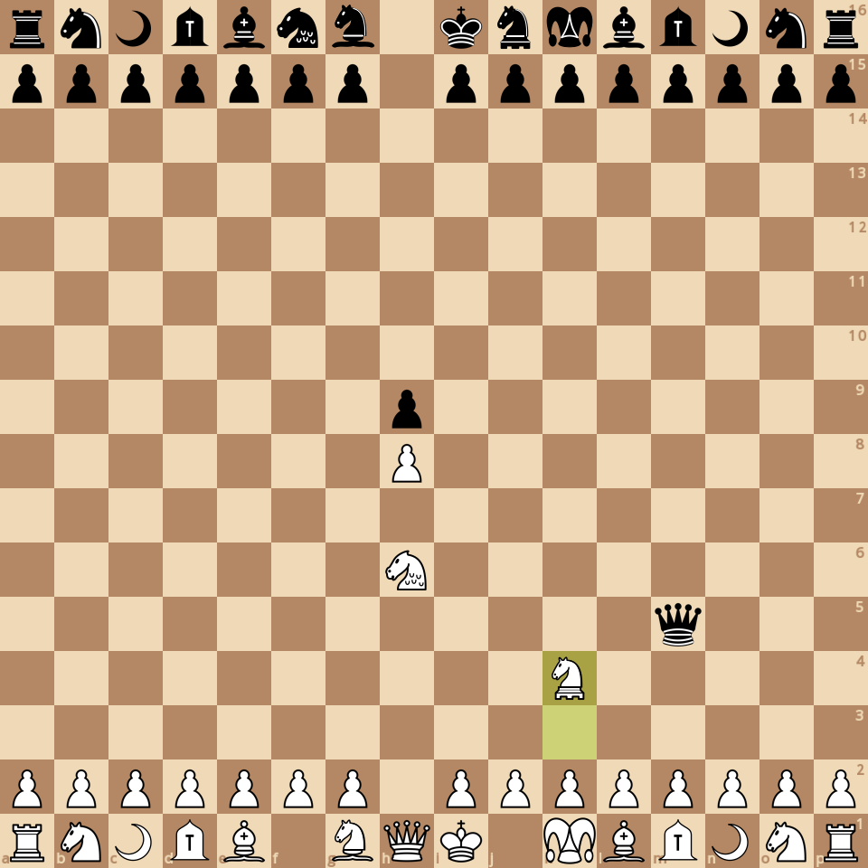
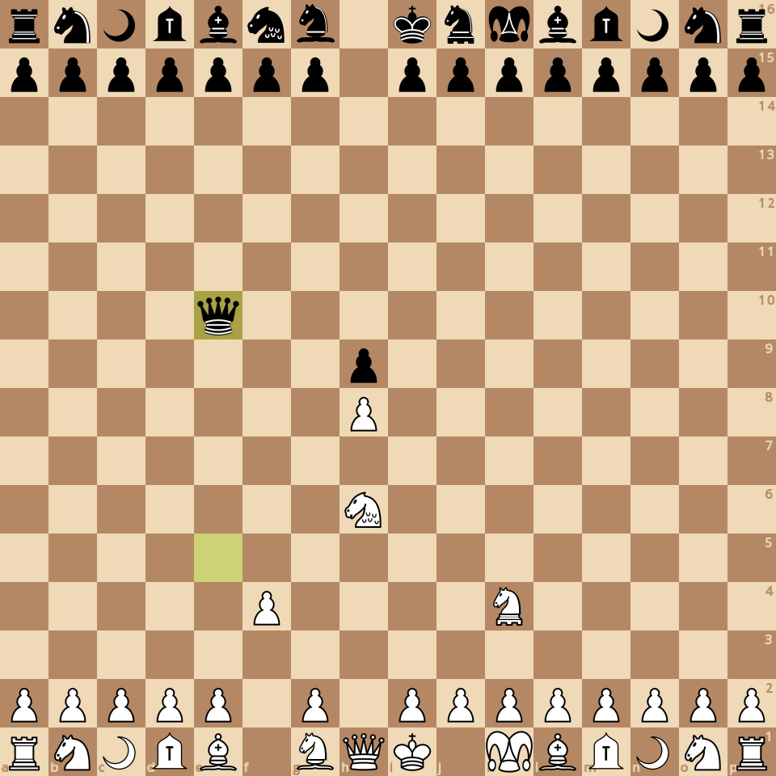
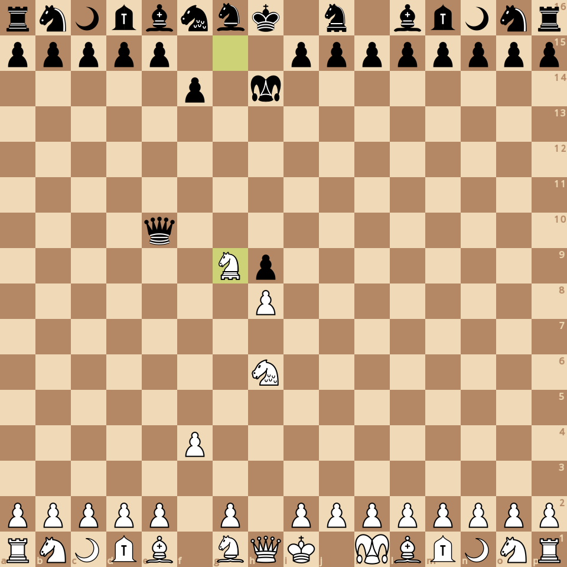

### board0000.png

Current board:\

### board0001.png

Found a new move 0\
Analyzed boards: 133076\
Average speed for the move: 49899.9 boards/s\
Time taken for the move: 2.66686s\
Total time taken: 2.66686s\
Current white score: 28972, black score: 28832\
Current board after move:\

### board0002.png

Found a new move 1\
Analyzed boards: 356537\
Average speed for the move: 48949.9 boards/s\
Time taken for the move: 4.56509s\
Total time taken: 7.23195s\
Current white score: 28962, black score: 28962\
Current board after move:\

### board0003.png

Found a new move 2\
Analyzed boards: 504864\
Average speed for the move: 49150.7 boards/s\
Time taken for the move: 3.0178s\
Total time taken: 10.2498s\
Current white score: 29192, black score: 28962\
Current board after move:\

### board0004.png

Found a new move 3\
Analyzed boards: 1109276\
Average speed for the move: 47181.2 boards/s\
Time taken for the move: 12.8105s\
Total time taken: 23.0602s\
Current white score: 29192, black score: 29352\
Current board after move:\

### board0005.png

Found a new move 4\
Analyzed boards: 1883018\
Average speed for the move: 45682.8 boards/s\
Time taken for the move: 16.9373s\
Total time taken: 39.9975s\
Current white score: 29322, black score: 29352\
Current board after move:\

### board0006.png

Found a new move 5\
Analyzed boards: 3505601\
Average speed for the move: 45737.5 boards/s\
Time taken for the move: 35.476s\
Total time taken: 75.4735s\
Current white score: 29282, black score: 29352\
Current board after move:\

### board0007.png

Found a new move 6\
Analyzed boards: 4216832\
Average speed for the move: 44954.6 boards/s\
Time taken for the move: 15.8211s\
Total time taken: 91.2946s\
Current white score: 29322, black score: 29362\
Current board after move:\

### board0008.png

Found a new move 7\
Analyzed boards: 5546419\
Average speed for the move: 44760.2 boards/s\
Time taken for the move: 29.7047s\
Total time taken: 120.999s\
Current white score: 29322, black score: 29322\
Current board after move:\

### board0009.png

Found a new move 8\
Analyzed boards: 5653700\
Average speed for the move: 44565 boards/s\
Time taken for the move: 2.40729s\
Total time taken: 123.407s\
Current white score: 29392, black score: 29292\
Current board after move:\

### board0010.png

Found a new move 9\
Analyzed boards: 6612964\
Average speed for the move: 44745.3 boards/s\
Time taken for the move: 21.4383s\
Total time taken: 144.845s\
Current white score: 29422, black score: 29342\
Current board after move:\

### board0011.png

Found a new move 10\
Analyzed boards: 7277921\
Average speed for the move: 43477.5 boards/s\
Time taken for the move: 15.2943s\
Total time taken: 160.139s\
Current white score: 29552, black score: 29312\
Current board after move:\

### board0012.png

Found a new move 11\
Analyzed boards: 9486641\
Average speed for the move: 44215.6 boards/s\
Time taken for the move: 49.9535s\
Total time taken: 210.093s\
Current white score: 29552, black score: 29352\
Current board after move:\

### board0013.png

Found a new move 12\
Analyzed boards: 10165864\
Average speed for the move: 43431.5 boards/s\
Time taken for the move: 15.639s\
Total time taken: 225.732s\
Current white score: 29552, black score: 29352\
Current board after move:\

### board0014.png

Found a new move 13\
Analyzed boards: 11053759\
Average speed for the move: 43770.9 boards/s\
Time taken for the move: 20.285s\
Total time taken: 246.017s\
Current white score: 29552, black score: 29472\
Current board after move:\

### board0015.png

Found a new move 14\
Analyzed boards: 11267963\
Average speed for the move: 43042.8 boards/s\
Time taken for the move: 4.97653s\
Total time taken: 250.993s\
Current white score: 29432, black score: 29425\
Current board after move:\

### board0016.png

Found a new move 15\
Analyzed boards: 11318141\
Average speed for the move: 43478.8 boards/s\
Time taken for the move: 1.15408s\
Total time taken: 252.147s\
Current white score: 29432, black score: 29455\
Current board after move:\

### board0017.png

Found a new move 16\
Analyzed boards: 11451089\
Average speed for the move: 43952.1 boards/s\
Time taken for the move: 3.02484s\
Total time taken: 255.172s\
Current white score: 29482, black score: 29455\
Current board after move:\

### board0018.png

Found a new move 17\
Analyzed boards: 12569051\
Average speed for the move: 44099.6 boards/s\
Time taken for the move: 25.3508s\
Total time taken: 280.523s\
Current white score: 29452, black score: 29435\
Current board after move:\

### board0019.png

Found a new move 18\
Analyzed boards: 14660995\
Average speed for the move: 43426.9 boards/s\
Time taken for the move: 48.1717s\
Total time taken: 328.695s\
Current white score: 29502, black score: 29505\
Current board after move:\

### board0020.png

Found a new move 19\
Analyzed boards: 15214024\
Average speed for the move: 44037.3 boards/s\
Time taken for the move: 12.5582s\
Total time taken: 341.253s\
Current white score: 29502, black score: 29425\
Current board after move:\

### board0021.png

Found a new move 20\
Analyzed boards: 18439575\
Average speed for the move: 43345.4 boards/s\
Time taken for the move: 74.4151s\
Total time taken: 415.668s\
Current white score: 29542, black score: 29425\
Current board after move:\

### board0022.png

Found a new move 21\
Analyzed boards: 19816480\
Average speed for the move: 43642.8 boards/s\
Time taken for the move: 31.5494s\
Total time taken: 447.217s\
Current white score: 29552, black score: 29335\
Current board after move:\

### board0023.png

Found a new move 22\
Analyzed boards: 21176694\
Average speed for the move: 42701.1 boards/s\
Time taken for the move: 31.8543s\
Total time taken: 479.072s\
Current white score: 29622, black score: 29355\
Current board after move:\

### board0024.png

Found a new move 23\
Analyzed boards: 21558137\
Average speed for the move: 43996.9 boards/s\
Time taken for the move: 8.66976s\
Total time taken: 487.741s\
Current white score: 29605, black score: 29395\
Current board after move:\

### board0025.png

Found a new move 24\
Analyzed boards: 22046313\
Average speed for the move: 43033.9 boards/s\
Time taken for the move: 11.344s\
Total time taken: 499.085s\
Current white score: 29575, black score: 29375\
Current board after move:\

### board0026.png

Found a new move 25\
Analyzed boards: 24015048\
Average speed for the move: 43816.9 boards/s\
Time taken for the move: 44.931s\
Total time taken: 544.016s\
Current white score: 29575, black score: 29335\
Current board after move:\

### board0027.png

Found a new move 26\
Analyzed boards: 25860338\
Average speed for the move: 43328.8 boards/s\
Time taken for the move: 42.588s\
Total time taken: 586.604s\
Current white score: 29585, black score: 29385\
Current board after move:\

### board0028.png

Found a new move 27\
Analyzed boards: 27572198\
Average speed for the move: 43292.2 boards/s\
Time taken for the move: 39.542s\
Total time taken: 626.146s\
Current white score: 29585, black score: 29315\
Current board after move:\

### board0029.png

Found a new move 28\
Analyzed boards: 29432616\
Average speed for the move: 43245.6 boards/s\
Time taken for the move: 43.0198s\
Total time taken: 669.166s\
Current white score: 29605, black score: 29285\
Current board after move:\

### board0030.png

Found a new move 29\
Analyzed boards: 31248072\
Average speed for the move: 42635.8 boards/s\
Time taken for the move: 42.5806s\
Total time taken: 711.747s\
Current white score: 29625, black score: 29355\
Current board after move:\

### board0031.png

Found a new move 30\
Analyzed boards: 34986215\
Average speed for the move: 41442.8 boards/s\
Time taken for the move: 90.2s\
Total time taken: 801.947s\
Current white score: 29655, black score: 29335\
Current board after move:\

### board0032.png

Found a new move 31\
Analyzed boards: 36981523\
Average speed for the move: 42960.1 boards/s\
Time taken for the move: 46.4456s\
Total time taken: 848.392s\
Current white score: 29645, black score: 29335\
Current board after move:\

### board0033.png

Found a new move 32\
Analyzed boards: 41153315\
Average speed for the move: 42635.4 boards/s\
Time taken for the move: 97.848s\
Total time taken: 946.24s\
Current white score: 29655, black score: 29335\
Current board after move:\

### board0034.png

Found a new move 33\
Analyzed boards: 43532482\
Average speed for the move: 43358.1 boards/s\
Time taken for the move: 54.8724s\
Total time taken: 1001.11s\
Current white score: 29675, black score: 29295\
Current board after move:\

### board0035.png

Found a new move 34\
Analyzed boards: 44677299\
Average speed for the move: 42967.8 boards/s\
Time taken for the move: 26.6436s\
Total time taken: 1027.76s\
Current white score: 29725, black score: 29285\
Current board after move:\

### board0036.png

Found a new move 35\
Analyzed boards: 46372910\
Average speed for the move: 42838.8 boards/s\
Time taken for the move: 39.5812s\
Total time taken: 1067.34s\
Current white score: 29725, black score: 29225\
Current board after move:\

### board0037.png

Found a new move 36\
Analyzed boards: 46772608\
Average speed for the move: 42955.2 boards/s\
Time taken for the move: 9.305s\
Total time taken: 1076.64s\
Current white score: 29835, black score: 29215\
Current board after move:\

### board0038.png

Found a new move 37\
Analyzed boards: 47687002\
Average speed for the move: 40960.5 boards/s\
Time taken for the move: 22.3238s\
Total time taken: 1098.97s\
Current white score: 29835, black score: 29305\
Current board after move:\

### board0039.png

Found a new move 38\
Analyzed boards: 54037153\
Average speed for the move: 40039.3 boards/s\
Time taken for the move: 158.598s\
Total time taken: 1257.56s\
Current white score: 30045, black score: 29305\
Current board after move:\

### board0040.png

Found a new move 39\
Analyzed boards: 57522304\
Average speed for the move: 40306.6 boards/s\
Time taken for the move: 86.4661s\
Total time taken: 1344.03s\
Current white score: 30045, black score: 29405\
Current board after move:\

### board0041.png

Found a new move 40\
Analyzed boards: 58187863\
Average speed for the move: 40959.9 boards/s\
Time taken for the move: 16.249s\
Total time taken: 1360.28s\
Current white score: 30055, black score: 29385\
Current board after move:\

### board0042.png

Found a new move 41\
Analyzed boards: 59225230\
Average speed for the move: 40399.1 boards/s\
Time taken for the move: 25.678s\
Total time taken: 1385.96s\
Current white score: 30025, black score: 29395\
Current board after move:\

### board0043.png

Found a new move 42\
Analyzed boards: 60530614\
Average speed for the move: 39792.8 boards/s\
Time taken for the move: 32.8046s\
Total time taken: 1418.76s\
Current white score: 30075, black score: 29395\
Current board after move:\

### board0044.png

Found a new move 43\
Analyzed boards: 60980498\
Average speed for the move: 39892.8 boards/s\
Time taken for the move: 11.2773s\
Total time taken: 1430.04s\
Current white score: 30075, black score: 29435\
Current board after move:\

### board0045.png

Found a new move 44\
Analyzed boards: 62143287\
Average speed for the move: 39280.6 boards/s\
Time taken for the move: 29.6021s\
Total time taken: 1459.64s\
Current white score: 30135, black score: 29425\
Current board after move:\

### board0046.png

Found a new move 45\
Analyzed boards: 64674950\
Average speed for the move: 39695.8 boards/s\
Time taken for the move: 63.7766s\
Total time taken: 1523.42s\
Current white score: 30135, black score: 29505\
Current board after move:\

### board0047.png

Found a new move 46\
Analyzed boards: 69574587\
Average speed for the move: 38731.3 boards/s\
Time taken for the move: 126.503s\
Total time taken: 1649.92s\
Current white score: 30045, black score: 29465\
Current board after move:\

### board0048.png

Found a new move 47\
Analyzed boards: 70571447\
Average speed for the move: 39215.8 boards/s\
Time taken for the move: 25.4199s\
Total time taken: 1675.34s\
Current white score: 30045, black score: 29475\
Current board after move:\

### board0049.png

Found a new move 48\
Analyzed boards: 72486806\
Average speed for the move: 40698 boards/s\
Time taken for the move: 47.0628s\
Total time taken: 1722.4s\
Current white score: 29965, black score: 29205\
Current board after move:\

### board0050.png

Found a new move 49\
Analyzed boards: 74188934\
Average speed for the move: 42656 boards/s\
Time taken for the move: 39.9036s\
Total time taken: 1762.31s\
Current white score: 29965, black score: 29315\
Current board after move:\

### board0051.png

Found a new move 50\
Analyzed boards: 76134066\
Average speed for the move: 42275.6 boards/s\
Time taken for the move: 46.0107s\
Total time taken: 1808.32s\
Current white score: 30055, black score: 28685\
Current board after move:\

### board0052.png

Found a new move 51\
Analyzed boards: 77072702\
Average speed for the move: 44222.2 boards/s\
Time taken for the move: 21.2254s\
Total time taken: 1829.54s\
Current white score: 29325, black score: 28655\
Current board after move:\

### board0053.png

Found a new move 52\
Analyzed boards: 77808489\
Average speed for the move: 45937 boards/s\
Time taken for the move: 16.0173s\
Total time taken: 1845.56s\
Current white score: 29255, black score: 28605\
Current board after move:\

### board0054.png

Found a new move 53\
Analyzed boards: 78419727\
Average speed for the move: 46723.6 boards/s\
Time taken for the move: 13.082s\
Total time taken: 1858.64s\
Current white score: 29228, black score: 28575\
Current board after move:\

### board0055.png

Found a new move 54\
Analyzed boards: 78539611\
Average speed for the move: 49195.6 boards/s\
Time taken for the move: 2.43689s\
Total time taken: 1861.08s\
Current white score: 29258, black score: 28575\
Current board after move:\

### board0056.png

Found a new move 55\
Analyzed boards: 78666762\
Average speed for the move: 48845.3 boards/s\
Time taken for the move: 2.60313s\
Total time taken: 1863.68s\
Current white score: 27958, black score: 28615\
Current board after move:\

### board0057.png

Found a new move 56\
Analyzed boards: 78858757\
Average speed for the move: 51733.4 boards/s\
Time taken for the move: 3.71124s\
Total time taken: 1867.39s\
Current white score: 27928, black score: 28655\
Current board after move:\

### board0058.png

Found a new move 57\
Analyzed boards: 79373985\
Average speed for the move: 50505.1 boards/s\
Time taken for the move: 10.2015s\
Total time taken: 1877.6s\
Current white score: 27968, black score: 28675\
Current board after move:\

### board0059.png

Found a new move 58\
Analyzed boards: 79699109\
Average speed for the move: 52087.1 boards/s\
Time taken for the move: 6.24193s\
Total time taken: 1883.84s\
Current white score: 27928, black score: 28685\
Current board after move:\

### board0060.png

Found a new move 59\
Analyzed boards: 80215078\
Average speed for the move: 51635.4 boards/s\
Time taken for the move: 9.99254s\
Total time taken: 1893.83s\
Current white score: 27488, black score: 28695\
Current board after move:\

### board0061.png

Found a new move 60\
Analyzed boards: 83482719\
Average speed for the move: 51966.1 boards/s\
Time taken for the move: 62.8802s\
Total time taken: 1956.71s\
Current white score: 27468, black score: 28595\
Current board after move:\

### board0062.png

Found a new move 61\
Analyzed boards: 84055631\
Average speed for the move: 46402.1 boards/s\
Time taken for the move: 12.3467s\
Total time taken: 1969.06s\
Current white score: 27468, black score: 28475\
Current board after move:\
Game ended, it's a checkmate!\

