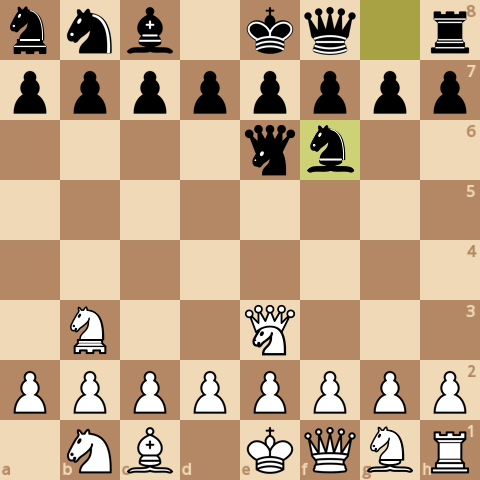
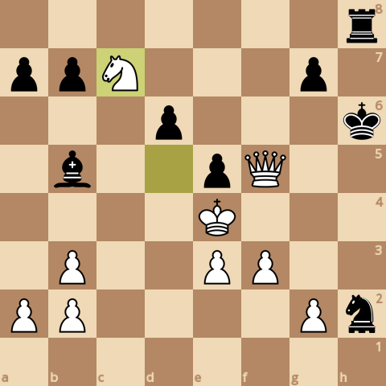
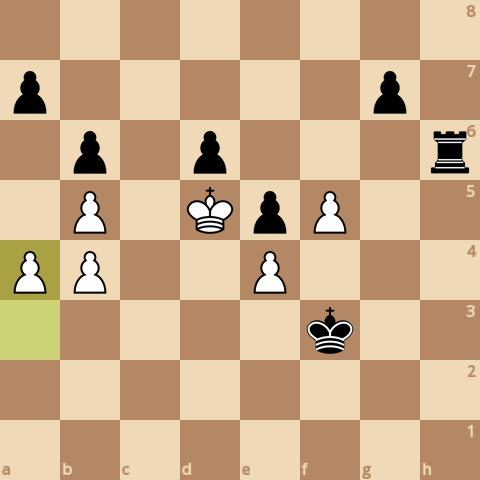

### board0000.png

Current board:\

### board0001.png

Found a new move 0\
Analyzed boards: 153204\
Average speed for the move: 156871 boards/s\
Time taken for the move: 0.976626s\
Total time taken: 0.976626s\
Current white score: 26330, black score: 26130\
Current board after move:\

### board0002.png

Found a new move 1\
Analyzed boards: 276650\
Average speed for the move: 158462 boards/s\
Time taken for the move: 0.779028s\
Total time taken: 1.75565s\
Current white score: 26320, black score: 26320\
Current board after move:\

### board0003.png

Found a new move 2\
Analyzed boards: 391463\
Average speed for the move: 150951 boards/s\
Time taken for the move: 0.760596s\
Total time taken: 2.51625s\
Current white score: 26380, black score: 26310\
Current board after move:\

### board0004.png

Found a new move 3\
Analyzed boards: 759198\
Average speed for the move: 145152 boards/s\
Time taken for the move: 2.53344s\
Total time taken: 5.04969s\
Current white score: 26380, black score: 26370\
Current board after move:\

### board0005.png

Found a new move 4\
Analyzed boards: 1184605\
Average speed for the move: 145926 boards/s\
Time taken for the move: 2.91522s\
Total time taken: 7.96491s\
Current white score: 26440, black score: 26370\
Current board after move:\

### board0006.png

Found a new move 5\
Analyzed boards: 1721281\
Average speed for the move: 145601 boards/s\
Time taken for the move: 3.68592s\
Total time taken: 11.6508s\
Current white score: 26440, black score: 26370\
Current board after move:\

### board0007.png

Found a new move 6\
Analyzed boards: 2420489\
Average speed for the move: 146016 boards/s\
Time taken for the move: 4.78857s\
Total time taken: 16.4394s\
Current white score: 26460, black score: 26370\
Current board after move:\

### board0008.png

Found a new move 7\
Analyzed boards: 3170354\
Average speed for the move: 141175 boards/s\
Time taken for the move: 5.31161s\
Total time taken: 21.751s\
Current white score: 26450, black score: 26390\
Current board after move:\

### board0009.png

Found a new move 8\
Analyzed boards: 3879686\
Average speed for the move: 144771 boards/s\
Time taken for the move: 4.89968s\
Total time taken: 26.6507s\
Current white score: 26570, black score: 24960\
Current board after move:\

### board0010.png

Found a new move 9\
Analyzed boards: 3992386\
Average speed for the move: 159483 boards/s\
Time taken for the move: 0.706658s\
Total time taken: 27.3574s\
Current white score: 25050, black score: 24970\
Current board after move:\

### board0011.png

Found a new move 10\
Analyzed boards: 5499303\
Average speed for the move: 158914 boards/s\
Time taken for the move: 9.48257s\
Total time taken: 36.8399s\
Current white score: 25070, black score: 24950\
Current board after move:\

### board0012.png

Found a new move 11\
Analyzed boards: 6035797\
Average speed for the move: 170223 boards/s\
Time taken for the move: 3.15172s\
Total time taken: 39.9916s\
Current white score: 25070, black score: 24970\
Current board after move:\

### board0013.png

Found a new move 12\
Analyzed boards: 6656698\
Average speed for the move: 167932 boards/s\
Time taken for the move: 3.69733s\
Total time taken: 43.689s\
Current white score: 25090, black score: 24970\
Current board after move:\

### board0014.png

Found a new move 13\
Analyzed boards: 7002779\
Average speed for the move: 166525 boards/s\
Time taken for the move: 2.07825s\
Total time taken: 45.7672s\
Current white score: 24120, black score: 25080\
Current board after move:\

### board0015.png

Found a new move 14\
Analyzed boards: 7119730\
Average speed for the move: 173851 boards/s\
Time taken for the move: 0.672707s\
Total time taken: 46.4399s\
Current white score: 24110, black score: 24040\
Current board after move:\

### board0016.png

Found a new move 15\
Analyzed boards: 8203733\
Average speed for the move: 177304 boards/s\
Time taken for the move: 6.1138s\
Total time taken: 52.5537s\
Current white score: 24100, black score: 24070\
Current board after move:\

### board0017.png

Found a new move 16\
Analyzed boards: 8317699\
Average speed for the move: 178970 boards/s\
Time taken for the move: 0.636788s\
Total time taken: 53.1905s\
Current white score: 24130, black score: 24070\
Current board after move:\

### board0018.png

Found a new move 17\
Analyzed boards: 8511788\
Average speed for the move: 173186 boards/s\
Time taken for the move: 1.1207s\
Total time taken: 54.3112s\
Current white score: 23160, black score: 24100\
Current board after move:\

### board0019.png

Found a new move 18\
Analyzed boards: 8557162\
Average speed for the move: 176406 boards/s\
Time taken for the move: 0.257213s\
Total time taken: 54.5684s\
Current white score: 23160, black score: 23100\
Current board after move:\

### board0020.png

Found a new move 19\
Analyzed boards: 8837577\
Average speed for the move: 174143 boards/s\
Time taken for the move: 1.61026s\
Total time taken: 56.1787s\
Current white score: 23160, black score: 23110\
Current board after move:\

### board0021.png

Found a new move 20\
Analyzed boards: 9077349\
Average speed for the move: 186583 boards/s\
Time taken for the move: 1.28507s\
Total time taken: 57.4638s\
Current white score: 23150, black score: 23110\
Current board after move:\

### board0022.png

Found a new move 21\
Analyzed boards: 9278798\
Average speed for the move: 183549 boards/s\
Time taken for the move: 1.09752s\
Total time taken: 58.5613s\
Current white score: 23150, black score: 23180\
Current board after move:\

### board0023.png

Found a new move 22\
Analyzed boards: 9827899\
Average speed for the move: 174835 boards/s\
Time taken for the move: 3.14069s\
Total time taken: 61.702s\
Current white score: 23160, black score: 23140\
Current board after move:\

### board0024.png

Found a new move 23\
Analyzed boards: 10275431\
Average speed for the move: 180024 boards/s\
Time taken for the move: 2.48595s\
Total time taken: 64.1879s\
Current white score: 23060, black score: 23180\
Current board after move:\

### board0025.png

Found a new move 24\
Analyzed boards: 10629745\
Average speed for the move: 171474 boards/s\
Time taken for the move: 2.06629s\
Total time taken: 66.2542s\
Current white score: 23100, black score: 23180\
Current board after move:\

### board0026.png

Found a new move 25\
Analyzed boards: 10808145\
Average speed for the move: 169064 boards/s\
Time taken for the move: 1.05522s\
Total time taken: 67.3094s\
Current white score: 23100, black score: 23240\
Current board after move:\

### board0027.png

Found a new move 26\
Analyzed boards: 11887385\
Average speed for the move: 175278 boards/s\
Time taken for the move: 6.15732s\
Total time taken: 73.4668s\
Current white score: 23180, black score: 23220\
Current board after move:\

### board0028.png

Found a new move 27\
Analyzed boards: 12101426\
Average speed for the move: 159432 boards/s\
Time taken for the move: 1.34252s\
Total time taken: 74.8093s\
Current white score: 23180, black score: 23240\
Current board after move:\

### board0029.png

Found a new move 28\
Analyzed boards: 13620568\
Average speed for the move: 165362 boards/s\
Time taken for the move: 9.18677s\
Total time taken: 83.996s\
Current white score: 23180, black score: 23140\
Current board after move:\

### board0030.png

Found a new move 29\
Analyzed boards: 14356825\
Average speed for the move: 178694 boards/s\
Time taken for the move: 4.1202s\
Total time taken: 88.1162s\
Current white score: 23140, black score: 23100\
Current board after move:\

### board0031.png

Found a new move 30\
Analyzed boards: 15096301\
Average speed for the move: 195573 boards/s\
Time taken for the move: 3.78107s\
Total time taken: 91.8973s\
Current white score: 23170, black score: 23090\
Current board after move:\

### board0032.png

Found a new move 31\
Analyzed boards: 15967613\
Average speed for the move: 168193 boards/s\
Time taken for the move: 5.18044s\
Total time taken: 97.0778s\
Current white score: 22860, black score: 23180\
Current board after move:\

### board0033.png

Found a new move 32\
Analyzed boards: 16664398\
Average speed for the move: 183341 boards/s\
Time taken for the move: 3.80048s\
Total time taken: 100.878s\
Current white score: 22850, black score: 22800\
Current board after move:\

### board0034.png

Found a new move 33\
Analyzed boards: 16946899\
Average speed for the move: 181040 boards/s\
Time taken for the move: 1.56044s\
Total time taken: 102.439s\
Current white score: 22810, black score: 22850\
Current board after move:\

### board0035.png

Found a new move 34\
Analyzed boards: 17260136\
Average speed for the move: 150548 boards/s\
Time taken for the move: 2.08064s\
Total time taken: 104.519s\
Current white score: 22790, black score: 22870\
Current board after move:\

### board0036.png

Found a new move 35\
Analyzed boards: 17912771\
Average speed for the move: 177597 boards/s\
Time taken for the move: 3.67481s\
Total time taken: 108.194s\
Current white score: 22800, black score: 22790\
Current board after move:\

### board0037.png

Found a new move 36\
Analyzed boards: 17921620\
Average speed for the move: 179253 boards/s\
Time taken for the move: 0.049366s\
Total time taken: 108.243s\
Current white score: 22740, black score: 22820\
Current board after move:\

### board0038.png

Found a new move 37\
Analyzed boards: 18051040\
Average speed for the move: 181809 boards/s\
Time taken for the move: 0.711847s\
Total time taken: 108.955s\
Current white score: 22740, black score: 22840\
Current board after move:\

### board0039.png

Found a new move 38\
Analyzed boards: 18078411\
Average speed for the move: 177697 boards/s\
Time taken for the move: 0.154032s\
Total time taken: 109.109s\
Current white score: 22740, black score: 22840\
Current board after move:\

### board0040.png

Found a new move 39\
Analyzed boards: 18158188\
Average speed for the move: 181998 boards/s\
Time taken for the move: 0.438341s\
Total time taken: 109.548s\
Current white score: 22220, black score: 22770\
Current board after move:\

### board0041.png

Found a new move 40\
Analyzed boards: 18192507\
Average speed for the move: 185212 boards/s\
Time taken for the move: 0.185296s\
Total time taken: 109.733s\
Current white score: 22230, black score: 22810\
Current board after move:\

### board0042.png

Found a new move 41\
Analyzed boards: 18554807\
Average speed for the move: 190513 boards/s\
Time taken for the move: 1.90171s\
Total time taken: 111.635s\
Current white score: 22110, black score: 22820\
Current board after move:\

### board0043.png

Found a new move 42\
Analyzed boards: 18810823\
Average speed for the move: 179793 boards/s\
Time taken for the move: 1.42395s\
Total time taken: 113.059s\
Current white score: 22100, black score: 22820\
Current board after move:\

### board0044.png

Found a new move 43\
Analyzed boards: 19248310\
Average speed for the move: 188740 boards/s\
Time taken for the move: 2.31793s\
Total time taken: 115.377s\
Current white score: 22110, black score: 22830\
Current board after move:\

### board0045.png

Found a new move 44\
Analyzed boards: 19520722\
Average speed for the move: 193182 boards/s\
Time taken for the move: 1.41013s\
Total time taken: 116.787s\
Current white score: 22120, black score: 22830\
Current board after move:\

### board0046.png

Found a new move 45\
Analyzed boards: 20049724\
Average speed for the move: 184071 boards/s\
Time taken for the move: 2.8739s\
Total time taken: 119.661s\
Current white score: 22120, black score: 22820\
Current board after move:\

### board0047.png

Found a new move 46\
Analyzed boards: 20385921\
Average speed for the move: 194276 boards/s\
Time taken for the move: 1.73051s\
Total time taken: 121.391s\
Current white score: 22130, black score: 22810\
Current board after move:\

### board0048.png

Found a new move 47\
Analyzed boards: 20803719\
Average speed for the move: 198370 boards/s\
Time taken for the move: 2.10616s\
Total time taken: 123.497s\
Current white score: 22130, black score: 22780\
Current board after move:\

### board0049.png

Found a new move 48\
Analyzed boards: 20885830\
Average speed for the move: 204733 boards/s\
Time taken for the move: 0.401063s\
Total time taken: 123.898s\
Current white score: 22100, black score: 22790\
Current board after move:\

### board0050.png

Found a new move 49\
Analyzed boards: 21248095\
Average speed for the move: 213786 boards/s\
Time taken for the move: 1.69452s\
Total time taken: 125.593s\
Current white score: 22100, black score: 22840\
Current board after move:\

### board0051.png

Found a new move 50\
Analyzed boards: 21392677\
Average speed for the move: 192487 boards/s\
Time taken for the move: 0.751125s\
Total time taken: 126.344s\
Current white score: 22090, black score: 22750\
Current board after move:\

### board0052.png

Found a new move 51\
Analyzed boards: 21441950\
Average speed for the move: 199177 boards/s\
Time taken for the move: 0.247383s\
Total time taken: 126.591s\
Current white score: 22100, black score: 22730\
Current board after move:\

### board0053.png

Found a new move 52\
Analyzed boards: 21576752\
Average speed for the move: 181744 boards/s\
Time taken for the move: 0.741714s\
Total time taken: 127.333s\
Current white score: 22110, black score: 22730\
Current board after move:\

### board0054.png

Found a new move 53\
Analyzed boards: 21638535\
Average speed for the move: 199701 boards/s\
Time taken for the move: 0.309378s\
Total time taken: 127.642s\
Current white score: 22120, black score: 22750\
Current board after move:\

### board0055.png

Found a new move 54\
Analyzed boards: 21748709\
Average speed for the move: 200421 boards/s\
Time taken for the move: 0.549713s\
Total time taken: 128.192s\
Current white score: 22100, black score: 22750\
Current board after move:\

### board0056.png

Found a new move 55\
Analyzed boards: 21777953\
Average speed for the move: 215872 boards/s\
Time taken for the move: 0.135469s\
Total time taken: 128.328s\
Current white score: 22110, black score: 22660\
Current board after move:\

### board0057.png

Found a new move 56\
Analyzed boards: 21873868\
Average speed for the move: 214273 boards/s\
Time taken for the move: 0.447629s\
Total time taken: 128.775s\
Current white score: 22110, black score: 22550\
Current board after move:\

### board0058.png

Found a new move 57\
Analyzed boards: 22058002\
Average speed for the move: 217916 boards/s\
Time taken for the move: 0.844976s\
Total time taken: 129.62s\
Current white score: 22110, black score: 22580\
Current board after move:\

### board0059.png

Found a new move 58\
Analyzed boards: 22080090\
Average speed for the move: 202049 boards/s\
Time taken for the move: 0.10932s\
Total time taken: 129.73s\
Current white score: 22080, black score: 22560\
Current board after move:\

### board0060.png

Found a new move 59\
Analyzed boards: 22206986\
Average speed for the move: 205486 boards/s\
Time taken for the move: 0.61754s\
Total time taken: 130.347s\
Current white score: 22080, black score: 22540\
Current board after move:\

### board0061.png

Found a new move 60\
Analyzed boards: 22237461\
Average speed for the move: 212009 boards/s\
Time taken for the move: 0.143744s\
Total time taken: 130.491s\
Current white score: 22080, black score: 22520\
Current board after move:\

### board0062.png

Found a new move 61\
Analyzed boards: 22459151\
Average speed for the move: 222806 boards/s\
Time taken for the move: 0.994989s\
Total time taken: 131.486s\
Current white score: 21720, black score: 22540\
Current board after move:\

### board0063.png

Found a new move 62\
Analyzed boards: 22462673\
Average speed for the move: 231787 boards/s\
Time taken for the move: 0.015195s\
Total time taken: 131.501s\
Current white score: 21800, black score: 22180\
Current board after move:\

### board0064.png

Found a new move 63\
Analyzed boards: 22507332\
Average speed for the move: 264558 boards/s\
Time taken for the move: 0.168806s\
Total time taken: 131.67s\
Current white score: 20750, black score: 22210\
Current board after move:\

### board0065.png

Found a new move 64\
Analyzed boards: 22509248\
Average speed for the move: 241188 boards/s\
Time taken for the move: 0.007944s\
Total time taken: 131.678s\
Current white score: 20740, black score: 21190\
Current board after move:\

### board0066.png

Found a new move 65\
Analyzed boards: 22521169\
Average speed for the move: 306768 boards/s\
Time taken for the move: 0.03886s\
Total time taken: 131.717s\
Current white score: 20740, black score: 21280\
Current board after move:\

### board0067.png

Found a new move 66\
Analyzed boards: 22526155\
Average speed for the move: 263044 boards/s\
Time taken for the move: 0.018955s\
Total time taken: 131.736s\
Current white score: 20720, black score: 21270\
Current board after move:\

### board0068.png

Found a new move 67\
Analyzed boards: 22540369\
Average speed for the move: 286065 boards/s\
Time taken for the move: 0.049688s\
Total time taken: 131.785s\
Current white score: 20720, black score: 21220\
Current board after move:\

### board0069.png

Found a new move 68\
Analyzed boards: 22546138\
Average speed for the move: 274544 boards/s\
Time taken for the move: 0.021013s\
Total time taken: 131.806s\
Current white score: 20730, black score: 21220\
Current board after move:\

### board0070.png

Found a new move 69\
Analyzed boards: 22559718\
Average speed for the move: 282340 boards/s\
Time taken for the move: 0.048098s\
Total time taken: 131.854s\
Current white score: 20720, black score: 21230\
Current board after move:\

### board0071.png

Found a new move 70\
Analyzed boards: 22564091\
Average speed for the move: 271970 boards/s\
Time taken for the move: 0.016079s\
Total time taken: 131.87s\
Current white score: 20730, black score: 21220\
Current board after move:\

### board0072.png

Found a new move 71\
Analyzed boards: 22576586\
Average speed for the move: 267021 boards/s\
Time taken for the move: 0.046794s\
Total time taken: 131.917s\
Current white score: 20630, black score: 21230\
Current board after move:\

### board0073.png

Found a new move 72\
Analyzed boards: 22582196\
Average speed for the move: 160382 boards/s\
Time taken for the move: 0.034979s\
Total time taken: 131.952s\
Current white score: 20620, black score: 21230\
Current board after move:\

### board0074.png

Found a new move 73\
Analyzed boards: 22601056\
Average speed for the move: 282619 boards/s\
Time taken for the move: 0.066733s\
Total time taken: 132.019s\
Current white score: 20610, black score: 21220\
Current board after move:\

### board0075.png

Found a new move 74\
Analyzed boards: 22605089\
Average speed for the move: 272721 boards/s\
Time taken for the move: 0.014788s\
Total time taken: 132.034s\
Current white score: 20600, black score: 21220\
Current board after move:\

### board0076.png

Found a new move 75\
Analyzed boards: 22619189\
Average speed for the move: 285842 boards/s\
Time taken for the move: 0.049328s\
Total time taken: 132.083s\
Current white score: 20600, black score: 21210\
Current board after move:\

### board0077.png

Found a new move 76\
Analyzed boards: 22621826\
Average speed for the move: 244552 boards/s\
Time taken for the move: 0.010783s\
Total time taken: 132.094s\
Current white score: 20590, black score: 21210\
Current board after move:\

### board0078.png

Found a new move 77\
Analyzed boards: 22632237\
Average speed for the move: 300566 boards/s\
Time taken for the move: 0.034638s\
Total time taken: 132.129s\
Current white score: 20590, black score: 21220\
Current board after move:\

### board0079.png

Found a new move 78\
Analyzed boards: 22633825\
Average speed for the move: 239481 boards/s\
Time taken for the move: 0.006631s\
Total time taken: 132.135s\
Current white score: 20590, black score: 21220\
Current board after move:\

### board0080.png

Found a new move 79\
Analyzed boards: 22651187\
Average speed for the move: 321548 boards/s\
Time taken for the move: 0.053995s\
Total time taken: 132.189s\
Current white score: 20590, black score: 21220\
Current board after move:\

### board0081.png

Found a new move 80\
Analyzed boards: 22652409\
Average speed for the move: 245185 boards/s\
Time taken for the move: 0.004984s\
Total time taken: 132.194s\
Current white score: 20600, black score: 21220\
Current board after move:\

### board0082.png

Found a new move 81\
Analyzed boards: 22675986\
Average speed for the move: 322244 boards/s\
Time taken for the move: 0.073165s\
Total time taken: 132.267s\
Current white score: 20600, black score: 21260\
Current board after move:\

### board0083.png

Found a new move 82\
Analyzed boards: 22683445\
Average speed for the move: 302621 boards/s\
Time taken for the move: 0.024648s\
Total time taken: 132.292s\
Current white score: 20610, black score: 21160\
Current board after move:\

### board0084.png

Found a new move 83\
Analyzed boards: 22715739\
Average speed for the move: 321468 boards/s\
Time taken for the move: 0.100458s\
Total time taken: 132.392s\
Current white score: 20510, black score: 21150\
Current board after move:\

### board0085.png

Found a new move 84\
Analyzed boards: 22719257\
Average speed for the move: 312295 boards/s\
Time taken for the move: 0.011265s\
Total time taken: 132.404s\
Current white score: 20500, black score: 21150\
Current board after move:\

### board0086.png

Found a new move 85\
Analyzed boards: 22756388\
Average speed for the move: 340989 boards/s\
Time taken for the move: 0.108892s\
Total time taken: 132.513s\
Current white score: 20500, black score: 21160\
Current board after move:\

### board0087.png

Found a new move 86\
Analyzed boards: 22764873\
Average speed for the move: 321183 boards/s\
Time taken for the move: 0.026418s\
Total time taken: 132.539s\
Current white score: 20510, black score: 21170\
Current board after move:\

### board0088.png

Found a new move 87\
Analyzed boards: 22803012\
Average speed for the move: 341842 boards/s\
Time taken for the move: 0.111569s\
Total time taken: 132.651s\
Current white score: 20400, black score: 21150\
Current board after move:\

### board0089.png

Found a new move 88\
Analyzed boards: 22806829\
Average speed for the move: 315977 boards/s\
Time taken for the move: 0.01208s\
Total time taken: 132.663s\
Current white score: 20400, black score: 21040\
Current board after move:\

### board0090.png

Found a new move 89\
Analyzed boards: 22838610\
Average speed for the move: 392242 boards/s\
Time taken for the move: 0.081024s\
Total time taken: 132.744s\
Current white score: 20400, black score: 21040\
Current board after move:\

### board0091.png

Found a new move 90\
Analyzed boards: 22852682\
Average speed for the move: 365630 boards/s\
Time taken for the move: 0.038487s\
Total time taken: 132.782s\
Current white score: 20400, black score: 21040\
Current board after move:\

### board0092.png

Found a new move 91\
Analyzed boards: 22867984\
Average speed for the move: 346827 boards/s\
Time taken for the move: 0.04412s\
Total time taken: 132.826s\
Current white score: 20400, black score: 21040\
Current board after move:\

### board0093.png

Found a new move 92\
Analyzed boards: 22874734\
Average speed for the move: 327431 boards/s\
Time taken for the move: 0.020615s\
Total time taken: 132.847s\
Current white score: 20400, black score: 21040\
Current board after move:\

### board0094.png

Found a new move 93\
Analyzed boards: 22895245\
Average speed for the move: 385799 boards/s\
Time taken for the move: 0.053165s\
Total time taken: 132.9s\
Current white score: 20400, black score: 21050\
Current board after move:\

### board0095.png

Found a new move 94\
Analyzed boards: 22904443\
Average speed for the move: 360324 boards/s\
Time taken for the move: 0.025527s\
Total time taken: 132.926s\
Current white score: 20400, black score: 21050\
Current board after move:\

### board0096.png

Found a new move 95\
Analyzed boards: 22942942\
Average speed for the move: 371723 boards/s\
Time taken for the move: 0.103569s\
Total time taken: 133.029s\
Current white score: 20400, black score: 21050\
Current board after move:\

### board0097.png

Found a new move 96\
Analyzed boards: 22960099\
Average speed for the move: 385351 boards/s\
Time taken for the move: 0.044523s\
Total time taken: 133.074s\
Current white score: 20400, black score: 21050\
Current board after move:\

### board0098.png

Found a new move 97\
Analyzed boards: 22985326\
Average speed for the move: 390257 boards/s\
Time taken for the move: 0.064642s\
Total time taken: 133.138s\
Current white score: 20400, black score: 20980\
Current board after move:\

### board0099.png

Found a new move 98\
Analyzed boards: 22990383\
Average speed for the move: 350986 boards/s\
Time taken for the move: 0.014408s\
Total time taken: 133.153s\
Current white score: 20400, black score: 20980\
Current board after move:\

### board0100.png

Found a new move 99\
Analyzed boards: 23012959\
Average speed for the move: 378024 boards/s\
Time taken for the move: 0.059721s\
Total time taken: 133.212s\
Current white score: 20400, black score: 21050\
Current board after move:\

### board0101.png

Found a new move 100\
Analyzed boards: 23024883\
Average speed for the move: 372264 boards/s\
Time taken for the move: 0.032031s\
Total time taken: 133.244s\
Current white score: 20400, black score: 21050\
Current board after move:\

### board0102.png

Found a new move 101\
Analyzed boards: 23045115\
Average speed for the move: 395172 boards/s\
Time taken for the move: 0.051198s\
Total time taken: 133.296s\
Current white score: 20400, black score: 21010\
Current board after move:\

### board0103.png

Found a new move 102\
Analyzed boards: 23050427\
Average speed for the move: 336906 boards/s\
Time taken for the move: 0.015767s\
Total time taken: 133.311s\
Current white score: 20400, black score: 21040\
Current board after move:\

### board0104.png

Found a new move 103\
Analyzed boards: 23075485\
Average speed for the move: 360734 boards/s\
Time taken for the move: 0.069464s\
Total time taken: 133.381s\
Current white score: 20400, black score: 21050\
Current board after move:\

### board0105.png

Found a new move 104\
Analyzed boards: 23091937\
Average speed for the move: 376985 boards/s\
Time taken for the move: 0.043641s\
Total time taken: 133.425s\
Current white score: 20400, black score: 21050\
Current board after move:\

### board0106.png

Found a new move 105\
Analyzed boards: 23123287\
Average speed for the move: 352022 boards/s\
Time taken for the move: 0.089057s\
Total time taken: 133.514s\
Current white score: 20400, black score: 21050\
Current board after move:\

### board0107.png

Found a new move 106\
Analyzed boards: 23130591\
Average speed for the move: 292616 boards/s\
Time taken for the move: 0.024961s\
Total time taken: 133.539s\
Current white score: 20400, black score: 20960\
Current board after move:\

### board0108.png

Found a new move 107\
Analyzed boards: 23142139\
Average speed for the move: 311124 boards/s\
Time taken for the move: 0.037117s\
Total time taken: 133.576s\
Current white score: 20280, black score: 20930\
Current board after move:\

### board0109.png

Found a new move 108\
Analyzed boards: 23147659\
Average speed for the move: 370470 boards/s\
Time taken for the move: 0.0149s\
Total time taken: 133.591s\
Current white score: 20280, black score: 20930\
Current board after move:\

### board0110.png

Found a new move 109\
Analyzed boards: 23149719\
Average speed for the move: 366744 boards/s\
Time taken for the move: 0.005617s\
Total time taken: 133.596s\
Current white score: 20280, black score: 20910\
Current board after move:\

### board0111.png

Found a new move 110\
Analyzed boards: 23151786\
Average speed for the move: 272907 boards/s\
Time taken for the move: 0.007574s\
Total time taken: 133.604s\
Current white score: 20280, black score: 20910\
Current board after move:\

### board0112.png

Found a new move 111\
Analyzed boards: 23153439\
Average speed for the move: 225174 boards/s\
Time taken for the move: 0.007341s\
Total time taken: 133.611s\
Current white score: 20280, black score: 21910\
Current board after move:\

### board0113.png

Found a new move 112\
Analyzed boards: 23160122\
Average speed for the move: 282771 boards/s\
Time taken for the move: 0.023634s\
Total time taken: 133.635s\
Current white score: 20280, black score: 21920\
Current board after move:\

### board0114.png

Found a new move 113\
Analyzed boards: 23215345\
Average speed for the move: 305049 boards/s\
Time taken for the move: 0.18103s\
Total time taken: 133.816s\
Current white score: 20180, black score: 21900\
Current board after move:\

### board0115.png

Found a new move 114\
Analyzed boards: 23217968\
Average speed for the move: 297426 boards/s\
Time taken for the move: 0.008819s\
Total time taken: 133.825s\
Current white score: 20170, black score: 21900\
Current board after move:\

### board0116.png

Found a new move 115\
Analyzed boards: 23229576\
Average speed for the move: 337972 boards/s\
Time taken for the move: 0.034346s\
Total time taken: 133.859s\
Current white score: 20170, black score: 21920\
Current board after move:\

### board0117.png

Found a new move 116\
Analyzed boards: 23234593\
Average speed for the move: 329199 boards/s\
Time taken for the move: 0.01524s\
Total time taken: 133.874s\
Current white score: 20180, black score: 21940\
Current board after move:\

### board0118.png

Found a new move 117\
Analyzed boards: 23260758\
Average speed for the move: 290441 boards/s\
Time taken for the move: 0.090087s\
Total time taken: 133.964s\
Current white score: 20080, black score: 21920\
Current board after move:\

### board0119.png

Found a new move 118\
Analyzed boards: 23275001\
Average speed for the move: 304208 boards/s\
Time taken for the move: 0.04682s\
Total time taken: 134.011s\
Current white score: 20050, black score: 21920\
Current board after move:\

### board0120.png

Found a new move 119\
Analyzed boards: 23325618\
Average speed for the move: 325511 boards/s\
Time taken for the move: 0.1555s\
Total time taken: 134.167s\
Current white score: 20050, black score: 21960\
Current board after move:\
Game ended, it's a checkmate!\

