### board0000.png

Current board:\

### board0001.png

Found a new move 0\
Analyzed boards: 11194\
Average speed for the move: 179991 boards/s\
Time taken for the move: 0.062192s\
Total time taken: 0.062192s\
Current white score: 24200, black score: 24100\
Current board after move:\

### board0002.png

Found a new move 1\
Analyzed boards: 75308\
Average speed for the move: 173203 boards/s\
Time taken for the move: 0.370167s\
Total time taken: 0.432359s\
Current white score: 24200, black score: 24200\
Current board after move:\
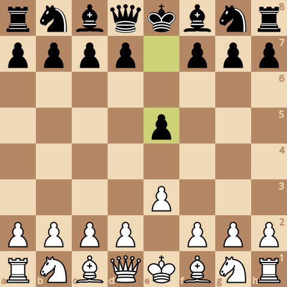

### board0003.png

Found a new move 2\
Analyzed boards: 296233\
Average speed for the move: 166040 boards/s\
Time taken for the move: 1.33055s\
Total time taken: 1.76291s\
Current white score: 24350, black score: 24200\
Current board after move:\
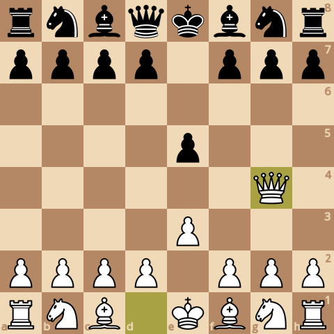

### board0004.png

Found a new move 3\
Analyzed boards: 506138\
Average speed for the move: 165776 boards/s\
Time taken for the move: 1.26619s\
Total time taken: 3.02911s\
Current white score: 24350, black score: 24220\
Current board after move:\
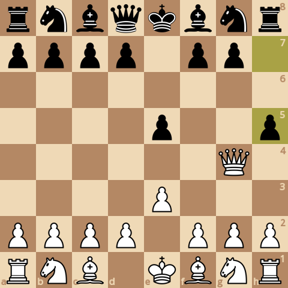

### board0005.png

Found a new move 4\
Analyzed boards: 634985\
Average speed for the move: 166466 boards/s\
Time taken for the move: 0.774015s\
Total time taken: 3.80312s\
Current white score: 24320, black score: 24200\
Current board after move:\
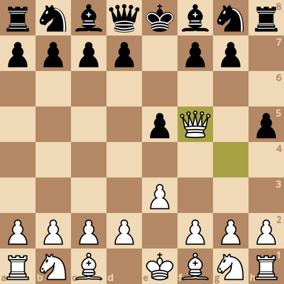

### board0006.png

Found a new move 5\
Analyzed boards: 779104\
Average speed for the move: 158525 boards/s\
Time taken for the move: 0.909126s\
Total time taken: 4.71225s\
Current white score: 24310, black score: 24270\
Current board after move:\
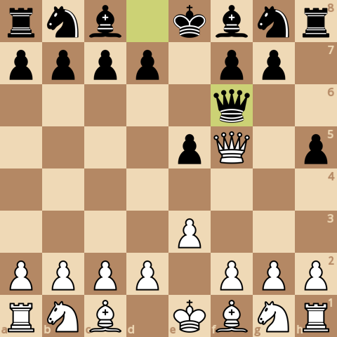

### board0007.png

Found a new move 6\
Analyzed boards: 887758\
Average speed for the move: 171283 boards/s\
Time taken for the move: 0.634353s\
Total time taken: 5.3466s\
Current white score: 24300, black score: 24270\
Current board after move:\
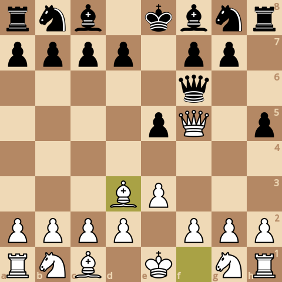

### board0008.png

Found a new move 7\
Analyzed boards: 983836\
Average speed for the move: 169194 boards/s\
Time taken for the move: 0.567858s\
Total time taken: 5.91446s\
Current white score: 24300, black score: 24300\
Current board after move:\
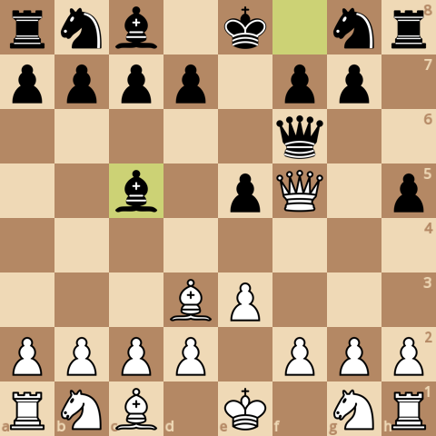

### board0009.png

Found a new move 8\
Analyzed boards: 1182599\
Average speed for the move: 172912 boards/s\
Time taken for the move: 1.14951s\
Total time taken: 7.06396s\
Current white score: 24340, black score: 24300\
Current board after move:\
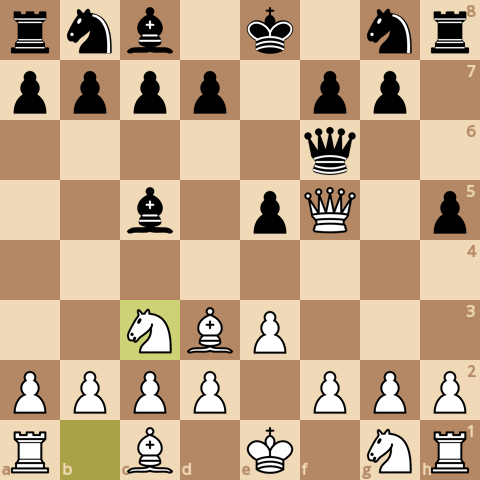

### board0010.png

Found a new move 9\
Analyzed boards: 1363226\
Average speed for the move: 167516 boards/s\
Time taken for the move: 1.07827s\
Total time taken: 8.14223s\
Current white score: 24330, black score: 24300\
Current board after move:\
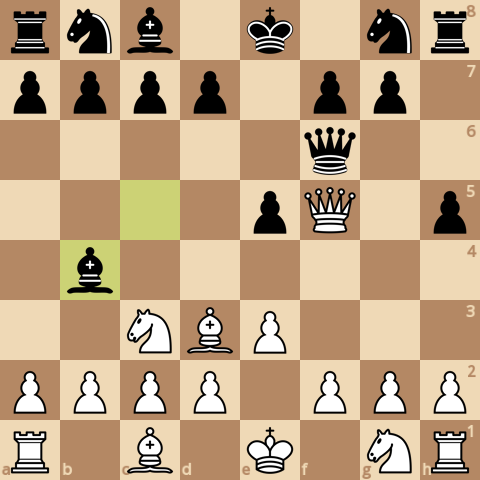

### board0011.png

Found a new move 10\
Analyzed boards: 1689821\
Average speed for the move: 175489 boards/s\
Time taken for the move: 1.86106s\
Total time taken: 10.0033s\
Current white score: 24350, black score: 24300\
Current board after move:\
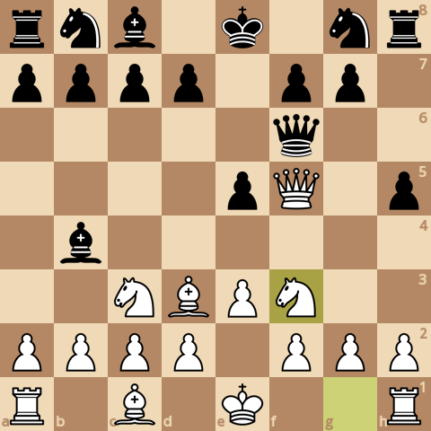

### board0012.png

Found a new move 11\
Analyzed boards: 2231742\
Average speed for the move: 172124 boards/s\
Time taken for the move: 3.14844s\
Total time taken: 13.1517s\
Current white score: 24350, black score: 24290\
Current board after move:\
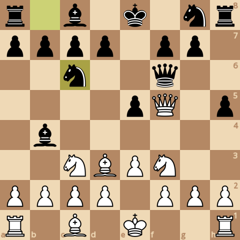

### board0013.png

Found a new move 12\
Analyzed boards: 2716313\
Average speed for the move: 170151 boards/s\
Time taken for the move: 2.84789s\
Total time taken: 15.9996s\
Current white score: 24370, black score: 24270\
Current board after move:\
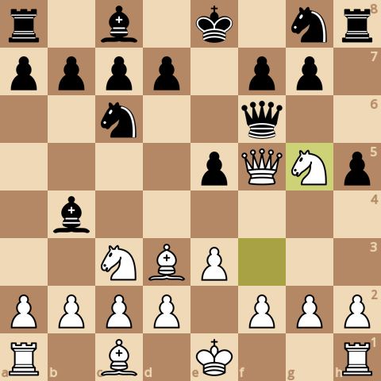

### board0014.png

Found a new move 13\
Analyzed boards: 3262851\
Average speed for the move: 165935 boards/s\
Time taken for the move: 3.2937s\
Total time taken: 19.2933s\
Current white score: 24380, black score: 24300\
Current board after move:\
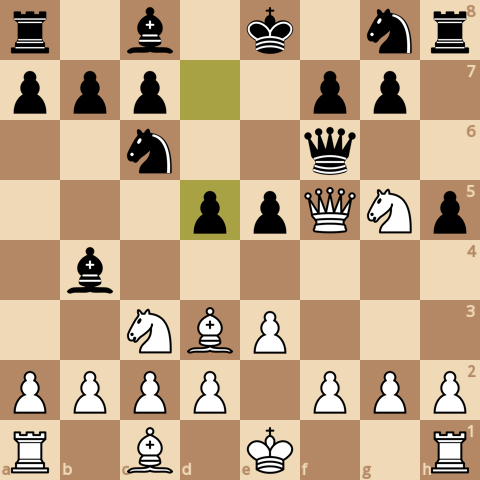

### board0015.png

Found a new move 14\
Analyzed boards: 3763491\
Average speed for the move: 147931 boards/s\
Time taken for the move: 3.38429s\
Total time taken: 22.6776s\
Current white score: 24420, black score: 23360\
Current board after move:\
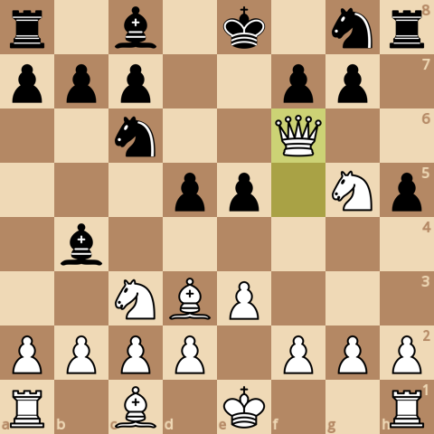

### board0016.png

Found a new move 15\
Analyzed boards: 3921097\
Average speed for the move: 161469 boards/s\
Time taken for the move: 0.976074s\
Total time taken: 23.6537s\
Current white score: 23390, black score: 23350\
Current board after move:\
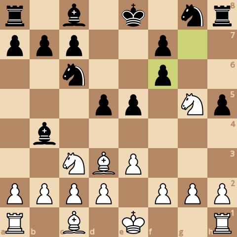

### board0017.png

Found a new move 16\
Analyzed boards: 4134115\
Average speed for the move: 145965 boards/s\
Time taken for the move: 1.45937s\
Total time taken: 25.1131s\
Current white score: 23340, black score: 23340\
Current board after move:\
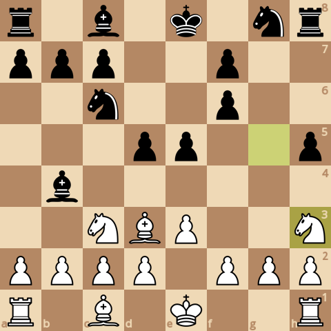

### board0018.png

Found a new move 17\
Analyzed boards: 4448834\
Average speed for the move: 155737 boards/s\
Time taken for the move: 2.02084s\
Total time taken: 27.1339s\
Current white score: 23340, black score: 23340\
Current board after move:\
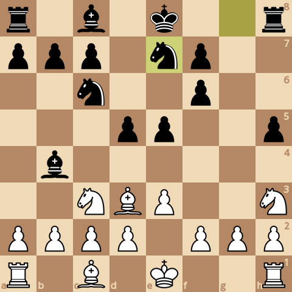

### board0019.png

Found a new move 18\
Analyzed boards: 4872043\
Average speed for the move: 166178 boards/s\
Time taken for the move: 2.54673s\
Total time taken: 29.6806s\
Current white score: 23360, black score: 23340\
Current board after move:\
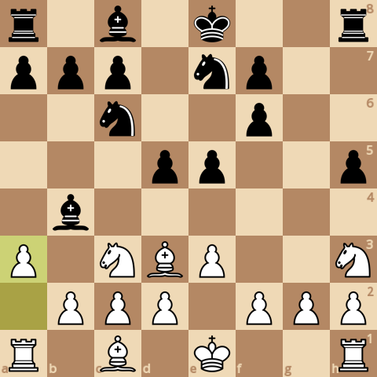

### board0020.png

Found a new move 19\
Analyzed boards: 5386676\
Average speed for the move: 166020 boards/s\
Time taken for the move: 3.09983s\
Total time taken: 32.7805s\
Current white score: 23000, black score: 23350\
Current board after move:\
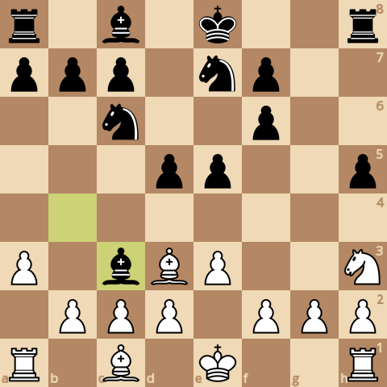

### board0021.png

Found a new move 20\
Analyzed boards: 5485492\
Average speed for the move: 172899 boards/s\
Time taken for the move: 0.571525s\
Total time taken: 33.352s\
Current white score: 23010, black score: 23000\
Current board after move:\
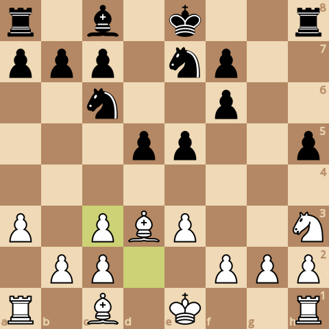

### board0022.png

Found a new move 21\
Analyzed boards: 5625875\
Average speed for the move: 169649 boards/s\
Time taken for the move: 0.827493s\
Total time taken: 34.1795s\
Current white score: 22970, black score: 23010\
Current board after move:\
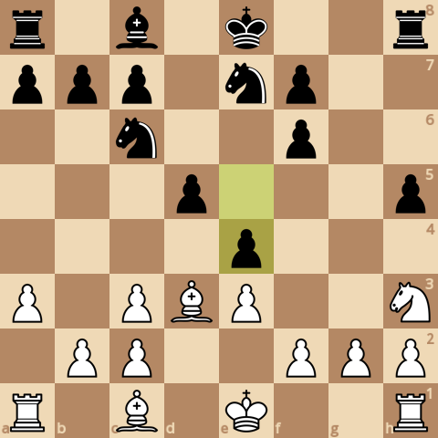

### board0023.png

Found a new move 22\
Analyzed boards: 5680142\
Average speed for the move: 189398 boards/s\
Time taken for the move: 0.286524s\
Total time taken: 34.466s\
Current white score: 22980, black score: 22990\
Current board after move:\
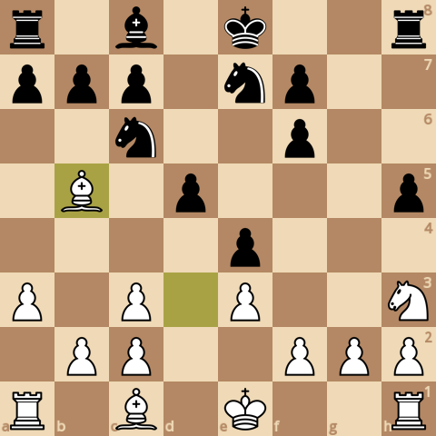

### board0024.png

Found a new move 23\
Analyzed boards: 5708391\
Average speed for the move: 204650 boards/s\
Time taken for the move: 0.138036s\
Total time taken: 34.604s\
Current white score: 22970, black score: 23060\
Current board after move:\
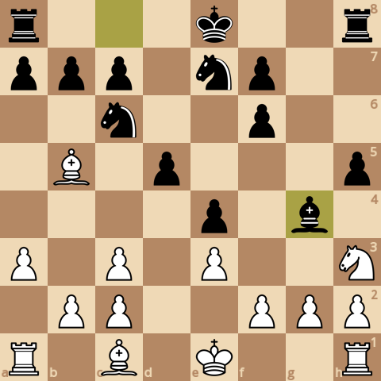

### board0025.png

Found a new move 24\
Analyzed boards: 5759944\
Average speed for the move: 194405 boards/s\
Time taken for the move: 0.265183s\
Total time taken: 34.8692s\
Current white score: 22990, black score: 23060\
Current board after move:\
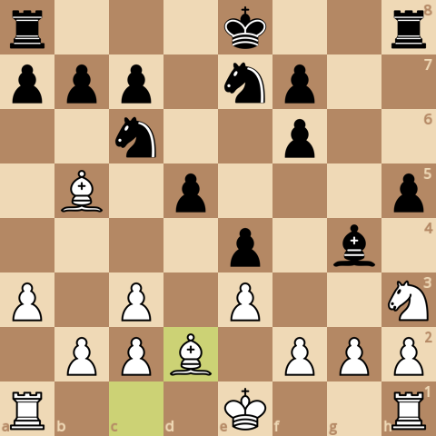

### board0026.png

Found a new move 25\
Analyzed boards: 5814504\
Average speed for the move: 192065 boards/s\
Time taken for the move: 0.284071s\
Total time taken: 35.1533s\
Current white score: 22990, black score: 23080\
Current board after move:\
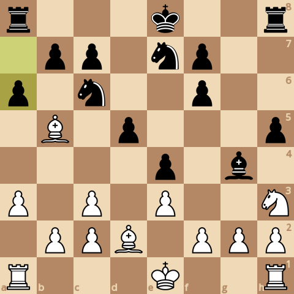

### board0027.png

Found a new move 26\
Analyzed boards: 5873186\
Average speed for the move: 181510 boards/s\
Time taken for the move: 0.323299s\
Total time taken: 35.4766s\
Current white score: 22990, black score: 23070\
Current board after move:\
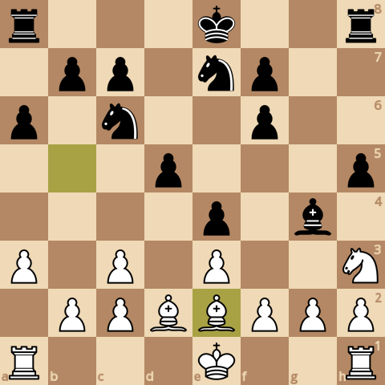

### board0028.png

Found a new move 27\
Analyzed boards: 5989897\
Average speed for the move: 155778 boards/s\
Time taken for the move: 0.749216s\
Total time taken: 36.2258s\
Current white score: 22990, black score: 23120\
Current board after move:\
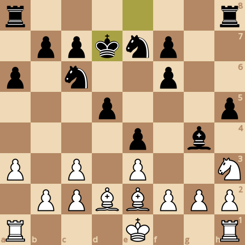

### board0029.png

Found a new move 28\
Analyzed boards: 6087086\
Average speed for the move: 162431 boards/s\
Time taken for the move: 0.598341s\
Total time taken: 36.8241s\
Current white score: 23030, black score: 23120\
Current board after move:\
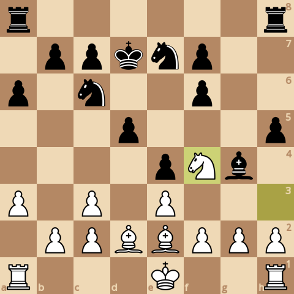

### board0030.png

Found a new move 29\
Analyzed boards: 6318990\
Average speed for the move: 145748 boards/s\
Time taken for the move: 1.59112s\
Total time taken: 38.4153s\
Current white score: 23030, black score: 23140\
Current board after move:\
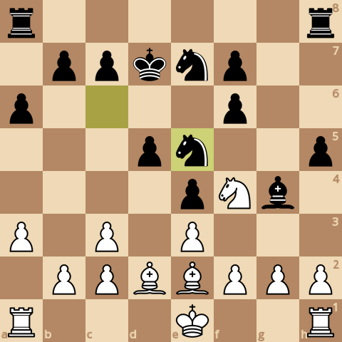

### board0031.png

Found a new move 30\
Analyzed boards: 6510476\
Average speed for the move: 150422 boards/s\
Time taken for the move: 1.27299s\
Total time taken: 39.6883s\
Current white score: 23030, black score: 23130\
Current board after move:\
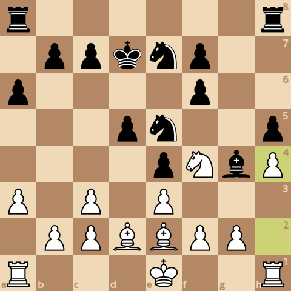

### board0032.png

Found a new move 31\
Analyzed boards: 6816092\
Average speed for the move: 179403 boards/s\
Time taken for the move: 1.70351s\
Total time taken: 41.3918s\
Current white score: 23030, black score: 23130\
Current board after move:\
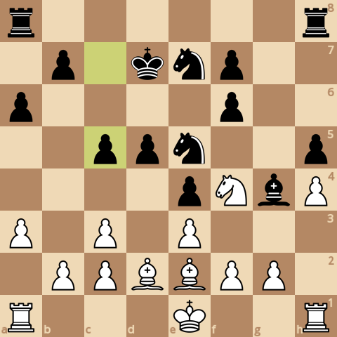

### board0033.png

Found a new move 32\
Analyzed boards: 6995780\
Average speed for the move: 175939 boards/s\
Time taken for the move: 1.02131s\
Total time taken: 42.4131s\
Current white score: 23040, black score: 23130\
Current board after move:\
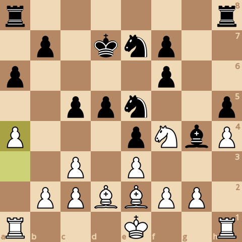

### board0034.png

Found a new move 33\
Analyzed boards: 7330028\
Average speed for the move: 174048 boards/s\
Time taken for the move: 1.92043s\
Total time taken: 44.3335s\
Current white score: 23040, black score: 23160\
Current board after move:\
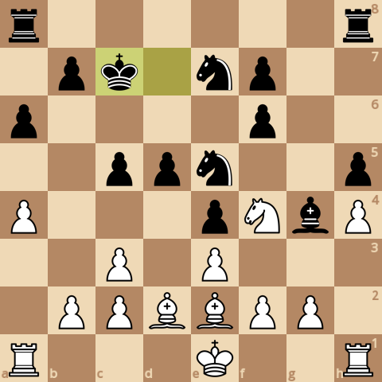

### board0035.png

Found a new move 34\
Analyzed boards: 7564038\
Average speed for the move: 175548 boards/s\
Time taken for the move: 1.33303s\
Total time taken: 45.6665s\
Current white score: 23040, black score: 23150\
Current board after move:\
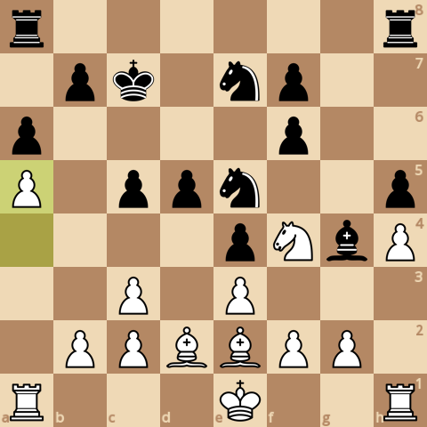

### board0036.png

Found a new move 35\
Analyzed boards: 8077460\
Average speed for the move: 180391 boards/s\
Time taken for the move: 2.84616s\
Total time taken: 48.5127s\
Current white score: 23040, black score: 23140\
Current board after move:\
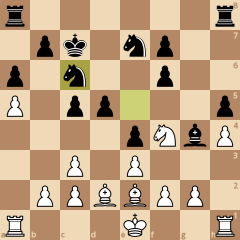

### board0037.png

Found a new move 36\
Analyzed boards: 8429197\
Average speed for the move: 181328 boards/s\
Time taken for the move: 1.93978s\
Total time taken: 50.4525s\
Current white score: 23020, black score: 23140\
Current board after move:\
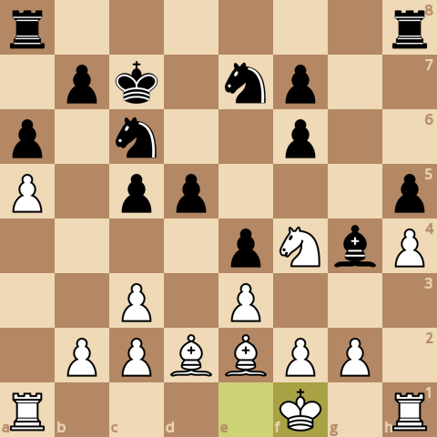

### board0038.png

Found a new move 37\
Analyzed boards: 8919389\
Average speed for the move: 183003 boards/s\
Time taken for the move: 2.67859s\
Total time taken: 53.1311s\
Current white score: 23020, black score: 23150\
Current board after move:\
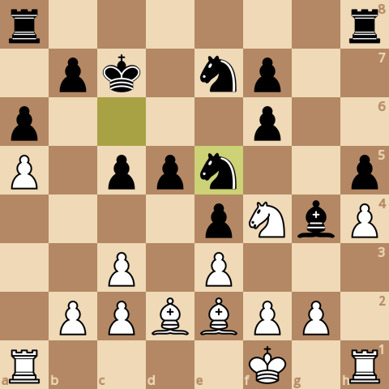

### board0039.png

Found a new move 38\
Analyzed boards: 9057062\
Average speed for the move: 180335 boards/s\
Time taken for the move: 0.763428s\
Total time taken: 53.8945s\
Current white score: 23030, black score: 23150\
Current board after move:\
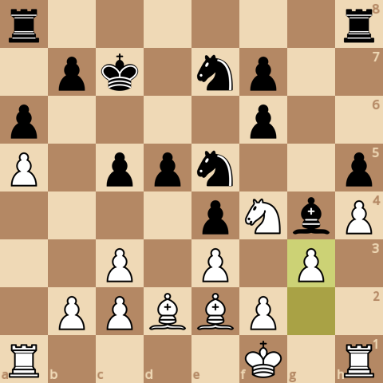

### board0040.png

Found a new move 39\
Analyzed boards: 9387760\
Average speed for the move: 188468 boards/s\
Time taken for the move: 1.75466s\
Total time taken: 55.6492s\
Current white score: 23020, black score: 23120\
Current board after move:\
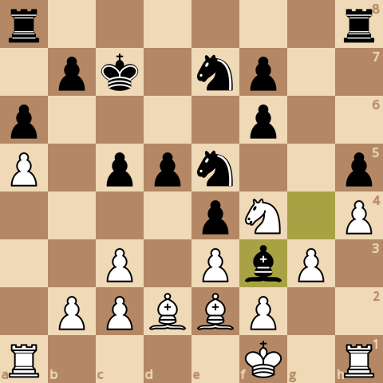

### board0041.png

Found a new move 40\
Analyzed boards: 9536288\
Average speed for the move: 183856 boards/s\
Time taken for the move: 0.807851s\
Total time taken: 56.457s\
Current white score: 23000, black score: 23120\
Current board after move:\
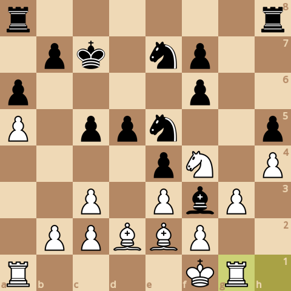

### board0042.png

Found a new move 41\
Analyzed boards: 9845397\
Average speed for the move: 188134 boards/s\
Time taken for the move: 1.64302s\
Total time taken: 58.1s\
Current white score: 23000, black score: 23130\
Current board after move:\
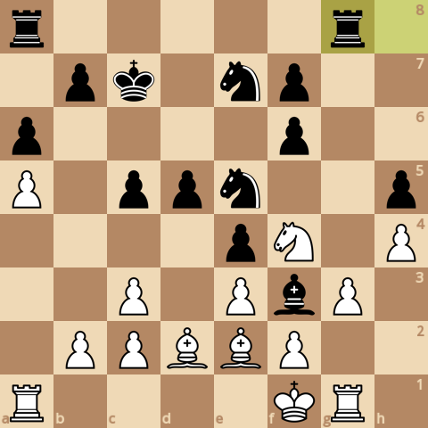

### board0043.png

Found a new move 42\
Analyzed boards: 10020211\
Average speed for the move: 189898 boards/s\
Time taken for the move: 0.920567s\
Total time taken: 59.0206s\
Current white score: 22960, black score: 23040\
Current board after move:\
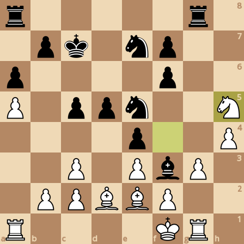

### board0044.png

Found a new move 43\
Analyzed boards: 10642277\
Average speed for the move: 206598 boards/s\
Time taken for the move: 3.011s\
Total time taken: 62.0316s\
Current white score: 22670, black score: 23040\
Current board after move:\
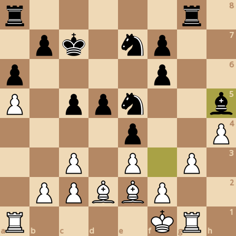

### board0045.png

Found a new move 44\
Analyzed boards: 10690670\
Average speed for the move: 209629 boards/s\
Time taken for the move: 0.230851s\
Total time taken: 62.2625s\
Current white score: 22660, black score: 22700\
Current board after move:\
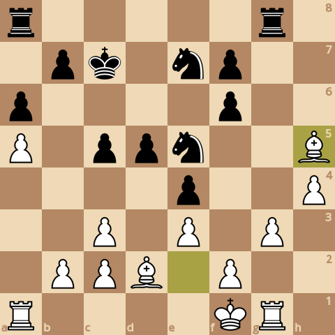

### board0046.png

Found a new move 45\
Analyzed boards: 11036160\
Average speed for the move: 207291 boards/s\
Time taken for the move: 1.66669s\
Total time taken: 63.9291s\
Current white score: 22660, black score: 22730\
Current board after move:\
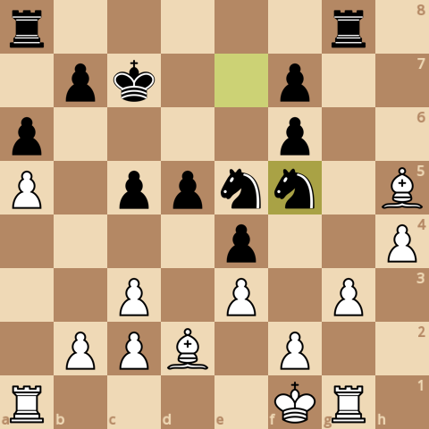

### board0047.png

Found a new move 46\
Analyzed boards: 11665022\
Average speed for the move: 211177 boards/s\
Time taken for the move: 2.97789s\
Total time taken: 66.907s\
Current white score: 22680, black score: 22730\
Current board after move:\
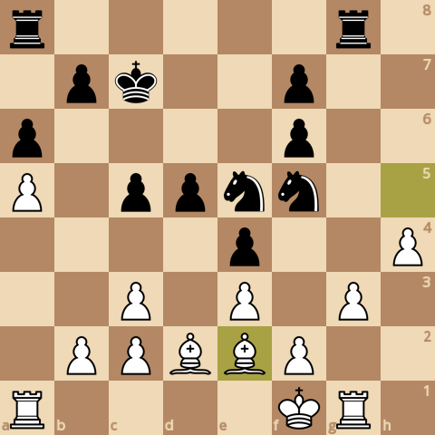

### board0048.png

Found a new move 47\
Analyzed boards: 12580487\
Average speed for the move: 210285 boards/s\
Time taken for the move: 4.35344s\
Total time taken: 71.2605s\
Current white score: 22640, black score: 22740\
Current board after move:\
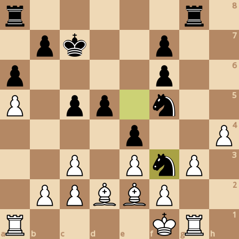

### board0049.png

Found a new move 48\
Analyzed boards: 12675641\
Average speed for the move: 229305 boards/s\
Time taken for the move: 0.414967s\
Total time taken: 71.6754s\
Current white score: 22660, black score: 22370\
Current board after move:\
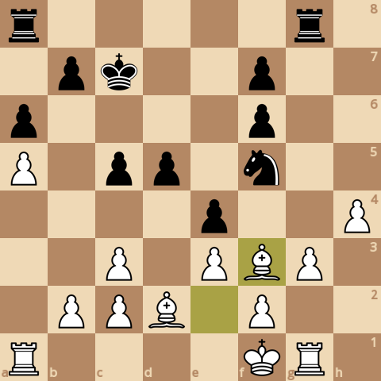

### board0050.png

Found a new move 49\
Analyzed boards: 12778302\
Average speed for the move: 218415 boards/s\
Time taken for the move: 0.470027s\
Total time taken: 72.1455s\
Current white score: 22300, black score: 22360\
Current board after move:\
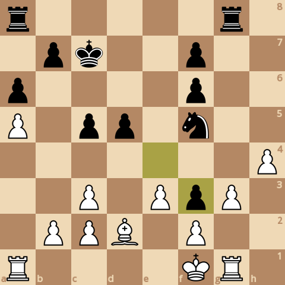

### board0051.png

Found a new move 50\
Analyzed boards: 13148538\
Average speed for the move: 230824 boards/s\
Time taken for the move: 1.60398s\
Total time taken: 73.7494s\
Current white score: 22320, black score: 22360\
Current board after move:\
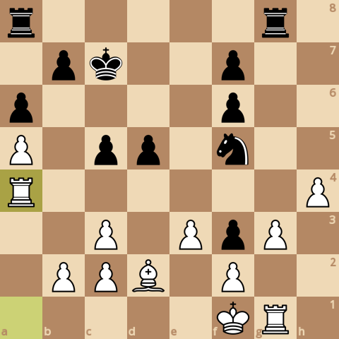

### board0052.png

Found a new move 51\
Analyzed boards: 13486921\
Average speed for the move: 241239 boards/s\
Time taken for the move: 1.40269s\
Total time taken: 75.1521s\
Current white score: 22270, black score: 22350\
Current board after move:\
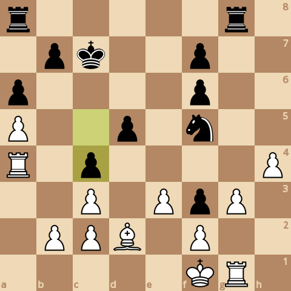

### board0053.png

Found a new move 52\
Analyzed boards: 13724553\
Average speed for the move: 251296 boards/s\
Time taken for the move: 0.945626s\
Total time taken: 76.0978s\
Current white score: 22330, black score: 22360\
Current board after move:\
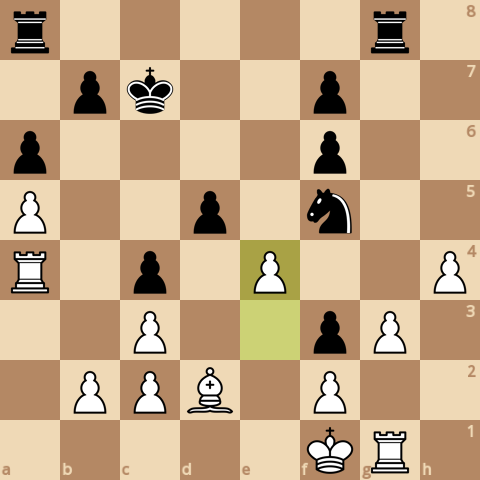

### board0054.png

Found a new move 53\
Analyzed boards: 13797911\
Average speed for the move: 233468 boards/s\
Time taken for the move: 0.31421s\
Total time taken: 76.412s\
Current white score: 22200, black score: 22350\
Current board after move:\
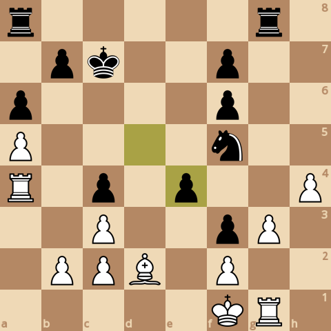

### board0055.png

Found a new move 54\
Analyzed boards: 13851402\
Average speed for the move: 252539 boards/s\
Time taken for the move: 0.211813s\
Total time taken: 76.6238s\
Current white score: 22220, black score: 22250\
Current board after move:\
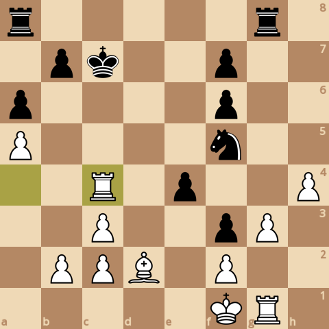

### board0056.png

Found a new move 55\
Analyzed boards: 13866594\
Average speed for the move: 252627 boards/s\
Time taken for the move: 0.060136s\
Total time taken: 76.6839s\
Current white score: 22230, black score: 22250\
Current board after move:\
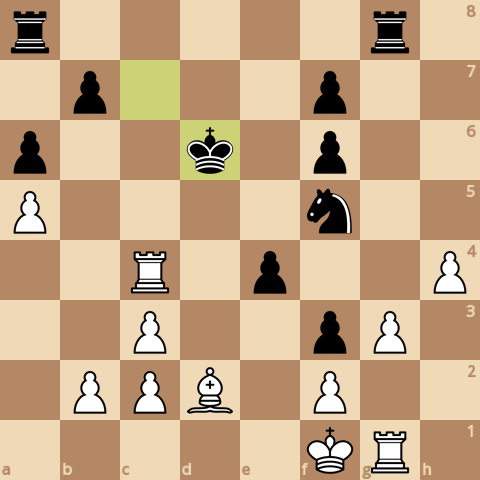

### board0057.png

Found a new move 56\
Analyzed boards: 13983047\
Average speed for the move: 254845 boards/s\
Time taken for the move: 0.456956s\
Total time taken: 77.1409s\
Current white score: 22230, black score: 22250\
Current board after move:\
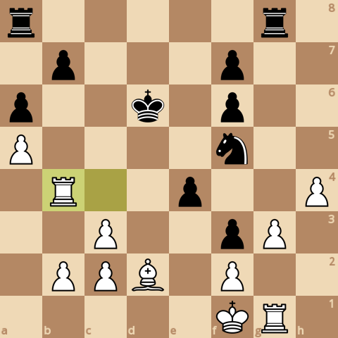

### board0058.png

Found a new move 57\
Analyzed boards: 14112007\
Average speed for the move: 259322 boards/s\
Time taken for the move: 0.497296s\
Total time taken: 77.6382s\
Current white score: 22230, black score: 22260\
Current board after move:\
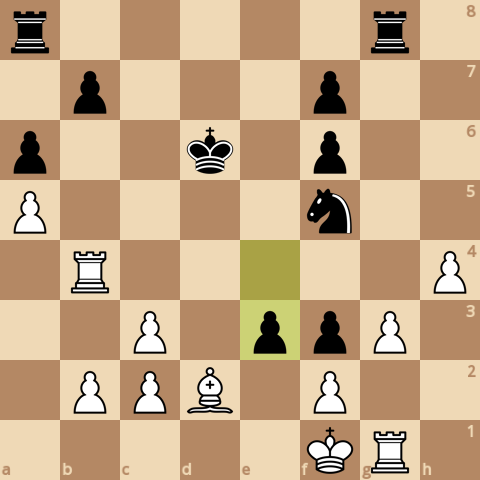

### board0059.png

Found a new move 58\
Analyzed boards: 14157846\
Average speed for the move: 249537 boards/s\
Time taken for the move: 0.183696s\
Total time taken: 77.8219s\
Current white score: 22210, black score: 22240\
Current board after move:\
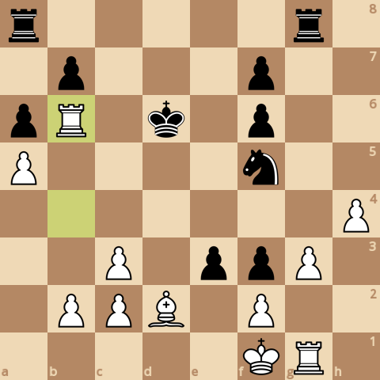

### board0060.png

Found a new move 59\
Analyzed boards: 14366258\
Average speed for the move: 259843 boards/s\
Time taken for the move: 0.802068s\
Total time taken: 78.6239s\
Current white score: 22230, black score: 22250\
Current board after move:\
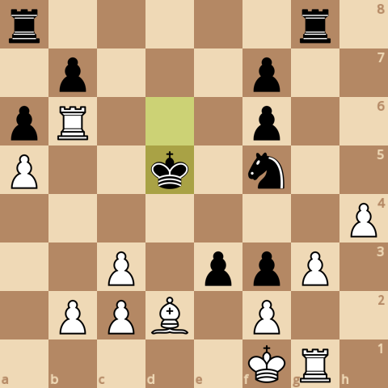

### board0061.png

Found a new move 60\
Analyzed boards: 14465585\
Average speed for the move: 218299 boards/s\
Time taken for the move: 0.455004s\
Total time taken: 79.0789s\
Current white score: 22260, black score: 22130\
Current board after move:\
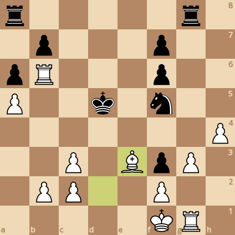

### board0062.png

Found a new move 61\
Analyzed boards: 14721982\
Average speed for the move: 264768 boards/s\
Time taken for the move: 0.968382s\
Total time taken: 80.0473s\
Current white score: 21900, black score: 22130\
Current board after move:\
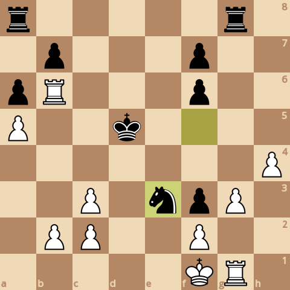

### board0063.png

Found a new move 62\
Analyzed boards: 14736620\
Average speed for the move: 271456 boards/s\
Time taken for the move: 0.053924s\
Total time taken: 80.1012s\
Current white score: 21910, black score: 21770\
Current board after move:\
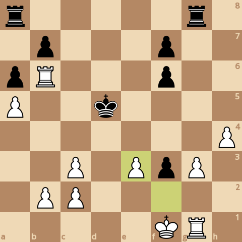

### board0064.png

Found a new move 63\
Analyzed boards: 14859228\
Average speed for the move: 295262 boards/s\
Time taken for the move: 0.415252s\
Total time taken: 80.5165s\
Current white score: 21910, black score: 21770\
Current board after move:\
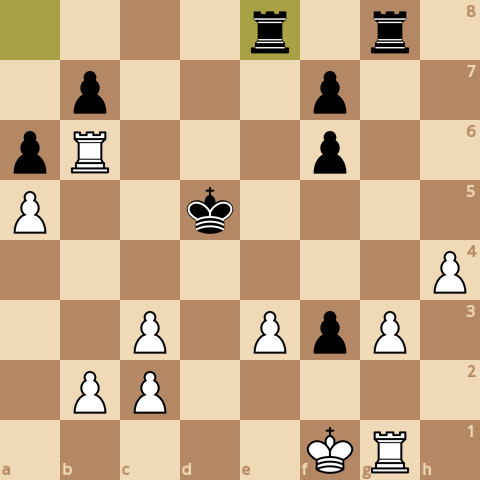

### board0065.png

Found a new move 64\
Analyzed boards: 14962962\
Average speed for the move: 291434 boards/s\
Time taken for the move: 0.355943s\
Total time taken: 80.8724s\
Current white score: 21980, black score: 21760\
Current board after move:\
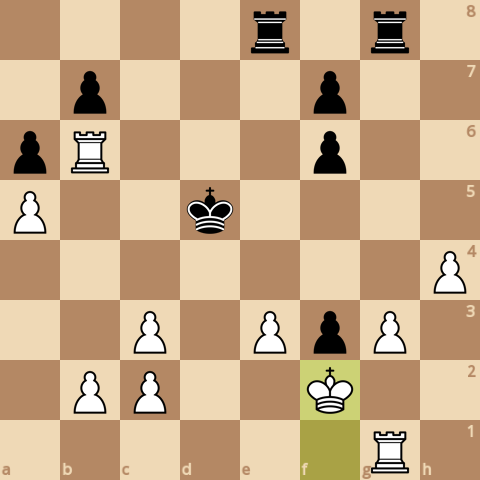

### board0066.png

Found a new move 65\
Analyzed boards: 15182677\
Average speed for the move: 282277 boards/s\
Time taken for the move: 0.778367s\
Total time taken: 81.6508s\
Current white score: 21970, black score: 21820\
Current board after move:\
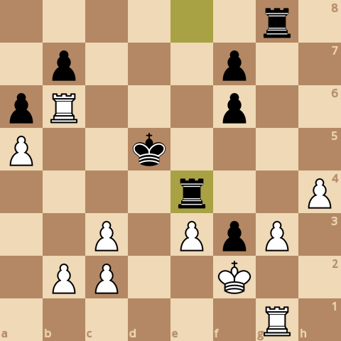

### board0067.png

Found a new move 66\
Analyzed boards: 15464082\
Average speed for the move: 277252 boards/s\
Time taken for the move: 1.01498s\
Total time taken: 82.6658s\
Current white score: 21980, black score: 21720\
Current board after move:\
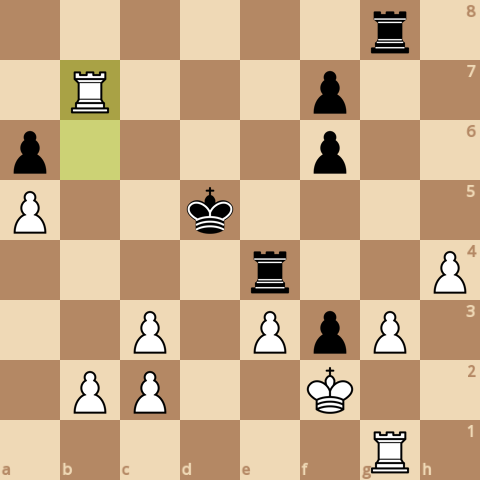

### board0068.png

Found a new move 67\
Analyzed boards: 15596775\
Average speed for the move: 285104 boards/s\
Time taken for the move: 0.465419s\
Total time taken: 83.1312s\
Current white score: 21980, black score: 21690\
Current board after move:\
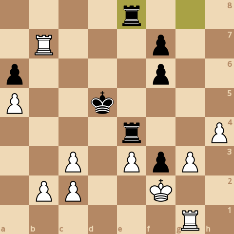

### board0069.png

Found a new move 68\
Analyzed boards: 15725282\
Average speed for the move: 278399 boards/s\
Time taken for the move: 0.461593s\
Total time taken: 83.5928s\
Current white score: 22020, black score: 21690\
Current board after move:\
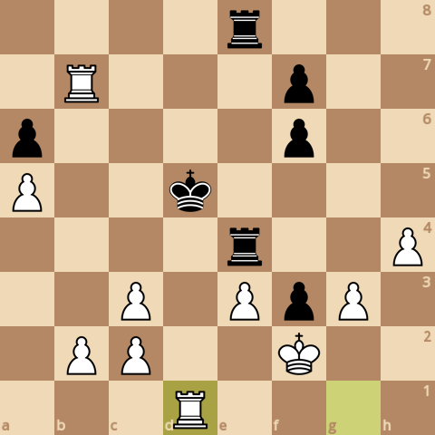

### board0070.png

Found a new move 69\
Analyzed boards: 15755910\
Average speed for the move: 267973 boards/s\
Time taken for the move: 0.114295s\
Total time taken: 83.7071s\
Current white score: 22050, black score: 21700\
Current board after move:\

### board0071.png

Found a new move 70\
Analyzed boards: 15840311\
Average speed for the move: 288265 boards/s\
Time taken for the move: 0.29279s\
Total time taken: 83.9999s\
Current white score: 22020, black score: 21700\
Current board after move:\
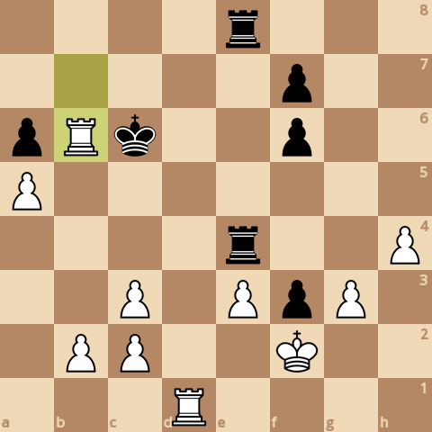

### board0072.png

Found a new move 71\
Analyzed boards: 15879613\
Average speed for the move: 279513 boards/s\
Time taken for the move: 0.140609s\
Total time taken: 84.1405s\
Current white score: 22050, black score: 21700\
Current board after move:\
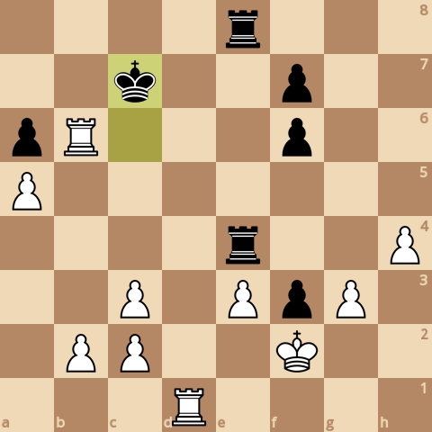

### board0073.png

Found a new move 72\
Analyzed boards: 16114092\
Average speed for the move: 246911 boards/s\
Time taken for the move: 0.949649s\
Total time taken: 85.0901s\
Current white score: 22020, black score: 21600\
Current board after move:\
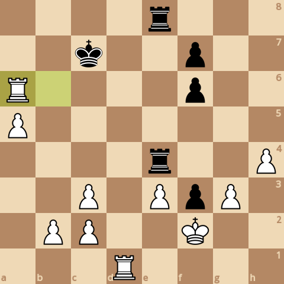

### board0074.png

Found a new move 73\
Analyzed boards: 16165887\
Average speed for the move: 267684 boards/s\
Time taken for the move: 0.193493s\
Total time taken: 85.2836s\
Current white score: 22030, black score: 21590\
Current board after move:\
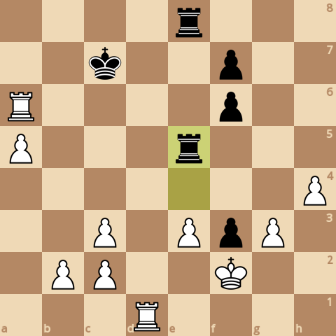

### board0075.png

Found a new move 74\
Analyzed boards: 16234355\
Average speed for the move: 261371 boards/s\
Time taken for the move: 0.261957s\
Total time taken: 85.5456s\
Current white score: 22010, black score: 21590\
Current board after move:\
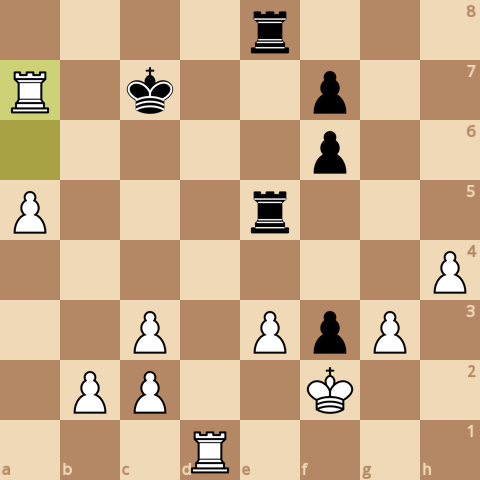

### board0076.png

Found a new move 75\
Analyzed boards: 16247114\
Average speed for the move: 267406 boards/s\
Time taken for the move: 0.047714s\
Total time taken: 85.5933s\
Current white score: 22040, black score: 21590\
Current board after move:\
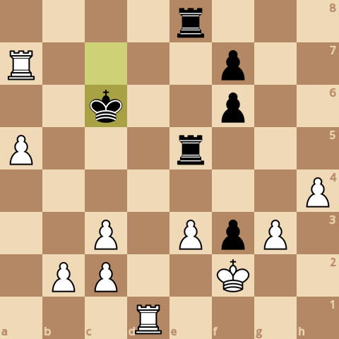

### board0077.png

Found a new move 76\
Analyzed boards: 16313875\
Average speed for the move: 269318 boards/s\
Time taken for the move: 0.247889s\
Total time taken: 85.8412s\
Current white score: 22060, black score: 21490\
Current board after move:\
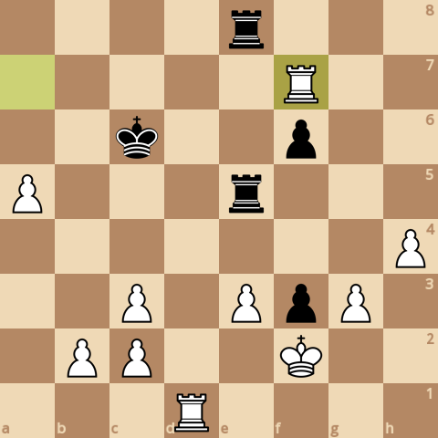

### board0078.png

Found a new move 77\
Analyzed boards: 16339539\
Average speed for the move: 259728 boards/s\
Time taken for the move: 0.098811s\
Total time taken: 85.94s\
Current white score: 21950, black score: 21550\
Current board after move:\

### board0079.png

Found a new move 78\
Analyzed boards: 16385370\
Average speed for the move: 268152 boards/s\
Time taken for the move: 0.170914s\
Total time taken: 86.1109s\
Current white score: 21960, black score: 21440\
Current board after move:\
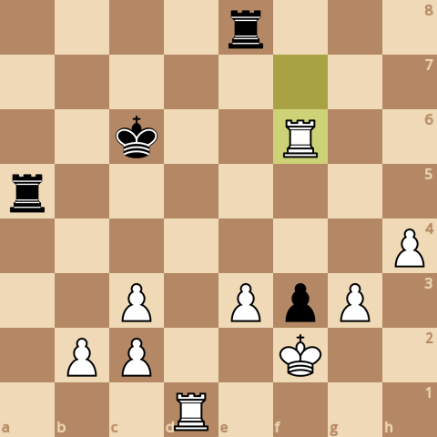

### board0080.png

Found a new move 79\
Analyzed boards: 16404839\
Average speed for the move: 279602 boards/s\
Time taken for the move: 0.069631s\
Total time taken: 86.1805s\
Current white score: 21980, black score: 21440\
Current board after move:\
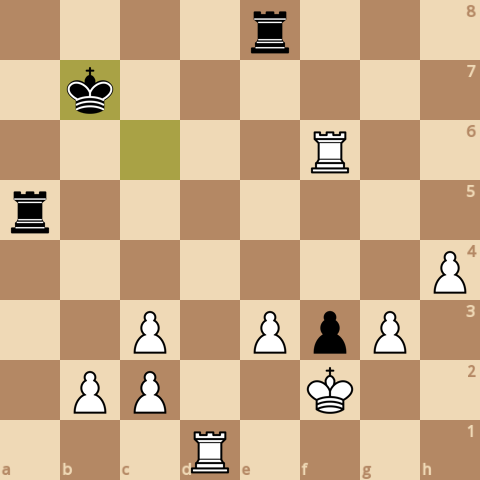

### board0081.png

Found a new move 80\
Analyzed boards: 16536058\
Average speed for the move: 276724 boards/s\
Time taken for the move: 0.474188s\
Total time taken: 86.6547s\
Current white score: 21970, black score: 21340\
Current board after move:\
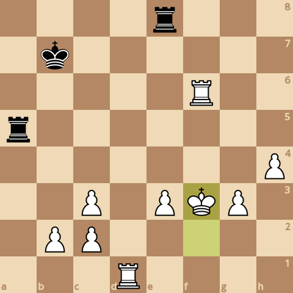

### board0082.png

Found a new move 81\
Analyzed boards: 16616373\
Average speed for the move: 268040 boards/s\
Time taken for the move: 0.299638s\
Total time taken: 86.9544s\
Current white score: 21970, black score: 21340\
Current board after move:\
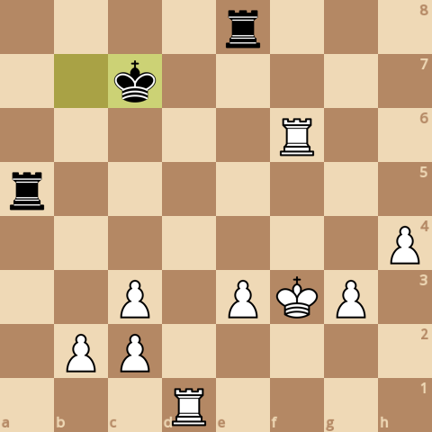

### board0083.png

Found a new move 82\
Analyzed boards: 16725533\
Average speed for the move: 276849 boards/s\
Time taken for the move: 0.394294s\
Total time taken: 87.3487s\
Current white score: 21950, black score: 21340\
Current board after move:\
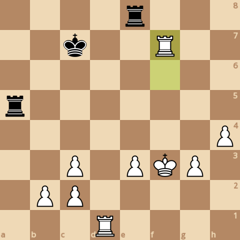

### board0084.png

Found a new move 83\
Analyzed boards: 16736158\
Average speed for the move: 272709 boards/s\
Time taken for the move: 0.038961s\
Total time taken: 87.3876s\
Current white score: 21970, black score: 21340\
Current board after move:\
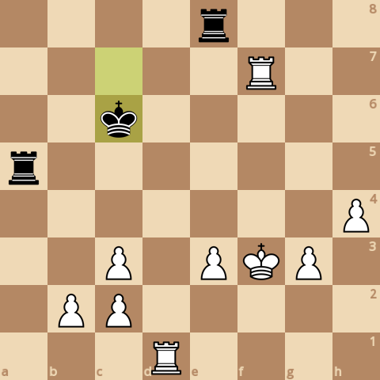

### board0085.png

Found a new move 84\
Analyzed boards: 16868841\
Average speed for the move: 273025 boards/s\
Time taken for the move: 0.485974s\
Total time taken: 87.8736s\
Current white score: 21970, black score: 21330\
Current board after move:\
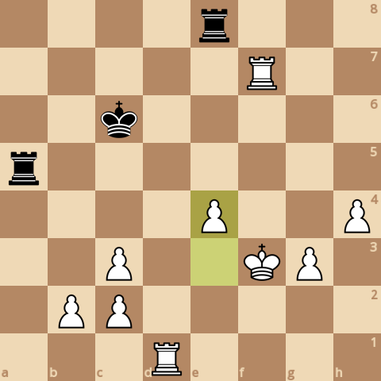

### board0086.png

Found a new move 85\
Analyzed boards: 16910506\
Average speed for the move: 269542 boards/s\
Time taken for the move: 0.154577s\
Total time taken: 88.0282s\
Current white score: 21970, black score: 21350\
Current board after move:\
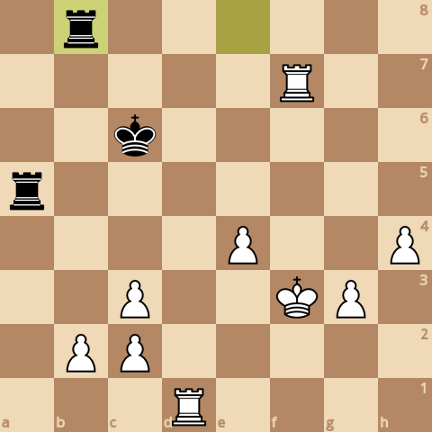

### board0087.png

Found a new move 86\
Analyzed boards: 16965033\
Average speed for the move: 277279 boards/s\
Time taken for the move: 0.19665s\
Total time taken: 88.2248s\
Current white score: 21970, black score: 21330\
Current board after move:\
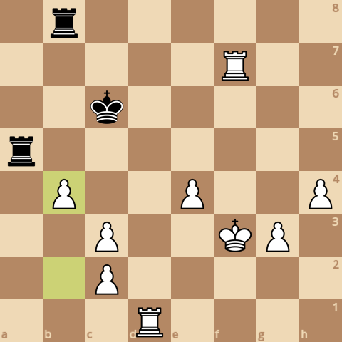

### board0088.png

Found a new move 87\
Analyzed boards: 17002382\
Average speed for the move: 279264 boards/s\
Time taken for the move: 0.133741s\
Total time taken: 88.3586s\
Current white score: 21950, black score: 21300\
Current board after move:\
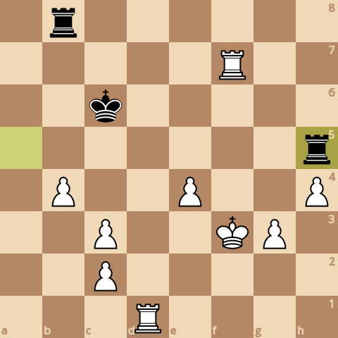

### board0089.png

Found a new move 88\
Analyzed boards: 17276075\
Average speed for the move: 278162 boards/s\
Time taken for the move: 0.983934s\
Total time taken: 89.3425s\
Current white score: 21950, black score: 21250\
Current board after move:\
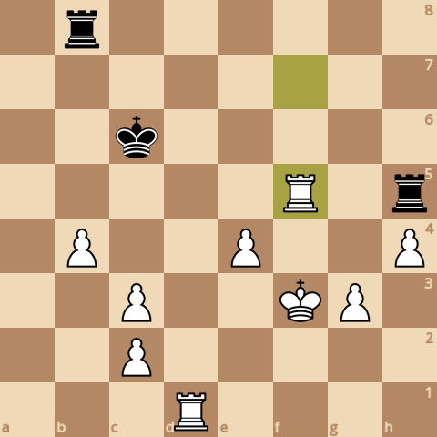

### board0090.png

Found a new move 89\
Analyzed boards: 17278631\
Average speed for the move: 284855 boards/s\
Time taken for the move: 0.008973s\
Total time taken: 89.3515s\
Current white score: 21360, black score: 21310\
Current board after move:\
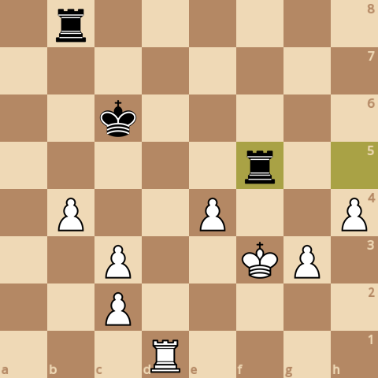

### board0091.png

Found a new move 90\
Analyzed boards: 17285258\
Average speed for the move: 349470 boards/s\
Time taken for the move: 0.018963s\
Total time taken: 89.3704s\
Current white score: 21360, black score: 20690\
Current board after move:\
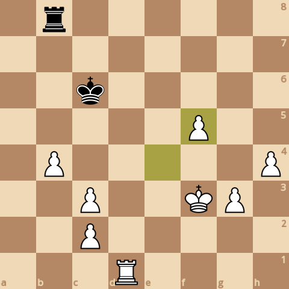

### board0092.png

Found a new move 91\
Analyzed boards: 17303930\
Average speed for the move: 334139 boards/s\
Time taken for the move: 0.055881s\
Total time taken: 89.4263s\
Current white score: 21360, black score: 20720\
Current board after move:\
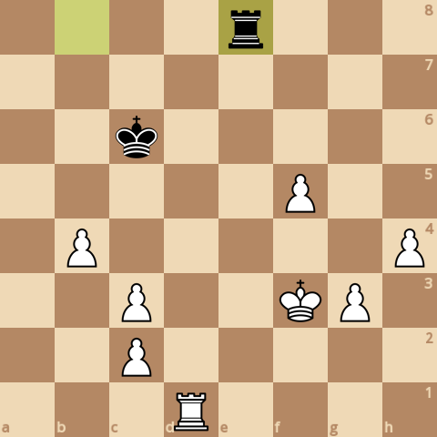

### board0093.png

Found a new move 92\
Analyzed boards: 17322337\
Average speed for the move: 350056 boards/s\
Time taken for the move: 0.052583s\
Total time taken: 89.4789s\
Current white score: 21370, black score: 20720\
Current board after move:\
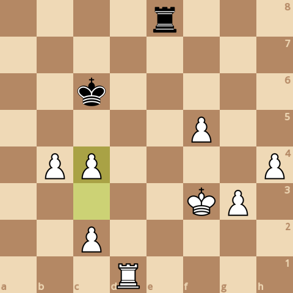

### board0094.png

Found a new move 93\
Analyzed boards: 17341544\
Average speed for the move: 333212 boards/s\
Time taken for the move: 0.057642s\
Total time taken: 89.5365s\
Current white score: 21370, black score: 20720\
Current board after move:\
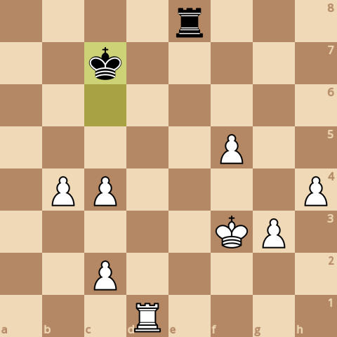

### board0095.png

Found a new move 94\
Analyzed boards: 17373283\
Average speed for the move: 343950 boards/s\
Time taken for the move: 0.092278s\
Total time taken: 89.6288s\
Current white score: 21370, black score: 20720\
Current board after move:\
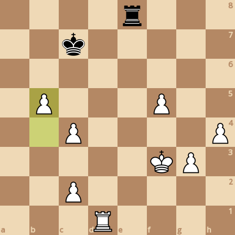

### board0096.png

Found a new move 95\
Analyzed boards: 17389576\
Average speed for the move: 333047 boards/s\
Time taken for the move: 0.048921s\
Total time taken: 89.6777s\
Current white score: 21360, black score: 20720\
Current board after move:\
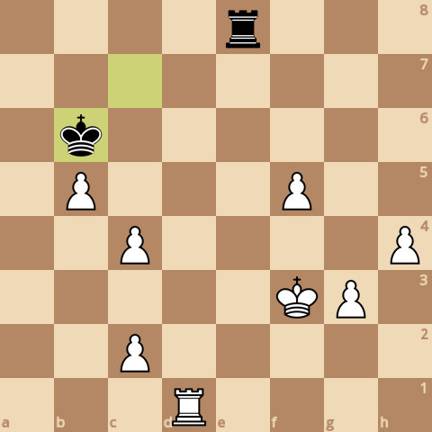

### board0097.png

Found a new move 96\
Analyzed boards: 17437700\
Average speed for the move: 337677 boards/s\
Time taken for the move: 0.142515s\
Total time taken: 89.8203s\
Current white score: 21310, black score: 20720\
Current board after move:\
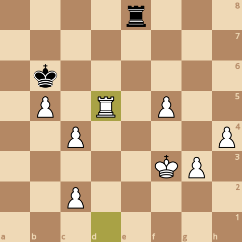

### board0098.png

Found a new move 97\
Analyzed boards: 17451168\
Average speed for the move: 323470 boards/s\
Time taken for the move: 0.041636s\
Total time taken: 89.8619s\
Current white score: 21310, black score: 20700\
Current board after move:\
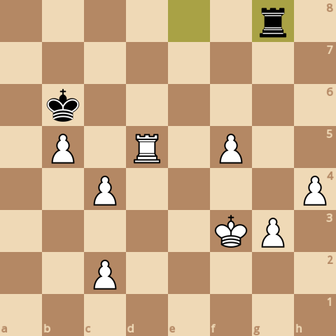

### board0099.png

Found a new move 98\
Analyzed boards: 17488425\
Average speed for the move: 352225 boards/s\
Time taken for the move: 0.105776s\
Total time taken: 89.9677s\
Current white score: 21310, black score: 20700\
Current board after move:\
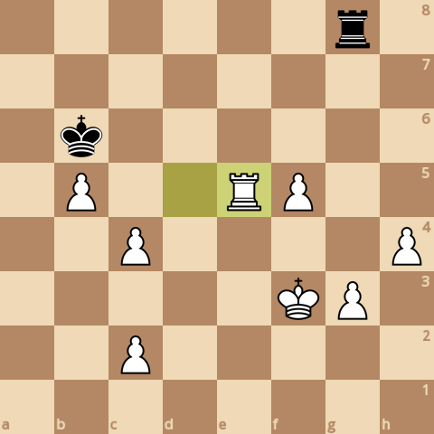

### board0100.png

Found a new move 99\
Analyzed boards: 17500314\
Average speed for the move: 338998 boards/s\
Time taken for the move: 0.035071s\
Total time taken: 90.0027s\
Current white score: 21310, black score: 20720\
Current board after move:\
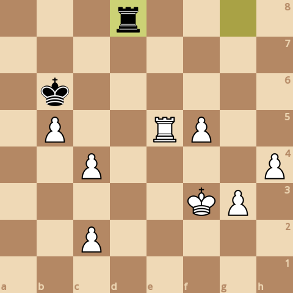

### board0101.png

Found a new move 100\
Analyzed boards: 17541088\
Average speed for the move: 326393 boards/s\
Time taken for the move: 0.124923s\
Total time taken: 90.1277s\
Current white score: 21310, black score: 20720\
Current board after move:\
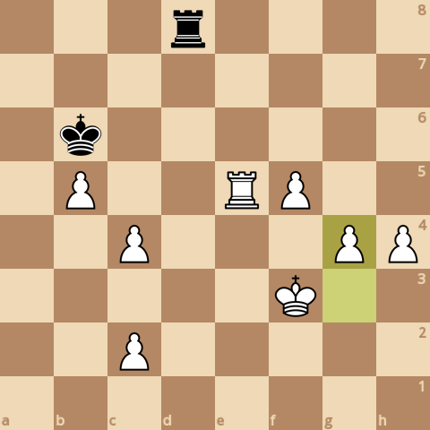

### board0102.png

Found a new move 101\
Analyzed boards: 17555238\
Average speed for the move: 325857 boards/s\
Time taken for the move: 0.043424s\
Total time taken: 90.1711s\
Current white score: 21310, black score: 20720\
Current board after move:\
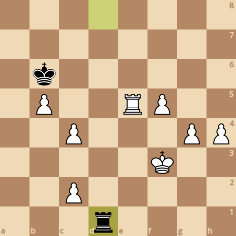

### board0103.png

Found a new move 102\
Analyzed boards: 17587733\
Average speed for the move: 350396 boards/s\
Time taken for the move: 0.092738s\
Total time taken: 90.2638s\
Current white score: 21360, black score: 20720\
Current board after move:\
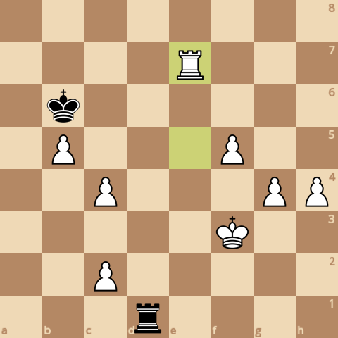

### board0104.png

Found a new move 103\
Analyzed boards: 17603435\
Average speed for the move: 327452 boards/s\
Time taken for the move: 0.047952s\
Total time taken: 90.3118s\
Current white score: 21360, black score: 20720\
Current board after move:\
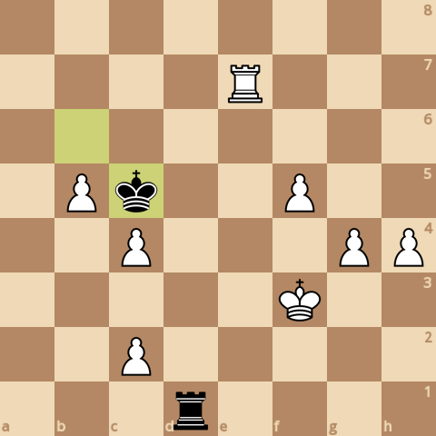

### board0105.png

Found a new move 104\
Analyzed boards: 17625681\
Average speed for the move: 338224 boards/s\
Time taken for the move: 0.065773s\
Total time taken: 90.3776s\
Current white score: 21320, black score: 20720\
Current board after move:\
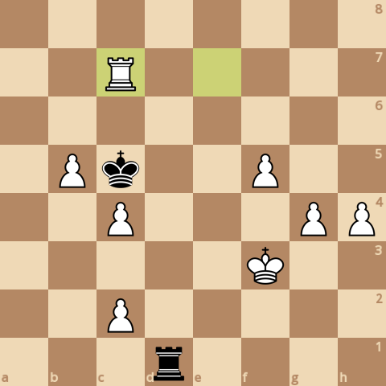

### board0106.png

Found a new move 105\
Analyzed boards: 17631386\
Average speed for the move: 340150 boards/s\
Time taken for the move: 0.016772s\
Total time taken: 90.3943s\
Current white score: 21330, black score: 20720\
Current board after move:\
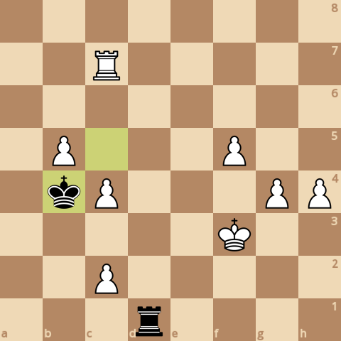

### board0107.png

Found a new move 106\
Analyzed boards: 17675184\
Average speed for the move: 354462 boards/s\
Time taken for the move: 0.123562s\
Total time taken: 90.5179s\
Current white score: 21340, black score: 20720\
Current board after move:\
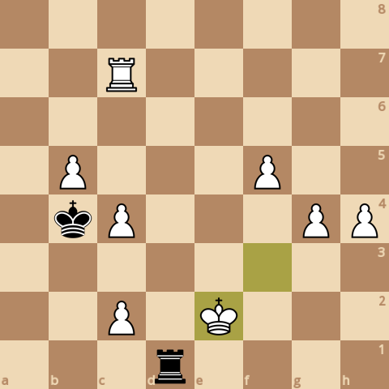

### board0108.png

Found a new move 107\
Analyzed boards: 17682204\
Average speed for the move: 342874 boards/s\
Time taken for the move: 0.020474s\
Total time taken: 90.5384s\
Current white score: 21340, black score: 20690\
Current board after move:\
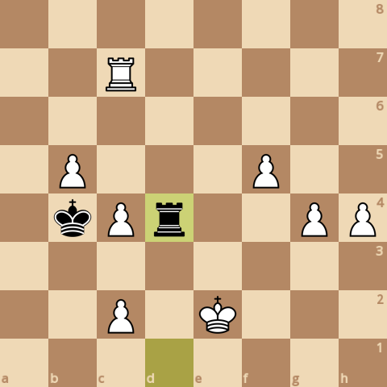

### board0109.png

Found a new move 108\
Analyzed boards: 17697337\
Average speed for the move: 328993 boards/s\
Time taken for the move: 0.045998s\
Total time taken: 90.5844s\
Current white score: 21340, black score: 20690\
Current board after move:\
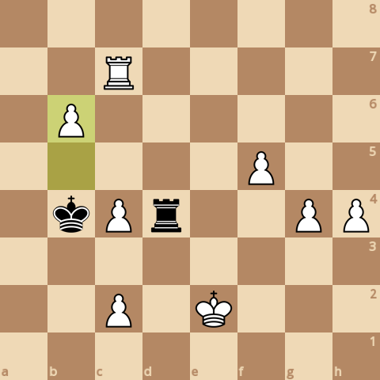

### board0110.png

Found a new move 109\
Analyzed boards: 17704633\
Average speed for the move: 331712 boards/s\
Time taken for the move: 0.021995s\
Total time taken: 90.6064s\
Current white score: 21340, black score: 20680\
Current board after move:\
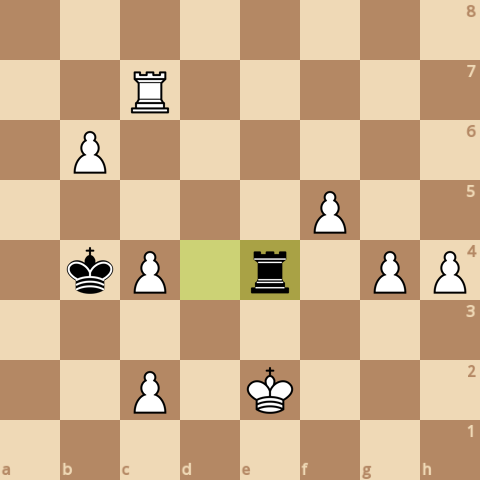

### board0111.png

Found a new move 110\
Analyzed boards: 17710378\
Average speed for the move: 386011 boards/s\
Time taken for the move: 0.014883s\
Total time taken: 90.6212s\
Current white score: 21330, black score: 20690\
Current board after move:\
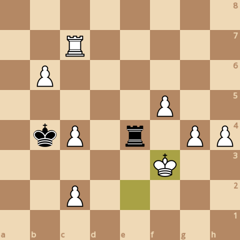

### board0112.png

Found a new move 111\
Analyzed boards: 17718471\
Average speed for the move: 346907 boards/s\
Time taken for the move: 0.023329s\
Total time taken: 90.6446s\
Current white score: 21330, black score: 20720\
Current board after move:\
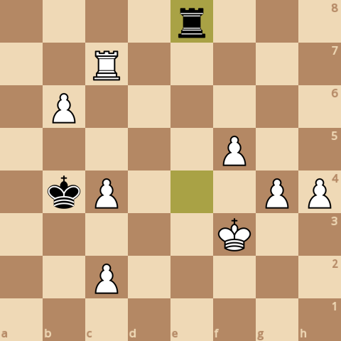

### board0113.png

Found a new move 112\
Analyzed boards: 17744962\
Average speed for the move: 350160 boards/s\
Time taken for the move: 0.075654s\
Total time taken: 90.7202s\
Current white score: 21340, black score: 20720\
Current board after move:\
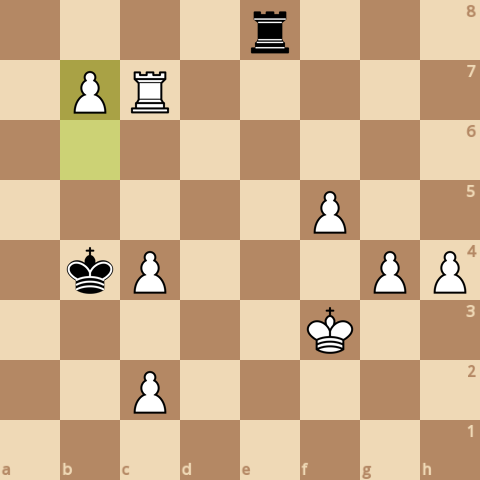

### board0114.png

Found a new move 113\
Analyzed boards: 17795645\
Average speed for the move: 354732 boards/s\
Time taken for the move: 0.142877s\
Total time taken: 90.8631s\
Current white score: 21300, black score: 20660\
Current board after move:\
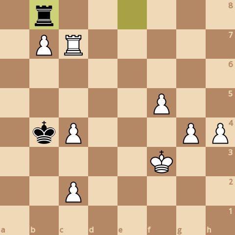

### board0115.png

Found a new move 114\
Analyzed boards: 17839946\
Average speed for the move: 390073 boards/s\
Time taken for the move: 0.113571s\
Total time taken: 90.9767s\
Current white score: 21310, black score: 20660\
Current board after move:\
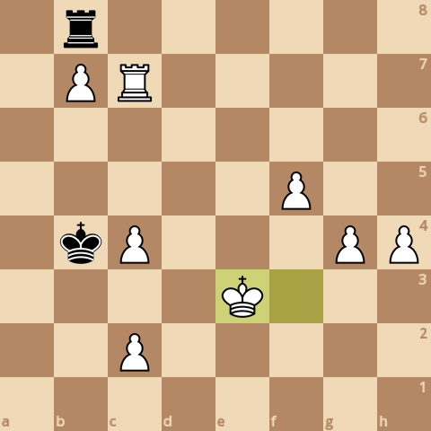

### board0116.png

Found a new move 115\
Analyzed boards: 17856251\
Average speed for the move: 338995 boards/s\
Time taken for the move: 0.048098s\
Total time taken: 91.0248s\
Current white score: 21300, black score: 20660\
Current board after move:\
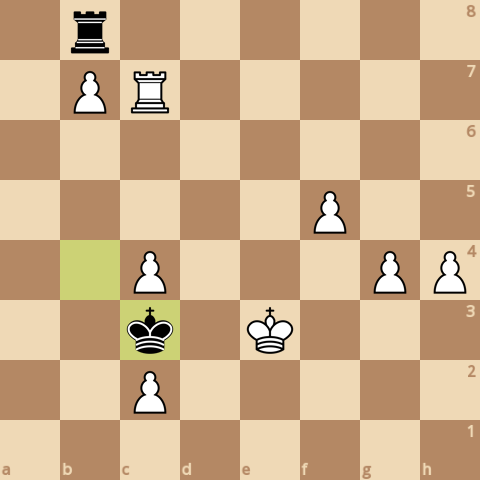

### board0117.png

Found a new move 116\
Analyzed boards: 17875526\
Average speed for the move: 328169 boards/s\
Time taken for the move: 0.058735s\
Total time taken: 91.0835s\
Current white score: 21310, black score: 20660\
Current board after move:\
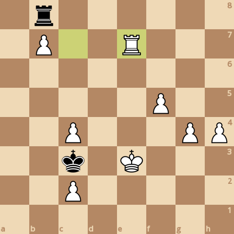

### board0118.png

Found a new move 117\
Analyzed boards: 17906975\
Average speed for the move: 267909 boards/s\
Time taken for the move: 0.117387s\
Total time taken: 91.2009s\
Current white score: 21210, black score: 20660\
Current board after move:\
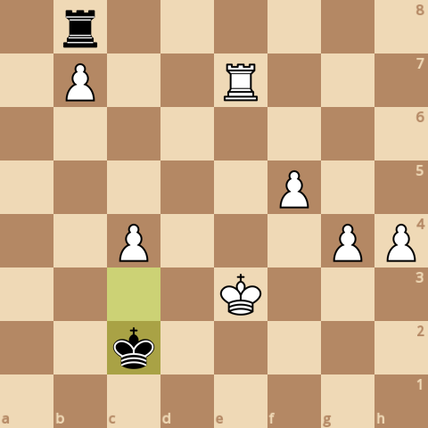

### board0119.png

Found a new move 118\
Analyzed boards: 17946492\
Average speed for the move: 347442 boards/s\
Time taken for the move: 0.113737s\
Total time taken: 91.3146s\
Current white score: 21210, black score: 20660\
Current board after move:\
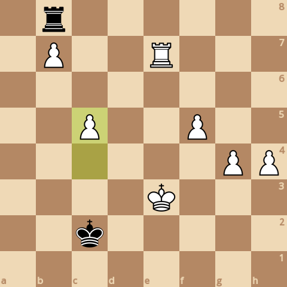

### board0120.png

Found a new move 119\
Analyzed boards: 18027354\
Average speed for the move: 377911 boards/s\
Time taken for the move: 0.213971s\
Total time taken: 91.5286s\
Current white score: 21210, black score: 20660\
Current board after move:\
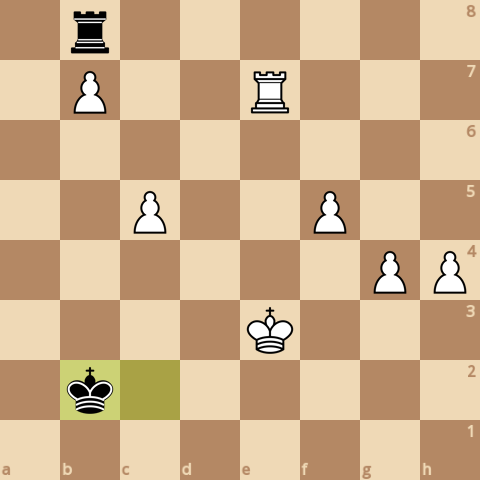

### board0121.png

Found a new move 120\
Analyzed boards: 18064074\
Average speed for the move: 383159 boards/s\
Time taken for the move: 0.095835s\
Total time taken: 91.6244s\
Current white score: 21210, black score: 20660\
Current board after move:\
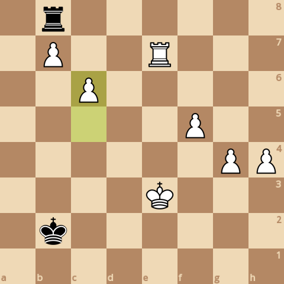

### board0122.png

Found a new move 121\
Analyzed boards: 18163254\
Average speed for the move: 371635 boards/s\
Time taken for the move: 0.266875s\
Total time taken: 91.8913s\
Current white score: 21210, black score: 20660\
Current board after move:\
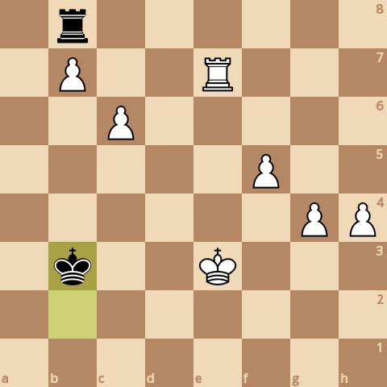

### board0123.png

Found a new move 122\
Analyzed boards: 18202838\
Average speed for the move: 379110 boards/s\
Time taken for the move: 0.104413s\
Total time taken: 91.9957s\
Current white score: 21270, black score: 20660\
Current board after move:\
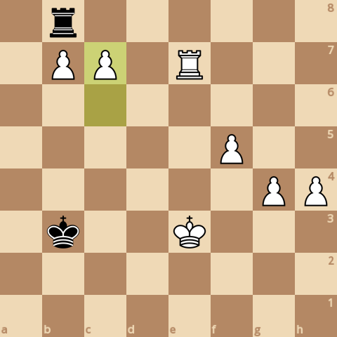

### board0124.png

Found a new move 123\
Analyzed boards: 18207695\
Average speed for the move: 343907 boards/s\
Time taken for the move: 0.014123s\
Total time taken: 92.0098s\
Current white score: 21130, black score: 20640\
Current board after move:\
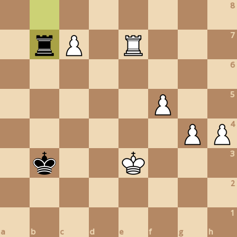

### board0125.png

Found a new move 124\
Analyzed boards: 18220036\
Average speed for the move: 406114 boards/s\
Time taken for the move: 0.030388s\
Total time taken: 92.0402s\
Current white score: 21160, black score: 20640\
Current board after move:\
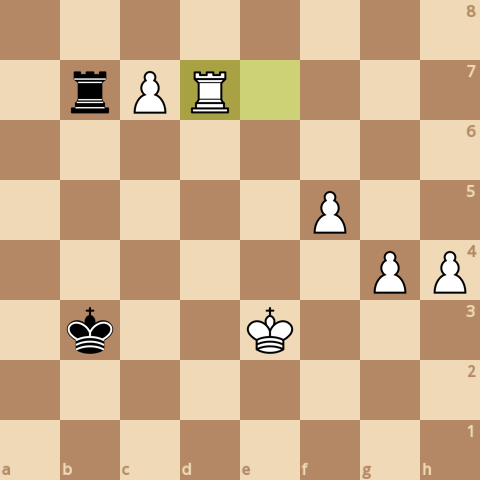

### board0126.png

Found a new move 125\
Analyzed boards: 18221473\
Average speed for the move: 313345 boards/s\
Time taken for the move: 0.004586s\
Total time taken: 92.0448s\
Current white score: 21030, black score: 20680\
Current board after move:\
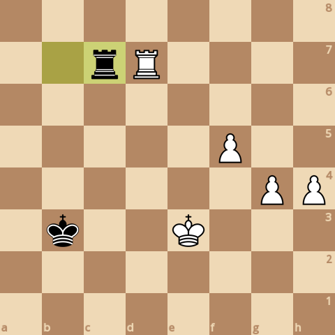

### board0127.png

Found a new move 126\
Analyzed boards: 18226104\
Average speed for the move: 422652 boards/s\
Time taken for the move: 0.010957s\
Total time taken: 92.0558s\
Current white score: 21050, black score: 20080\
Current board after move:\
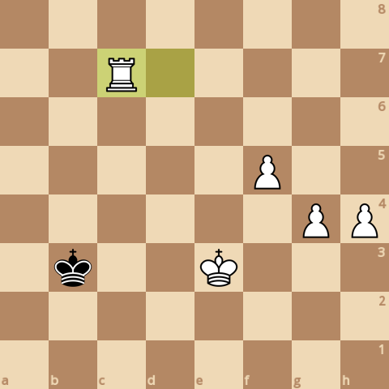

### board0128.png

Found a new move 127\
Analyzed boards: 18230280\
Average speed for the move: 440506 boards/s\
Time taken for the move: 0.00948s\
Total time taken: 92.0653s\
Current white score: 21050, black score: 20080\
Current board after move:\
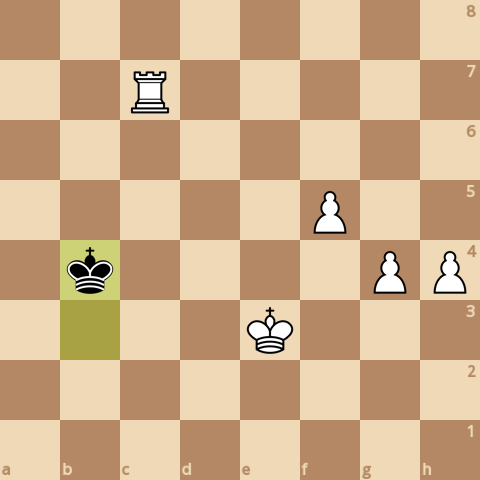

### board0129.png

Found a new move 128\
Analyzed boards: 18239248\
Average speed for the move: 486176 boards/s\
Time taken for the move: 0.018446s\
Total time taken: 92.0837s\
Current white score: 21050, black score: 20080\
Current board after move:\
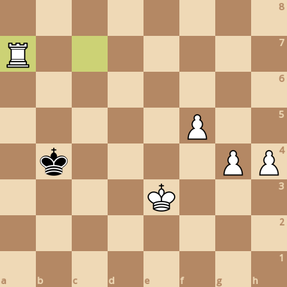

### board0130.png

Found a new move 129\
Analyzed boards: 18253100\
Average speed for the move: 414817 boards/s\
Time taken for the move: 0.033393s\
Total time taken: 92.1171s\
Current white score: 21050, black score: 20080\
Current board after move:\
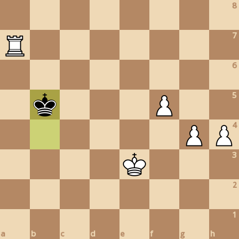

### board0131.png

Found a new move 130\
Analyzed boards: 18261716\
Average speed for the move: 505159 boards/s\
Time taken for the move: 0.017056s\
Total time taken: 92.1342s\
Current white score: 21010, black score: 20080\
Current board after move:\
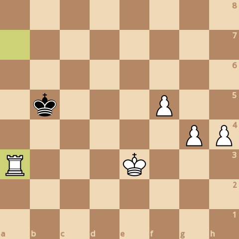

### board0132.png

Found a new move 131\
Analyzed boards: 18271451\
Average speed for the move: 431497 boards/s\
Time taken for the move: 0.022561s\
Total time taken: 92.1567s\
Current white score: 21010, black score: 20080\
Current board after move:\

### board0133.png

Found a new move 132\
Analyzed boards: 18278847\
Average speed for the move: 444872 boards/s\
Time taken for the move: 0.016625s\
Total time taken: 92.1733s\
Current white score: 21050, black score: 20080\
Current board after move:\
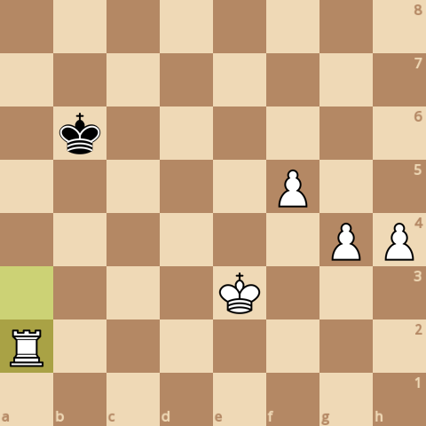

### board0134.png

Found a new move 133\
Analyzed boards: 18284193\
Average speed for the move: 428984 boards/s\
Time taken for the move: 0.012462s\
Total time taken: 92.1858s\
Current white score: 21050, black score: 20080\
Current board after move:\
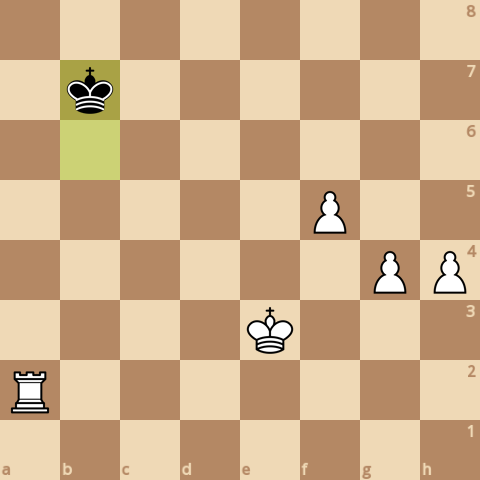

### board0135.png

Found a new move 134\
Analyzed boards: 18287023\
Average speed for the move: 417959 boards/s\
Time taken for the move: 0.006771s\
Total time taken: 92.1926s\
Current white score: 21050, black score: 20080\
Current board after move:\
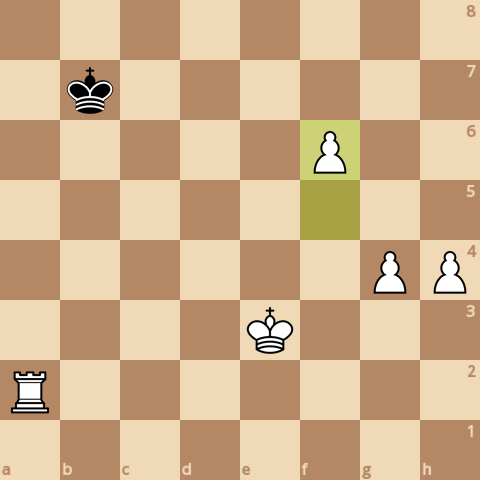

### board0136.png

Found a new move 135\
Analyzed boards: 18290844\
Average speed for the move: 473893 boards/s\
Time taken for the move: 0.008063s\
Total time taken: 92.2006s\
Current white score: 21050, black score: 20080\
Current board after move:\
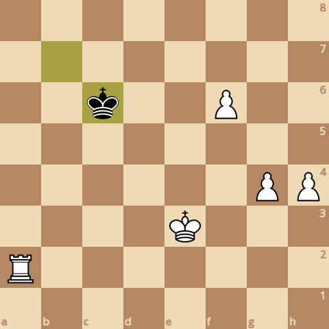

### board0137.png

Found a new move 136\
Analyzed boards: 18294225\
Average speed for the move: 454435 boards/s\
Time taken for the move: 0.00744s\
Total time taken: 92.2081s\
Current white score: 21080, black score: 20080\
Current board after move:\
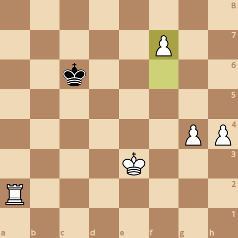

### board0138.png

Found a new move 137\
Analyzed boards: 18300917\
Average speed for the move: 487045 boards/s\
Time taken for the move: 0.01374s\
Total time taken: 92.2218s\
Current white score: 21080, black score: 20080\
Current board after move:\
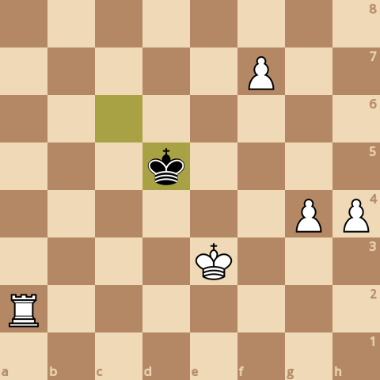

### board0139.png

Found a new move 138\
Analyzed boards: 18311657\
Average speed for the move: 472711 boards/s\
Time taken for the move: 0.02272s\
Total time taken: 92.2445s\
Current white score: 22050, black score: 20080\
Current board after move:\
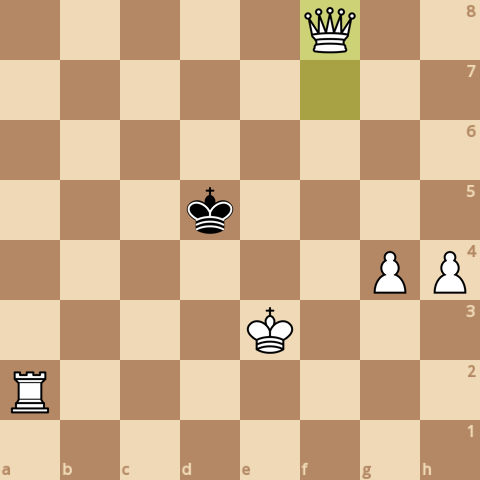

### board0140.png

Found a new move 139\
Analyzed boards: 18318424\
Average speed for the move: 329102 boards/s\
Time taken for the move: 0.020562s\
Total time taken: 92.2651s\
Current white score: 22050, black score: 20080\
Current board after move:\
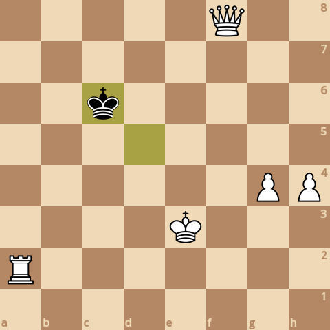

### board0141.png

Found a new move 140\
Analyzed boards: 18331851\
Average speed for the move: 424194 boards/s\
Time taken for the move: 0.031653s\
Total time taken: 92.2967s\
Current white score: 22050, black score: 20080\
Current board after move:\
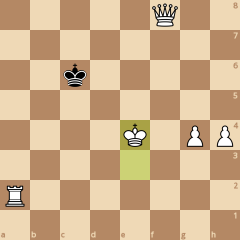

### board0142.png

Found a new move 141\
Analyzed boards: 18344285\
Average speed for the move: 362022 boards/s\
Time taken for the move: 0.034346s\
Total time taken: 92.3311s\
Current white score: 22050, black score: 20080\
Current board after move:\

### board0143.png

Found a new move 142\
Analyzed boards: 18355708\
Average speed for the move: 361407 boards/s\
Time taken for the move: 0.031607s\
Total time taken: 92.3627s\
Current white score: 22050, black score: 20080\
Current board after move:\
Game ended, it's a checkmate!\
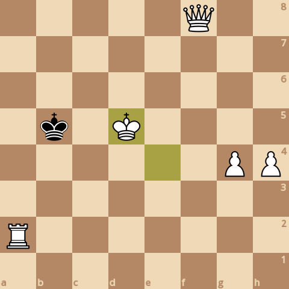

