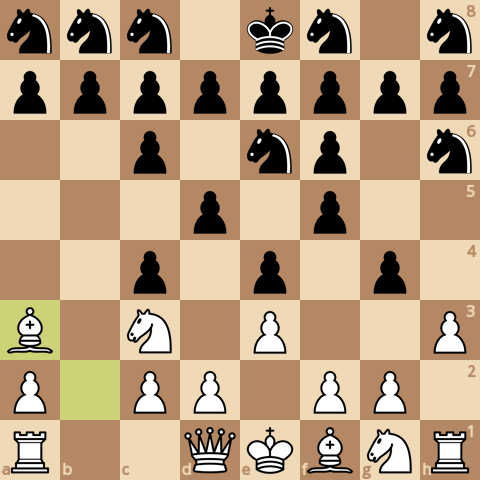
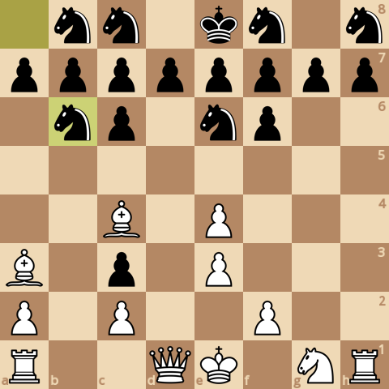
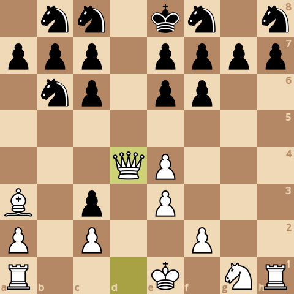
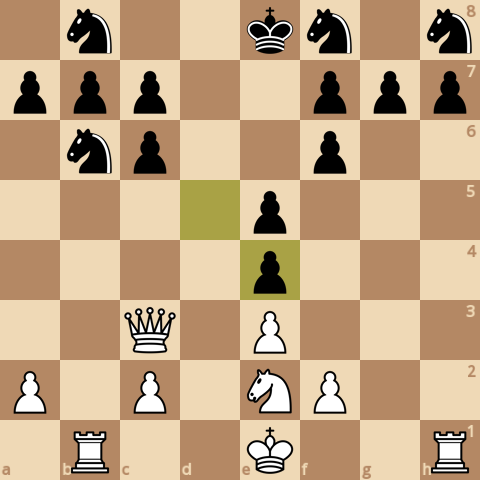
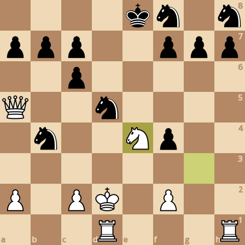
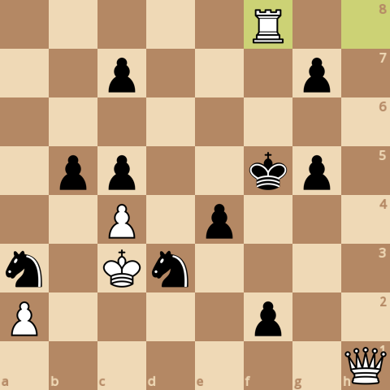

### board0000.png

Current board:\

### board0001.png

Found a new move 0\
Analyzed boards: 40524\
Average speed for the move: 162078 boards/s\
Time taken for the move: 0.250028s\
Total time taken: 0.250028s\
Current white score: 24190, black score: 23980\
Current board after move:\

### board0002.png

Found a new move 1\
Analyzed boards: 482850\
Average speed for the move: 160482 boards/s\
Time taken for the move: 2.75624s\
Total time taken: 3.00627s\
Current white score: 24170, black score: 23980\
Current board after move:\

### board0003.png

Found a new move 2\
Analyzed boards: 646864\
Average speed for the move: 155966 boards/s\
Time taken for the move: 1.0516s\
Total time taken: 4.05787s\
Current white score: 24170, black score: 23990\
Current board after move:\

### board0004.png

Found a new move 3\
Analyzed boards: 1315584\
Average speed for the move: 160798 boards/s\
Time taken for the move: 4.15876s\
Total time taken: 8.21663s\
Current white score: 24170, black score: 23970\
Current board after move:\

### board0005.png

Found a new move 4\
Analyzed boards: 1737009\
Average speed for the move: 156319 boards/s\
Time taken for the move: 2.69593s\
Total time taken: 10.9126s\
Current white score: 24180, black score: 23960\
Current board after move:\

### board0006.png

Found a new move 5\
Analyzed boards: 2659709\
Average speed for the move: 163527 boards/s\
Time taken for the move: 5.64248s\
Total time taken: 16.555s\
Current white score: 24170, black score: 23970\
Current board after move:\

### board0007.png

Found a new move 6\
Analyzed boards: 3581305\
Average speed for the move: 155870 boards/s\
Time taken for the move: 5.91261s\
Total time taken: 22.4677s\
Current white score: 24210, black score: 23970\
Current board after move:\

### board0008.png

Found a new move 7\
Analyzed boards: 7715607\
Average speed for the move: 157315 boards/s\
Time taken for the move: 26.2804s\
Total time taken: 48.7481s\
Current white score: 24210, black score: 24000\
Current board after move:\

### board0009.png

Found a new move 8\
Analyzed boards: 9264298\
Average speed for the move: 148147 boards/s\
Time taken for the move: 10.4537s\
Total time taken: 59.2018s\
Current white score: 24210, black score: 23910\
Current board after move:\

### board0010.png

Found a new move 9\
Analyzed boards: 11217810\
Average speed for the move: 155596 boards/s\
Time taken for the move: 12.555s\
Total time taken: 71.7569s\
Current white score: 24090, black score: 23890\
Current board after move:\

### board0011.png

Found a new move 10\
Analyzed boards: 11772499\
Average speed for the move: 153163 boards/s\
Time taken for the move: 3.62156s\
Total time taken: 75.3784s\
Current white score: 24120, black score: 23880\
Current board after move:\

### board0012.png

Found a new move 11\
Analyzed boards: 13741944\
Average speed for the move: 156487 boards/s\
Time taken for the move: 12.5853s\
Total time taken: 87.9638s\
Current white score: 24110, black score: 23870\
Current board after move:\

### board0013.png

Found a new move 12\
Analyzed boards: 14561911\
Average speed for the move: 150089 boards/s\
Time taken for the move: 5.46321s\
Total time taken: 93.427s\
Current white score: 24130, black score: 23870\
Current board after move:\

### board0014.png

Found a new move 13\
Analyzed boards: 17792627\
Average speed for the move: 157668 boards/s\
Time taken for the move: 20.4906s\
Total time taken: 113.918s\
Current white score: 24120, black score: 23890\
Current board after move:\

### board0015.png

Found a new move 14\
Analyzed boards: 19317825\
Average speed for the move: 147778 boards/s\
Time taken for the move: 10.3209s\
Total time taken: 124.238s\
Current white score: 24150, black score: 23780\
Current board after move:\

### board0016.png

Found a new move 15\
Analyzed boards: 23213320\
Average speed for the move: 170876 boards/s\
Time taken for the move: 22.7972s\
Total time taken: 147.036s\
Current white score: 24050, black score: 23820\
Current board after move:\

### board0017.png

Found a new move 16\
Analyzed boards: 26183048\
Average speed for the move: 160452 boards/s\
Time taken for the move: 18.5086s\
Total time taken: 165.544s\
Current white score: 24060, black score: 23720\
Current board after move:\

### board0018.png

Found a new move 17\
Analyzed boards: 27594632\
Average speed for the move: 172930 boards/s\
Time taken for the move: 8.16277s\
Total time taken: 173.707s\
Current white score: 24060, black score: 23730\
Current board after move:\

### board0019.png

Found a new move 18\
Analyzed boards: 29011585\
Average speed for the move: 161466 boards/s\
Time taken for the move: 8.77552s\
Total time taken: 182.482s\
Current white score: 24080, black score: 23620\
Current board after move:\

### board0020.png

Found a new move 19\
Analyzed boards: 31836920\
Average speed for the move: 174084 boards/s\
Time taken for the move: 16.2298s\
Total time taken: 198.712s\
Current white score: 24000, black score: 23630\
Current board after move:\

### board0021.png

Found a new move 20\
Analyzed boards: 32715849\
Average speed for the move: 166764 boards/s\
Time taken for the move: 5.27051s\
Total time taken: 203.983s\
Current white score: 24020, black score: 23270\
Current board after move:\

### board0022.png

Found a new move 21\
Analyzed boards: 33387112\
Average speed for the move: 172156 boards/s\
Time taken for the move: 3.89916s\
Total time taken: 207.882s\
Current white score: 23690, black score: 23250\
Current board after move:\

### board0023.png

Found a new move 22\
Analyzed boards: 33899062\
Average speed for the move: 172483 boards/s\
Time taken for the move: 2.96812s\
Total time taken: 210.85s\
Current white score: 23730, black score: 23150\
Current board after move:\

### board0024.png

Found a new move 23\
Analyzed boards: 35797654\
Average speed for the move: 188397 boards/s\
Time taken for the move: 10.0776s\
Total time taken: 220.928s\
Current white score: 23730, black score: 23150\
Current board after move:\

### board0025.png

Found a new move 24\
Analyzed boards: 36139995\
Average speed for the move: 179709 boards/s\
Time taken for the move: 1.90497s\
Total time taken: 222.833s\
Current white score: 23730, black score: 22840\
Current board after move:\

### board0026.png

Found a new move 25\
Analyzed boards: 36529617\
Average speed for the move: 196756 boards/s\
Time taken for the move: 1.98022s\
Total time taken: 224.813s\
Current white score: 23360, black score: 22840\
Current board after move:\

### board0027.png

Found a new move 26\
Analyzed boards: 36747898\
Average speed for the move: 193230 boards/s\
Time taken for the move: 1.12964s\
Total time taken: 225.942s\
Current white score: 23410, black score: 22840\
Current board after move:\

### board0028.png

Found a new move 27\
Analyzed boards: 37438177\
Average speed for the move: 206723 boards/s\
Time taken for the move: 3.33915s\
Total time taken: 229.282s\
Current white score: 23380, black score: 22890\
Current board after move:\

### board0029.png

Found a new move 28\
Analyzed boards: 38484433\
Average speed for the move: 196593 boards/s\
Time taken for the move: 5.32194s\
Total time taken: 234.604s\
Current white score: 23430, black score: 22560\
Current board after move:\

### board0030.png

Found a new move 29\
Analyzed boards: 39019175\
Average speed for the move: 212804 boards/s\
Time taken for the move: 2.51284s\
Total time taken: 237.116s\
Current white score: 23050, black score: 22560\
Current board after move:\

### board0031.png

Found a new move 30\
Analyzed boards: 39130035\
Average speed for the move: 216222 boards/s\
Time taken for the move: 0.512714s\
Total time taken: 237.629s\
Current white score: 23090, black score: 22560\
Current board after move:\

### board0032.png

Found a new move 31\
Analyzed boards: 39981509\
Average speed for the move: 227176 boards/s\
Time taken for the move: 3.74808s\
Total time taken: 241.377s\
Current white score: 23090, black score: 22550\
Current board after move:\

### board0033.png

Found a new move 32\
Analyzed boards: 40383109\
Average speed for the move: 219795 boards/s\
Time taken for the move: 1.82715s\
Total time taken: 243.204s\
Current white score: 23130, black score: 22550\
Current board after move:\

### board0034.png

Found a new move 33\
Analyzed boards: 43296360\
Average speed for the move: 223715 boards/s\
Time taken for the move: 13.0222s\
Total time taken: 256.226s\
Current white score: 23110, black score: 22560\
Current board after move:\

### board0035.png

Found a new move 34\
Analyzed boards: 43826076\
Average speed for the move: 218090 boards/s\
Time taken for the move: 2.42889s\
Total time taken: 258.655s\
Current white score: 23130, black score: 22460\
Current board after move:\

### board0036.png

Found a new move 35\
Analyzed boards: 44983242\
Average speed for the move: 223226 boards/s\
Time taken for the move: 5.18384s\
Total time taken: 263.839s\
Current white score: 23020, black score: 22450\
Current board after move:\

### board0037.png

Found a new move 36\
Analyzed boards: 45355914\
Average speed for the move: 219887 boards/s\
Time taken for the move: 1.69483s\
Total time taken: 265.534s\
Current white score: 23040, black score: 22440\
Current board after move:\

### board0038.png

Found a new move 37\
Analyzed boards: 45791723\
Average speed for the move: 232386 boards/s\
Time taken for the move: 1.87536s\
Total time taken: 267.409s\
Current white score: 23030, black score: 22440\
Current board after move:\

### board0039.png

Found a new move 38\
Analyzed boards: 46902574\
Average speed for the move: 224349 boards/s\
Time taken for the move: 4.95144s\
Total time taken: 272.361s\
Current white score: 23040, black score: 22440\
Current board after move:\

### board0040.png

Found a new move 39\
Analyzed boards: 47488227\
Average speed for the move: 222935 boards/s\
Time taken for the move: 2.62701s\
Total time taken: 274.988s\
Current white score: 23010, black score: 22460\
Current board after move:\

### board0041.png

Found a new move 40\
Analyzed boards: 48312018\
Average speed for the move: 215566 boards/s\
Time taken for the move: 3.82153s\
Total time taken: 278.809s\
Current white score: 23010, black score: 22460\
Current board after move:\

### board0042.png

Found a new move 41\
Analyzed boards: 49369525\
Average speed for the move: 227669 boards/s\
Time taken for the move: 4.64493s\
Total time taken: 283.454s\
Current white score: 23000, black score: 22470\
Current board after move:\

### board0043.png

Found a new move 42\
Analyzed boards: 50290309\
Average speed for the move: 208199 boards/s\
Time taken for the move: 4.42262s\
Total time taken: 287.877s\
Current white score: 23010, black score: 22470\
Current board after move:\

### board0044.png

Found a new move 43\
Analyzed boards: 51776831\
Average speed for the move: 210612 boards/s\
Time taken for the move: 7.0581s\
Total time taken: 294.935s\
Current white score: 23010, black score: 22500\
Current board after move:\

### board0045.png

Found a new move 44\
Analyzed boards: 53157443\
Average speed for the move: 207336 boards/s\
Time taken for the move: 6.65881s\
Total time taken: 301.594s\
Current white score: 23030, black score: 22400\
Current board after move:\

### board0046.png

Found a new move 45\
Analyzed boards: 54687400\
Average speed for the move: 212542 boards/s\
Time taken for the move: 7.19838s\
Total time taken: 308.792s\
Current white score: 22910, black score: 22400\
Current board after move:\

### board0047.png

Found a new move 46\
Analyzed boards: 55438159\
Average speed for the move: 210346 boards/s\
Time taken for the move: 3.56916s\
Total time taken: 312.361s\
Current white score: 22920, black score: 22280\
Current board after move:\

### board0048.png

Found a new move 47\
Analyzed boards: 56193052\
Average speed for the move: 224220 boards/s\
Time taken for the move: 3.36675s\
Total time taken: 315.728s\
Current white score: 22920, black score: 22290\
Current board after move:\

### board0049.png

Found a new move 48\
Analyzed boards: 56625604\
Average speed for the move: 228757 boards/s\
Time taken for the move: 1.89088s\
Total time taken: 317.619s\
Current white score: 22920, black score: 22270\
Current board after move:\

### board0050.png

Found a new move 49\
Analyzed boards: 57304751\
Average speed for the move: 231857 boards/s\
Time taken for the move: 2.92916s\
Total time taken: 320.548s\
Current white score: 22910, black score: 22280\
Current board after move:\

### board0051.png

Found a new move 50\
Analyzed boards: 57602806\
Average speed for the move: 228295 boards/s\
Time taken for the move: 1.30557s\
Total time taken: 321.854s\
Current white score: 22970, black score: 22280\
Current board after move:\

### board0052.png

Found a new move 51\
Analyzed boards: 57713426\
Average speed for the move: 232595 boards/s\
Time taken for the move: 0.47559s\
Total time taken: 322.329s\
Current white score: 22970, black score: 22290\
Current board after move:\

### board0053.png

Found a new move 52\
Analyzed boards: 58140872\
Average speed for the move: 228091 boards/s\
Time taken for the move: 1.87401s\
Total time taken: 324.203s\
Current white score: 22980, black score: 22180\
Current board after move:\

### board0054.png

Found a new move 53\
Analyzed boards: 58508972\
Average speed for the move: 234668 boards/s\
Time taken for the move: 1.5686s\
Total time taken: 325.772s\
Current white score: 22960, black score: 22160\
Current board after move:\

### board0055.png

Found a new move 54\
Analyzed boards: 59233950\
Average speed for the move: 235209 boards/s\
Time taken for the move: 3.08227s\
Total time taken: 328.854s\
Current white score: 22970, black score: 22150\
Current board after move:\

### board0056.png

Found a new move 55\
Analyzed boards: 59553282\
Average speed for the move: 245755 boards/s\
Time taken for the move: 1.29939s\
Total time taken: 330.154s\
Current white score: 22960, black score: 22190\
Current board after move:\

### board0057.png

Found a new move 56\
Analyzed boards: 59935710\
Average speed for the move: 235671 boards/s\
Time taken for the move: 1.62272s\
Total time taken: 331.776s\
Current white score: 22970, black score: 22190\
Current board after move:\

### board0058.png

Found a new move 57\
Analyzed boards: 60007451\
Average speed for the move: 239177 boards/s\
Time taken for the move: 0.299949s\
Total time taken: 332.076s\
Current white score: 22630, black score: 22180\
Current board after move:\

### board0059.png

Found a new move 58\
Analyzed boards: 60066516\
Average speed for the move: 243213 boards/s\
Time taken for the move: 0.242853s\
Total time taken: 332.319s\
Current white score: 22660, black score: 21830\
Current board after move:\

### board0060.png

Found a new move 59\
Analyzed boards: 60155760\
Average speed for the move: 254394 boards/s\
Time taken for the move: 0.35081s\
Total time taken: 332.67s\
Current white score: 22660, black score: 21830\
Current board after move:\

### board0061.png

Found a new move 60\
Analyzed boards: 60388895\
Average speed for the move: 242396 boards/s\
Time taken for the move: 0.961794s\
Total time taken: 333.632s\
Current white score: 22700, black score: 21830\
Current board after move:\

### board0062.png

Found a new move 61\
Analyzed boards: 60521813\
Average speed for the move: 242306 boards/s\
Time taken for the move: 0.548554s\
Total time taken: 334.18s\
Current white score: 22660, black score: 21830\
Current board after move:\

### board0063.png

Found a new move 62\
Analyzed boards: 60540532\
Average speed for the move: 257699 boards/s\
Time taken for the move: 0.072639s\
Total time taken: 334.253s\
Current white score: 22620, black score: 21830\
Current board after move:\

### board0064.png

Found a new move 63\
Analyzed boards: 60671111\
Average speed for the move: 247241 boards/s\
Time taken for the move: 0.528144s\
Total time taken: 334.781s\
Current white score: 22580, black score: 21830\
Current board after move:\

### board0065.png

Found a new move 64\
Analyzed boards: 60849969\
Average speed for the move: 245954 boards/s\
Time taken for the move: 0.727202s\
Total time taken: 335.508s\
Current white score: 22650, black score: 21830\
Current board after move:\

### board0066.png

Found a new move 65\
Analyzed boards: 60926056\
Average speed for the move: 250395 boards/s\
Time taken for the move: 0.303868s\
Total time taken: 335.812s\
Current white score: 22660, black score: 21830\
Current board after move:\

### board0067.png

Found a new move 66\
Analyzed boards: 61277397\
Average speed for the move: 247758 boards/s\
Time taken for the move: 1.41808s\
Total time taken: 337.23s\
Current white score: 22670, black score: 21830\
Current board after move:\

### board0068.png

Found a new move 67\
Analyzed boards: 61376564\
Average speed for the move: 247682 boards/s\
Time taken for the move: 0.40038s\
Total time taken: 337.631s\
Current white score: 22660, black score: 21840\
Current board after move:\

### board0069.png

Found a new move 68\
Analyzed boards: 61592155\
Average speed for the move: 245644 boards/s\
Time taken for the move: 0.877656s\
Total time taken: 338.508s\
Current white score: 22610, black score: 21840\
Current board after move:\

### board0070.png

Found a new move 69\
Analyzed boards: 61853413\
Average speed for the move: 258936 boards/s\
Time taken for the move: 1.00897s\
Total time taken: 339.517s\
Current white score: 22610, black score: 21840\
Current board after move:\

### board0071.png

Found a new move 70\
Analyzed boards: 62147502\
Average speed for the move: 249149 boards/s\
Time taken for the move: 1.18038s\
Total time taken: 340.698s\
Current white score: 22680, black score: 21840\
Current board after move:\

### board0072.png

Found a new move 71\
Analyzed boards: 62307159\
Average speed for the move: 257504 boards/s\
Time taken for the move: 0.620017s\
Total time taken: 341.318s\
Current white score: 22680, black score: 21890\
Current board after move:\

### board0073.png

Found a new move 72\
Analyzed boards: 62515981\
Average speed for the move: 248801 boards/s\
Time taken for the move: 0.839315s\
Total time taken: 342.157s\
Current white score: 22700, black score: 21890\
Current board after move:\

### board0074.png

Found a new move 73\
Analyzed boards: 62877347\
Average speed for the move: 257293 boards/s\
Time taken for the move: 1.40449s\
Total time taken: 343.561s\
Current white score: 22670, black score: 21890\
Current board after move:\

### board0075.png

Found a new move 74\
Analyzed boards: 62939876\
Average speed for the move: 245346 boards/s\
Time taken for the move: 0.254861s\
Total time taken: 343.816s\
Current white score: 22650, black score: 21880\
Current board after move:\

### board0076.png

Found a new move 75\
Analyzed boards: 63113853\
Average speed for the move: 252271 boards/s\
Time taken for the move: 0.689644s\
Total time taken: 344.506s\
Current white score: 22650, black score: 21840\
Current board after move:\

### board0077.png

Found a new move 76\
Analyzed boards: 63126927\
Average speed for the move: 259760 boards/s\
Time taken for the move: 0.050331s\
Total time taken: 344.556s\
Current white score: 22650, black score: 21840\
Current board after move:\

### board0078.png

Found a new move 77\
Analyzed boards: 63298929\
Average speed for the move: 263611 boards/s\
Time taken for the move: 0.652485s\
Total time taken: 345.209s\
Current white score: 22550, black score: 21870\
Current board after move:\

### board0079.png

Found a new move 78\
Analyzed boards: 63409890\
Average speed for the move: 250598 boards/s\
Time taken for the move: 0.442784s\
Total time taken: 345.652s\
Current white score: 22500, black score: 21870\
Current board after move:\

### board0080.png

Found a new move 79\
Analyzed boards: 63456699\
Average speed for the move: 259274 boards/s\
Time taken for the move: 0.180539s\
Total time taken: 345.832s\
Current white score: 22490, black score: 21880\
Current board after move:\

### board0081.png

Found a new move 80\
Analyzed boards: 63461785\
Average speed for the move: 253704 boards/s\
Time taken for the move: 0.020047s\
Total time taken: 345.852s\
Current white score: 22540, black score: 21530\
Current board after move:\

### board0082.png

Found a new move 81\
Analyzed boards: 63475737\
Average speed for the move: 267644 boards/s\
Time taken for the move: 0.052129s\
Total time taken: 345.904s\
Current white score: 21960, black score: 21530\
Current board after move:\

### board0083.png

Found a new move 82\
Analyzed boards: 63515533\
Average speed for the move: 270085 boards/s\
Time taken for the move: 0.147346s\
Total time taken: 346.052s\
Current white score: 21970, black score: 21520\
Current board after move:\

### board0084.png

Found a new move 83\
Analyzed boards: 63541384\
Average speed for the move: 269556 boards/s\
Time taken for the move: 0.095902s\
Total time taken: 346.147s\
Current white score: 21970, black score: 21510\
Current board after move:\

### board0085.png

Found a new move 84\
Analyzed boards: 63594269\
Average speed for the move: 262742 boards/s\
Time taken for the move: 0.201281s\
Total time taken: 346.349s\
Current white score: 21990, black score: 21510\
Current board after move:\

### board0086.png

Found a new move 85\
Analyzed boards: 63652506\
Average speed for the move: 276229 boards/s\
Time taken for the move: 0.210829s\
Total time taken: 346.56s\
Current white score: 21990, black score: 21500\
Current board after move:\

### board0087.png

Found a new move 86\
Analyzed boards: 63849478\
Average speed for the move: 269557 boards/s\
Time taken for the move: 0.730724s\
Total time taken: 347.29s\
Current white score: 21990, black score: 21500\
Current board after move:\

### board0088.png

Found a new move 87\
Analyzed boards: 63940166\
Average speed for the move: 278022 boards/s\
Time taken for the move: 0.32619s\
Total time taken: 347.617s\
Current white score: 21990, black score: 21510\
Current board after move:\

### board0089.png

Found a new move 88\
Analyzed boards: 63963189\
Average speed for the move: 265833 boards/s\
Time taken for the move: 0.086607s\
Total time taken: 347.703s\
Current white score: 21990, black score: 21510\
Current board after move:\

### board0090.png

Found a new move 89\
Analyzed boards: 64039643\
Average speed for the move: 265843 boards/s\
Time taken for the move: 0.287591s\
Total time taken: 347.991s\
Current white score: 21990, black score: 21530\
Current board after move:\

### board0091.png

Found a new move 90\
Analyzed boards: 64090589\
Average speed for the move: 248118 boards/s\
Time taken for the move: 0.20533s\
Total time taken: 348.196s\
Current white score: 21970, black score: 21530\
Current board after move:\

### board0092.png

Found a new move 91\
Analyzed boards: 64206734\
Average speed for the move: 253584 boards/s\
Time taken for the move: 0.458014s\
Total time taken: 348.654s\
Current white score: 21940, black score: 21570\
Current board after move:\

### board0093.png

Found a new move 92\
Analyzed boards: 64414953\
Average speed for the move: 241975 boards/s\
Time taken for the move: 0.860498s\
Total time taken: 349.515s\
Current white score: 21990, black score: 21570\
Current board after move:\

### board0094.png

Found a new move 93\
Analyzed boards: 64457641\
Average speed for the move: 245967 boards/s\
Time taken for the move: 0.173552s\
Total time taken: 349.688s\
Current white score: 21990, black score: 21560\
Current board after move:\

### board0095.png

Found a new move 94\
Analyzed boards: 64513440\
Average speed for the move: 252272 boards/s\
Time taken for the move: 0.221186s\
Total time taken: 349.909s\
Current white score: 21990, black score: 21570\
Current board after move:\

### board0096.png

Found a new move 95\
Analyzed boards: 64664900\
Average speed for the move: 251321 boards/s\
Time taken for the move: 0.602656s\
Total time taken: 350.512s\
Current white score: 21970, black score: 21550\
Current board after move:\

### board0097.png

Found a new move 96\
Analyzed boards: 64801148\
Average speed for the move: 243711 boards/s\
Time taken for the move: 0.559056s\
Total time taken: 351.071s\
Current white score: 21960, black score: 21550\
Current board after move:\

### board0098.png

Found a new move 97\
Analyzed boards: 65061185\
Average speed for the move: 254866 boards/s\
Time taken for the move: 1.02029s\
Total time taken: 352.091s\
Current white score: 21970, black score: 21550\
Current board after move:\

### board0099.png

Found a new move 98\
Analyzed boards: 65230412\
Average speed for the move: 244410 boards/s\
Time taken for the move: 0.692391s\
Total time taken: 352.784s\
Current white score: 21950, black score: 21550\
Current board after move:\

### board0100.png

Found a new move 99\
Analyzed boards: 65272424\
Average speed for the move: 259725 boards/s\
Time taken for the move: 0.161756s\
Total time taken: 352.945s\
Current white score: 21980, black score: 21550\
Current board after move:\

### board0101.png

Found a new move 100\
Analyzed boards: 65509559\
Average speed for the move: 240940 boards/s\
Time taken for the move: 0.984206s\
Total time taken: 353.93s\
Current white score: 21950, black score: 21550\
Current board after move:\

### board0102.png

Found a new move 101\
Analyzed boards: 65552267\
Average speed for the move: 264353 boards/s\
Time taken for the move: 0.161557s\
Total time taken: 354.091s\
Current white score: 21960, black score: 21550\
Current board after move:\

### board0103.png

Found a new move 102\
Analyzed boards: 65736569\
Average speed for the move: 242060 boards/s\
Time taken for the move: 0.761391s\
Total time taken: 354.853s\
Current white score: 21950, black score: 21440\
Current board after move:\

### board0104.png

Found a new move 103\
Analyzed boards: 65818607\
Average speed for the move: 281344 boards/s\
Time taken for the move: 0.291593s\
Total time taken: 355.144s\
Current white score: 21860, black score: 21420\
Current board after move:\

### board0105.png

Found a new move 104\
Analyzed boards: 65952865\
Average speed for the move: 260621 boards/s\
Time taken for the move: 0.515146s\
Total time taken: 355.659s\
Current white score: 21880, black score: 21410\
Current board after move:\

### board0106.png

Found a new move 105\
Analyzed boards: 66006766\
Average speed for the move: 283454 boards/s\
Time taken for the move: 0.190158s\
Total time taken: 355.849s\
Current white score: 21880, black score: 21410\
Current board after move:\

### board0107.png

Found a new move 106\
Analyzed boards: 66071325\
Average speed for the move: 260157 boards/s\
Time taken for the move: 0.248154s\
Total time taken: 356.098s\
Current white score: 21810, black score: 21410\
Current board after move:\

### board0108.png

Found a new move 107\
Analyzed boards: 66084228\
Average speed for the move: 264737 boards/s\
Time taken for the move: 0.048739s\
Total time taken: 356.146s\
Current white score: 21820, black score: 21430\
Current board after move:\

### board0109.png

Found a new move 108\
Analyzed boards: 66126504\
Average speed for the move: 257895 boards/s\
Time taken for the move: 0.163927s\
Total time taken: 356.31s\
Current white score: 21870, black score: 21290\
Current board after move:\

### board0110.png

Found a new move 109\
Analyzed boards: 66150652\
Average speed for the move: 291094 boards/s\
Time taken for the move: 0.082956s\
Total time taken: 356.393s\
Current white score: 21870, black score: 21290\
Current board after move:\

### board0111.png

Found a new move 110\
Analyzed boards: 66161621\
Average speed for the move: 315591 boards/s\
Time taken for the move: 0.034757s\
Total time taken: 356.428s\
Current white score: 21850, black score: 21300\
Current board after move:\

### board0112.png

Found a new move 111\
Analyzed boards: 66195445\
Average speed for the move: 310825 boards/s\
Time taken for the move: 0.10882s\
Total time taken: 356.537s\
Current white score: 21830, black score: 21310\
Current board after move:\

### board0113.png

Found a new move 112\
Analyzed boards: 66212890\
Average speed for the move: 320627 boards/s\
Time taken for the move: 0.054409s\
Total time taken: 356.591s\
Current white score: 21850, black score: 21210\
Current board after move:\

### board0114.png

Found a new move 113\
Analyzed boards: 66243194\
Average speed for the move: 331623 boards/s\
Time taken for the move: 0.091381s\
Total time taken: 356.683s\
Current white score: 21870, black score: 21230\
Current board after move:\

### board0115.png

Found a new move 114\
Analyzed boards: 66273091\
Average speed for the move: 314113 boards/s\
Time taken for the move: 0.095179s\
Total time taken: 356.778s\
Current white score: 21870, black score: 21130\
Current board after move:\

### board0116.png

Found a new move 115\
Analyzed boards: 66297545\
Average speed for the move: 317189 boards/s\
Time taken for the move: 0.077096s\
Total time taken: 356.855s\
Current white score: 21880, black score: 21130\
Current board after move:\

### board0117.png

Found a new move 116\
Analyzed boards: 66308384\
Average speed for the move: 325867 boards/s\
Time taken for the move: 0.033262s\
Total time taken: 356.888s\
Current white score: 21890, black score: 21110\
Current board after move:\

### board0118.png

Found a new move 117\
Analyzed boards: 66334804\
Average speed for the move: 329694 boards/s\
Time taken for the move: 0.080135s\
Total time taken: 356.968s\
Current white score: 21880, black score: 21140\
Current board after move:\

### board0119.png

Found a new move 118\
Analyzed boards: 66354815\
Average speed for the move: 321312 boards/s\
Time taken for the move: 0.062279s\
Total time taken: 357.031s\
Current white score: 21920, black score: 21030\
Current board after move:\

### board0120.png

Found a new move 119\
Analyzed boards: 66381733\
Average speed for the move: 347612 boards/s\
Time taken for the move: 0.077437s\
Total time taken: 357.108s\
Current white score: 21880, black score: 21010\
Current board after move:\

### board0121.png

Found a new move 120\
Analyzed boards: 66409032\
Average speed for the move: 355743 boards/s\
Time taken for the move: 0.076738s\
Total time taken: 357.185s\
Current white score: 21870, black score: 21010\
Current board after move:\

### board0122.png

Found a new move 121\
Analyzed boards: 66443038\
Average speed for the move: 359551 boards/s\
Time taken for the move: 0.094579s\
Total time taken: 357.279s\
Current white score: 21890, black score: 21010\
Current board after move:\

### board0123.png

Found a new move 122\
Analyzed boards: 66469023\
Average speed for the move: 343286 boards/s\
Time taken for the move: 0.075695s\
Total time taken: 357.355s\
Current white score: 21880, black score: 21020\
Current board after move:\

### board0124.png

Found a new move 123\
Analyzed boards: 66477128\
Average speed for the move: 356844 boards/s\
Time taken for the move: 0.022713s\
Total time taken: 357.378s\
Current white score: 21890, black score: 21010\
Current board after move:\

### board0125.png

Found a new move 124\
Analyzed boards: 66511835\
Average speed for the move: 331186 boards/s\
Time taken for the move: 0.104796s\
Total time taken: 357.483s\
Current white score: 21900, black score: 21010\
Current board after move:\

### board0126.png

Found a new move 125\
Analyzed boards: 66532385\
Average speed for the move: 338684 boards/s\
Time taken for the move: 0.060676s\
Total time taken: 357.543s\
Current white score: 21910, black score: 20950\
Current board after move:\

### board0127.png

Found a new move 126\
Analyzed boards: 66557280\
Average speed for the move: 331403 boards/s\
Time taken for the move: 0.07512s\
Total time taken: 357.618s\
Current white score: 21900, black score: 20850\
Current board after move:\

### board0128.png

Found a new move 127\
Analyzed boards: 66587935\
Average speed for the move: 366091 boards/s\
Time taken for the move: 0.083736s\
Total time taken: 357.702s\
Current white score: 21900, black score: 20840\
Current board after move:\

### board0129.png

Found a new move 128\
Analyzed boards: 66620003\
Average speed for the move: 365476 boards/s\
Time taken for the move: 0.087743s\
Total time taken: 357.79s\
Current white score: 21880, black score: 20840\
Current board after move:\

### board0130.png

Found a new move 129\
Analyzed boards: 66647877\
Average speed for the move: 369755 boards/s\
Time taken for the move: 0.075385s\
Total time taken: 357.865s\
Current white score: 21880, black score: 20860\
Current board after move:\

### board0131.png

Found a new move 130\
Analyzed boards: 66671884\
Average speed for the move: 344547 boards/s\
Time taken for the move: 0.069677s\
Total time taken: 357.935s\
Current white score: 21870, black score: 20850\
Current board after move:\

### board0132.png

Found a new move 131\
Analyzed boards: 66683755\
Average speed for the move: 374125 boards/s\
Time taken for the move: 0.03173s\
Total time taken: 357.967s\
Current white score: 21880, black score: 20850\
Current board after move:\

### board0133.png

Found a new move 132\
Analyzed boards: 66706360\
Average speed for the move: 386311 boards/s\
Time taken for the move: 0.058515s\
Total time taken: 358.025s\
Current white score: 21890, black score: 20510\
Current board after move:\

### board0134.png

Found a new move 133\
Analyzed boards: 66707763\
Average speed for the move: 396104 boards/s\
Time taken for the move: 0.003542s\
Total time taken: 358.029s\
Current white score: 21280, black score: 20540\
Current board after move:\

### board0135.png

Found a new move 134\
Analyzed boards: 66710427\
Average speed for the move: 432960 boards/s\
Time taken for the move: 0.006153s\
Total time taken: 358.035s\
Current white score: 21310, black score: 20190\
Current board after move:\

### board0136.png

Found a new move 135\
Analyzed boards: 66715831\
Average speed for the move: 451877 boards/s\
Time taken for the move: 0.011959s\
Total time taken: 358.047s\
Current white score: 21310, black score: 20170\
Current board after move:\

### board0137.png

Found a new move 136\
Analyzed boards: 66721099\
Average speed for the move: 453356 boards/s\
Time taken for the move: 0.01162s\
Total time taken: 358.058s\
Current white score: 21310, black score: 20170\
Current board after move:\

### board0138.png

Found a new move 137\
Analyzed boards: 66727924\
Average speed for the move: 421895 boards/s\
Time taken for the move: 0.016177s\
Total time taken: 358.075s\
Current white score: 21310, black score: 20190\
Current board after move:\

### board0139.png

Found a new move 138\
Analyzed boards: 66735275\
Average speed for the move: 450153 boards/s\
Time taken for the move: 0.01633s\
Total time taken: 358.091s\
Current white score: 21310, black score: 20190\
Current board after move:\

### board0140.png

Found a new move 139\
Analyzed boards: 66743879\
Average speed for the move: 451038 boards/s\
Time taken for the move: 0.019076s\
Total time taken: 358.11s\
Current white score: 21330, black score: 20180\
Current board after move:\

### board0141.png

Found a new move 140\
Analyzed boards: 66748886\
Average speed for the move: 451040 boards/s\
Time taken for the move: 0.011101s\
Total time taken: 358.121s\
Current white score: 21310, black score: 20180\
Current board after move:\

### board0142.png

Found a new move 141\
Analyzed boards: 66750234\
Average speed for the move: 436953 boards/s\
Time taken for the move: 0.003085s\
Total time taken: 358.124s\
Current white score: 21310, black score: 20160\
Current board after move:\

### board0143.png

Found a new move 142\
Analyzed boards: 66753398\
Average speed for the move: 447208 boards/s\
Time taken for the move: 0.007075s\
Total time taken: 358.131s\
Current white score: 21300, black score: 20150\
Current board after move:\
Game ended, it's a checkmate!\

