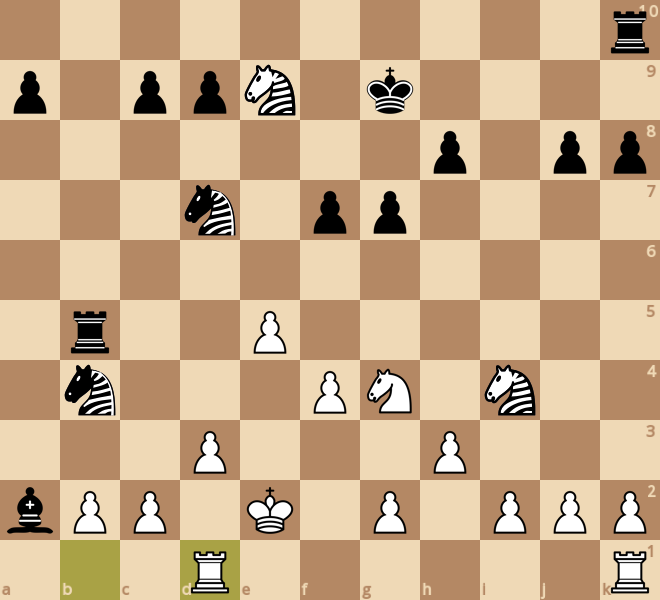
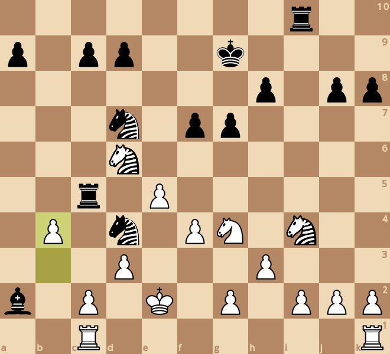
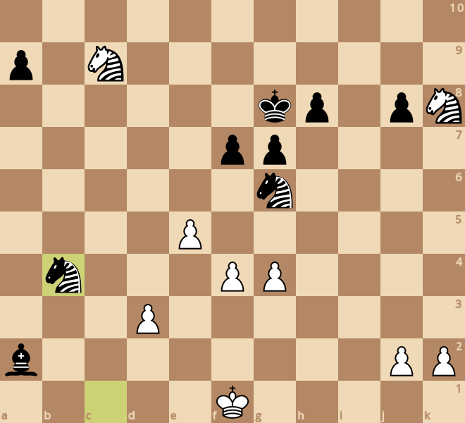
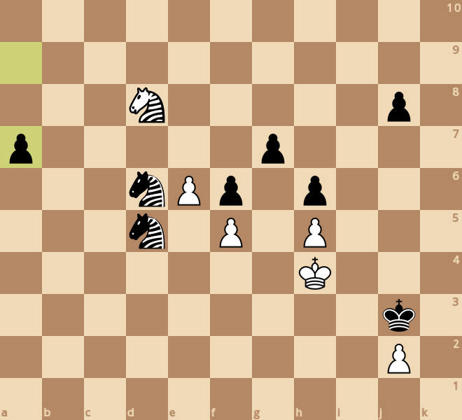
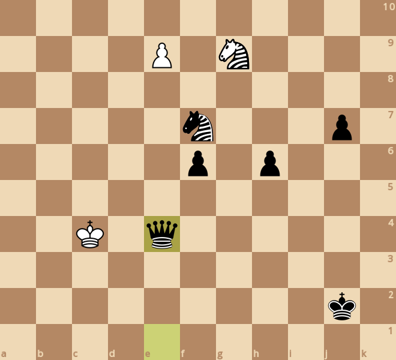
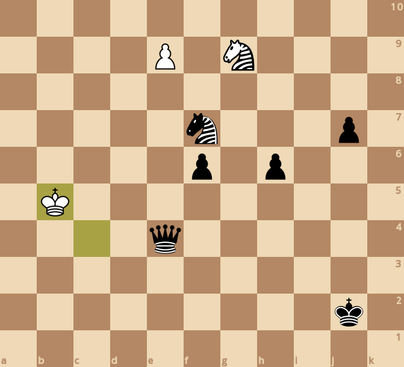

### board0000.png

Current board:\

### board0001.png

Found a new move 0\
Analyzed boards: 94615\
Average speed for the move: 117144 boards/s\
Time taken for the move: 0.807683s\
Total time taken: 0.807683s\
Current white score: 25870, black score: 25740\
Current board after move:\

### board0002.png

Found a new move 1\
Analyzed boards: 589512\
Average speed for the move: 113389 boards/s\
Time taken for the move: 4.36458s\
Total time taken: 5.17226s\
Current white score: 25870, black score: 25870\
Current board after move:\

### board0003.png

Found a new move 2\
Analyzed boards: 2373485\
Average speed for the move: 102543 boards/s\
Time taken for the move: 17.3973s\
Total time taken: 22.5695s\
Current white score: 25980, black score: 25870\
Current board after move:\

### board0004.png

Found a new move 3\
Analyzed boards: 4371927\
Average speed for the move: 96047 boards/s\
Time taken for the move: 20.8069s\
Total time taken: 43.3765s\
Current white score: 25980, black score: 26080\
Current board after move:\

### board0005.png

Found a new move 4\
Analyzed boards: 17031364\
Average speed for the move: 90432.3 boards/s\
Time taken for the move: 139.988s\
Total time taken: 183.365s\
Current white score: 25920, black score: 26080\
Current board after move:\

### board0006.png

Found a new move 5\
Analyzed boards: 23309484\
Average speed for the move: 81878.4 boards/s\
Time taken for the move: 76.6762s\
Total time taken: 260.041s\
Current white score: 25920, black score: 26090\
Current board after move:\

### board0007.png

Found a new move 6\
Analyzed boards: 34015421\
Average speed for the move: 89766.1 boards/s\
Time taken for the move: 119.265s\
Total time taken: 379.306s\
Current white score: 26170, black score: 26050\
Current board after move:\

### board0008.png

Found a new move 7\
Analyzed boards: 35010915\
Average speed for the move: 83559 boards/s\
Time taken for the move: 11.9137s\
Total time taken: 391.219s\
Current white score: 25020, black score: 26160\
Current board after move:\

### board0009.png

Found a new move 8\
Analyzed boards: 35217968\
Average speed for the move: 97897.4 boards/s\
Time taken for the move: 2.115s\
Total time taken: 393.334s\
Current white score: 25070, black score: 24990\
Current board after move:\

### board0010.png

Found a new move 9\
Analyzed boards: 36942658\
Average speed for the move: 101173 boards/s\
Time taken for the move: 17.0469s\
Total time taken: 410.381s\
Current white score: 25070, black score: 24990\
Current board after move:\

### board0011.png

Found a new move 10\
Analyzed boards: 38390499\
Average speed for the move: 104347 boards/s\
Time taken for the move: 13.8752s\
Total time taken: 424.256s\
Current white score: 25040, black score: 24970\
Current board after move:\

### board0012.png

Found a new move 11\
Analyzed boards: 38616852\
Average speed for the move: 104026 boards/s\
Time taken for the move: 2.17592s\
Total time taken: 426.432s\
Current white score: 25040, black score: 25010\
Current board after move:\

### board0013.png

Found a new move 12\
Analyzed boards: 39131258\
Average speed for the move: 101867 boards/s\
Time taken for the move: 5.04977s\
Total time taken: 431.482s\
Current white score: 25100, black score: 25010\
Current board after move:\

### board0014.png

Found a new move 13\
Analyzed boards: 39480121\
Average speed for the move: 106570 boards/s\
Time taken for the move: 3.27357s\
Total time taken: 434.756s\
Current white score: 25100, black score: 25030\
Current board after move:\

### board0015.png

Found a new move 14\
Analyzed boards: 40189608\
Average speed for the move: 109333 boards/s\
Time taken for the move: 6.48922s\
Total time taken: 441.245s\
Current white score: 25100, black score: 25030\
Current board after move:\

### board0016.png

Found a new move 15\
Analyzed boards: 40802197\
Average speed for the move: 108139 boards/s\
Time taken for the move: 5.66485s\
Total time taken: 446.91s\
Current white score: 25100, black score: 25050\
Current board after move:\

### board0017.png

Found a new move 16\
Analyzed boards: 41906323\
Average speed for the move: 103103 boards/s\
Time taken for the move: 10.709s\
Total time taken: 457.619s\
Current white score: 25150, black score: 25050\
Current board after move:\

### board0018.png

Found a new move 17\
Analyzed boards: 43738091\
Average speed for the move: 102285 boards/s\
Time taken for the move: 17.9085s\
Total time taken: 475.527s\
Current white score: 25150, black score: 25090\
Current board after move:\

### board0019.png

Found a new move 18\
Analyzed boards: 45599348\
Average speed for the move: 106632 boards/s\
Time taken for the move: 17.4549s\
Total time taken: 492.982s\
Current white score: 25210, black score: 25090\
Current board after move:\

### board0020.png

Found a new move 19\
Analyzed boards: 48090968\
Average speed for the move: 105797 boards/s\
Time taken for the move: 23.551s\
Total time taken: 516.533s\
Current white score: 25210, black score: 25120\
Current board after move:\

### board0021.png

Found a new move 20\
Analyzed boards: 50225983\
Average speed for the move: 98459.2 boards/s\
Time taken for the move: 21.6843s\
Total time taken: 538.217s\
Current white score: 25250, black score: 25120\
Current board after move:\

### board0022.png

Found a new move 21\
Analyzed boards: 55983975\
Average speed for the move: 99683.2 boards/s\
Time taken for the move: 57.7629s\
Total time taken: 595.98s\
Current white score: 25250, black score: 25170\
Current board after move:\

### board0023.png

Found a new move 22\
Analyzed boards: 58857331\
Average speed for the move: 103321 boards/s\
Time taken for the move: 27.8099s\
Total time taken: 623.79s\
Current white score: 25220, black score: 25170\
Current board after move:\

### board0024.png

Found a new move 23\
Analyzed boards: 61315984\
Average speed for the move: 100997 boards/s\
Time taken for the move: 24.3438s\
Total time taken: 648.134s\
Current white score: 25190, black score: 25190\
Current board after move:\

### board0025.png

Found a new move 24\
Analyzed boards: 65245465\
Average speed for the move: 97723.4 boards/s\
Time taken for the move: 40.2102s\
Total time taken: 688.344s\
Current white score: 25210, black score: 25190\
Current board after move:\

### board0026.png

Found a new move 25\
Analyzed boards: 67972579\
Average speed for the move: 89387.8 boards/s\
Time taken for the move: 30.5088s\
Total time taken: 718.853s\
Current white score: 25230, black score: 25280\
Current board after move:\

### board0027.png

Found a new move 26\
Analyzed boards: 70898970\
Average speed for the move: 89058.8 boards/s\
Time taken for the move: 32.8591s\
Total time taken: 751.712s\
Current white score: 25200, black score: 24950\
Current board after move:\

### board0028.png

Found a new move 27\
Analyzed boards: 73683602\
Average speed for the move: 90568.4 boards/s\
Time taken for the move: 30.7462s\
Total time taken: 782.458s\
Current white score: 24820, black score: 24950\
Current board after move:\

### board0029.png

Found a new move 28\
Analyzed boards: 76748440\
Average speed for the move: 95209.5 boards/s\
Time taken for the move: 32.1905s\
Total time taken: 814.649s\
Current white score: 24810, black score: 24950\
Current board after move:\

### board0030.png

Found a new move 29\
Analyzed boards: 79763342\
Average speed for the move: 104000 boards/s\
Time taken for the move: 28.9893s\
Total time taken: 843.638s\
Current white score: 24810, black score: 25000\
Current board after move:\

### board0031.png

Found a new move 30\
Analyzed boards: 83251588\
Average speed for the move: 103222 boards/s\
Time taken for the move: 33.7935s\
Total time taken: 877.432s\
Current white score: 24850, black score: 25000\
Current board after move:\

### board0032.png

Found a new move 31\
Analyzed boards: 85502008\
Average speed for the move: 103306 boards/s\
Time taken for the move: 21.784s\
Total time taken: 899.215s\
Current white score: 24850, black score: 25050\
Current board after move:\

### board0033.png

Found a new move 32\
Analyzed boards: 90963154\
Average speed for the move: 103671 boards/s\
Time taken for the move: 52.6776s\
Total time taken: 951.893s\
Current white score: 24880, black score: 25050\
Current board after move:\

### board0034.png

Found a new move 33\
Analyzed boards: 94428331\
Average speed for the move: 105737 boards/s\
Time taken for the move: 32.7716s\
Total time taken: 984.665s\
Current white score: 24880, black score: 25050\
Current board after move:\

### board0035.png

Found a new move 34\
Analyzed boards: 98537707\
Average speed for the move: 105586 boards/s\
Time taken for the move: 38.9197s\
Total time taken: 1023.58s\
Current white score: 24840, black score: 25050\
Current board after move:\

### board0036.png

Found a new move 35\
Analyzed boards: 99081805\
Average speed for the move: 106399 boards/s\
Time taken for the move: 5.11374s\
Total time taken: 1028.7s\
Current white score: 24840, black score: 25020\
Current board after move:\

### board0037.png

Found a new move 36\
Analyzed boards: 102339077\
Average speed for the move: 103570 boards/s\
Time taken for the move: 31.45s\
Total time taken: 1060.15s\
Current white score: 24830, black score: 24900\
Current board after move:\

### board0038.png

Found a new move 37\
Analyzed boards: 102805510\
Average speed for the move: 109604 boards/s\
Time taken for the move: 4.25561s\
Total time taken: 1064.4s\
Current white score: 24830, black score: 24930\
Current board after move:\

### board0039.png

Found a new move 38\
Analyzed boards: 107602362\
Average speed for the move: 109668 boards/s\
Time taken for the move: 43.7397s\
Total time taken: 1108.14s\
Current white score: 24840, black score: 24930\
Current board after move:\

### board0040.png

Found a new move 39\
Analyzed boards: 110577357\
Average speed for the move: 110289 boards/s\
Time taken for the move: 26.9746s\
Total time taken: 1135.12s\
Current white score: 24830, black score: 24960\
Current board after move:\

### board0041.png

Found a new move 40\
Analyzed boards: 113842818\
Average speed for the move: 109488 boards/s\
Time taken for the move: 29.8248s\
Total time taken: 1164.94s\
Current white score: 24850, black score: 24960\
Current board after move:\

### board0042.png

Found a new move 41\
Analyzed boards: 117312329\
Average speed for the move: 110954 boards/s\
Time taken for the move: 31.2697s\
Total time taken: 1196.21s\
Current white score: 24850, black score: 24920\
Current board after move:\

### board0043.png

Found a new move 42\
Analyzed boards: 123150513\
Average speed for the move: 109265 boards/s\
Time taken for the move: 53.4315s\
Total time taken: 1249.64s\
Current white score: 24810, black score: 24800\
Current board after move:\

### board0044.png

Found a new move 43\
Analyzed boards: 130186146\
Average speed for the move: 111639 boards/s\
Time taken for the move: 63.0211s\
Total time taken: 1312.67s\
Current white score: 24810, black score: 24830\
Current board after move:\

### board0045.png

Found a new move 44\
Analyzed boards: 142051692\
Average speed for the move: 113159 boards/s\
Time taken for the move: 104.858s\
Total time taken: 1417.52s\
Current white score: 24820, black score: 24830\
Current board after move:\

### board0046.png

Found a new move 45\
Analyzed boards: 148448418\
Average speed for the move: 113057 boards/s\
Time taken for the move: 56.5797s\
Total time taken: 1474.1s\
Current white score: 24810, black score: 24810\
Current board after move:\

### board0047.png

Found a new move 46\
Analyzed boards: 152549369\
Average speed for the move: 113764 boards/s\
Time taken for the move: 36.0478s\
Total time taken: 1510.15s\
Current white score: 24940, black score: 24810\
Current board after move:\

### board0048.png

Found a new move 47\
Analyzed boards: 158959065\
Average speed for the move: 111486 boards/s\
Time taken for the move: 57.493s\
Total time taken: 1567.64s\
Current white score: 24940, black score: 24770\
Current board after move:\

### board0049.png

Found a new move 48\
Analyzed boards: 161337298\
Average speed for the move: 112272 boards/s\
Time taken for the move: 21.1828s\
Total time taken: 1588.83s\
Current white score: 24950, black score: 24110\
Current board after move:\

### board0050.png

Found a new move 49\
Analyzed boards: 161641055\
Average speed for the move: 129896 boards/s\
Time taken for the move: 2.33846s\
Total time taken: 1591.16s\
Current white score: 24250, black score: 24110\
Current board after move:\

### board0051.png

Found a new move 50\
Analyzed boards: 163089777\
Average speed for the move: 132299 boards/s\
Time taken for the move: 10.9504s\
Total time taken: 1602.11s\
Current white score: 24240, black score: 24110\
Current board after move:\

### board0052.png

Found a new move 51\
Analyzed boards: 164098560\
Average speed for the move: 125506 boards/s\
Time taken for the move: 8.03775s\
Total time taken: 1610.15s\
Current white score: 24240, black score: 24110\
Current board after move:\

### board0053.png

Found a new move 52\
Analyzed boards: 164643354\
Average speed for the move: 119156 boards/s\
Time taken for the move: 4.57209s\
Total time taken: 1614.72s\
Current white score: 24270, black score: 24110\
Current board after move:\

### board0054.png

Found a new move 53\
Analyzed boards: 166551498\
Average speed for the move: 120450 boards/s\
Time taken for the move: 15.8418s\
Total time taken: 1630.57s\
Current white score: 23930, black score: 24080\
Current board after move:\

### board0055.png

Found a new move 54\
Analyzed boards: 167509890\
Average speed for the move: 124172 boards/s\
Time taken for the move: 7.71827s\
Total time taken: 1638.28s\
Current white score: 23940, black score: 23710\
Current board after move:\

### board0056.png

Found a new move 55\
Analyzed boards: 167989066\
Average speed for the move: 127661 boards/s\
Time taken for the move: 3.75351s\
Total time taken: 1642.04s\
Current white score: 23940, black score: 23810\
Current board after move:\

### board0057.png

Found a new move 56\
Analyzed boards: 169532088\
Average speed for the move: 127834 boards/s\
Time taken for the move: 12.0705s\
Total time taken: 1654.11s\
Current white score: 23920, black score: 23690\
Current board after move:\

### board0058.png

Found a new move 57\
Analyzed boards: 170456243\
Average speed for the move: 129985 boards/s\
Time taken for the move: 7.1097s\
Total time taken: 1661.22s\
Current white score: 23920, black score: 23700\
Current board after move:\

### board0059.png

Found a new move 58\
Analyzed boards: 172449022\
Average speed for the move: 133388 boards/s\
Time taken for the move: 14.9397s\
Total time taken: 1676.16s\
Current white score: 23910, black score: 23640\
Current board after move:\

### board0060.png

Found a new move 59\
Analyzed boards: 174477639\
Average speed for the move: 133445 boards/s\
Time taken for the move: 15.2018s\
Total time taken: 1691.36s\
Current white score: 23560, black score: 23640\
Current board after move:\

### board0061.png

Found a new move 60\
Analyzed boards: 175474687\
Average speed for the move: 140737 boards/s\
Time taken for the move: 7.08446s\
Total time taken: 1698.44s\
Current white score: 23570, black score: 23270\
Current board after move:\

### board0062.png

Found a new move 61\
Analyzed boards: 177729771\
Average speed for the move: 141359 boards/s\
Time taken for the move: 15.9529s\
Total time taken: 1714.4s\
Current white score: 23460, black score: 23260\
Current board after move:\

### board0063.png

Found a new move 62\
Analyzed boards: 180193616\
Average speed for the move: 145695 boards/s\
Time taken for the move: 16.911s\
Total time taken: 1731.31s\
Current white score: 23440, black score: 23260\
Current board after move:\

### board0064.png

Found a new move 63\
Analyzed boards: 182668384\
Average speed for the move: 140079 boards/s\
Time taken for the move: 17.6669s\
Total time taken: 1748.98s\
Current white score: 23440, black score: 23310\
Current board after move:\

### board0065.png

Found a new move 64\
Analyzed boards: 197399852\
Average speed for the move: 145766 boards/s\
Time taken for the move: 101.063s\
Total time taken: 1850.04s\
Current white score: 23460, black score: 23310\
Current board after move:\

### board0066.png

Found a new move 65\
Analyzed boards: 200165841\
Average speed for the move: 142244 boards/s\
Time taken for the move: 19.4453s\
Total time taken: 1869.48s\
Current white score: 23470, black score: 23330\
Current board after move:\

### board0067.png

Found a new move 66\
Analyzed boards: 202751418\
Average speed for the move: 144136 boards/s\
Time taken for the move: 17.9384s\
Total time taken: 1887.42s\
Current white score: 23460, black score: 23290\
Current board after move:\

### board0068.png

Found a new move 67\
Analyzed boards: 206562878\
Average speed for the move: 153427 boards/s\
Time taken for the move: 24.8421s\
Total time taken: 1912.26s\
Current white score: 23460, black score: 23260\
Current board after move:\

### board0069.png

Found a new move 68\
Analyzed boards: 211799170\
Average speed for the move: 150861 boards/s\
Time taken for the move: 34.7094s\
Total time taken: 1946.97s\
Current white score: 23470, black score: 23260\
Current board after move:\

### board0070.png

Found a new move 69\
Analyzed boards: 214355044\
Average speed for the move: 147815 boards/s\
Time taken for the move: 17.2911s\
Total time taken: 1964.26s\
Current white score: 23460, black score: 23310\
Current board after move:\

### board0071.png

Found a new move 70\
Analyzed boards: 217319403\
Average speed for the move: 155361 boards/s\
Time taken for the move: 19.0805s\
Total time taken: 1983.34s\
Current white score: 23470, black score: 23340\
Current board after move:\

### board0072.png

Found a new move 71\
Analyzed boards: 218328289\
Average speed for the move: 150615 boards/s\
Time taken for the move: 6.69846s\
Total time taken: 1990.04s\
Current white score: 23460, black score: 23340\
Current board after move:\

### board0073.png

Found a new move 72\
Analyzed boards: 219819989\
Average speed for the move: 155973 boards/s\
Time taken for the move: 9.56385s\
Total time taken: 1999.61s\
Current white score: 23480, black score: 23350\
Current board after move:\

### board0074.png

Found a new move 73\
Analyzed boards: 221565013\
Average speed for the move: 148235 boards/s\
Time taken for the move: 11.772s\
Total time taken: 2011.38s\
Current white score: 23360, black score: 23290\
Current board after move:\

### board0075.png

Found a new move 74\
Analyzed boards: 222878767\
Average speed for the move: 154581 boards/s\
Time taken for the move: 8.49882s\
Total time taken: 2019.88s\
Current white score: 23350, black score: 23290\
Current board after move:\

### board0076.png

Found a new move 75\
Analyzed boards: 223670540\
Average speed for the move: 152795 boards/s\
Time taken for the move: 5.18194s\
Total time taken: 2025.06s\
Current white score: 23320, black score: 23250\
Current board after move:\

### board0077.png

Found a new move 76\
Analyzed boards: 224270978\
Average speed for the move: 157449 boards/s\
Time taken for the move: 3.81355s\
Total time taken: 2028.87s\
Current white score: 23240, black score: 23270\
Current board after move:\

### board0078.png

Found a new move 77\
Analyzed boards: 225069516\
Average speed for the move: 156501 boards/s\
Time taken for the move: 5.10243s\
Total time taken: 2033.98s\
Current white score: 22890, black score: 23270\
Current board after move:\

### board0079.png

Found a new move 78\
Analyzed boards: 225992198\
Average speed for the move: 157969 boards/s\
Time taken for the move: 5.84091s\
Total time taken: 2039.82s\
Current white score: 22870, black score: 22670\
Current board after move:\

### board0080.png

Found a new move 79\
Analyzed boards: 226236594\
Average speed for the move: 162860 boards/s\
Time taken for the move: 1.50065s\
Total time taken: 2041.32s\
Current white score: 22340, black score: 22620\
Current board after move:\

### board0081.png

Found a new move 80\
Analyzed boards: 226817765\
Average speed for the move: 173904 boards/s\
Time taken for the move: 3.3419s\
Total time taken: 2044.66s\
Current white score: 22340, black score: 22620\
Current board after move:\

### board0082.png

Found a new move 81\
Analyzed boards: 226957981\
Average speed for the move: 177862 boards/s\
Time taken for the move: 0.788341s\
Total time taken: 2045.45s\
Current white score: 22370, black score: 22580\
Current board after move:\

### board0083.png

Found a new move 82\
Analyzed boards: 227457171\
Average speed for the move: 182956 boards/s\
Time taken for the move: 2.72846s\
Total time taken: 2048.18s\
Current white score: 22330, black score: 22480\
Current board after move:\

### board0084.png

Found a new move 83\
Analyzed boards: 227990886\
Average speed for the move: 195053 boards/s\
Time taken for the move: 2.73626s\
Total time taken: 2050.91s\
Current white score: 22210, black score: 22530\
Current board after move:\

### board0085.png

Found a new move 84\
Analyzed boards: 228280183\
Average speed for the move: 187057 boards/s\
Time taken for the move: 1.54658s\
Total time taken: 2052.46s\
Current white score: 22160, black score: 22420\
Current board after move:\

### board0086.png

Found a new move 85\
Analyzed boards: 229025648\
Average speed for the move: 201902 boards/s\
Time taken for the move: 3.6922s\
Total time taken: 2056.15s\
Current white score: 22160, black score: 22420\
Current board after move:\

### board0087.png

Found a new move 86\
Analyzed boards: 229264509\
Average speed for the move: 196191 boards/s\
Time taken for the move: 1.21749s\
Total time taken: 2057.37s\
Current white score: 22220, black score: 22310\
Current board after move:\

### board0088.png

Found a new move 87\
Analyzed boards: 229364772\
Average speed for the move: 202015 boards/s\
Time taken for the move: 0.496315s\
Total time taken: 2057.86s\
Current white score: 21550, black score: 22330\
Current board after move:\

### board0089.png

Found a new move 88\
Analyzed boards: 229387343\
Average speed for the move: 197278 boards/s\
Time taken for the move: 0.114412s\
Total time taken: 2057.98s\
Current white score: 21510, black score: 21660\
Current board after move:\

### board0090.png

Found a new move 89\
Analyzed boards: 229413274\
Average speed for the move: 224713 boards/s\
Time taken for the move: 0.115396s\
Total time taken: 2058.09s\
Current white score: 21400, black score: 21690\
Current board after move:\

### board0091.png

Found a new move 90\
Analyzed boards: 229554356\
Average speed for the move: 233474 boards/s\
Time taken for the move: 0.604274s\
Total time taken: 2058.7s\
Current white score: 21440, black score: 21690\
Current board after move:\

### board0092.png

Found a new move 91\
Analyzed boards: 229732519\
Average speed for the move: 234871 boards/s\
Time taken for the move: 0.758558s\
Total time taken: 2059.46s\
Current white score: 21440, black score: 21740\
Current board after move:\

### board0093.png

Found a new move 92\
Analyzed boards: 229851983\
Average speed for the move: 227029 boards/s\
Time taken for the move: 0.526206s\
Total time taken: 2059.98s\
Current white score: 21470, black score: 21740\
Current board after move:\

### board0094.png

Found a new move 93\
Analyzed boards: 230051273\
Average speed for the move: 230402 boards/s\
Time taken for the move: 0.864968s\
Total time taken: 2060.85s\
Current white score: 21460, black score: 21740\
Current board after move:\

### board0095.png

Found a new move 94\
Analyzed boards: 230144672\
Average speed for the move: 231904 boards/s\
Time taken for the move: 0.402749s\
Total time taken: 2061.25s\
Current white score: 21440, black score: 21740\
Current board after move:\

### board0096.png

Found a new move 95\
Analyzed boards: 230503737\
Average speed for the move: 236570 boards/s\
Time taken for the move: 1.5178s\
Total time taken: 2062.77s\
Current white score: 21450, black score: 21750\
Current board after move:\

### board0097.png

Found a new move 96\
Analyzed boards: 230647602\
Average speed for the move: 221966 boards/s\
Time taken for the move: 0.64814s\
Total time taken: 2063.42s\
Current white score: 21460, black score: 21750\
Current board after move:\

### board0098.png

Found a new move 97\
Analyzed boards: 230905444\
Average speed for the move: 229673 boards/s\
Time taken for the move: 1.12265s\
Total time taken: 2064.54s\
Current white score: 21460, black score: 21750\
Current board after move:\

### board0099.png

Found a new move 98\
Analyzed boards: 231095411\
Average speed for the move: 228041 boards/s\
Time taken for the move: 0.83304s\
Total time taken: 2065.37s\
Current white score: 21460, black score: 21750\
Current board after move:\

### board0100.png

Found a new move 99\
Analyzed boards: 231598633\
Average speed for the move: 227094 boards/s\
Time taken for the move: 2.21591s\
Total time taken: 2067.59s\
Current white score: 21460, black score: 21760\
Current board after move:\

### board0101.png

Found a new move 100\
Analyzed boards: 231796589\
Average speed for the move: 226629 boards/s\
Time taken for the move: 0.873481s\
Total time taken: 2068.46s\
Current white score: 21440, black score: 21760\
Current board after move:\

### board0102.png

Found a new move 101\
Analyzed boards: 231852072\
Average speed for the move: 225105 boards/s\
Time taken for the move: 0.246476s\
Total time taken: 2068.71s\
Current white score: 21440, black score: 21760\
Current board after move:\

### board0103.png

Found a new move 102\
Analyzed boards: 232036502\
Average speed for the move: 228093 boards/s\
Time taken for the move: 0.808574s\
Total time taken: 2069.52s\
Current white score: 21450, black score: 21760\
Current board after move:\

### board0104.png

Found a new move 103\
Analyzed boards: 232234322\
Average speed for the move: 227306 boards/s\
Time taken for the move: 0.870279s\
Total time taken: 2070.39s\
Current white score: 21450, black score: 21780\
Current board after move:\

### board0105.png

Found a new move 104\
Analyzed boards: 232320801\
Average speed for the move: 232902 boards/s\
Time taken for the move: 0.371311s\
Total time taken: 2070.76s\
Current white score: 21460, black score: 21780\
Current board after move:\

### board0106.png

Found a new move 105\
Analyzed boards: 232383979\
Average speed for the move: 224479 boards/s\
Time taken for the move: 0.281443s\
Total time taken: 2071.04s\
Current white score: 21460, black score: 21750\
Current board after move:\

### board0107.png

Found a new move 106\
Analyzed boards: 232526276\
Average speed for the move: 232170 boards/s\
Time taken for the move: 0.612901s\
Total time taken: 2071.65s\
Current white score: 21450, black score: 21750\
Current board after move:\

### board0108.png

Found a new move 107\
Analyzed boards: 232575848\
Average speed for the move: 243284 boards/s\
Time taken for the move: 0.203762s\
Total time taken: 2071.86s\
Current white score: 21350, black score: 21760\
Current board after move:\

### board0109.png

Found a new move 108\
Analyzed boards: 232708849\
Average speed for the move: 250435 boards/s\
Time taken for the move: 0.531079s\
Total time taken: 2072.39s\
Current white score: 21340, black score: 21760\
Current board after move:\

### board0110.png

Found a new move 109\
Analyzed boards: 232775571\
Average speed for the move: 248432 boards/s\
Time taken for the move: 0.268572s\
Total time taken: 2072.66s\
Current white score: 21340, black score: 21700\
Current board after move:\

### board0111.png

Found a new move 110\
Analyzed boards: 232788764\
Average speed for the move: 259669 boards/s\
Time taken for the move: 0.050807s\
Total time taken: 2072.71s\
Current white score: 21350, black score: 21730\
Current board after move:\

### board0112.png

Found a new move 111\
Analyzed boards: 232819579\
Average speed for the move: 259702 boards/s\
Time taken for the move: 0.118655s\
Total time taken: 2072.83s\
Current white score: 21230, black score: 21710\
Current board after move:\

### board0113.png

Found a new move 112\
Analyzed boards: 232939498\
Average speed for the move: 269241 boards/s\
Time taken for the move: 0.445397s\
Total time taken: 2073.27s\
Current white score: 21240, black score: 21710\
Current board after move:\

### board0114.png

Found a new move 113\
Analyzed boards: 232997080\
Average speed for the move: 258787 boards/s\
Time taken for the move: 0.222507s\
Total time taken: 2073.49s\
Current white score: 21220, black score: 21720\
Current board after move:\

### board0115.png

Found a new move 114\
Analyzed boards: 233042886\
Average speed for the move: 253082 boards/s\
Time taken for the move: 0.180993s\
Total time taken: 2073.68s\
Current white score: 21250, black score: 21720\
Current board after move:\

### board0116.png

Found a new move 115\
Analyzed boards: 233105916\
Average speed for the move: 269293 boards/s\
Time taken for the move: 0.234057s\
Total time taken: 2073.91s\
Current white score: 21250, black score: 21720\
Current board after move:\

### board0117.png

Found a new move 116\
Analyzed boards: 233132726\
Average speed for the move: 242180 boards/s\
Time taken for the move: 0.110703s\
Total time taken: 2074.02s\
Current white score: 21260, black score: 21720\
Current board after move:\

### board0118.png

Found a new move 117\
Analyzed boards: 233196552\
Average speed for the move: 260244 boards/s\
Time taken for the move: 0.245254s\
Total time taken: 2074.27s\
Current white score: 20910, black score: 21740\
Current board after move:\

### board0119.png

Found a new move 118\
Analyzed boards: 233200502\
Average speed for the move: 259101 boards/s\
Time taken for the move: 0.015245s\
Total time taken: 2074.28s\
Current white score: 20910, black score: 21360\
Current board after move:\

### board0120.png

Found a new move 119\
Analyzed boards: 233237397\
Average speed for the move: 237840 boards/s\
Time taken for the move: 0.155125s\
Total time taken: 2074.44s\
Current white score: 20900, black score: 21350\
Current board after move:\

### board0121.png

Found a new move 120\
Analyzed boards: 233252551\
Average speed for the move: 267871 boards/s\
Time taken for the move: 0.056572s\
Total time taken: 2074.49s\
Current white score: 20890, black score: 21350\
Current board after move:\

### board0122.png

Found a new move 121\
Analyzed boards: 233303158\
Average speed for the move: 285723 boards/s\
Time taken for the move: 0.177119s\
Total time taken: 2074.67s\
Current white score: 20890, black score: 21370\
Current board after move:\

### board0123.png

Found a new move 122\
Analyzed boards: 233337370\
Average speed for the move: 268165 boards/s\
Time taken for the move: 0.127578s\
Total time taken: 2074.8s\
Current white score: 20900, black score: 21370\
Current board after move:\

### board0124.png

Found a new move 123\
Analyzed boards: 233397144\
Average speed for the move: 309907 boards/s\
Time taken for the move: 0.192877s\
Total time taken: 2074.99s\
Current white score: 20900, black score: 21360\
Current board after move:\

### board0125.png

Found a new move 124\
Analyzed boards: 233403418\
Average speed for the move: 301200 boards/s\
Time taken for the move: 0.02083s\
Total time taken: 2075.01s\
Current white score: 20880, black score: 21350\
Current board after move:\

### board0126.png

Found a new move 125\
Analyzed boards: 233457979\
Average speed for the move: 269068 boards/s\
Time taken for the move: 0.202778s\
Total time taken: 2075.21s\
Current white score: 20880, black score: 21370\
Current board after move:\

### board0127.png

Found a new move 126\
Analyzed boards: 233481290\
Average speed for the move: 284225 boards/s\
Time taken for the move: 0.082016s\
Total time taken: 2075.3s\
Current white score: 20890, black score: 21370\
Current board after move:\

### board0128.png

Found a new move 127\
Analyzed boards: 233512808\
Average speed for the move: 288183 boards/s\
Time taken for the move: 0.109368s\
Total time taken: 2075.4s\
Current white score: 20890, black score: 21370\
Current board after move:\

### board0129.png

Found a new move 128\
Analyzed boards: 233529771\
Average speed for the move: 277600 boards/s\
Time taken for the move: 0.061106s\
Total time taken: 2075.47s\
Current white score: 20880, black score: 21370\
Current board after move:\

### board0130.png

Found a new move 129\
Analyzed boards: 233555325\
Average speed for the move: 315715 boards/s\
Time taken for the move: 0.08094s\
Total time taken: 2075.55s\
Current white score: 20870, black score: 21370\
Current board after move:\

### board0131.png

Found a new move 130\
Analyzed boards: 233568532\
Average speed for the move: 289672 boards/s\
Time taken for the move: 0.045593s\
Total time taken: 2075.59s\
Current white score: 20850, black score: 21370\
Current board after move:\

### board0132.png

Found a new move 131\
Analyzed boards: 233583387\
Average speed for the move: 292709 boards/s\
Time taken for the move: 0.05075s\
Total time taken: 2075.64s\
Current white score: 20840, black score: 21370\
Current board after move:\

### board0133.png

Found a new move 132\
Analyzed boards: 233588797\
Average speed for the move: 310866 boards/s\
Time taken for the move: 0.017403s\
Total time taken: 2075.66s\
Current white score: 20840, black score: 21370\
Current board after move:\

### board0134.png

Found a new move 133\
Analyzed boards: 233599589\
Average speed for the move: 311763 boards/s\
Time taken for the move: 0.034616s\
Total time taken: 2075.7s\
Current white score: 20840, black score: 21350\
Current board after move:\

### board0135.png

Found a new move 134\
Analyzed boards: 233604508\
Average speed for the move: 296575 boards/s\
Time taken for the move: 0.016586s\
Total time taken: 2075.71s\
Current white score: 20840, black score: 21350\
Current board after move:\

### board0136.png

Found a new move 135\
Analyzed boards: 233626157\
Average speed for the move: 303084 boards/s\
Time taken for the move: 0.071429s\
Total time taken: 2075.78s\
Current white score: 20840, black score: 21350\
Current board after move:\

### board0137.png

Found a new move 136\
Analyzed boards: 233636579\
Average speed for the move: 313831 boards/s\
Time taken for the move: 0.033209s\
Total time taken: 2075.82s\
Current white score: 20850, black score: 21350\
Current board after move:\

### board0138.png

Found a new move 137\
Analyzed boards: 233671574\
Average speed for the move: 302859 boards/s\
Time taken for the move: 0.115549s\
Total time taken: 2075.93s\
Current white score: 20850, black score: 21350\
Current board after move:\

### board0139.png

Found a new move 138\
Analyzed boards: 233679297\
Average speed for the move: 317375 boards/s\
Time taken for the move: 0.024334s\
Total time taken: 2075.96s\
Current white score: 20830, black score: 21350\
Current board after move:\

### board0140.png

Found a new move 139\
Analyzed boards: 233686340\
Average speed for the move: 316625 boards/s\
Time taken for the move: 0.022244s\
Total time taken: 2075.98s\
Current white score: 20830, black score: 21340\
Current board after move:\

### board0141.png

Found a new move 140\
Analyzed boards: 233690566\
Average speed for the move: 298362 boards/s\
Time taken for the move: 0.014164s\
Total time taken: 2075.99s\
Current white score: 20810, black score: 21340\
Current board after move:\

### board0142.png

Found a new move 141\
Analyzed boards: 233702176\
Average speed for the move: 219604 boards/s\
Time taken for the move: 0.052868s\
Total time taken: 2076.05s\
Current white score: 20810, black score: 21350\
Current board after move:\

### board0143.png

Found a new move 142\
Analyzed boards: 233714280\
Average speed for the move: 314586 boards/s\
Time taken for the move: 0.038476s\
Total time taken: 2076.08s\
Current white score: 20820, black score: 21350\
Current board after move:\

### board0144.png

Found a new move 143\
Analyzed boards: 233725892\
Average speed for the move: 274795 boards/s\
Time taken for the move: 0.042257s\
Total time taken: 2076.13s\
Current white score: 20720, black score: 21350\
Current board after move:\

### board0145.png

Found a new move 144\
Analyzed boards: 233748013\
Average speed for the move: 325491 boards/s\
Time taken for the move: 0.067962s\
Total time taken: 2076.19s\
Current white score: 20740, black score: 21350\
Current board after move:\

### board0146.png

Found a new move 145\
Analyzed boards: 233780333\
Average speed for the move: 324254 boards/s\
Time taken for the move: 0.099675s\
Total time taken: 2076.29s\
Current white score: 20740, black score: 21360\
Current board after move:\

### board0147.png

Found a new move 146\
Analyzed boards: 233802489\
Average speed for the move: 297436 boards/s\
Time taken for the move: 0.07449s\
Total time taken: 2076.37s\
Current white score: 20760, black score: 21360\
Current board after move:\

### board0148.png

Found a new move 147\
Analyzed boards: 233835401\
Average speed for the move: 299901 boards/s\
Time taken for the move: 0.109743s\
Total time taken: 2076.48s\
Current white score: 20760, black score: 21350\
Current board after move:\

### board0149.png

Found a new move 148\
Analyzed boards: 233849045\
Average speed for the move: 302112 boards/s\
Time taken for the move: 0.045162s\
Total time taken: 2076.52s\
Current white score: 20760, black score: 21350\
Current board after move:\

### board0150.png

Found a new move 149\
Analyzed boards: 233870555\
Average speed for the move: 318021 boards/s\
Time taken for the move: 0.067637s\
Total time taken: 2076.59s\
Current white score: 20760, black score: 21350\
Current board after move:\

### board0151.png

Found a new move 150\
Analyzed boards: 233880723\
Average speed for the move: 318347 boards/s\
Time taken for the move: 0.03194s\
Total time taken: 2076.62s\
Current white score: 20770, black score: 21240\
Current board after move:\

### board0152.png

Found a new move 151\
Analyzed boards: 233894461\
Average speed for the move: 310857 boards/s\
Time taken for the move: 0.044194s\
Total time taken: 2076.67s\
Current white score: 20670, black score: 21260\
Current board after move:\

### board0153.png

Found a new move 152\
Analyzed boards: 233925020\
Average speed for the move: 290888 boards/s\
Time taken for the move: 0.105054s\
Total time taken: 2076.77s\
Current white score: 20670, black score: 21260\
Current board after move:\

### board0154.png

Found a new move 153\
Analyzed boards: 233947049\
Average speed for the move: 332303 boards/s\
Time taken for the move: 0.066292s\
Total time taken: 2076.84s\
Current white score: 20670, black score: 21240\
Current board after move:\

### board0155.png

Found a new move 154\
Analyzed boards: 233957942\
Average speed for the move: 291085 boards/s\
Time taken for the move: 0.037422s\
Total time taken: 2076.88s\
Current white score: 20670, black score: 21240\
Current board after move:\

### board0156.png

Found a new move 155\
Analyzed boards: 233969914\
Average speed for the move: 298330 boards/s\
Time taken for the move: 0.04013s\
Total time taken: 2076.92s\
Current white score: 20670, black score: 21240\
Current board after move:\

### board0157.png

Found a new move 156\
Analyzed boards: 233980680\
Average speed for the move: 309332 boards/s\
Time taken for the move: 0.034804s\
Total time taken: 2076.95s\
Current white score: 20670, black score: 21240\
Current board after move:\

### board0158.png

Found a new move 157\
Analyzed boards: 233995048\
Average speed for the move: 331748 boards/s\
Time taken for the move: 0.04331s\
Total time taken: 2076.99s\
Current white score: 20670, black score: 21240\
Current board after move:\

### board0159.png

Found a new move 158\
Analyzed boards: 234009766\
Average speed for the move: 315438 boards/s\
Time taken for the move: 0.046659s\
Total time taken: 2077.04s\
Current white score: 20670, black score: 21240\
Current board after move:\

### board0160.png

Found a new move 159\
Analyzed boards: 234015289\
Average speed for the move: 334666 boards/s\
Time taken for the move: 0.016503s\
Total time taken: 2077.06s\
Current white score: 20670, black score: 21270\
Current board after move:\

### board0161.png

Found a new move 160\
Analyzed boards: 234022733\
Average speed for the move: 318501 boards/s\
Time taken for the move: 0.023372s\
Total time taken: 2077.08s\
Current white score: 20670, black score: 21270\
Current board after move:\

### board0162.png

Found a new move 161\
Analyzed boards: 234068086\
Average speed for the move: 321288 boards/s\
Time taken for the move: 0.14116s\
Total time taken: 2077.22s\
Current white score: 20670, black score: 21230\
Current board after move:\

### board0163.png

Found a new move 162\
Analyzed boards: 234073039\
Average speed for the move: 313303 boards/s\
Time taken for the move: 0.015809s\
Total time taken: 2077.24s\
Current white score: 20670, black score: 21230\
Current board after move:\

### board0164.png

Found a new move 163\
Analyzed boards: 234080191\
Average speed for the move: 352315 boards/s\
Time taken for the move: 0.0203s\
Total time taken: 2077.26s\
Current white score: 20670, black score: 21220\
Current board after move:\

### board0165.png

Found a new move 164\
Analyzed boards: 234088898\
Average speed for the move: 340863 boards/s\
Time taken for the move: 0.025544s\
Total time taken: 2077.28s\
Current white score: 20670, black score: 21220\
Current board after move:\

### board0166.png

Found a new move 165\
Analyzed boards: 234100492\
Average speed for the move: 322145 boards/s\
Time taken for the move: 0.03599s\
Total time taken: 2077.32s\
Current white score: 20570, black score: 21260\
Current board after move:\

### board0167.png

Found a new move 166\
Analyzed boards: 234107279\
Average speed for the move: 244084 boards/s\
Time taken for the move: 0.027806s\
Total time taken: 2077.35s\
Current white score: 20600, black score: 21260\
Current board after move:\

### board0168.png

Found a new move 167\
Analyzed boards: 234127321\
Average speed for the move: 252015 boards/s\
Time taken for the move: 0.079527s\
Total time taken: 2077.43s\
Current white score: 20600, black score: 21270\
Current board after move:\

### board0169.png

Found a new move 168\
Analyzed boards: 234132586\
Average speed for the move: 269199 boards/s\
Time taken for the move: 0.019558s\
Total time taken: 2077.45s\
Current white score: 20600, black score: 21270\
Current board after move:\

### board0170.png

Found a new move 169\
Analyzed boards: 234165470\
Average speed for the move: 277495 boards/s\
Time taken for the move: 0.118503s\
Total time taken: 2077.56s\
Current white score: 20600, black score: 21270\
Current board after move:\

### board0171.png

Found a new move 170\
Analyzed boards: 234201117\
Average speed for the move: 269530 boards/s\
Time taken for the move: 0.132256s\
Total time taken: 2077.7s\
Current white score: 20600, black score: 20900\
Current board after move:\

### board0172.png

Found a new move 171\
Analyzed boards: 234262969\
Average speed for the move: 325005 boards/s\
Time taken for the move: 0.190311s\
Total time taken: 2077.89s\
Current white score: 20600, black score: 20930\
Current board after move:\

### board0173.png

Found a new move 172\
Analyzed boards: 234280463\
Average speed for the move: 250763 boards/s\
Time taken for the move: 0.069763s\
Total time taken: 2077.96s\
Current white score: 20600, black score: 20930\
Current board after move:\

### board0174.png

Found a new move 173\
Analyzed boards: 234308167\
Average speed for the move: 259112 boards/s\
Time taken for the move: 0.106919s\
Total time taken: 2078.06s\
Current white score: 20600, black score: 21920\
Current board after move:\

### board0175.png

Found a new move 174\
Analyzed boards: 234387585\
Average speed for the move: 250432 boards/s\
Time taken for the move: 0.317124s\
Total time taken: 2078.38s\
Current white score: 20580, black score: 21920\
Current board after move:\

### board0176.png

Found a new move 175\
Analyzed boards: 234642818\
Average speed for the move: 253810 boards/s\
Time taken for the move: 1.00561s\
Total time taken: 2079.39s\
Current white score: 20580, black score: 21970\
Current board after move:\

### board0177.png

Found a new move 176\
Analyzed boards: 234675894\
Average speed for the move: 259768 boards/s\
Time taken for the move: 0.127329s\
Total time taken: 2079.51s\
Current white score: 20580, black score: 21970\
Current board after move:\

### board0178.png

Found a new move 177\
Analyzed boards: 234910899\
Average speed for the move: 250609 boards/s\
Time taken for the move: 0.937736s\
Total time taken: 2080.45s\
Current white score: 20580, black score: 22000\
Current board after move:\

### board0179.png

Found a new move 178\
Analyzed boards: 234959530\
Average speed for the move: 264366 boards/s\
Time taken for the move: 0.183953s\
Total time taken: 2080.64s\
Current white score: 20580, black score: 22020\
Current board after move:\

### board0180.png

Found a new move 179\
Analyzed boards: 235386758\
Average speed for the move: 259408 boards/s\
Time taken for the move: 1.64693s\
Total time taken: 2082.28s\
Current white score: 20580, black score: 21940\
Current board after move:\

### board0181.png

Found a new move 180\
Analyzed boards: 235410653\
Average speed for the move: 258839 boards/s\
Time taken for the move: 0.092316s\
Total time taken: 2082.38s\
Current white score: 20580, black score: 21950\
Current board after move:\

### board0182.png

Found a new move 181\
Analyzed boards: 235646737\
Average speed for the move: 276222 boards/s\
Time taken for the move: 0.854688s\
Total time taken: 2083.23s\
Current white score: 20580, black score: 21880\
Current board after move:\

### board0183.png

Found a new move 182\
Analyzed boards: 235659121\
Average speed for the move: 269411 boards/s\
Time taken for the move: 0.045967s\
Total time taken: 2083.28s\
Current white score: 20580, black score: 21900\
Current board after move:\

### board0184.png

Found a new move 183\
Analyzed boards: 235723849\
Average speed for the move: 260670 boards/s\
Time taken for the move: 0.248314s\
Total time taken: 2083.52s\
Current white score: 20220, black score: 21960\
Current board after move:\

### board0185.png

Found a new move 184\
Analyzed boards: 235745401\
Average speed for the move: 269198 boards/s\
Time taken for the move: 0.08006s\
Total time taken: 2083.6s\
Current white score: 20220, black score: 21960\
Current board after move:\

### board0186.png

Found a new move 185\
Analyzed boards: 235783495\
Average speed for the move: 260271 boards/s\
Time taken for the move: 0.146363s\
Total time taken: 2083.75s\
Current white score: 20080, black score: 21940\
Current board after move:\

### board0187.png

Found a new move 186\
Analyzed boards: 235808235\
Average speed for the move: 291728 boards/s\
Time taken for the move: 0.084805s\
Total time taken: 2083.84s\
Current white score: 20080, black score: 21960\
Current board after move:\

### board0188.png

Found a new move 187\
Analyzed boards: 235833565\
Average speed for the move: 335884 boards/s\
Time taken for the move: 0.075413s\
Total time taken: 2083.91s\
Current white score: 20080, black score: 21970\
Current board after move:\

### board0189.png

Found a new move 188\
Analyzed boards: 235836953\
Average speed for the move: 305170 boards/s\
Time taken for the move: 0.011102s\
Total time taken: 2083.92s\
Current white score: 20080, black score: 22000\
Current board after move:\

### board0190.png

Found a new move 189\
Analyzed boards: 235850073\
Average speed for the move: 328123 boards/s\
Time taken for the move: 0.039985s\
Total time taken: 2083.96s\
Current white score: 20080, black score: 21980\
Current board after move:\
Game ended, it's a checkmate!\

